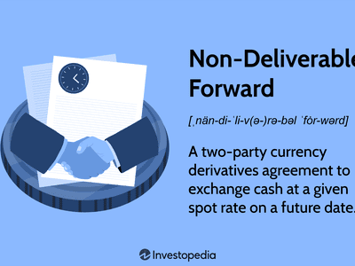

Non-deliverable swaps (NDS) are a significant component of the financial derivatives market, providing specialized currency swaps that involve currencies restricted or not convertible on the global stage. As global economic complexities intensify, multinational corporations and financial institutions increasingly rely on NDS to hedge against risks and manage non-convertible currencies effectively. This financial tool holds substantial importance in enabling companies to navigate the challenges posed by volatile exchange rates and regulatory constraints associated with non-convertible currencies.

Algorithmic trading, a cutting-edge technological advancement, is transforming the landscape of non-deliverable swaps. By driving efficiency and transparency, algorithmic trading is set to redefine how NDS are utilized and traded. The advent of electronic trading platforms facilitates quicker and more accurate transactions, promoting deeper liquidity and more competitive pricing in the NDS market. Essentially, these technological advancements offer a promising outlook for enhancing market dynamics and accessibility.



This article aims to provide an in-depth overview of non-deliverable swaps, examining their pivotal role in financial markets and the implications of algorithmic trading on this segment. We will explore how NDS can harness automation's potential to streamline operations and enhance risk management efficacy. Additionally, the challenges and opportunities that come with integrating algorithmic solutions into NDS trading will be discussed, offering insights into the evolving landscape of this essential financial instrument.

## Table of Contents

## What is a Non-Deliverable Swap (NDS)?

A non-deliverable swap (NDS) is a financial derivative instrument primarily used to hedge currency risk in markets with currencies that are non-convertible or subject to exchange controls. Unlike traditional currency swaps, NDSs do not involve the physical exchange of the two currencies at the end of the contract term. Instead, they are settled in cash, utilizing a freely convertible currency, often the U.S. dollar. This characteristic makes NDSs particularly appealing to corporations and financial institutions operating in markets where currency conversion restrictions are prevalent.

The core mechanism of an NDS involves a notional principal amount, which serves as the reference for calculating payments but is not exchanged between counterparties. Parties agree on a fixed exchange rate at the outset of the contract, referred to as the contract rate. Upon maturity, the difference between this contracted rate and the prevailing spot rate determines the cash settlement amount. If the spot rate is less favorable than the agreed contract rate for the counterparty that has agreed to receive the non-convertible currency, that counterparty will receive a payment in the convertible currency, effectively compensating for the depreciation of the non-convertible currency.

The formula for calculating the settlement amount at maturity can be expressed as:

$$
\text{Settlement Payment} = (\text{Notional Amount}) \times \left(\frac{1}{\text{Contract Rate}} - \frac{1}{\text{Spot Rate at Maturity}}\right)
$$

This cash settlement minimizes the risks associated with currency controls and provides a mechanism to manage exposure in inaccessible or illiquid currency markets, without the need for physical currency transactions.

NDSs are vital tools for multinational corporations and financial institutions that deal with markets where foreign exchange restrictions impede seamless currency conversion. They offer a strategic method to hedge against foreign exchange risks, protect cash flow stability, and ensure that financial obligations can be met regardless of currency fluctuations in regions with stringent currency controls.

## Understanding Non-Deliverable Swaps

Non-deliverable swaps (NDS) represent a strategic financial tool employed primarily in markets where currency devaluation and [liquidity](/wiki/liquidity-risk-premium) constraints pose significant risks. They are particularly useful in environments with non-convertible currencies that are subject to restrictions or are not freely traded on global markets. By using an NDS, parties can effectively hedge against the [volatility](/wiki/volatility-trading-strategies) associated with such currencies, protecting themselves from potential unfavorable movements.

A fundamental aspect of NDS is its utility for financial institutions managing foreign currency loan exposures and multinational corporations dealing with the complexities of repatriating profits from constrained currency regions. It offers a means to mitigate the financial impact of sharp currency devaluations and regulatory limitations on foreign exchange convertibility.

At the core of an NDS are several critical components that define its structure and operation:

1. **Notional Amounts**: This denotes the hypothetical principal amount used to calculate payments. In an NDS, this figure remains notional as there is no actual exchange of principal, enabling cash-settled transactions based solely on value differences.

2. **Currencies Involved**: Typically, the swap involves a restricted currency and a convertible currency, such as the U.S. dollar (USD). The transaction is settled in the convertible currency, which simplifies the process and sidesteps the challenges of direct currency exchange.

3. **Settlement Dates**: These are predefined dates upon which the differential between the contracted rate and the spot rate at maturity is resolved. This date is crucial as it determines the settlement period of the swap.

4. **Contract Rates and Fixing Rates**: The contract rate is agreed upon at the inception of the swap, while the fixing rate refers to the spot rate determined on the fixing date, shortly before the settlement date. The difference between these rates is what is ultimately settled.

Given their structured nature, NDS can be analogized to a sequence of non-deliverable forwards (NDFs), effectively bundling forward contracts to address various risk management scenarios. This perspective helps in understanding how NDS can be adapted to manage complex risk profiles by leveraging a series of forecast-driven outcomes, framed by contractually established parameters. Consequently, NDS empowers entities to strategically navigate the intricate landscape of non-convertible currency markets, ensuring financial stability in the face of unpredictability.

## Example of an NDS

Consider a financial institution in Argentina that opts to hedge against the depreciation of the Argentine peso after acquiring a substantial loan denominated in U.S. dollars. This scenario exemplifies the practical use of a non-deliverable swap (NDS).

By entering into a currency swap with a predetermined exchange rate, the institution effectively mitigates the risk associated with potential currency fluctuations. This strategy ensures that repayment costs remain stable despite volatile exchange rate movements. The financial institution agrees to a notional amount exchanged at a fixed rate, which does not involve the physical exchange of currencies. Instead, the transaction is settled in U.S. dollars based on the difference between the contracted exchange rate and the prevailing spot rate at maturity.

The settlement process can be outlined mathematically as follows:

- Let $N$ represent the notional amount in Argentine pesos.
- $K$ is the contracted exchange rate (peso per dollar).
- $S$ is the spot rate at the time of settlement.

The cash settlement amount in USD can be calculated using the formula:

$$
\text{Cash Settlement} = \left( \frac{N}{K} - \frac{N}{S} \right) \times K
$$

This mechanism allows the institution to stabilize financial obligations by protecting against adverse movements in the peso without the need to exchange the actual currencies involved. Consequently, the financial institution safeguards itself from unnecessary exposure to exchange rate risk, achieving a more predictable and controllable financial outcome.

## The Role of Algorithmic Trading in NDS

Algorithmic trading is significantly transforming the landscape of non-deliverable swaps (NDS), offering enhanced liquidity, market depth, and transparency to an otherwise opaque market. This transformation is primarily driven by recent technological advancements which have facilitated the development of specialized platforms for NDS trading, particularly in burgeoning financial markets such as Asia. These platforms leverage data analytics and sophisticated algorithms to execute trades at speeds and levels of precision unattainable through manual trading methods.

The proliferation of electronic trading platforms has notably increased the appeal of [algorithmic trading](/wiki/algorithmic-trading) among asset managers and quant funds. These entities are consistently seeking improved strategies for executing trades and managing portfolios, and algorithm-driven approaches allow them to capitalize on micro-movements in currency markets. By systematically analyzing vast datasets, algorithms can identify patterns and execute orders in fractions of seconds, capitalizing on even minute [arbitrage](/wiki/arbitrage) opportunities.

Moreover, automation in NDS trading provides significant advantages, particularly for non-bank participants. In markets characterized by limited convertibility and restricted access to foreign currencies, the ability to automate trades can lead to more efficient execution strategies. Algorithmic solutions can reduce human error, optimize entry and [exit](/wiki/exit-strategy) points, and decrease transaction costs—factors that are crucial in maximizing returns and minimizing risks in narrow-margin trades.

Consider a simple example to encode an algorithm that automatically hedges exposure with NDS. Suppose a fund needs to hedge a position worth 10 million in a currency with high volatility. An algorithm can be programmed in Python to monitor currency rates and execute trades when the exchange rate crosses a certain threshold. Here is a simplified version:

```python
import random

def monitor_exchange_rate(current_rate, threshold_rate):
    # Simulates monitoring exchange rates
    rate_change = random.uniform(-0.05, 0.05)  # Placeholder for real market data
    current_rate += rate_change
    if current_rate <= threshold_rate:
        execute_trade(current_rate)
    return current_rate

def execute_trade(rate):
    print(f"Executing NDS trade at rate: {rate}")

# Initial setup
current_rate = 1.0  # Assume initial exchange rate
threshold_rate = 0.95  # Target rate for executing the NDS
iterations = 100

for _ in range(iterations):
    current_rate = monitor_exchange_rate(current_rate, threshold_rate)
```

This example illustrates how automation can be integrated into an NDS trading strategy, ensuring timely and efficient trade execution whenever market conditions align with predefined criteria.

In conclusion, algorithmic trading is unlocking new potentials in the NDS market, making it more accessible and cost-effective for a broad spectrum of market participants. As platforms continue to evolve and adapt to regional market dynamics, the role of algorithms in NDS trading is poised to expand, offering substantial opportunities for innovation and growth in managing currency risk.

## Challenges and Opportunities

Despite significant advancements in financial technology, the non-deliverable swaps (NDS) market faces considerable challenges regarding liquidity and transparency, which pose barriers to broader algorithmic adoption. Historically, the NDS market has lacked a unified trading platform, restricting the ease with which participants can access and execute transactions. This absence has hindered market efficiency and limited the deeper integration of algorithmic trading strategies.

Volatility in market conditions, along with fluctuating interest rates, has also impacted the adoption pace of algorithmic trading in NDS. The inherent unpredictability caused by these factors complicates the design and deployment of effective algorithms capable of operating efficiently in such environments. As interest rates and currency values can shift rapidly, developing algorithms that can adjust in real-time to these changes remains a complex and ongoing challenge.

However, the landscape is gradually changing. The increasing number of electronic trading platforms and growing participation by financial institutions are promising signs for the expansion of algorithmic trading within the NDS market. These platforms aim to enhance market access and improve transaction efficiency by offering better tools for price discovery, execution, and risk management.

As technology continues to advance, the NDS market may overcome existing obstacles. The deployment of [machine learning](/wiki/machine-learning) and [artificial intelligence](/wiki/ai-artificial-intelligence) could further improve the adaptability and efficiency of trading algorithms, allowing them to navigate volatile markets with greater precision. Moreover, increased data availability can enhance transparency, empowering traders and asset managers with richer insights to guide decision-making processes.

In summary, while challenges of liquidity and transparency persist, the ongoing technological evolution presents significant opportunities for expansion and development in algorithmic trading of non-deliverable swaps. Improved market infrastructure and innovation hold the potential to unlock new levels of efficiency and participation in this segment of the financial market.

## Conclusion

Non-deliverable swaps (NDS) have proven to be an indispensable mechanism in managing currency risk associated with non-convertible markets. By enabling companies and financial institutions to hedge against exposure to volatile and restricted currencies, NDS provide a financial safeguard without necessitating the physical exchange of currencies. The introduction of algorithmic trading into this domain heralds a significant enhancement in trading efficiency and transparency. Algorithm-driven platforms facilitate rapid execution, reduced transaction costs, and improved market access, thereby increasing liquidity and market participation.

As the trading infrastructure continues to evolve, the adoption of algorithmic solutions for NDS trading is becoming increasingly feasible. This progression is driven by technological advancements, which cater to the demand for efficiency and precision in handling large volumes of transactions. Automating the trading process allows market participants to capitalize on systematic strategies, optimizing their financial operations while managing risks effectively.

Despite the apparent benefits, challenges such as market liquidity and transparency persist. These issues can impede the full-scale implementation of algorithmic trading strategies in the NDS market. However, the trajectory indicates a promising future for automation as more platforms enter the market and more institutions become receptive to automated solutions.

In this dynamic landscape, investors and institutions must remain proactive and adaptable. Continuous monitoring and adaptation to technological changes are crucial for leveraging the potential of algorithmic trading in non-deliverable swaps. By embracing this technological shift, market participants can achieve significant gains in efficiency, cost management, and risk mitigation, securing a robust position in the global financial markets.

## References & Further Reading

[1]: ["Mastering Non-Deliverable Derivatives"](https://www.cftc.gov/sites/default/files/filings/ptc/15/02/ptc022615tradsef003.pdf) by Andreas Wilke

[2]: ["Algorithmic Trading and DMA: An introduction to direct access trading strategies"](https://www.semanticscholar.org/paper/Algorithmic-trading-%26-DMA-%3A-an-introduction-to-Johnson/aa5de1ab883d5e23b6651faa7c1807586d688e4b) by Barry Johnson

[3]: Morgan, P.J., & Pontines, V. (2014). ["An Analytical Framework on Macroprudential Policies and Financial Stability."](https://papers.ssrn.com/sol3/papers.cfm?abstract_id=2464018) ADB Working Paper Series on Regional Economic Integration

[4]: ["Foreign Exchange Risk: Models, Instruments, and Strategies"](https://www.amazon.com/Foreign-Exchange-Risk-Instruments-Strategies/dp/1899332375) by David F. DeRosa

[5]: Harris, L. (2003). ["Trading and Exchanges: Market Microstructure for Practitioners."](https://www.amazon.com/Trading-Exchanges-Market-Microstructure-Practitioners/dp/0195144708) Oxford University Press