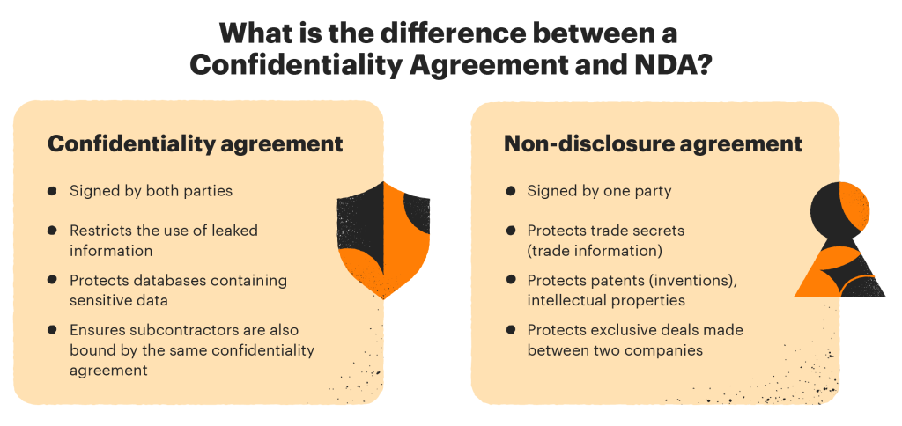

## Table of Contents

## What is a Non-Disclosure Agreement (NDA)?

A Non-Disclosure Agreement (NDA) is a legal contract between two or more parties that outlines confidential information that the parties agree not to share with others. It is commonly used when businesses need to share sensitive information with employees, contractors, or other companies, but want to make sure that information stays private. For example, if a company is working on a new product, they might have employees sign an NDA to prevent them from telling others about the product before it's released.

NDAs are important because they help protect a company's trade secrets, business strategies, and other confidential data. If someone breaks the agreement and shares the information, the company can take legal action against them. This could mean the person has to pay money or face other penalties. NDAs are used in many industries, like technology, entertainment, and healthcare, to keep important information safe and secure.

## What are the main types of NDAs?

There are two main types of NDAs: unilateral and mutual. A unilateral NDA, also called a one-way NDA, is used when only one party is sharing confidential information. For example, if a company is showing a new invention to a potential investor, the company might have the investor sign a unilateral NDA to keep the invention a secret.

A mutual NDA, also called a two-way NDA, is used when both parties are sharing confidential information with each other. This type of NDA is common in business partnerships or joint ventures where both sides need to exchange sensitive data. For example, if two companies are working together on a new project, they might sign a mutual NDA to protect the information each company shares with the other.

These two types of NDAs help businesses protect their secrets, but they are used in different situations. A unilateral NDA is simpler and used when information flows in one direction, while a mutual NDA is more complex and used when information is shared both ways.

## Why are NDAs important for businesses?

NDAs are important for businesses because they help keep secrets safe. When a company is working on something new, like a new product or a special way of doing things, they don't want other people to know about it until they are ready. If everyone knew about it too soon, other companies might copy the idea or it could hurt the company's plans. By having people sign an NDA, the company can make sure that the people who know the secret don't tell anyone else.

NDAs also help build trust between businesses and the people they work with, like employees, contractors, or partners. When someone signs an NDA, they are promising to keep the company's secrets safe. This makes the company feel more comfortable sharing important information. If someone breaks the NDA and tells the secret, the company can take them to court and make them pay money or face other punishments. This helps the company feel safe and protected.

## What are the key elements that should be included in an NDA?

An NDA should have a few important parts to make sure it works well. First, it needs to clearly say what information is secret. This means listing the types of information that need to be kept private, like business plans, customer lists, or new inventions. The NDA should also say how long the information needs to stay secret, which could be a certain number of years or until the information becomes public in another way. It's also important to explain what happens if someone breaks the NDA, like having to pay money or face other punishments.

The NDA should also include who is involved in the agreement. This means naming the people or companies that are promising to keep the information secret. It should be clear if the NDA is between one person sharing secrets and another person keeping them (unilateral) or if both sides are sharing secrets (mutual). Finally, the NDA needs to be signed by everyone involved to show that they agree to follow the rules. This makes the NDA a legal contract that everyone has to obey.

## How does an NDA protect confidential information?

An NDA protects confidential information by making a legal promise between the people involved. When someone signs an NDA, they agree not to share the secret information with anyone else. This helps businesses keep their special ideas, plans, or inventions safe. If someone breaks the NDA and tells the secret, the company can take them to court. The person who broke the NDA might have to pay money or face other punishments, which makes people think twice before sharing the secret.

NDAs also help build trust between businesses and the people they work with, like employees or partners. When a company shares important information, they want to make sure it stays private. By having people sign an NDA, the company knows that the people who know the secret will keep it safe. This makes it easier for the company to work with others without worrying about their secrets getting out.

## What are the potential consequences of breaching an NDA?

If someone breaks an NDA and shares the secret information, they can face serious problems. The company that owns the secret can take the person to court. This means the person might have to pay a lot of money to the company as a penalty for breaking the NDA. The court might also make the person stop sharing the secret and do other things to fix the damage they caused.

Breaking an NDA can also hurt a person's job and reputation. If a company finds out that someone shared their secret, they might not want to work with that person anymore. Other companies might hear about it too and decide not to hire the person. This can make it hard for the person to find a new job, especially in the same industry. People might also think the person is not trustworthy, which can affect their personal and professional relationships.

## How long does an NDA typically last?

An NDA can last for different amounts of time, depending on what the people who signed it agree on. Sometimes, an NDA might last for a certain number of years, like two or five years. Other times, it might last until the secret information becomes public in another way, like if the company decides to share it themselves or if it gets out through no fault of the person who signed the NDA.

The length of an NDA is important because it tells everyone how long they need to keep the secret. If the NDA lasts for five years, the person who signed it has to keep the information private for that whole time. If they tell the secret before the five years are up, they could get in trouble. But once the time is over, they don't have to keep the secret anymore, unless they signed a new NDA.

## Can an NDA be enforced internationally?

An NDA can be enforced internationally, but it can be tricky. Different countries have different laws about NDAs, so it depends on where the people who signed the NDA are and where the secret information is being shared. If a company in the United States has someone in another country sign an NDA, they might need to follow the laws of both countries to make sure the NDA is strong.

To make an NDA work in different countries, it's a good idea to include a part in the agreement that says which country's laws will be used if there's a problem. This can help make things clearer and easier if the company needs to take someone to court in another country for breaking the NDA. But even with this, enforcing an NDA internationally can still be hard and might need help from lawyers who know about international law.

## What are the differences between a unilateral and a mutual NDA?

A unilateral NDA, also called a one-way NDA, is used when only one side is sharing secret information. For example, if a company wants to show a new invention to a possible investor, they might have the investor sign a unilateral NDA. This means the investor promises to keep the invention a secret, but the company doesn't have to keep any secrets from the investor. Unilateral NDAs are simpler because they only protect the information going one way.

A mutual NDA, also called a two-way NDA, is used when both sides are sharing secret information with each other. This type of NDA is common when two companies are working together on a project. For example, if two companies are making a new product together, they might sign a mutual NDA. This means both companies promise to keep each other's secrets safe. Mutual NDAs are more complex because they protect information going both ways.

## How should one approach negotiating the terms of an NDA?

When you're negotiating the terms of an NDA, it's important to start by understanding what each side wants to protect. Talk openly about what information is really secret and why it needs to stay that way. You might want to suggest changes to the NDA to make it fair for everyone. For example, if you think the time the NDA lasts is too long, you could ask to make it shorter. Or, if you're worried about the punishments for breaking the NDA, you might want to talk about making them less harsh.

It's also helpful to work with a lawyer who knows about NDAs. They can help you understand the legal words and make sure the NDA is strong and fair. During the negotiation, try to find a middle ground where both sides feel comfortable. Remember, the goal is to protect the important information while still being able to work together. If you can agree on the terms, everyone will feel more confident and ready to move forward.

## What are some common pitfalls to avoid when drafting an NDA?

When you're writing an NDA, it's important to be clear about what information is secret. A common mistake is not being specific enough about what needs to stay private. If the NDA is too vague, it might not hold up in court. Make sure to list the types of information that need to be kept secret, like business plans, customer lists, or new inventions. Another pitfall is setting the time the NDA lasts for too long or too short. If it's too long, it might be hard for the other person to agree to it. If it's too short, the secret might not be protected long enough.

Another thing to watch out for is not thinking about what happens if someone breaks the NDA. You need to say what the punishments will be, like paying money or stopping the person from sharing the secret. If you don't include this, the NDA might not be strong enough to protect the information. Also, make sure everyone who needs to sign the NDA actually does sign it. If someone who should be part of the agreement doesn't sign, the NDA won't cover them, and the secret might not be safe.

## How have recent legal cases influenced the drafting and enforcement of NDAs?

Recent legal cases have made people think more carefully about how they write and use NDAs. One big change is that courts are now looking more closely at NDAs to make sure they are fair and not too broad. For example, some cases have shown that NDAs can't be used to stop people from talking about things like sexual harassment or illegal activities. This means that when writing an NDA, you need to be clear about what can and can't be kept secret, and make sure it doesn't stop someone from speaking out about important issues.

Another way recent cases have affected NDAs is by making companies think about how they enforce them. Courts have sometimes said that NDAs are not valid if they are too hard to follow or if the punishments for breaking them are too harsh. This has led companies to be more careful about what they put in their NDAs and to make sure the terms are reasonable. As a result, NDAs are now often written to be more specific and balanced, so they can protect secret information without being unfair to the people who sign them.

## References & Further Reading

[1]: Bergstra, J., Bardenet, R., Bengio, Y., & Kégl, B. (2011). ["Algorithms for Hyper-Parameter Optimization."](https://dl.acm.org/doi/10.5555/2986459.2986743) Advances in Neural Information Processing Systems 24.

[2]: ["Advances in Financial Machine Learning"](https://www.amazon.com/Advances-Financial-Machine-Learning-Marcos/dp/1119482089) by Marcos Lopez de Prado

[3]: ["Evidence-Based Technical Analysis: Applying the Scientific Method and Statistical Inference to Trading Signals"](https://www.amazon.com/Evidence-Based-Technical-Analysis-Scientific-Statistical/dp/0470008741) by David Aronson

[4]: ["Machine Learning for Algorithmic Trading"](https://github.com/stefan-jansen/machine-learning-for-trading) by Stefan Jansen

[5]: ["Quantitative Trading: How to Build Your Own Algorithmic Trading Business"](https://www.amazon.com/Quantitative-Trading-Build-Algorithmic-Business/dp/1119800064) by Ernest P. Chan