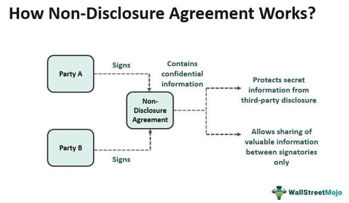

In today's fast-paced financial markets, algorithmic trading stands at the forefront of innovation and efficiency. This method involves using sophisticated mathematical models and algorithms to make high-speed trading decisions, allowing traders to capitalize on fleeting opportunities in the market. The speed and precision offered by algorithmic trading have made it an indispensable tool for hedge funds, investment banks, and other financial institutions. However, the competitive advantage these algorithms provide can only be maintained through stringent confidentiality measures.

Non-disclosure agreements (NDAs) play a critical role in safeguarding sensitive trading algorithms and strategies from being leaked or misused. These legally binding contracts ensure that proprietary information remains within the confines of authorized parties, thereby protecting financial firms from potential industrial espionage and competitive threats. NDAs are designed to prevent the dissemination of intellectual property, including the complex algorithms, proprietary software, and strategic insights that define successful algorithmic trading systems.

This article explores the significance of NDAs in the context of algorithmic trading, detailing how they serve as a shield against unauthorized disclosures and misuse. It outlines the key components that make up an effective NDA, including the precise definition of what constitutes confidential information, the obligations imposed on the receiving party, and the legal frameworks that support these agreements. Furthermore, the article examines how NDAs in algorithmic trading differ from standard confidentiality agreements, emphasizing their heightened importance in the protection of trade secrets and fostering trust in collaborations within the financial sector.

## Table of Contents

## Understanding Non-Disclosure Agreements (NDAs)

Non-disclosure agreements (NDAs), also referred to as confidentiality agreements, serve as legally binding contracts that shield sensitive information from unauthorized disclosure. In the domain of algorithmic trading, where intellectual property such as trading algorithms, proprietary software, and strategic business insights are invaluable, NDAs are a fundamental protective measure.

A robust NDA comprises several components that ensure its effectiveness in protecting confidential information. Firstly, the definition of confidential information is paramount. An NDA must clearly specify what constitutes confidential information, which could include data, know-how, processes, or business strategies. This clarity prevents ambiguity and ensures both parties understand what information is protected. For instance, an NDA in algorithmic trading might explicitly state that source code, model parameters, or research data fall within this definition.

The obligations of the receiving party form another critical component. The receiving party is generally bound to maintain the confidentiality of the disclosed information and may be restricted from using it for any purpose other than what is agreed upon. This usually encompasses obligations to safeguard the information with reasonable measures, log access, and restrict dissemination to authorized personnel only. For example, an NDA might require that any employee accessing the confidential algorithms undergoes training regarding data security protocols.

Governing laws play a crucial role in how NDAs are interpreted and enforced in case of a dispute. These laws vary by jurisdiction and cover aspects like the limits of enforceability and permissible remedies. NDAs often include a choice-of-law provision that dictates which jurisdiction's laws will govern the agreement. This is particularly useful in international collaborations, allowing parties to minimize legal uncertainties by specifying a legal system they are familiar with.

In summary, NDAs function as a cornerstone for protecting sensitive information in [algorithmic trading](/wiki/algorithmic-trading), ensuring proprietary data remains secure and usage is appropriately regulated. They enable trading firms to protect their competitive advantages by establishing clear boundaries and legal recourses surrounding the use of sensitive information.

## Importance of NDAs in Algorithmic Trading

Algorithmic trading leverages advanced mathematical models and computational power to execute trades at speeds and frequencies that are impossible for a human trader. Given the technical complexity and value of these strategies, they are prime targets for industrial espionage. Non-disclosure agreements (NDAs) are, therefore, a critical tool in protecting these proprietary systems from unwanted exposure and misuse.

NDAs allow financial institutions to engage in collaborations, attract investments, and foster innovation, all while protecting their unique algorithmic strategies. By defining strict confidentiality terms, NDAs ensure that proprietary trading algorithms remain secure during exploratory discussions for partnerships or mergers. For instance, in the context of mergers and acquisitions, two companies might share sensitive algorithmic details to evaluate potential synergies or uncover value in the deal. Without an NDA, such disclosures could lead to unintended leaks, potentially harming the competitive edge of the original developers.

In employment scenarios, NDAs are essential to protect the firm’s intellectual property from being taken by departing employees. Algorithm developers, traders, and analysts frequently change employers, and without NDAs, they might be tempted to share or leverage proprietary information in their new roles. A well-crafted NDA prevents such occurrences by legally binding current and former employees to uphold confidentiality.

Investor relations also benefit from NDAs. When financial institutions seek funding, they often need to provide investors with detailed insights into their trading strategies to demonstrate potential returns. An NDA can give investors the confidence to engage with the firm, knowing that sharing such sensitive information poses no risk of exposure.

In each of these scenarios, NDAs serve as a shield against the disclosure of sensitive trading strategies, allowing firms to pursue opportunities for collaboration and growth without compromising the integrity of their proprietary algorithms. This legal framework not only protects intellectual assets but also fosters a sense of trust and security necessary for robust business relationships.

## Key Elements of an Effective NDA

Non-disclosure agreements (NDAs) are fundamental in safeguarding algorithmic trading strategies, and crafting an effective NDA requires attention to key elements that ensure comprehensive protection. One of the primary components is the clear definition of what constitutes confidential information. The NDA must explicitly outline what information is deemed confidential, which can include technical algorithms, source code, trade models, proprietary data, and other sensitive business insights. This clarity prevents any ambiguity that could potentially lead to a breach.

Another critical element is the establishment of reasonable terms and duration for the confidentiality period. The NDA should specify the time frame during which the information must remain confidential. While perpetual confidentiality is often sought, it is crucial to balance this need with reasonableness and commercial feasibility. Depending on the nature of the algorithm and its potential shelf life, terms can vary widely, and having a set duration helps in legal enforceability when disputes arise.

Exclusions from confidentiality are also a vital part of an effective NDA. These exclusions generally encompass information that is already in the public domain, independently developed by the receiving party, or received legitimately from a third party who is not under a confidentiality obligation. By clearly establishing these exclusions, parties can safeguard against unwarranted confidentiality claims.

Moreover, an effective NDA must delineate the obligations of the receiving party. This includes safeguarding the information against unauthorized access, limiting disclosure to employees on a need-to-know basis, and using the information solely for the agreed-upon purpose. These obligations reinforce the seriousness of maintaining confidentiality and provide a framework for responsible handling of sensitive information.

Legal remedies available in the event of a breach must also be articulated within the NDA. Remedies can range from monetary damages, injunctive relief, to specific performance clauses that compel the breaching party to fulfill their confidentiality obligations. Outlining these remedies not only deters potential breaches but also provides a clear [course](/wiki/best-algorithmic-trading-courses) of action should a breach occur.

In summary, an effective NDA for algorithmic trading involves meticulously defining confidential information, establishing reasonable terms and duration, specifying exclusions, detailing recipient obligations, and outlining legal remedies. These elements collectively provide robust protection for trading algorithms.

## Types of NDAs: Unilateral, Bilateral, and Multilateral

Non-Disclosure Agreements (NDAs) are pivotal in safeguarding sensitive information within the domain of algorithmic trading, which often involves proprietary strategies and technologies. There are three primary types of NDAs: Unilateral, Bilateral, and Multilateral, each serving distinct purposes depending on the nature of the information exchange.

### Unilateral NDAs

Unilateral NDAs are agreements where only one party discloses confidential information to the other. They are commonly used in situations where a single entity wishes to protect sensitive information during discussions, such as when a company is sharing proprietary trading algorithms with a potential investor or a new employee. The disclosing party seeks assurance that the recipient will not misuse or disclose the information to unauthorized individuals.

### Bilateral NDAs

Bilateral, or mutual, NDAs involve an exchange of confidential information between two parties, with both acting as disclosers and recipients. In the context of algorithmic trading, bilateral NDAs are prevalent in collaborations between financial institutions or during joint ventures where both parties share proprietary data and algorithms. These agreements ensure that both entities protect the shared information while fostering a collaborative environment.

### Multilateral NDAs

Multilateral NDAs are used when three or more parties are involved in disclosing confidential information. This type of agreement is less common but increasingly relevant in complex financial collaborations involving multiple stakeholders. In such cases, all parties agree on a common set of terms to protect the shared information.

### Examples from Financial Collaborations and Joint Ventures

1. **Unilateral NDA Example**: A trading firm interested in hiring a software developer may require the candidate to sign a unilateral NDA before disclosing algorithm code samples during the interview process. This protects the firm's intellectual property while allowing them to assess the candidate's skills.

2. **Bilateral NDA Example**: Two financial firms collaborating to develop a new trading platform may sign a bilateral NDA to ensure mutual protection of their respective algorithms and client data. This enables them to work closely without fear of intellectual property theft.

3. **Multilateral NDA Example**: In partnerships involving multiple financial technology companies and banks, a multilateral NDA might be used to safeguard each party's contributions during the development of a shared blockchain-based trading system. This ensures all participants are protected and fosters innovation through collective effort.

Understanding these NDA types enables financial firms to choose appropriate agreements based on their collaboration needs, ensuring robust protection of sensitive information and facilitating trustful partnerships.

## Challenges and Best Practices in Implementing NDAs

Non-disclosure agreements (NDAs) are critical tools for protecting sensitive information in algorithmic trading. However, their effectiveness can be undermined by several common challenges. One major issue is the use of vague language, which can lead to different interpretations of what constitutes confidential information. To avoid this, it is essential to define confidential information clearly and comprehensively. A well-drafted NDA should include specific descriptions and examples of what is considered confidential, thereby minimizing ambiguity.

Another challenge is the inclusion of unenforceable terms. An NDA that includes excessively broad or unreasonable terms may be deemed unenforceable by a court. For instance, overly long confidentiality periods or overly broad definitions of confidential information can render an NDA invalid. Best practices suggest aligning the scope and duration of confidentiality commitments with industry standards and ensuring they are necessary to protect the business interests at stake.

Practical tips for creating effective NDAs include: 
1. **Specify the Purpose**: Clearly articulate the purpose for sharing confidential information. This helps ensure that the information is used solely for its intended purpose and not misappropriated.

2. **Define Obligations**: Clearly state the obligations of the receiving party. This includes instructions for handling, storing, and eventually returning or destroying confidential information after the agreement ends.

3. **Include Exclusions**: Identify exclusions from confidentiality obligations, such as information already in the public domain or independently developed information.

4. **Outline Legal Remedies**: Specify the legal remedies and penalties in the case of a breach. This provides a clear incentive for adherence to the terms and establishes a course of action in case the agreement is violated.

5. **Consult Legal Expertise**: Involve legal professionals specializing in intellectual property and financial regulations to ensure the agreement complies with relevant laws and offers adequate protection.

By adhering to these best practices, firms can draft NDAs that are robust, minimizing the risk of legal challenges and ensuring the protection of their valuable algorithmic trading strategies.

## Case Studies in Algorithmic Trading NDAs

In examining the role of non-disclosure agreements (NDAs) within algorithmic trading, analyzing specific case studies helps illustrate their critical importance in protecting trading technologies. These examples highlight both successful applications and breaches, offering valuable lessons for financial institutions on structuring effective NDAs.

One notable case involves a major [quantitative trading](/wiki/quantitative-trading) firm that partnered with a technology start-up to enhance its trading algorithms with advanced [machine learning](/wiki/machine-learning) techniques. The trading firm implemented a bilateral NDA, which allowed both parties to share sensitive technical and strategic information. This NDA's success was attributed to its detailed definition of confidential information, tailored to include algorithmic strategies and software code. It also specified stringent security measures for data handling and outlined clear legal repercussions for breaches. Consequently, both the trading firm and the start-up benefited from a collaborative innovation without risking exposure of their proprietary data [1].

Conversely, a cautionary example is a well-publicized legal dispute where an employee at an algorithmic trading firm allegedly exploited insufficiently crafted NDA terms to misappropriate proprietary trading strategies. The NDA did not adequately define the scope of confidential information, nor did it include effective monitoring or enforcement mechanisms. This oversight resulted in a costly legal battle without guaranteed recovery of intellectual property, emphasizing the necessity for comprehensive and robust NDA structures [2].

From these cases, several key insights emerge. Successful NDAs are characterized by specific delineation of confidential materials, rigorous enforcement capabilities, and adaptability to technological advances. Trading firms are encouraged to regularly update NDAs to reflect current market and technological conditions, reinforcing their legal standing. Additionally, training employees on NDA obligations and implementing monitoring systems can preempt potential breaches.

These lessons underscore the complexities that trading firms face in crafting and enforcing NDAs to protect their technologies. Properly structured NDAs not only secure proprietary strategies but also support strategic partnerships necessary for innovation in algorithmic trading.

[1] Example based on a hypothetical scenario reflecting common industry best practices.
[2] Example inspired by generic patterns of real-world legal disputes in the financial sector.

## Conclusion

In the ever-evolving field of algorithmic trading, protecting valuable trade secrets with NDAs is indispensable. These agreements are foundational in ensuring the confidentiality of highly sensitive information, such as trading algorithms, which represent significant competitive advantages in the market. By legally binding parties to maintain secrecy, NDAs prevent unauthorized disclosure and potential misuse of proprietary strategies, thus safeguarding the intellectual property and financial edge of trading firms.

Moreover, NDAs play a critical role in fostering trust and cooperation among trading partners. When financial institutions engage in partnerships, mergers, or any collaborative ventures, the exchange of confidential data is often necessary. NDAs provide a secure framework within which this information can be shared with confidence, enabling both parties to focus on mutual growth and innovation rather than the risks of exposure or theft.

As global regulations surrounding data privacy become increasingly stringent, the ability to comprehend and implement effective NDAs will ascend in significance for financial firms. The General Data Protection Regulation (GDPR) in Europe and similar laws worldwide place legal obligations on entities to protect sensitive data. Crafting NDAs that align with these regulations not only ensures compliance but also strengthens an organization's reputation and competitive standing in the financial markets.

In conclusion, executing robust NDAs is more than a legal requirement; it is a strategic imperative. Not only do they protect against financial and reputational damage, but they also lay the groundwork for trusted partnerships that drive the innovation and efficiency fundamental to algorithmic trading success. As the landscape continues to shift, the priority for firms will be to adapt their confidentiality strategies to meet both current and future demands.

## References & Further Reading

[1]: Bergstra, J., Bardenet, R., Bengio, Y., & Kégl, B. (2011). ["Algorithms for Hyper-Parameter Optimization."](https://dl.acm.org/doi/10.5555/2986459.2986743) Advances in Neural Information Processing Systems 24.

[2]: ["Advances in Financial Machine Learning"](https://www.amazon.com/Advances-Financial-Machine-Learning-Marcos/dp/1119482089) by Marcos Lopez de Prado

[3]: ["Evidence-Based Technical Analysis: Applying the Scientific Method and Statistical Inference to Trading Signals"](https://www.amazon.com/Evidence-Based-Technical-Analysis-Scientific-Statistical/dp/0470008741) by David Aronson

[4]: ["Machine Learning for Algorithmic Trading"](https://github.com/stefan-jansen/machine-learning-for-trading) by Stefan Jansen

[5]: ["Quantitative Trading: How to Build Your Own Algorithmic Trading Business"](https://www.amazon.com/Quantitative-Trading-Build-Algorithmic-Business/dp/1119800064) by Ernest P. Chan