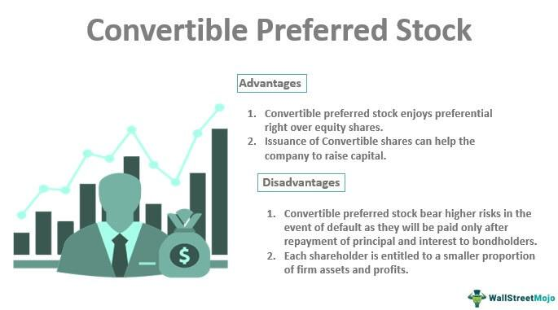

In today's dynamic financial markets, investors are consistently seeking innovative strategies to optimize their portfolios. One area that has garnered increased attention is non-dividend stocks, which have become particularly attractive within the context of algorithmic trading. Unlike traditional dividend-paying stocks, non-dividend stocks channel their profits back into the business, positioning themselves for potential growth rather than distributing income to shareholders.

The appeal of non-dividend stocks lies in their unique opportunities and challenges. For investors with a focus on growth potential, these stocks present an enticing prospect. The companies behind them, often thriving in rapidly evolving sectors like technology and biotechnology, prioritize reinvestment over immediate profit sharing. This reinvestment strategy aims to boost long-term capital appreciation, making these stocks a critical component for those targeting substantial returns in their investment journey.



This article aims to provide a comprehensive examination of non-dividend stocks covering their valuation, investment strategies, and suitability for algorithmic trading. Furthermore, we will explore the associated risks and essential considerations that investors should understand to make informed decisions. By evaluating the intricacies of these stocks, investors can navigate the complexities of contemporary financial landscapes and effectively capitalize on growth-oriented opportunities.

## Table of Contents

## Understanding Non-Dividend Stocks

Non-dividend stocks are equities that do not provide regular income to shareholders in the form of dividends. Instead, the companies issuing these stocks prefer to reinvest their profits back into the business operations, aiming to stimulate growth and expansion. This strategic choice is prevalent in industries that experience rapid advancements and innovation, such as technology and biotechnology. These sectors prioritize reinvestment because it allows companies to bolster their competitive edge through research and development, infrastructure enhancement, and scaling of operations.

Investors in non-dividend stocks are primarily focused on capital gains rather than immediate income. This means they anticipate that the value of the stock will increase over time, providing returns through the appreciation in stock price. Such an investment strategy is aligned with long-term growth prospects, where the return on investment is realized upon selling the stock at a higher market price than the purchase price.

A crucial aspect for investors considering non-dividend stocks is the evaluation of the company's business strategy, market position, and management capabilities. Understanding these components allows investors to assess the potential for future profitability and growth that the company might achieve. The company’s business strategy reveals its approach to maintaining and enhancing its market share, while its market position offers insights into its competitive advantage and potential barriers to entry for new competitors. Additionally, effective management is essential to execute and adapt strategies as market conditions evolve.

In financial analysis, metrics like the Price/Earnings (P/E) ratio and Price/Book (P/B) ratio can be useful, although they must be interpreted with caution since these companies are not providing dividends. The P/E ratio compares a company's share price to its earnings per share (EPS), providing insight into investor expectations for future growth. The P/B ratio, on the other hand, compares the company's market value to its book value, offering a glimpse into how well the company is generating return on its equity.

## Valuing Non-Dividend Stocks

Valuing non-dividend stocks primarily focuses on assessing future growth potential rather than current income returns. For investors interested in these stocks, this forward-looking approach requires utilizing specific valuation metrics to capture growth expectations and the intrinsic value of a company.

One essential metric is the Price/Earnings (P/E) ratio, which provides insight into how much investors are willing to pay for a dollar of earnings. A high P/E ratio typically reflects strong investor confidence in a company's future earnings growth, suggesting that the market expects the company's earnings to increase significantly. Conversely, a low P/E ratio might indicate that a stock is undervalued or that the company faces challenging growth prospects.

Another critical metric is the book value, calculated as the company's total assets minus its liabilities. This metric offers insights into the company's net asset value, serving as a baseline for determining whether a stock is valued appropriately in the market. By comparing the book value to the company's market value, investors can assess the intrinsic worth of non-dividend stocks relative to their current market price.

Moreover, the thorough analysis of a company's earnings history and reinvestment strategies is indispensable in appraising non-dividend stocks. This involves examining past earnings performances to understand revenue trends and reinvestment effectiveness in generating future growth. Evaluating how a company allocates its earnings towards research and development, expansion, and other growth initiatives provides valuable context in assessing its potential to enhance shareholder value over the long term.

While these valuation techniques offer a foundation for evaluating non-dividend stocks, investors must also consider qualitative factors such as the company's competitive position, market dynamics, and management prowess. These qualitative considerations provide a comprehensive picture of a company's ability to sustain growth and achieve market success.

## The Appeal of Non-Dividend Stocks for Algo Traders

Non-dividend stocks have emerged as a favored asset class among algorithmic traders due to their inherent [volatility](/wiki/volatility-trading-strategies). This volatility is primarily driven by market speculation, as investors anticipate future company performance and technological advancements that often characterize growth sectors like technology and biotechnology. The absence of dividends indicates that companies are more likely to reinvest earnings into expansion and innovation, further fueling speculative activity and price oscillations. For algorithmic traders, such fluctuations present numerous profit opportunities as they can capitalize on short-term price movements.

Algorithmic trading, or algo trading, involves the use of automated and pre-programmed trading instructions accounting for variables such as timing, price, and [volume](/wiki/volume-trading-strategy). This method allows traders to execute orders with speed and precision that human traders cannot match. Given the fast-paced nature of price changes in non-dividend stocks, this execution efficiency becomes particularly advantageous. Algorithms can be designed to react instantaneously to predetermined market signals, enabling the exploitation of transient market inefficiencies for profit.

The volatility associated with non-dividend stocks is often augmented by the companies' strategies of continuous reinvestment into disruptive innovations and strategic pivots. For instance, technological breakthroughs or significant business model shifts can lead to unpredictable changes in stock prices. Algorithmic trading systems harness this unpredictability by leveraging technical indicators and historical price data to identify patterns and trends. Key technical indicators such as moving averages, relative strength index (RSI), and moving average convergence divergence (MACD) are commonly employed to guide trading decisions and optimize entry and [exit](/wiki/exit-strategy) points. 

To ensure profitability and reduce risks, [backtesting](/wiki/backtesting) is a critical component of developing [algorithmic trading](/wiki/algorithmic-trading) strategies for non-dividend stocks. By simulating how a particular algorithm would have performed in the past using historical data, traders can assess its potential effectiveness under similar market conditions. This helps in refining algorithms to adapt to specific market dynamics associated with non-dividend stocks. 

In summary, the appeal of non-dividend stocks for algorithmic traders lies in their inherent unpredictability, driven by speculation and continuous company innovation. The use of algorithmic trading methods enables fast, data-driven decisions that capitalize on these rapid price movements, employing sophisticated analyses of market data and technical indicators to optimize trading strategies.

## Designing Algorithmic Strategies for Non-Dividend Stocks

Designing algorithmic strategies for non-dividend stocks involves a comprehensive analysis of historical price data to identify and exploit patterns that can lead to profitable trading. Algorithmic traders often rely on technical indicators like moving averages, Relative Strength Index (RSI), and Moving Average Convergence Divergence (MACD) to make informed decisions.

### Moving Averages
A moving average smooths out price data by creating a constantly updated average price. When developing algorithmic trading strategies, moving averages can help identify trends. For instance, a common strategy is the crossover of a short-term moving average above a long-term moving average as a buy signal, while the reverse indicates a sell signal.

### Relative Strength Index (RSI)
RSI is a [momentum](/wiki/momentum) oscillator that measures the speed and change of price movements. It ranges from 0 to 100 and is often used to identify overbought or oversold conditions in a market. An RSI above 70 typically signals that a stock could be overbought, suggesting a potential sell opportunity, while an RSI below 30 indicates potential underbought conditions, suggesting a buy opportunity.

### Moving Average Convergence Divergence (MACD)
MACD is a trend-following momentum indicator that shows the relationship between two moving averages of a security’s price. The MACD line is the difference between the 12-day EMA and the 26-day EMA, while the Signal line is the 9-day EMA of the MACD line. Buy and sell signals are generated when the MACD line crosses the Signal line.

### Backtesting
One critical step in algorithmic strategy design is backtesting, which involves applying a trading strategy to historical data to evaluate its potential profitability and risk. Through backtesting, traders can identify the strengths and weaknesses of a strategy before implementing it in live markets, minimizing potential losses.

```python
# Basic example of a backtesting setup using Python and Pandas
import pandas as pd

# Assume `data` is a DataFrame with historical price data
data['Short_MA'] = data['Close'].rolling(window=50).mean()
data['Long_MA'] = data['Close'].rolling(window=200).mean()
data['Signal'] = 0
data.loc[data['Short_MA'] > data['Long_MA'], 'Signal'] = 1
data.loc[data['Short_MA'] < data['Long_MA'], 'Signal'] = -1

# Calculate returns
data['Return'] = data['Signal'].shift(1) * data['Close'].pct_change()

# Cumulative returns
data['Cumulative Return'] = (1 + data['Return']).cumprod()
```

This simple moving average crossover strategy is just one way to backtest potential strategies to gauge their effectiveness. Throughout the backtesting process, traders should pay attention to risk metrics such as drawdowns, Sharpe ratio, and volatility to assess both the strategy's risk and its reward potential.

### Entry and Exit Points
Accurate determination of entry and exit points is crucial. Traders rely on technical indicators to decide when to enter or exit a trade. Backtested strategies that consistently identify optimal entry and exit points provide a competitive edge in rapidly changing markets.

### Continuously Evolving Strategies
The success of algorithmic trading strategies depends on their adaptability to market conditions. Traders need to continually refine their strategies by incorporating new data and leveraging statistical models and [machine learning](/wiki/machine-learning) techniques to refine algorithms. Regular updates ensure that the strategies remain aligned with current market dynamics and continue to perform effectively.

In conclusion, designing algorithmic strategies for non-dividend stocks requires a deep understanding of technical indicators, rigorous backtesting, and a commitment to strategy refinement. As market conditions evolve, successful algorithmic trading strategies adapt, continually leveraging data-driven insights to maximize returns on investment.

## Case Studies and Examples

Prominent non-dividend stocks such as Amazon and Tesla exemplify noteworthy opportunities for growth-driven returns. These companies consistently choose to reinvest their earnings into expanding business operations rather than distributing dividends to shareholders. This strategy has led to significant capital appreciation, reflecting their robust business models and growth potential.

Amazon's approach of channeling profits back into the business has allowed for diversification into various sectors, including cloud computing with Amazon Web Services (AWS), which has emerged as a major revenue driver. Similarly, Tesla's reinvestment strategy focuses on scaling production capacity and advancing battery technology, supporting their long-term vision in the electric vehicle market. Both companies' growth trajectories underline the effectiveness of utilizing reinvestment for expansion, resulting in substantial market valuation increases.

In the context of algorithmic trading, the volatility inherent in stocks like Amazon and Tesla offers opportunities for profit by capitalizing on price swings. Algorithmic traders utilize strategic analysis and technical indicators such as moving averages, relative strength index (RSI), and moving average convergence divergence (MACD) to develop trading strategies that exploit these fluctuations. For instance, a trader might employ a momentum-based strategy using the RSI to identify overbought or oversold conditions, thus determining potential entry and exit points.

Backtesting plays a crucial role in refining these algorithmic strategies. By simulating trades using historical performance data of Amazon and Tesla, traders can assess the effectiveness of their algorithms under past market conditions. This process helps identify profitable patterns and optimize trading rules, such as adjusting stop-loss levels or fine-tuning indicator parameters, to enhance future returns.

Continuous innovation and adaptation to market trends are pivotal reasons for the sustained investment appeal of companies like Amazon and Tesla. Their ability to innovate—whether through introducing new products, scaling production efficiency, or exploring adjacent markets—supports their growth potential and attracts investor confidence. As a result, these stocks continue to be attractive targets for both long-term investors seeking capital appreciation and algorithmic traders taking advantage of their inherent volatility.

## Potential Risks and Considerations

Investing in non-dividend stocks presents several risks and considerations that investors must account for to optimize their strategies effectively. One primary concern is the heightened volatility often associated with these equities. Since non-dividend stocks, such as those in tech or biotech sectors, typically reinvest their earnings into growth strategies, their prices can be more influenced by market sentiment and speculative activities. Consequently, these stocks might experience significant price swings, which can pose both opportunities and risks for investors aiming for capital gains.

An effective strategy to manage this volatility includes robust risk management techniques such as diversification and the implementation of stop-loss orders. Diversification helps to spread risk across different assets, potentially reducing the impact of adverse movements in any single stock. On the other hand, stop-loss orders allow investors to set predetermined price levels at which their positions will be automatically liquidated, thus limiting potential losses.

The dynamic nature of market conditions also necessitates frequent updates and rigorous testing of trading algorithms. As market environments evolve, algorithmic traders must continuously refine their models to ensure their strategies remain effective. This involves backtesting against historical data to assess algorithm performance and recalibrating as necessary to adapt to new patterns or market anomalies.

Understanding macroeconomic factors is fundamental in managing investment risks associated with non-dividend stocks. Economic indicators such as interest rates, inflation, and GDP growth can have significant impacts on stock valuations. For instance, an increase in interest rates might lead to higher discount rates, thereby reducing the present value of a company's projected cash flows. Investors should maintain a keen awareness of these factors to inform their strategic decisions.

Finally, investors must be adaptable, ready to adjust their strategies in response to shifting market conditions and emerging opportunities. This could involve reallocating assets in response to geopolitical developments, regulatory changes, or technological advancements. By maintaining flexibility and vigilance, investors are better positioned to navigate the inherent uncertainties and capitalize on the potential of non-dividend stocks.

## Conclusion

Non-dividend stocks present unique opportunities for capital appreciation, particularly suitable for algorithmic trading strategies. Their propensity for volatility, especially in growth sectors such as technology and biotechnology, creates a fertile ground for exploiting short-term price movements. This inherent volatility can be harnessed effectively through systematic strategies that leverage swift execution capabilities offered by algorithmic trading.

Successful investments in non-dividend stocks hinge on comprehensive analysis and strategic execution. Algorithmic strategies must be iteratively refined to adapt to ever-changing market conditions, relying on historical data analysis and various technical indicators to improve precision and timing. The essence of algorithmic trading in this context is to automate the trading process while minimizing emotional decision-making, thereby seizing opportunities that emerge from market fluctuations.

A prudent risk management framework is crucial when dealing with such dynamic assets. Diversification across different assets, the use of technical tools like stop-loss orders, and continuous algorithm testing and updating are crucial measures to mitigate associated risks. These measures ensure that investors can buffer against unpredictable market shifts and economic factors that might influence stock performance.

To maximize returns in this volatile landscape, investors ought to remain vigilant to ongoing market developments, adjusting their strategies to align with emerging trends and data interpretations. By combining vigilance with strategic agility, investors can navigate the complexities of non-dividend stocks, capitalizing on their growth potential while safeguarding against potential pitfalls.

## References & Further Reading

[1]: Bergstra, J., Bardenet, R., Bengio, Y., & Kégl, B. (2011). ["Algorithms for Hyper-Parameter Optimization."](https://dl.acm.org/doi/10.5555/2986459.2986743) Advances in Neural Information Processing Systems 24.

[2]: ["Advances in Financial Machine Learning"](https://www.amazon.com/Advances-Financial-Machine-Learning-Marcos/dp/1119482089) by Marcos Lopez de Prado

[3]: ["Evidence-Based Technical Analysis: Applying the Scientific Method and Statistical Inference to Trading Signals"](https://www.amazon.com/Evidence-Based-Technical-Analysis-Scientific-Statistical/dp/0470008741) by David Aronson

[4]: ["Machine Learning for Algorithmic Trading"](https://github.com/stefan-jansen/machine-learning-for-trading) by Stefan Jansen

[5]: ["Quantitative Trading: How to Build Your Own Algorithmic Trading Business"](https://www.amazon.com/Quantitative-Trading-Build-Algorithmic-Business/dp/1119800064) by Ernest P. Chan