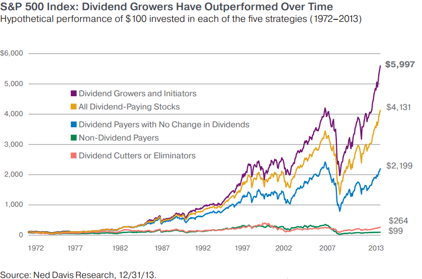

## Table of Contents

## What are non-dividend stocks?

Non-dividend stocks are shares in companies that do not pay out regular dividends to their shareholders. Dividends are payments made by a company to its shareholders from its profits. When a company chooses not to pay dividends, it often reinvests the profits back into the business to fuel growth, pay off debts, or fund other projects. Investors who buy non-dividend stocks are typically looking for capital appreciation, meaning they hope the value of the stock will increase over time, allowing them to sell it for a profit.

These stocks can be attractive to investors who are more interested in long-term growth rather than immediate income. For example, many technology companies, especially in their early stages, do not pay dividends because they are focused on expanding their business and developing new products. Instead of receiving regular payments, investors in these companies might see the stock price rise significantly if the company performs well. However, non-dividend stocks can also be riskier because they depend more on the company's future success and market conditions.

## How do non-dividend stocks differ from dividend stocks?

Non-dividend stocks and dividend stocks are different in how they give money back to people who own them. Non-dividend stocks are from companies that don't pay out regular cash to their shareholders. Instead, these companies keep the money to grow their business, pay off debts, or start new projects. People who buy non-dividend stocks usually want the price of the stock to go up over time so they can sell it for more money later. This type of stock can be good for people who are okay with waiting for their investment to grow and are willing to take more risk.

On the other hand, dividend stocks are from companies that do pay out regular cash to their shareholders. This money comes from the company's profits. People who buy dividend stocks like getting regular payments, which can be like getting a little income from their investment. These stocks can be good for people who want some money now, not just later. Dividend stocks are often seen as less risky because they give a steady return, but they might not grow as fast as non-dividend stocks.

In summary, the main difference is that non-dividend stocks focus on growing the company and increasing the stock's value, while dividend stocks focus on sharing the company's profits with shareholders right away. Both types have their own benefits and risks, so it depends on what an investor wants from their investment.

## What defines a 'quality' stock?

A 'quality' stock is one that comes from a company that is strong and well-managed. These companies usually make good profits, have a lot of money coming in, and don't have too much debt. They also have a good reputation and often lead in their industry. Investors like quality stocks because they think these companies will keep doing well and their stock prices will go up over time.

Quality stocks also tend to be less risky than other stocks. They can handle tough times better because they have strong finances and good management. This makes them a safe choice for people who want to invest their money without too much worry. While they might not grow as fast as some other stocks, they offer steady growth and are a good choice for long-term investing.

## Why might investors choose non-dividend quality stocks?

Investors might choose non-dividend quality stocks because they believe these companies will grow a lot in the future. These companies often use their profits to make their business bigger and better instead of paying it out to shareholders. This can make the stock price go up over time. For example, a tech company might use its money to create new products, which can make the company more valuable. Investors who buy these stocks are looking for their investment to increase in value, even if they don't get regular payments.

Another reason is that non-dividend quality stocks are often seen as safer bets. These companies are usually strong and well-managed, with good profits and not too much debt. This means they can handle tough times better than other companies. Even though they don't pay dividends, the stability and potential for growth make them attractive. Investors who are willing to wait for their investment to grow over the long term might prefer these stocks because they offer a good balance of safety and growth potential.

## What are the key financial metrics to look for in non-dividend quality stocks?

When looking at non-dividend quality stocks, one key metric to consider is the company's earnings growth. This shows how well the company is doing at making more money over time. Investors want to see steady or increasing earnings because it means the company is growing and could lead to a higher stock price. Another important metric is the company's return on equity (ROE), which measures how well the company uses the money shareholders have invested to generate profits. A high ROE can indicate a well-managed company that is good at turning investments into profits.

Another metric to look at is the company's debt-to-equity ratio. This tells you how much the company relies on debt to run its business. A lower ratio is usually better because it means the company isn't too risky and can handle tough times better. Also, investors should check the company's free cash flow, which is the money left after the company pays for its operations and investments. Strong free cash flow is a good sign because it shows the company has money to grow or handle unexpected problems.

Lastly, it's helpful to look at the price-to-earnings (P/E) ratio, which compares the stock's price to its earnings per share. A lower P/E ratio might mean the stock is a good deal, but it's important to compare it with other companies in the same industry. These metrics together can help investors find non-dividend quality stocks that have a good chance of growing over time and being less risky.

## How can one identify non-dividend quality stocks in the market?

To find non-dividend quality stocks, you need to look at a few important things about a company. First, check if the company is making more money over time. This is called earnings growth. If a company's earnings are going up, it's a good sign that the company is doing well and could make its stock price go up too. Also, look at the return on equity (ROE). This tells you how good the company is at using the money people invest to make profits. A high ROE means the company is doing a great job with the money it has.

Another thing to consider is how much debt the company has. You can find this out by looking at the debt-to-equity ratio. A lower ratio is better because it means the company isn't too risky and can handle tough times better. It's also important to see if the company has a lot of free cash flow. This is the money left after the company pays for everything it needs. Strong free cash flow means the company has money to grow or deal with problems. 

Lastly, you can use the price-to-earnings (P/E) ratio to see if the stock is a good deal. This compares the stock's price to how much money the company makes per share. A lower P/E ratio might mean the stock is priced well, but you should compare it with other companies in the same industry. By looking at these things, you can find non-dividend quality stocks that have a good chance of growing over time and being less risky.

## What are some examples of non-dividend quality stocks?

One example of a non-dividend quality stock is Amazon. Amazon is a big company that sells a lot of things online and has other businesses like cloud computing with AWS. They don't pay dividends because they use their money to grow their business and start new projects. Amazon has been good at making more money over time and has a strong position in many markets. This makes it a quality stock that investors believe will keep growing.

Another example is Alphabet, the company that owns Google. Alphabet doesn't pay dividends either, but it reinvests its profits to improve its search engine, develop new technologies, and expand into other areas like self-driving cars. Alphabet has a lot of money coming in and is known for its strong earnings growth and good management. Investors see Alphabet as a quality stock because of its potential to grow and its ability to handle tough times well.

## What are the risks associated with investing in non-dividend stocks?

Investing in non-dividend stocks can be risky because these companies don't give you regular payments like dividend stocks do. Instead, they keep their profits to grow their business. This means you're betting on the company's future success. If the company doesn't grow as expected, the stock price might not go up, and you could lose money. For example, if a tech company you invested in fails to create a successful new product, the stock price could drop, leaving you with less money than you started with.

Another risk is that non-dividend stocks can be more affected by market changes. Since they don't give you regular income, your return depends entirely on the stock price going up. If the market goes down or the company faces problems, the stock price could fall a lot. This makes non-dividend stocks riskier, especially if you need to sell your stocks during a bad time in the market. It's important to think about these risks and maybe mix your investments with some dividend stocks or other types of investments to be safer.

## How does the growth potential of non-dividend quality stocks compare to dividend stocks?

Non-dividend quality stocks often have higher growth potential than dividend stocks. This is because companies that don't pay dividends usually keep their profits to grow their business. They might use the money to make new products, expand into new markets, or improve their services. If these efforts are successful, the company's value can go up a lot, which can make the stock price rise too. Investors who buy these stocks are hoping for big increases in the stock price over time, even if they don't get regular payments.

On the other hand, dividend stocks might not grow as fast because the company is sharing its profits with shareholders instead of using all of it to grow. These companies often focus on giving steady income to investors, which can be good if you need money regularly. But because they're paying out dividends, they might not have as much money left to reinvest in the business. So, while dividend stocks can be less risky and provide income, they usually don't have the same high growth potential as non-dividend quality stocks.

## What role do non-dividend quality stocks play in a diversified investment portfolio?

Non-dividend quality stocks can be a good part of a diversified investment portfolio because they help spread out your risk. When you invest in different types of stocks, you're not putting all your money in one place. Non-dividend quality stocks are from strong companies that use their profits to grow their business. This can lead to bigger increases in the stock price over time. By having some of these stocks in your portfolio, you're betting on the future growth of these companies, which can balance out the steady but slower growth from dividend stocks.

These stocks also add variety to your investments. While dividend stocks give you regular payments, non-dividend quality stocks don't. This means you're not relying on just one way to make money from your investments. If the market changes or if something happens to the companies that pay dividends, the non-dividend quality stocks might still do well. This mix can help protect your money and give you a chance at higher returns in the long run.

## How have non-dividend quality stocks performed historically compared to the broader market?

Non-dividend quality stocks have often done better than the broader market over long periods of time. These stocks come from strong companies that use their profits to grow their business instead of paying them out as dividends. When these companies do well, their stock prices can go up a lot. For example, many big tech companies like Amazon and Alphabet have been non-dividend quality stocks and have seen their stock prices rise a lot over the years. This can lead to bigger returns for investors who are willing to wait and believe in the company's future.

But, non-dividend quality stocks can also be riskier than the broader market. Since they don't give regular payments like dividend stocks, their value depends more on how well the company does in the future. If the company doesn't grow as expected or if the market goes down, these stocks can lose value quickly. Still, over many years, investors who pick the right non-dividend quality stocks often see their investments grow more than if they just followed the broader market.

## What advanced strategies can be used to optimize a portfolio focused on non-dividend quality stocks?

One advanced strategy to optimize a portfolio focused on non-dividend quality stocks is to use dollar-cost averaging. This means you invest a fixed amount of money at regular times, like every month, instead of putting all your money in at once. This can help you buy more shares when prices are low and fewer when prices are high, which can lower your average cost per share over time. Another strategy is to use stop-loss orders. These are orders to sell a stock if it drops to a certain price, which can help you limit your losses if the stock price goes down a lot.

Another strategy is to rebalance your portfolio regularly. This means you check your investments and make sure they still match your goals. If one stock has grown a lot and now makes up too big a part of your portfolio, you might sell some of it and buy more of other stocks to keep things balanced. You can also use sector rotation, which means moving your money into different parts of the market based on what's doing well at the time. For example, if tech stocks are doing great, you might put more money into them, but if they start to slow down, you might move some money into another sector like healthcare or energy.

## References & Further Reading

[1]: Bergstra, J., Bardenet, R., Bengio, Y., & Kégl, B. (2011). ["Algorithms for Hyper-Parameter Optimization."](https://dl.acm.org/doi/10.5555/2986459.2986743) Advances in Neural Information Processing Systems 24.

[2]: ["Advances in Financial Machine Learning"](https://www.amazon.com/Advances-Financial-Machine-Learning-Marcos/dp/1119482089) by Marcos Lopez de Prado

[3]: ["Evidence-Based Technical Analysis: Applying the Scientific Method and Statistical Inference to Trading Signals"](https://www.amazon.com/Evidence-Based-Technical-Analysis-Scientific-Statistical/dp/0470008741) by David Aronson

[4]: ["Machine Learning for Algorithmic Trading"](https://github.com/stefan-jansen/machine-learning-for-trading) by Stefan Jansen

[5]: ["Quantitative Trading: How to Build Your Own Algorithmic Trading Business"](https://www.amazon.com/Quantitative-Trading-Build-Algorithmic-Business/dp/1119800064) by Ernest P. Chan