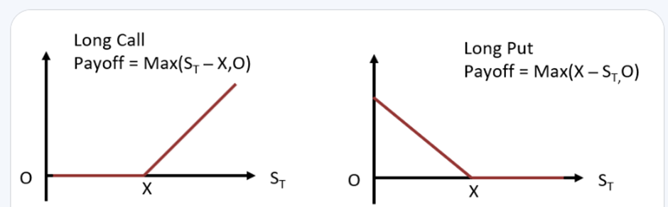

## Table of Contents

## What are non-equity options?

Non-equity options are financial instruments that give the buyer the right, but not the obligation, to buy or sell an asset at a set price before a certain date. Unlike equity options, which are based on stocks, non-equity options are based on other types of assets. These can include commodities like gold or oil, currencies, or even indexes like the S&P 500.

These options are used by investors to hedge against price movements in the underlying asset or to speculate on future price changes. For example, a farmer might use a non-equity option on corn to lock in a selling price, protecting against a drop in corn prices. Similarly, an investor might buy an option on a currency to bet on its future value. Non-equity options can be complex, but they offer flexibility and can be a useful tool in managing financial risk.

## How do non-equity options differ from equity options?

Non-equity options and equity options are both types of options, but they are based on different things. Equity options are based on stocks. This means when you buy an equity option, you are buying the right to buy or sell a specific company's stock at a set price. On the other hand, non-equity options are based on things other than stocks. These can be things like gold, oil, currencies, or even stock indexes like the S&P 500.

The main difference between the two is what they represent. Equity options give you a way to bet on or protect against changes in a company's stock price. Non-equity options, however, let you bet on or protect against changes in the price of other types of assets. Both types of options can be used for similar purposes, like hedging or speculation, but they focus on different markets and assets.

## What types of assets are typically covered by non-equity options?

Non-equity options can be based on a variety of assets, not just stocks. Some common types of assets for non-equity options include commodities like gold, silver, and oil. These options allow people to bet on or protect against changes in the prices of these raw materials. For example, a jewelry maker might use a gold option to manage the risk of rising gold prices.

Another type of asset for non-equity options is currencies. These options let people bet on or hedge against changes in the value of different currencies. For example, if someone thinks the value of the euro will go up compared to the dollar, they might buy a euro option. This way, they can make money if the euro does indeed rise in value.

Lastly, non-equity options can also be based on stock indexes like the S&P 500 or the Dow Jones Industrial Average. These options allow people to bet on or protect against changes in the overall stock market, rather than individual stocks. For example, an investor might buy an S&P 500 option to hedge against a potential drop in the market.

## What is the basic mechanism of trading non-equity options?

Trading non-equity options works a lot like trading other kinds of options. When you buy a non-equity option, you're buying the right to buy or sell something like gold, oil, or a currency at a set price before a certain date. You don't have to buy or sell that thing if you don't want to, but having the option can be useful. For example, if you buy an option to buy gold at $1,800 an ounce and the price of gold goes up to $2,000, you can use your option to buy gold at the lower price and then sell it at the higher price, making a profit.

When you trade non-equity options, you can either buy or sell them. If you buy an option, you pay a price called the premium. If you sell an option, you get the premium, but you have to be ready to buy or sell the asset if the person who bought the option decides to use it. Trading non-equity options can be a way to make money if you think the price of the asset will change a lot, or it can be a way to protect yourself if you're worried about price changes. Just like with any kind of trading, it's important to understand the risks and do your research before you start.

## Can you explain the concept of an option's strike price in the context of non-equity options?

The strike price of a non-equity option is the price at which you can buy or sell the asset that the option is based on. For example, if you have an option to buy gold, the strike price is the price per ounce of gold you can buy it at. If the market price of gold goes above the strike price, you can use your option to buy gold at the lower strike price and then sell it at the higher market price, making a profit. If the market price stays below the strike price, you don't have to use the option, and you only lose the money you paid for the option itself.

The strike price is important because it helps you decide if it's worth using your option. If you have an option to sell oil and the market price of oil drops below the strike price, you can use your option to sell oil at the higher strike price, which can help you avoid losing money. But if the market price stays above the strike price, it's better not to use the option because you wouldn't make any money from it. The strike price is a key part of non-equity options because it sets the level at which the option becomes valuable to use.

## What are the expiration dates for non-equity options and how do they affect trading strategies?

The expiration date of a non-equity option is the last day you can use the option to buy or sell the asset it's based on. For example, if you have an option to buy gold and the expiration date is June 30th, you have to use the option by that date or you lose the right to buy gold at the strike price. Expiration dates can be different for different options, but they are always set in advance so you know when the option will expire.

Expiration dates are important because they affect how you plan your trading strategies. If you think the price of the asset will change a lot before the expiration date, you might buy an option to make money from that change. But if you think the price won't change much, you might not want to buy the option because it could expire worthless, and you would lose the money you paid for it. Knowing when an option expires helps you decide if it's a good time to buy or sell the option, and it can help you manage the risks of trading.

## How is the pricing of non-equity options determined?

The pricing of non-equity options is influenced by several factors, including the price of the underlying asset, the strike price, the time until the option expires, and the [volatility](/wiki/volatility-trading-strategies) of the asset's price. The price you pay for an option, called the premium, is what you pay to have the right to buy or sell the asset at the strike price. If the price of the asset is close to the strike price, the option might be more expensive because it's more likely to be used. The time until the option expires also matters because the longer you have to use the option, the more valuable it can be. And if the price of the asset changes a lot, the option can be more expensive because it's riskier for the person selling the option.

Another important [factor](/wiki/factor-investing) in pricing non-equity options is the [interest rate](/wiki/interest-rate-trading-strategies) and any dividends the asset might pay. If interest rates are high, it can make the option more expensive because it's more costly for the seller to hold onto the asset. Dividends can also affect the price because if the asset pays dividends, it might be less valuable to hold onto the option instead of the asset itself. All these factors are used in models like the Black-Scholes model to calculate the fair price of an option. But remember, the actual price you see in the market can be different because it's also affected by what people are willing to pay and what sellers are willing to accept.

## What are some common strategies used in trading non-equity options?

One common strategy in trading non-equity options is called hedging. This is when you use options to protect yourself from price changes in the asset you're interested in. For example, if you're a farmer who grows corn, you might buy an option to sell corn at a set price. This way, if the price of corn goes down, you can still sell your corn at the higher price you set with the option. Hedging helps you avoid losing money if prices move against you.

Another strategy is speculation. This is when you buy options because you think the price of the asset will change a lot. For example, if you think the price of gold will go up, you might buy an option to buy gold at a set price. If the price of gold does go up, you can use your option to buy gold at the lower price and then sell it at the higher price, making a profit. Speculation can be risky because if the price doesn't change as much as you thought, you could lose the money you paid for the option.

A third strategy is called spreading. This is when you buy and sell different options at the same time to make money from the difference in their prices. For example, you might buy an option to buy oil at one price and sell an option to sell oil at a different price. If the prices of the options move in a way that's good for you, you can make money from the difference. Spreading can be a way to manage risk because you're not betting on just one option, but it can still be complicated and risky.

## What are the risks associated with trading non-equity options?

Trading non-equity options can be risky because you might lose money. When you buy an option, you pay a price called the premium. If the price of the asset doesn't move the way you thought it would, the option might expire worthless, and you lose the money you paid for it. This can happen if you're trying to make money from a big price change that doesn't happen, or if you're trying to protect yourself from a price change that doesn't happen.

Another risk is that options can be hard to understand. They have a lot of parts, like the strike price and the expiration date, and it can be hard to know how these parts will affect the price of the option. If you don't understand these parts well, you might make a bad decision and lose money. Also, the price of options can change a lot because they're affected by things like the price of the asset, how much the price changes, and even interest rates. This can make it hard to predict what will happen and can lead to big losses if you're not careful.

## How do regulatory frameworks impact the trading of non-equity options?

Regulatory frameworks play a big role in how non-equity options are traded. They set rules that everyone has to follow to make sure trading is fair and safe. For example, regulators might require that people who sell options have enough money to cover their promises. This helps prevent big problems if the price of the asset moves a lot. Regulators also make sure that the information about options is clear and easy to understand, so people can make good choices.

These rules can also affect what kinds of options are available and how they can be used. Some regulators might limit the kinds of options that can be traded or set rules about who can trade them. This can make it harder for some people to use options, but it can also help protect them from big risks. Overall, regulatory frameworks are important because they help keep the trading of non-equity options safe and fair for everyone involved.

## What are some advanced trading techniques specific to non-equity options?

One advanced technique for trading non-equity options is called a straddle. This is when you buy both a call option and a put option on the same asset at the same strike price and expiration date. You do this because you think the price of the asset will move a lot, but you're not sure which way it will go. If the price goes up a lot, you can use the call option to make money. If the price goes down a lot, you can use the put option. This can be a good way to make money from big price changes, but it can also be risky because if the price doesn't move much, you could lose money on both options.

Another technique is called a butterfly spread. This is when you use three different options at the same time to make money from a small price change in the asset. You buy one option at a low strike price, sell two options at a middle strike price, and buy another option at a high strike price. If the price of the asset ends up right in the middle, you can make money from the difference in the prices of the options. This can be a good way to make money from small price changes, but it can be hard to set up and understand, and it can still be risky if the price moves too much in either direction.

## Can you discuss case studies or real-world examples of successful non-equity options trading?

One real-world example of successful non-equity options trading happened during the oil price crash in 2020. A trader named Boaz Weinstein used options to bet that the price of oil would go down. He bought put options on oil, which gave him the right to sell oil at a set price. When the price of oil did drop a lot, he used his options to sell oil at the higher price he set and then bought it back at the lower market price, making a big profit. This shows how options can be used to make money from big price changes in commodities like oil.

Another example is from the currency markets. In 2015, a trader named George Soros made a famous bet against the British pound. He bought put options on the pound, betting that its value would go down compared to the German mark. When the pound did drop in value, Soros used his options to sell pounds at the higher price he set and then bought them back at the lower market price, making a huge profit. This shows how options can be used to make money from big price changes in currencies.

## References & Further Reading

1. Hull, J. C. (2018). *Options, Futures, and Other Derivatives*. Pearson Education.

2. Black, F., & Scholes, M. (1973). The Pricing of Options and Corporate Liabilities. *Journal of Political Economy*, 81(3), 637-654.

3. Baxter, M., & Rennie, A. (1996). *Financial Calculus: An Introduction to Derivative Pricing*. Cambridge University Press.

4. Aldridge, I. (2013). *High-Frequency Trading: A Practical Guide to Algorithmic Strategies and Trading Systems*. Wiley.

5. Lopez de Prado, M. (2018). *Advances in Financial Machine Learning*. Wiley.

6. Chan, E. P. (2009). *Quantitative Trading: How to Build Your Own Algorithmic Trading Business*. Wiley.

7. Jansen, S. (2018). *Machine Learning for Algorithmic Trading: Predictive Models to Extract Signals from Market and Alternative Data for Systematic Trading Strategies with Python*. Packt Publishing.

8. Aronson, D. R. (2006). *Evidence-Based Technical Analysis: Applying the Scientific Method and Statistical Inference to Trading Signals*. Wiley.