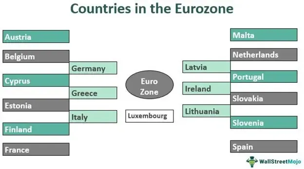

The Eurozone, officially known as the Euro Area, is an economic and monetary union comprising 20 of the European Union's (EU) member countries that have adopted the Euro (€) as their official currency. Established to foster economic integration and stability, the Eurozone allows for the free movement of goods, services, capital, and labor among its members, facilitating a unified market. The Euro, introduced in 1999, has grown to become one of the world's leading reserve currencies, second only to the U.S. dollar, reflecting its significant role in global financial markets. Its establishment was driven by the necessity to streamline economic transactions within Europe and eliminate currency exchange fluctuations among member countries, thereby strengthening the EU's collective economic position.

The development and regulation of financial markets within the European Union, including currency trading activities, are primarily the responsibility of the European Central Bank (ECB) and various EU regulatory bodies. The ECB, located in Frankfurt, Germany, is tasked with formulating monetary policy, maintaining price stability, and supervising financial institutions to ensure a sound and secure European banking system. By setting key interest rates and controlling the Euro monetary supply, the ECB plays a crucial role in influencing forex market dynamics and currency trading activities. Additionally, regulatory frameworks such as the Markets in Financial Instruments Directive (MiFID) II provide oversight to ensure transparency, efficiency, and investor protection within EU financial markets.



Algorithmic trading, defined as the use of computer algorithms to execute trading orders automatically, has gained substantial traction in foreign exchange (forex) markets, including those involving the Euro. These algorithms can process vast amounts of data at extremely high speeds, enabling traders to capitalize on minute market fluctuations that human traders may overlook. Algorithmic trading strategies often incorporate statistical models, machine learning, and artificial intelligence to predict market trends and execute trades with precision. In the context of forex markets, where currency values can be highly volatile, algorithmic trading offers advantages such as timeliness, accuracy, and the ability to manage large trading volumes efficiently.

Understanding algorithmic trading within the Eurozone context is increasingly essential for traders and investors, given the complex interplay of economic policies, technological advancements, and market forces. The Euro's value can be heavily influenced by ECB policy decisions, geopolitical events, and economic indicators such as GDP growth and inflation rates. As such, traders equipped with algorithmic solutions can better adapt to these rapidly changing conditions, optimizing their trading strategies for competitive advantage. Moreover, the regulatory environment poses additional considerations, as algorithmic trading must comply with stringent EU guidelines designed to mitigate risks and ensure market integrity.

This article will explore how Eurozone economic policies, continuous technological innovations, and dynamic market conditions affect algorithmic trading strategies, offering valuable insights for market participants navigating this complex landscape.

## Table of Contents

## The Eurozone and Its Economic Influence

The Eurozone, formally known as the euro area, consists of European Union (EU) member countries that have adopted the Euro (€) as their official currency. Conceived to enhance economic integration and stability, the Eurozone functions as a monetary union in which the European Central Bank (ECB) plays a pivotal role. Established by the Maastricht Treaty in 1992, the Eurozone officially began on January 1, 1999, when 11 EU countries introduced the Euro for accounting purposes. Physical coins and banknotes were introduced on January 1, 2002. Today, the Eurozone comprises 20 out of the 27 EU member states, including Germany, France, and Italy, among others.

The introduction of the Euro has significantly influenced global markets. As a unified currency, it has facilitated easier trade and investment across countries in the zone, eliminated exchange rate risks, and contributed to price stability. The Euro is one of the world's most traded currencies, challenging the dominance of the US Dollar. Its strength and stability influence the global foreign exchange market and international economic policies.

The ECB, headquartered in Frankfurt, Germany, is the central bank for the Eurozone, tasked with maintaining price stability, managing the monetary policy, and overseeing the banking system. It uses various tools, such as [interest rate](/wiki/interest-rate-trading-strategies) adjustments and open market operations, to control inflation and stabilize the economy. The ECB's policies are crucial for the Euro's exchange rates and affect global currency trading. For instance, announcements on interest rate changes can lead to substantial fluctuations in the Euro's value.

Recent economic policies by the ECB have further impacted currency trading. The ECB has, in the past, implemented quantitative easing programs to stimulate the economy by increasing money supply and lowering interest rates. Such measures can lead to depreciation of the Euro, affecting trading strategies and international competitiveness for businesses in the Eurozone. Additionally, the ECB's forward guidance on monetary policy helps market participants anticipate policy changes, influencing trading decisions.

Economic stability or [volatility](/wiki/volatility-trading-strategies) within the Eurozone significantly affects trading strategies. During times of economic stability, traders might employ strategies focusing on steady interest rates and inflation forecasts. Conversely, during periods of volatility, such as the debt crises in Greece and other southern European countries, traders might adopt more conservative or speculative strategies based on anticipated policy responses by the ECB. The economic health of the region epitomizes the interconnection between macroeconomic factors and trading strategies. Understanding these dynamics is vital for traders looking to navigate the complexities of [forex](/wiki/forex-system) markets involving the Euro.

In summary, the Eurozone's formation and development as a monetary union with the Euro as a central currency have played a crucial role in shaping both regional and global economic landscapes. The ECB's influence over monetary policy is significant for currency stability and trade strategies, emphasizing an ongoing need for market participants to stay informed about developments within this influential economic bloc.

## Algorithmic Trading in Forex Markets

Algorithmic trading refers to the use of computer algorithms to manage the trading process in financial markets, executing orders based on pre-defined instructions, such as timing, price, or [volume](/wiki/volume-trading-strategy). In the forex markets, these algorithms are designed to capitalize on minute price discrepancies, efficiently handling the intricacies of currency trading. The speed and precision of [algorithmic trading](/wiki/algorithmic-trading) have considerably transformed forex markets by ensuring rapid execution and minimizing manual intervention.

Several types of algorithms are prominently used in forex, notably high-frequency trading ([HFT](/wiki/high-frequency-trading-strategies)) algorithms and market-making algorithms. HFT algorithms are engineered to execute numerous trades at incredibly high speeds, often within fractions of a second. Their primary objective is to exploit small price inconsistencies that occur momentarily in currency pairs. On the other hand, market-making algorithms provide [liquidity](/wiki/liquidity-risk-premium) to the market by continuously quoting both buy and sell prices, [earning](/wiki/earning-announcement) the spread.

The advantages of algorithmic trading are multifold. First and foremost, it allows for increased trading speed, which is crucial in forex markets where prices fluctuate in milliseconds. By automating the trading process, algorithms can process and analyze vast amounts of data far more efficiently than human traders. This computational power helps traders identify patterns and price movements that might be invisible to manual trading methods. Furthermore, algorithmic trading reduces the emotional and psychological bias often inherent in human trading decisions, thus promoting a more disciplined approach.

However, algorithmic trading is not without its challenges. The technical complexities involved in developing and maintaining trading algorithms require significant expertise in both financial markets and programming. These algorithms need sophisticated infrastructure capable of handling high-speed data feeds and low-latency execution environments. Regulatory scrutiny adds another layer of complexity, as various jurisdictions may impose rules on the use of algorithmic trading to prevent malpractices like market manipulation and ensure fair trading conditions.

Recent trends and technological innovations continue to reshape algorithmic trading. The integration of [artificial intelligence](/wiki/ai-artificial-intelligence) (AI) and [machine learning](/wiki/machine-learning) has enabled the development of predictive models that enhance the decision-making process of algorithms. These technologies allow for the continual improvement of trading strategies through pattern recognition and real-time data processing. Moreover, the use of cloud computing has reduced the cost of accessing computational power, democratizing the ability to deploy sophisticated trading algorithms.

Overall, algorithmic trading in forex markets stands as a testament to the power of technology in optimizing trading efficiency and effectiveness. As innovations continue, the scope and impact of these algorithms are expected to further expand, providing new opportunities and challenges for market participants.

## Impact of Eurozone Policies on Algo Trading

Eurozone monetary policies significantly influence algorithmic trading strategies and decision-making processes in forex markets. The European Central Bank (ECB), as the central monetary authority in the Eurozone, plays a crucial role in shaping these policies. Key decisions by the ECB, such as interest rate adjustments, quantitative easing, or asset purchase programs, can lead to sudden shifts in market sentiment and volatility. For instance, a reduction in interest rates by the ECB may lead to a depreciation of the Euro, prompting algorithmic trading systems to adjust their strategies in real time to capitalize on potential [arbitrage](/wiki/arbitrage) opportunities or manage risks.

Advanced algorithmic trading systems are designed to monitor and respond to a variety of Eurozone economic indicators, including inflation rates and gross domestic product (GDP) growth. Algorithms can utilize macroeconomic models to predict currency movements based on statistical relationships between these indicators and currency prices. For example, an uptick in inflation may signal potential future interest rate hikes by the ECB, which algorithms can [factor](/wiki/factor-investing) into their predictive models to optimize trading strategies. Thus, accurate forecasts and models are crucial for maintaining a competitive edge.

Regulatory frameworks within the European Union also govern algorithmic trading operations, ensuring fair trading practices and market stability. The Markets in Financial Instruments Directive (MiFID II) is a significant piece of EU legislation that impacts algorithmic trading. It imposes requirements for algorithmic traders, such as maintaining robust risk controls and ensuring transparency. Compliance with these regulations is crucial as non-adherence may result in penalties and operational disruptions.

Policy changes in the Eurozone present both potential risks and opportunities for algorithmic traders. A sudden policy shift could result in increased market volatility, posing risks for algorithms that aren’t agile enough to adjust their positions swiftly. Conversely, well-designed algorithms can exploit these shifts by recognizing patterns or anomalies that arise during the transition period. Therefore, traders must continually update their systems to incorporate new data and adjust to an evolving policy landscape.

Understanding the implications of Eurozone policies on algorithmic trading is essential for traders seeking to navigate the complexities of forex markets. By aligning their strategies with economic conditions and regulatory requirements, traders can enhance their decision-making processes and improve their potential for success.

## Case Studies: Successful Algo Trades Involving the Euro

To illustrate the impact of algorithmic trading strategies involving the Euro, several case studies of successful trades can be examined. These case studies highlight not only the effective utilization of technology but also the interplay between economic factors and strategic decision-making.

One notable example involved a sophisticated high-frequency trading (HFT) strategy deployed by a financial technology firm during a European Central Bank (ECB) monetary policy announcement. The firm utilized a proprietary algorithm designed to execute trades within microseconds of the ECB's announcements. Key to the success of this strategy was the algorithm's ability to rapidly parse and react to the ECB’s language regarding interest rate changes. Economic announcements of this nature often lead to substantial short-term market volatility. By accurately interpreting the ECB's guidance, the algorithm efficiently captured price movements, generating sizeable returns within a minimal timespan.

Several factors contributed to the success of this trade. Primarily, the algorithm's design incorporated machine learning techniques to improve its predictive accuracy over time. The firm invested heavily in acquiring low-latency data feeds and optimizing network infrastructure to reduce execution delay, a critical component in high-frequency environments. This trade exemplifies how economic announcements influence algorithmic strategies, emphasizing the importance of speed and precision in volatile market conditions.

Another successful case involved a collaborative project between a fintech startup and a major European bank. The joint effort focused on developing a market-making algorithm that would maintain Euro currency pairs' liquidity in various forex trading platforms. The algorithm adjusted its behavior based on real-time market conditions and macroeconomic indicators from the Eurozone. It leveraged [deep learning](/wiki/deep-learning) models to determine optimal bid-ask spreads, ensuring profitability while managing risk. 

The success of this market-making algorithm lay in the integration of advanced analytics with traditional market strategies. It smoothly adapted to policy shifts and economic indicators, managing to maintain effective spreads while accommodating large trading volumes. This collaboration underscores the potential benefits of partnerships between fintech firms and banks, combining technological innovation with financial expertise.

The lessons drawn from these case studies stress the significance of adaptability and collaboration in algorithmic trading. The use of machine learning to refine predictive capabilities and the strategic importance of collaborating with established financial institutions are critical takeaways. These examples demonstrate that staying at the forefront of technological advancements and maintaining a keen awareness of economic policies are crucial for future algorithmic trading ventures.

Such cases also reveal the evolving landscape of algorithmic trading in the Eurozone, where success is increasingly defined by the ability to leverage cutting-edge technology and forge strategic alliances. Understanding these dynamics will be essential for traders intent on navigating the complexities of the forex markets effectively.

## Future Trends in Eurozone Algo Trading

The Eurozone, a significant player in global finance, is poised for transformative shifts in algorithmic trading influenced by technological advances, regulatory changes, and evolving economic and geopolitical dynamics. Predicting these trends is crucial for traders and investors seeking to maintain a competitive edge.

Emerging technologies, notably artificial intelligence (AI) and machine learning, are set to progressively refine algorithmic trading strategies. These technologies are enhancing the ability to analyze large volumes of market data in real-time, identify complex patterns, and make more informed trading decisions. For instance, machine learning models can be trained on historical market data to predict future price movements, enhance risk management, and optimize trade executions. Here is a simple example of a machine learning algorithm using Python:

```python
from sklearn.model_selection import train_test_split
from sklearn.ensemble import RandomForestRegressor
from sklearn.metrics import mean_squared_error

# Sample data
X = market_data.drop('Euro_Price', axis=1)  # market data features
y = market_data['Euro_Price']  # target prices

# Splitting data into training and testing sets
X_train, X_test, y_train, y_test = train_test_split(X, y, test_size=0.2, random_state=42)

# Create a random forest model
model = RandomForestRegressor(n_estimators=100, random_state=42)

# Train the model
model.fit(X_train, y_train)

# Predict and evaluate
predictions = model.predict(X_test)
error = mean_squared_error(y_test, predictions)
print(f"Mean Squared Error: {error}")
```

This code snippet demonstrates how Eurozone traders might use machine learning techniques to predict Euro price movements, thereby enhancing their strategic trading decisions.

Moreover, as the algorithmic trading ecosystem becomes more reliant on these technologies, the potential for changes in regulatory frameworks is amplified. The European Union could introduce new regulations to address concerns about market manipulation and systemic risk associated with advanced trading technologies. Stringent regulations may require transparency in algorithmic operations and the use of standardized testing protocols to ensure the stability and integrity of financial systems.

Geopolitical tensions and economic developments within the Eurozone also present both risks and opportunities for algorithmic trading. Factors such as Brexit's impact on cross-border transactions, fluctuating relationships with major global economies, and regional economic disparities could influence currency volatility. Understanding these factors can aid in developing algorithms sensitive to geopolitical signals, allowing traders to anticipate and adapt to market shifts more rapidly.

To capitalize on upcoming trends, traders should focus on continuous education and integration of advanced technologies into their trading systems. Embracing innovations like AI-driven analysis and blockchain for transparent transactions will likely be paramount. Additionally, monitoring regulatory trends and understanding their implications can provide a strategic advantage. By investing in robust infrastructure and versatile algorithms, traders can better navigate the complex and dynamic Eurozone trading environment, thereby securing a competitive position in the forex market.

## Conclusion

The intersection of the Eurozone, the Euro, and algorithmic trading presents a rapidly evolving landscape that is crucial for traders and investors to understand. The Eurozone, as a pivotal economic region, exerts significant influence on global markets, particularly through its unified currency, the Euro. Algorithmic trading, utilizing advanced technological innovations, has increasingly gained prominence within the forex markets, offering both opportunities and challenges.

Staying informed about economic policies and regulatory changes within the Eurozone is of utmost importance for traders. The European Central Bank (ECB) plays a critical role in shaping these policies, which directly impact currency trading dynamics and algotrading strategies. Traders must, therefore, keep abreast of policy announcements, economic indicators, and regulatory developments to effectively adapt their strategies in response to market conditions.

To enhance algorithmic trading strategies, traders should consider actionable steps such as leveraging big data analytics, employing machine learning models, and optimizing trading algorithms for speed and efficiency. Implementing back-testing methodologies to simulate trades under various market conditions can also provide valuable insights into potential outcomes.

Ongoing education and adaptation to technological advancements are crucial for maintaining a competitive edge. This involves not only understanding the current technologies employed in algorithmic trading but also anticipating future trends such as the integration of artificial intelligence and blockchain technology in trading processes.

In conclusion, algorithmic trading is poised to reshape the future of forex markets, with the Eurozone playing a central role. As technology advances and the market landscape changes, embracing innovation while remaining vigilant to economic and regulatory shifts will be key to capitalizing on the opportunities presented by algorithmic trading. By adopting a proactive approach, traders can leverage these developments to enhance their trading outcomes and secure a competitive advantage in the forex market.

## References & Further Reading

[1]: European Central Bank. (n.d.). ["Monetary Policy."](https://www.ecb.europa.eu/mopo/html/index.en.html) European Central Bank. 

[2]: Francesca Taylor. (2007). ["Mastering the Currency Market: Forex Strategies for High and Low Volatility Markets."](https://archive.org/details/masteringcurrenc0000norr) Marketplace Books.

[3]: Marcos López de Prado. (2018). ["Advances in Financial Machine Learning."](https://www.amazon.com/Advances-Financial-Machine-Learning-Marcos/dp/1119482089) Wiley.

[4]: MiFID II. (n.d.). ["Markets in Financial Instruments Directive II."](https://eur-lex.europa.eu/legal-content/EN/TXT/?uri=celex%3A32014L0065) European Commission.

[5]: David Aronson. (2006). ["Evidence-Based Technical Analysis: Applying the Scientific Method and Statistical Inference to Trading Signals."](https://www.amazon.com/Evidence-Based-Technical-Analysis-Scientific-Statistical/dp/0470008741) Wiley.

[6]: Stefan Jansen. (2020). ["Machine Learning for Algorithmic Trading: Predictive models to extract signals from market and alternative data for systematic trading strategies with Python."](https://github.com/stefan-jansen/machine-learning-for-trading) Packt Publishing.

[7]: Ernest P. Chan. (2009). ["Quantitative Trading: How to Build Your Own Algorithmic Trading Business."](https://onlinelibrary.wiley.com/doi/pdf/10.1002/9781119203377.fmatter) Wiley.