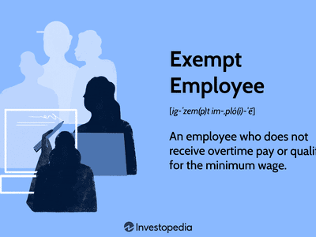

## Table of Contents

## What is a non-exempt employee?

A non-exempt employee is someone who is entitled to receive overtime pay. This means if they work more than 40 hours in a week, their employer must pay them extra for those additional hours. The overtime rate is usually one and a half times their regular hourly rate. Non-exempt employees are typically paid by the hour, and their job duties and salary level must meet certain criteria set by the Fair Labor Standards Act (FLSA).

The FLSA is a law in the United States that sets standards for minimum wage, overtime pay, and other labor practices. It helps protect workers by ensuring they are paid fairly for their time. Non-exempt employees are covered by this law, which means their employers must follow these rules. If an employer does not pay overtime correctly, the employee can file a complaint with the Department of Labor to seek the wages they are owed.

## How does the Fair Labor Standards Act (FLSA) define non-exempt employees?

The Fair Labor Standards Act (FLSA) says that non-exempt employees are workers who must get paid extra if they work more than 40 hours in a week. This extra pay is called overtime, and it's usually one and a half times their normal hourly rate. Non-exempt employees are often paid by the hour, and their job and how much they earn must fit certain rules set by the FLSA.

The FLSA looks at two main things to decide if someone is non-exempt: their job duties and their salary. If a worker's job involves mostly routine tasks and they earn less than a certain amount each year, they are usually non-exempt. This means their employer has to follow the FLSA rules about paying them overtime when they work extra hours.

## What are the basic rights of non-exempt employees?

Non-exempt employees have the right to be paid at least the minimum wage for all the hours they work. This means they should get paid for every hour they are on the job, no matter how many hours they work in a week. If they work more than 40 hours in a week, they also have the right to get paid extra for those extra hours. This extra pay is called overtime, and it is usually one and a half times their normal hourly rate.

Non-exempt employees also have the right to keep accurate records of their work hours. Their employer must keep track of how many hours they work each day and each week. This helps make sure they get paid correctly for all their time. If a non-exempt employee thinks they are not being paid the right amount, they can file a complaint with the Department of Labor to get help.

## What are the advantages of being a non-exempt employee?

Being a non-exempt employee means you get paid for every hour you work. This is good because you know exactly how much money you will get based on the hours you put in. If you work more than 40 hours in a week, you get extra money called overtime pay. This can be a big advantage because you earn one and a half times your normal hourly rate for those extra hours. So, if you need to work a lot, you can make more money.

Another advantage is that your employer has to keep track of your hours. This means there is a clear record of how much you work, which helps make sure you get paid correctly. If you think you are not getting paid the right amount, you can ask for help from the Department of Labor. This gives you a way to make sure you are treated fairly and get the money you deserve.

## What are the disadvantages of being a non-exempt employee?

One disadvantage of being a non-exempt employee is that you might have less flexibility with your work hours. Because you get paid for every hour you work, your employer might not let you work from home or have a flexible schedule. They need to keep track of your hours, so they might want you to be at work during certain times. This can make it harder to balance work with other parts of your life, like family or hobbies.

Another disadvantage is that you might not get paid for things like breaks or time spent getting ready for work. If you have to do things like put on special clothes or equipment before you start working, you might not get paid for that time. Also, if you have to work extra hours, it can be tiring. Even though you get more money for overtime, working long hours can make you feel stressed and worn out.

## How does overtime pay work for non-exempt employees?

Overtime pay for non-exempt employees means they get extra money if they work more than 40 hours in a week. The extra money is called overtime, and it is usually one and a half times their normal hourly rate. So, if a non-exempt employee usually makes $10 an hour, they would get $15 an hour for any time they work over 40 hours in a week.

Employers have to follow rules set by the Fair Labor Standards Act (FLSA) when they pay overtime. This means they have to keep track of how many hours their non-exempt employees work and make sure they get paid the right amount for any overtime. If an employer does not pay overtime correctly, the employee can file a complaint with the Department of Labor to get the money they are owed.

## What types of jobs are typically classified as non-exempt?

Non-exempt jobs are usually ones where people do routine tasks and get paid by the hour. These jobs often include things like working in a store, helping customers, or doing manual labor. For example, people who work as cashiers, janitors, or factory workers are often non-exempt. These jobs usually don't need a lot of special skills or education, and the pay is based on how many hours someone works.

Some other common non-exempt jobs are in places like restaurants or hotels. People who work as servers, cooks, or housekeepers often fall into this category. They get paid for every hour they work, and if they work more than 40 hours in a week, they get extra money for those extra hours. This helps make sure they are paid fairly for all the time they spend working.

## How can an employee determine if they are non-exempt or exempt?

To find out if you are a non-exempt or exempt employee, you need to look at your job duties and how much you earn. Non-exempt employees usually do routine tasks and get paid by the hour. They are covered by the Fair Labor Standards Act (FLSA), which means they get extra pay, called overtime, if they work more than 40 hours in a week. If your job involves mostly following set procedures and you earn less than a certain amount each year, you are likely non-exempt.

Exempt employees, on the other hand, often have jobs that need more skills or education. They might be managers, professionals like doctors or lawyers, or people who do administrative work. Exempt employees usually get paid a salary, not by the hour, and they don't get overtime pay even if they work extra hours. If your job fits into one of these categories and you earn above a certain salary level, you are probably exempt. If you're not sure, you can ask your employer or check with the Department of Labor for more information.

## What are the common misconceptions about non-exempt employee status?

A common misconception about non-exempt employees is that they are less important or have lower status jobs. This is not true. Non-exempt employees do important work, like helping customers in stores or keeping places clean. They just get paid differently, by the hour, and they get extra money for working more than 40 hours a week. Their job is just as valuable as any other job, but the way they are paid follows different rules.

Another misconception is that non-exempt employees can't have good jobs or make a lot of money. This is also not true. Many non-exempt jobs can pay well, especially if someone works a lot of overtime. For example, a skilled worker in a factory might make good money because they get paid extra for working long hours. Non-exempt employees can have rewarding careers and earn a good living, even if they are paid by the hour.

## How do labor laws regarding non-exempt employees vary by state?

Labor laws for non-exempt employees can be different in each state. While the Fair Labor Standards Act (FLSA) sets rules for the whole country, states can have their own rules too. Some states might have a higher minimum wage than the federal one, which means non-exempt employees in those states get paid more per hour. Also, some states have different rules about how overtime is paid or how many hours someone can work in a day before they get extra pay.

For example, in California, non-exempt employees get overtime pay if they work more than 8 hours in a day, not just over 40 hours in a week like the federal rule. This means they can get extra money even if they don't work a full 40 hours in a week, as long as they work more than 8 hours in one day. Other states might have rules about breaks or meal periods that non-exempt employees must get during their workday. It's important for non-exempt employees to know the rules in their state so they can make sure they are paid correctly and treated fairly.

## What are the potential legal issues a non-exempt employee might face?

A non-exempt employee might face legal issues if their employer does not pay them correctly. For example, if the employer does not pay the right amount of overtime or does not pay at least the minimum wage, this can be a problem. Non-exempt employees have the right to be paid for every hour they work, and if they work more than 40 hours in a week, they should get extra money for those extra hours. If an employer does not follow these rules, the employee can file a complaint with the Department of Labor to get the money they are owed.

Another potential issue is if the employer does not keep accurate records of the employee's work hours. Non-exempt employees have the right to have their hours tracked correctly so they can be paid fairly. If an employer messes up the records or does not keep them at all, this can lead to legal problems. The employee might need to go to court or get help from a lawyer to make sure they get paid the right amount. Knowing the labor laws in their state can help non-exempt employees understand their rights and protect themselves from these kinds of issues.

## How can employers ensure compliance with non-exempt employee regulations?

Employers can make sure they follow the rules for non-exempt employees by keeping good records of how many hours their workers are on the job. They need to track every hour worked, including any extra time over 40 hours in a week, so they can pay the right amount of overtime. This means paying one and a half times the normal hourly rate for those extra hours. Employers should also make sure they are paying at least the minimum wage, which might be different in each state. By keeping accurate records and paying correctly, employers can avoid legal problems and make sure their workers are treated fairly.

It's also important for employers to know the labor laws in their state, because some states have different rules than the federal ones. For example, some states might have a higher minimum wage or different rules about when overtime starts. Employers should train their managers and staff about these rules so everyone knows what to do. If there's ever a question or a problem, employers can talk to a lawyer or get help from the Department of Labor to make sure they are doing everything right. By staying informed and following the rules, employers can keep their business running smoothly and avoid any legal issues with non-exempt employees.

## References & Further Reading

[1]: U.S. Department of Labor. ["Fair Labor Standards Act (FLSA) Overview."](https://www.dol.gov/agencies/whd/flsa)

[2]: SEC. ["Regulation of Algorithmic Trading."](https://www.sec.gov/files/Algo_Trading_Report_2020.pdf)

[3]: Murphy, K. P. (2012). ["Machine Learning: A Probabilistic Perspective."](https://www.semanticscholar.org/paper/Machine-learning-a-probabilistic-perspective-Murphy/360ca02e6f5a5e1af3dce4866a257aafc2d6d6f5) MIT Press.

[4]: CFTC. ["Regulatory Framework for Algorithmic Trading in the Financial Markets."](https://www.cftc.gov/PressRoom/SpeechesTestimony/johnsonstatement012524)

[5]: Bodek, H. (2013). ["The Problem of HFT."](https://haimbodek.com/theproblemofhft)

[6]: Bajpai, P. (2020). ["The impact and mechanisms of algorithmic trading."](https://www.sciencedirect.com/science/article/pii/S0957417422006479) Investopedia.