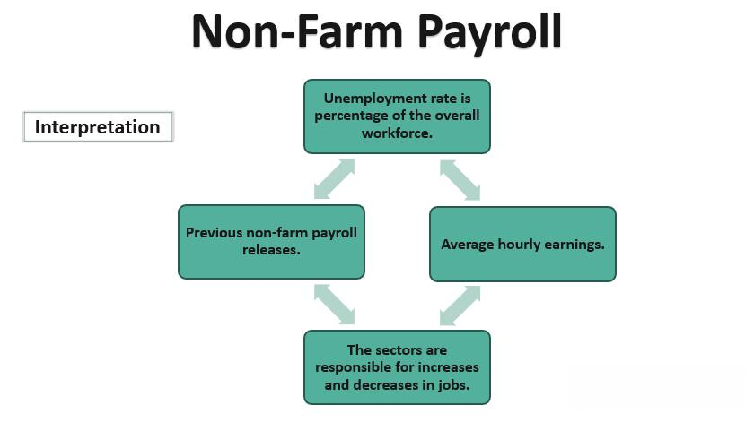

The job market functions as a pivotal indicator of a country's economic health, offering insights through labor statistics into employment trends that influence both local economies and global financial markets. Labor statistics encompass a wide array of data, including employment rates, sector-specific job growth, and unemployment figures, all of which reflect the underlying economic conditions. These statistics serve not only as a measure of economic stability but also as tools for predicting future economic performance.

In recent years, algorithmic trading has gained prominence by integrating sophisticated mathematical models to execute trades based on real-time market data. This technological evolution has reshaped how employment data is utilized in financial markets. Where once manual analysis and decision-making processes were the norm, algorithmic trading now allows for the rapid interpretation and response to labor statistics, thereby influencing trading strategies and market performance.



This article examines the convergence of labor statistics, employment dynamics, and their effects on algorithmic trading. By leveraging employment data, traders and investors can make informed decisions that are crucial for effective market participation. Employment figures, such as non-farm payrolls, are especially influential, significantly impacting trading strategies due to their reflection of job market conditions and economic growth expectations.

The interaction between these elements is complex and underscores the necessity for continuous analysis and adaptation. As financial markets continue to evolve under the influence of advanced trading technologies, understanding the impact of employment data becomes increasingly critical for managing risks and capitalizing on market opportunities.

## Table of Contents

## Understanding Labor Statistics and Employment Data

Labor statistics provide a comprehensive overview of employment trends and economic health. They comprise a diverse set of data points, such as employment rates, unemployment figures, and sector-specific job growth. These statistics serve as a critical tool for economists and investors, offering insights into the labor market and informing economic forecasts.

A cornerstone of labor statistics is the non-farm payrolls (NFP) report, a pivotal monthly measure that tracks employment in the United States, excluding farm and private household workers. This statistic is instrumental in assessing job market conditions and is eagerly anticipated by market participants due to its potential to trigger significant market movements. By excluding volatile sectors, such as agriculture, non-farm payrolls provide a clearer picture of underlying employment trends.

Employment data is a key indicator of economic stability, offering signals about potential growth or contraction in the economy. High employment rates usually suggest robust economic activity, while increased unemployment may indicate economic decline. For example, consistent growth in employment across sectors can point to industrial expansion and consumer confidence.

Analyzing employment data over time can uncover long-term trends and cycles within the economy. Trends such as consistent job growth in specific sectors may highlight emerging industries, whereas persistent unemployment in certain demographics might signal systemic economic issues. Economists often rely on historical data to understand these patterns, observing how employment figures correlate with macroeconomic factors such as GDP growth, interest rates, and inflation.

A deeper statistical analysis can be conducted using time-series models to project future trends. Simple models like moving averages can smooth out fluctuations in employment data, while more complex models such as ARIMA (AutoRegressive Integrated Moving Average) can forecast future changes based on past trends.

To illustrate the practical application of employment [statistics](/wiki/bayesian-statistics) in Python, consider the following code snippet that plots historical non-farm payrolls data:

```python
import matplotlib.pyplot as plt
import pandas as pd

# Assuming `nfp_data.csv` is a CSV file with Date and Jobs columns
nfp_data = pd.read_csv('nfp_data.csv', parse_dates=['Date'])

plt.figure(figsize=(10, 6))
plt.plot(nfp_data['Date'], nfp_data['Jobs'], label='Non-Farm Payrolls')
plt.xlabel('Date')
plt.ylabel('Number of Jobs')
plt.title('Historical Non-Farm Payrolls')
plt.legend()
plt.show()
```

This code demonstrates a basic visualization technique, highlighting how employment data fluctuations can be visualized to identify potential trends. Monitoring these trends allows economists and investors to make informed decisions, leveraging data analysis to navigate the complexities of the job market and its impact on the broader economy.

## The Role of Non-Farm Payrolls in Market Movements

Non-farm payrolls (NFP) are a pivotal economic indicator that significantly influences market movements. Released by the U.S. Bureau of Labor Statistics on a monthly basis, NFP data sheds light on the employment situation by measuring the number of jobs added or lost within non-agricultural sectors. Notably, this data excludes farm workers, private household employees, and non-profit organization employees, focusing instead on various industries including construction, manufacturing, and services.

The considerable anticipation surrounding the release of NFP statistics arises from their capacity to provide deep insights into economic health and job market trends. For investors and traders, these insights are instrumental in making informed strategic decisions. NFP figures have a direct impact on financial markets, often dictating investor sentiment and influencing stock prices, currency valuations, and bond yields. When NFP data reveals stronger-than-expected job growth, it may signal economic expansion, potentially prompting a rise in interest rates due to expectations of inflation. Conversely, weaker-than-anticipated job figures might lead to lower interest rates as a stimulus for economic growth.

Market speculation intensifies in the lead-up to the release of NFP data, contributing to [volatility](/wiki/volatility-trading-strategies) across financial markets. Traders may position themselves based on predictions of the upcoming NFP results, leading to fluctuations in asset prices. This speculative behavior is particularly evident in currency markets, where exchange rates can shift considerably based on anticipated changes in U.S. interest rates following NFP announcements.

To capitalize on the impact of NFP data, investors and traders must thoroughly understand how these figures interact with broader economic indicators. By integrating NFP insights with analysis of other data points such as GDP growth, inflation rates, and consumer spending, market participants can refine their trading strategies. This comprehensive approach allows for more precise forecasts of economic performance, enabling investors to optimize their portfolios effectively.

Understanding the nuances of NFP data's influence on markets is critical for enhancing trading strategies and improving decision-making processes. Employing data-driven analysis, traders can better navigate the complexities of market dynamics, using NFP statistics as a foundation for anticipating market movements and identifying potential opportunities for gain.

## Algorithmic Trading: Integrating Employment Data

Algorithmic trading employs sophisticated mathematical models and computational algorithms to execute trades efficiently and effectively. A critical component of this process is the integration of real-time market data, including employment statistics, which play a significant role in influencing market movements. Employment data such as non-farm payrolls and unemployment rates are integral to understanding economic conditions and predicting potential market trends.

Traders utilize [algorithmic trading](/wiki/algorithmic-trading) systems to automatically react to changes in employment data by embedding trading rules and conditions into the algorithm's code. For instance, a sudden drop in unemployment could signal economic growth, prompting algorithms to increase investments in stocks. Conversely, a rise might lead to reduced exposure to riskier assets.

Here is a simple Python code snippet that demonstrates how an algorithm might respond to employment data:

```python
def trade_decision(unemployment_rate):
    if unemployment_rate < 4:
        return "BUY"
    elif unemployment_rate >= 6:
        return "SELL"
    else:
        return "HOLD"

current_unemployment_rate = 3.8  # Example rate
action = trade_decision(current_unemployment_rate)
print(f"Trading action: {action}")
```

This automated approach to trading increases efficiency by minimizing the latency between data reception and execution of trades, ensuring that opportunities are seized promptly. Furthermore, algorithmic trading substantially reduces the likelihood of human error, allowing for more consistent performance and adherence to predetermined strategies.

Real-time data integration allows these algorithms to continuously adapt to market conditions. For example, [machine learning](/wiki/machine-learning) models can be trained to recognize patterns in employment data that precede market shifts, such as correlations between job growth in certain sectors and stock performance.

However, traders must exercise caution due to potential anomalies and disparities in employment data that could affect trading outcomes. Market anomalies might arise from unexpected geopolitical events or unanticipated policy changes that are not immediately reflected in employment figures. Additionally, disparities in data collection and reporting can pose challenges, necessitating robust error-checking mechanisms within the algorithms.

By accounting for these variables and continuously refining algorithms based on incoming data, traders can optimize trade execution while managing risks effectively. Algorithmic trading, when combined with real-time employment data, thus offers a strategic advantage in today's dynamic financial markets.

## Challenges and Opportunities in the Job Market

The job market is continuously evolving, influenced by an array of challenges and opportunities. Among the foremost challenges is the rapid advancement in technology, particularly automation and [artificial intelligence](/wiki/ai-artificial-intelligence) (AI). These innovations are redefining job roles and functions across various sectors. For instance, tasks that were once manual are increasingly being automated, leading to a decline in demand for certain types of labor. This shift requires the workforce to adapt by acquiring new skills to remain relevant.

Employment data provides a lens through which these broader economic challenges can be observed and analyzed. Fluctuations in employment rates, for example, may indicate underlying economic shifts, such as changes in industry demand or the impact of economic policies. As such, this data has significant implications for both local and global markets. Investors and policymakers closely watch these figures to gauge economic health and make informed decisions.

On the opportunity side, automation and AI are not merely displacing jobs but also creating new ones, particularly in tech-driven sectors. These technologies open pathways for innovation, leading to the creation of new industries and roles that did not exist before. Understanding these dynamics is crucial for both investors and job seekers to navigate the evolving job market landscape. Those equipped with the right skills can find themselves at a competitive advantage in new and emerging fields.

From a trading perspective, data-driven insights derived from employment statistics offer a valuable tool for anticipating market trends. Traders can utilize employment data to predict economic performance and adjust their strategies accordingly. For example, a consistent rise in employment figures might suggest economic growth, prompting investment in sectors likely to benefit from increased consumer spending.

By analyzing employment trends, traders can make informed predictions about market movements. This involves not only looking at current data but also recognizing patterns over time to identify potential shifts in market dynamics. As such, continuously updated and accurate employment data becomes an essential component for traders seeking to manage risks and capitalize on opportunities in volatile markets.

## Strategies for Utilizing Employment Data in Trading

Combining employment statistics with other economic indicators can provide traders with a robust framework for understanding market dynamics. Employment data, such as unemployment rates and job growth figures, offer valuable insights when analyzed alongside indicators like GDP growth, inflation rates, and consumer confidence indices. This multi-dimensional analysis helps in constructing a holistic view of economic conditions, allowing traders to make informed decisions.

Historical employment data forms the backbone of many predictive models used in financial markets. Traders often analyze past employment trends to anticipate future market movements. For example, a consistent decrease in unemployment rates over several months might indicate economic stability, potentially leading to bullish market conditions. Conversely, an unexpected spike in unemployment may signal economic downturns, prompting traders to adopt bearish strategies. Utilizing statistical software or programming languages like Python, traders can create models that correlate historical employment data with market trends, enhancing their capability to forecast potential market shifts.

Diversifying trading strategies based on employment data is a critical risk management approach, particularly in volatile markets. By allocating investments across different sectors or asset classes that respond differently to employment changes, traders can cushion their portfolios against unforeseen market swings. For instance, sectors such as consumer staples may perform well during high unemployment periods as demand for essential goods typically remains stable, while technology stocks might be more volatile under the same conditions.

Leveraging both long-term and short-term employment trends can further optimize trading decisions. Long-term trends provide insights into fundamental economic shifts, helping traders align their strategies with overarching market directions. Short-term trends, on the other hand, offer tactical opportunities to capitalize on immediate market fluctuations. For example, a sudden increase in employment during a recessionary period might signal an impending market rally, providing a tactical entry point for traders.

To maintain a competitive edge, investors should continuously monitor employment data in conjunction with geopolitical events. Geopolitical developments, such as trade agreements or political instability, can have profound effects on employment patterns and, subsequently, on market dynamics. By integrating real-time employment data with geopolitical analysis, traders can anticipate potential market disruptions and adjust their strategies accordingly. For instance, a new trade policy that impacts manufacturing jobs can alter employment statistics, prompting immediate shifts in market sentiment.

In conclusion, the strategic utilization of employment data in trading involves a multi-faceted approach that blends historical analysis, diversified strategy design, and the integration of short and long-term trends with geopolitical awareness. This comprehensive strategy enables traders to navigate financial markets with increased precision and resilience, ultimately enhancing their decision-making process.

## Conclusion

Labor statistics and employment data are indispensable tools for understanding market trends and making informed trading decisions. These data serve as fundamental indicators of economic health, reflecting various aspects of the job market, such as employment rates and sector-specific job growth. When integrated with algorithmic trading, employment data empower traders with strategic advantages in today's fast-paced markets. Algorithms can efficiently process and react to employment statistics, enabling traders to automate their strategies and increase operational efficiency while minimizing human error. 

By staying informed on employment trends, investors can seize market opportunities and manage risks more effectively. Continuous monitoring and analysis of these statistics allow one to anticipate economic shifts and adjust portfolios accordingly. As job markets evolve, driven by technological advancements and policy changes, maintaining a dynamic approach to data analysis becomes essential.

The continuous evolution of trading technologies further enhances the importance of employment data. As these technologies advance, the synergistic use of employment data will increasingly impact financial markets. Traders who adapt to these changes by integrating employment data into their models are better positioned to optimize their strategies and performance. This intersection of labor statistics and algorithmic trading will undoubtedly shape the future dynamics of financial markets, underscoring the value of data-driven decision-making in an ever-adapting economic landscape.

## References & Further Reading

[1]: ["The Role of Non-Farm Payroll in Financial Markets"](https://www.investopedia.com/terms/n/nonfarmpayroll.asp) on Investopedia.

[2]: ["Advances in Financial Machine Learning"](https://www.amazon.com/Advances-Financial-Machine-Learning-Marcos/dp/1119482089) by Marcos Lopez de Prado

[3]: Böhringer, C., & Müller, A. (2014). ["Non-farm Payroll Employment as a Trading Indicator: Evidence from High-Frequency Data"](https://scholar.google.com/citations?user=QcJJBcYAAAAJ). Annals of Finance, 10(3), 305-323.

[4]: ["Evidence-Based Technical Analysis: Applying the Scientific Method and Statistical Inference to Trading Signals"](https://www.amazon.com/Evidence-Based-Technical-Analysis-Scientific-Statistical/dp/0470008741) by David Aronson

[5]: ["Algorithmic and High-Frequency Trading"](https://assets.cambridge.org/97811070/91146/frontmatter/9781107091146_frontmatter.pdf) by Álvaro Cartea, Sebastian Jaimungal, and José Penalva

[6]: ["Quantitative Trading: How to Build Your Own Algorithmic Trading Business"](https://books.google.com/books/about/Quantitative_Trading.html?id=j70yEAAAQBAJ) by Ernest P. Chan

[7]: ["The Economics of Non-Farm Payrolls"](https://tradingeconomics.com/united-states/non-farm-payrolls) on FXStreet.