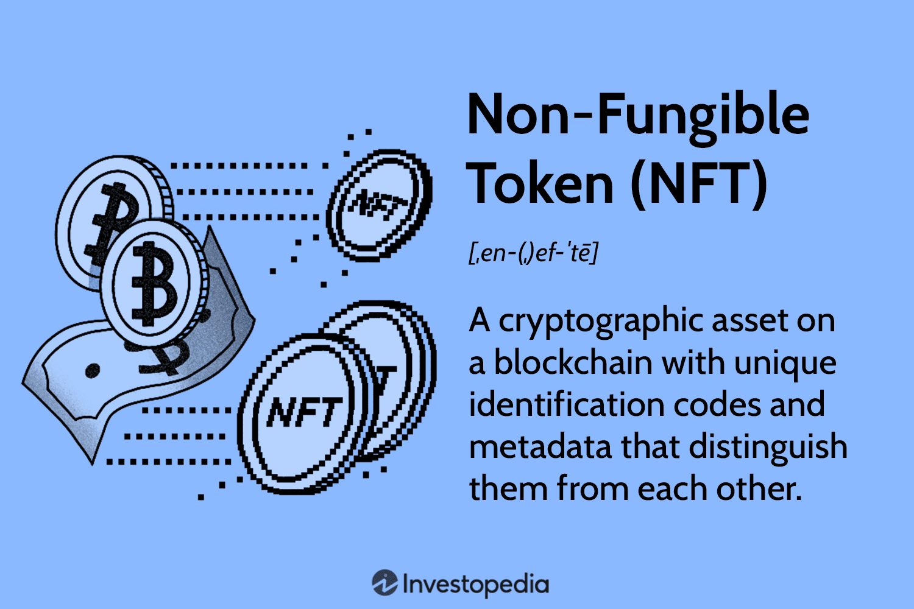

The digital transformation is accelerating across various industries, significantly impacting the financial sector. This shift is largely driven by advancements in blockchain technology, which is revolutionizing asset management. From cryptocurrencies to Non-Fungible Tokens (NFTs), blockchain technology is enabling new forms of digital assets that are changing how we perceive and interact with financial assets.

Cryptocurrencies, such as Bitcoin and Ethereum, have already demonstrated blockchain's potential to create decentralized and secure systems. However, NFTs are now emerging as a transformative form of digital asset, offering unique opportunities for asset management. Unlike cryptocurrencies, NFTs are non-fungible, meaning each token holds distinct information that renders it unique from others, making them ideal for representing ownership of digital art, music, and various other assets.



Moreover, blockchain technology is not only underpinning these digital assets but is also enhancing algorithmic trading. Algorithmic trading utilizes advanced algorithms to execute trades based on predetermined criteria, allowing for more data-driven investment decisions and minimizing human errors. The integration of this technology with digital assets empowers investors to refine their strategies and potentially gain a competitive edge in the digital marketplace.

Understanding these technological trends is essential for investors looking to leverage the full potential of digital assets. As the landscape of digital assets continues to evolve, investors who stay informed and adapt to these changes are likely to enhance their investment strategies and capitalize on new opportunities. This article focuses on the pivotal role of blockchain in managing digital assets, particularly highlighting NFTs and algorithmic trading, to illustrate how these technologies can optimize investment strategies in the digital marketplace.

## Table of Contents

## Understanding Digital Assets in the Blockchain Era

Digital assets, at their core, are intangible assets that exist in a digital form, characterized by their ability to be created, traded, and stored without a physical presence. These include cryptocurrencies, non-fungible tokens (NFTs), and digital content like music, art, and videos. As the digital economy expands, the demand for efficient and secure methods of managing these assets has grown significantly. This is where blockchain technology comes into play, providing an infrastructure that ensures the security, authenticity, and traceability of digital assets.

Blockchain technology employs a decentralized ledger system, where data is distributed across multiple nodes, ensuring that alterations are almost impossible without consensus. This decentralization is key to the technology's ability to maintain secure records. Furthermore, since every transaction is recorded on the blockchain, the authenticity and ownership of digital assets can be easily verified, significantly reducing the potential for fraud.

NFTs, or Non-Fungible Tokens, have recently gained prominence as a unique class of digital assets. Unlike cryptocurrencies such as Bitcoin or Ethereum—which are fungible and can be exchanged one for another, maintaining equivalent value—NFTs are unique and cannot be exchanged on a one-to-one basis. Each NFT represents a specific item or piece of content on the blockchain, making it ideal for verifying the ownership and provenance of digital collectibles, art, music, and even virtual real estate.

The uniqueness of NFTs is largely due to their indivisibility and non-interchangeability. This means that each NFT has its distinct value based on its rarity and the demand for the specific item it represents. For example, digital artworks can be tokenized as NFTs, ensuring that the original piece can be identified and owned, much like a traditional art piece, but with the added security and transparency provided by blockchain technology.

Moreover, the decentralized nature of blockchain provides a platform that is not only secure but also efficient for managing and trading digital assets. With the ability to facilitate peer-to-peer transactions without the need for intermediaries, blockchain reduces transaction costs and time. This efficiency is a driving force behind the accelerated adoption of blockchain for digital asset management.

In summary, digital assets have transformed the way intangible assets are perceived and traded, thanks to blockchain technology. This technology not only secures and verifies transactions but also opens up new avenues for asset management. With the rise of NFTs, blockchain has shown its potential to revolutionize the concept of ownership in the digital age, making it a critical component for anyone involved in the digital marketplace.

## The Rise of NFTs: Transforming Ownership in the Digital World

NFTs, or Non-Fungible Tokens, have significantly changed how digital ownership is perceived, offering a reliable method to own and trade unique digital items securely. These digital assets encompass a wide range of categories, including art, music, in-game items, and even virtual real estate. Unlike traditional digital assets, NFTs leverage blockchain technology to establish verifiable ownership and provenance, providing transparency and reducing fraudulent activities.

The core principle that gives NFTs their unique character is their non-fungibility. A non-fungible asset is one that cannot be exchanged on a one-to-one basis with another asset because each one has distinct attributes. This is contrary to cryptocurrencies like Bitcoin or Ethereum, which are fungible since each unit is interchangeable with another.

NFTs are deployed on various blockchain platforms, with Ethereum being the most prevalent, thanks to its robust support for smart contracts. These smart contracts are scripts stored on the blockchain that automatically execute actions, adhering to predefined rules without the need for intermediaries. This automation ensures that the processes of transferring ownership, enforcing scarcity, and validating transactions occur seamlessly and transparently.

The surge in the NFT market is evident from the substantial growth in transaction volumes, reflecting increased interest from collectors, investors, and content creators. NFTs have introduced a new dimension to the world of collectibles and digital content, where artists and creators can tokenize their work, sell it directly to a global audience, and receive royalties each time the asset changes hands.

As the adoption continues to increase, several platforms like OpenSea, Rarible, and Foundation have become prominent, offering diverse marketplaces for NFT transactions. These platforms provide tools for minting, buying, and selling NFTs, further facilitating their accessibility and integration into the mainstream digital economy.

The world of NFTs is not restricted to individual creativity; their scope extends to innovative applications across diverse industries. For example, real estate projects in virtual worlds like Decentraland allow users to buy parcels of land as NFTs, enabling unique ownership experiences in virtual spaces. In the gaming industry, NFTs provide a mechanism to secure ownership of in-game assets, creating sustainable ecosystems where items can be traded, sold, or used across different games and platforms.

In summary, NFTs represent a paradigm shift in digital ownership by creating a secure and transparent framework for owning unique assets. The combination of blockchain technology and smart contracts ensures that NFTs are not only revolutionizing the digital art scene but are also making their mark across varied sectors, heralding a new era of ownership in the digital world.

## Algorithmic Trading: Enhancing Market Strategies through Technology

Algorithmic trading, often called algo trading, utilizes computational algorithms to automate trading strategies, executing trades based on predetermined criteria such as price, timing, or market conditions. This approach significantly enhances market strategy by limiting human error and allowing for precise, data-driven decision-making. In contrast to traditional trading methods, which are often hampered by emotional bias and require continuous human monitoring, algo trading operates continuously and can instantly respond to market changes.

The integration of [algorithmic trading](/wiki/algorithmic-trading) with digital assets, particularly Non-Fungible Tokens (NFTs), offers substantial opportunities for optimization. By employing AI and [machine learning](/wiki/machine-learning) techniques, algo trading can sift through extensive datasets, extracting relevant insights and patterns that might be invisible to human analysts. These capabilities are crucial in the fast-paced digital asset marketplace, where conditions fluctuate rapidly.

For NFTs, algorithmic trading systems can identify emerging market trends, thus enabling investors to capitalize on profitable opportunities. By analyzing historical and real-time market data, these systems can determine optimal entry and [exit](/wiki/exit-strategy) points, refining the timing of trades for maximum returns. Moreover, they play a critical role in risk management by continuously monitoring market [volatility](/wiki/volatility-trading-strategies) and adjusting strategies accordingly to mitigate potential losses.

Python, a prominent programming language in the finance industry due to its extensive library support, is often used to develop and implement algorithmic trading strategies. Libraries such as NumPy for numerical computation, pandas for data manipulation, and scikit-learn for machine learning enable the rapid analysis and processing of financial data. For instance, a Python script can be designed to automatically execute a trade when a certain set of market conditions is met:

```python
# Simplified Python example for an NFT market trend analysis

import numpy as np
import pandas as pd
from sklearn.linear_model import LinearRegression

# Sample dataset (time, market_value) for NFT prices
data = np.array([
    [1, 100], [2, 150], [3, 200], [4, 250], [5, 300]
])

df = pd.DataFrame(data, columns=['Time', 'Market Value'])
X = df[['Time']]
y = df['Market Value']

# Linear regression model to predict future market values
model = LinearRegression().fit(X, y)

future_time = np.array([[6]])  # Predicting the market value at time 6
predicted_value = model.predict(future_time)

print(f"Predicted Market Value at time 6: {predicted_value[0]}")
```

This example demonstrates how algorithmic models can assist traders in forecasting market trends, enabling strategic decision-making. In the volatile and rapidly evolving digital asset markets, the ability to quickly adapt to new data provides an undeniable strategic advantage. This adaptability, combined with the precision of automated trading systems, positions algorithmic trading as an indispensable tool for investors seeking to thrive in dynamic digital markets.

## Key Strategies for Combining NFTs and Algorithmic Trading

Combining NFTs with algorithmic trading provides a strategic approach to navigating the often-volatile NFT market. By leveraging data-driven methods, investors can optimize their decision-making processes and improve their potential returns. Here are some key strategies for integrating these technologies:

1. **Algorithmic Frameworks for Market Navigation**: Deploying algorithmic frameworks is essential for handling the complexities associated with the NFT market. Algorithms can process vast amounts of data, identifying patterns and predicting future price movements. This capability is crucial for NFT trading, where market movements are often unpredictable and influenced by numerous external factors.

2. **Trend Analysis and Backtesting**: To refine investment strategies, investors can employ trend analysis and backtesting. Trend analysis involves evaluating historical data to identify persistent movements in NFT prices. Backtesting, on the other hand, tests investment strategies against past market data to assess their viability. Both techniques help in crafting a robust trading plan by providing insights into what strategies may yield positive outcomes.

3. **Quantifying Rarity and Market Demand**: Data analytics play a substantial role in understanding the rarity and market demand for specific NFTs. Rarity can significantly affect an NFT's value, making it essential for investors to assess an NFT's scarcity within its category. By analyzing transaction histories, social media sentiment, and other data points, one can gauge demand levels and make more informed buying or selling decisions.

4. **Diversification Across NFT Categories**: Diversification is a risk management strategy that involves spreading investments across various NFT categories. This approach helps mitigate risks because different categories may exhibit distinct market behaviors or be affected by different demand drivers. Diversifying a portfolio can reduce potential losses associated with the decline in a particular NFT category's value.

5. **API Tools for Real-Time Market Data**: Platforms like OpenSea and Rarible offer APIs that provide real-time NFT market data. These tools enable investors to access up-to-date information on NFT listings, sales volume, and price changes. By integrating these APIs into their trading systems, investors can quickly respond to market movements and adjust their strategies accordingly.

Incorporating these strategies allows investors to harness the full potential of NFTs and algorithmic trading, leading to more efficient and effective market participation.

## Challenges and Risk Management in NFT Algo Trading

NFT (Non-Fungible Token) investments, while innovative, present distinct challenges primarily characterized by high volatility and speculative risks. Understanding and implementing effective risk management strategies is crucial for investors navigating this dynamic market.

One fundamental risk management tactic is the use of stop-loss orders. These are preset instructions to sell an asset when it reaches a certain price, thereby limiting an investor's potential loss. This strategy is especially vital due to the NFT market's erratic price swings.

Portfolio diversification is another key approach. By spreading investments across various NFT categories—such as digital art, music, and virtual real estate—investors can mitigate the risk inherent in any single asset's poor performance. Diversification reduces dependency on the success of individual NFTs and balances the overall risk of the investment portfolio.

Investors must also continually adapt to fluctuating market conditions. Regular portfolio rebalancing is essential in maintaining an optimal allocation of investments in response to market changes. Rebalancing involves periodically reviewing and adjusting the components of a portfolio to align with predetermined financial goals and risk tolerance.

Technological tools play a crucial role in safeguarding NFT investments. Blockchain analytics platforms aid in monitoring asset performance and tracking transaction history, enhancing transparency and security. Secure digital wallets are necessary for protecting NFTs from cyber threats, as they provide a safe storage solution that prevents unauthorized access.

Liquidity concerns present additional challenges in NFT trading. Unlike traditional assets, NFTs often lack immediate buyers or sellers, which can impede quick asset liquidation. To combat this, investors should assess the [liquidity](/wiki/liquidity-risk-premium) of NFT marketplaces and consider the long-term holding potential of their assets. Moreover, awareness of market manipulation practices is essential. Due diligence and thorough research are vital to identify suspect market activities, ensuring informed investment decisions.

Addressing these challenges with strategic risk management can significantly reduce potential setbacks in NFT algo trading, facilitating a more stable investment experience.

## The Future of Digital Assets and NFT Investments

As technology progresses, the digital asset landscape stands on the brink of transformative innovations. Of particular interest is the integration of [artificial intelligence](/wiki/ai-artificial-intelligence) (AI) with blockchain technology, which promises to revolutionize how investors engage with non-fungible tokens (NFTs). AI can significantly enhance data analysis, providing profound insights into market dynamics and enabling investors to devise more sophisticated strategies. By employing machine learning algorithms, patterns in NFT trading can be detected earlier, allowing for optimized decision-making processes that transcend human capabilities.

The convergence of traditional financial models with digital assets presents another intriguing development that could fundamentally redefine investment paradigms. The blending of conventional asset management principles with blockchain-driven assets encourages a more fluid approach to diversification and risk management, potentially reshaping portfolio strategies to include digital assets as a core component. Such integration encourages broader participation, marking a shift towards a more decentralized and inclusive financial system.

Remaining informed about emerging technologies and trends is crucial for maintaining competitiveness in this fast-evolving area. As new platforms and tools emerge, offering novel ways to trade and manage digital assets, investors must stay adaptable. This requires a proactive approach to education and a willingness to engage with new digital ecosystems as they develop.

The digital asset market is well-positioned for further expansion, offering unprecedented opportunities for growth and profit. As technology continues to evolve, it opens doors to innovative asset classes and investment vehicles, attracting a diverse range of investors seeking to capitalize on these new opportunities. The potential for scalability and globalization within digital marketplaces further fuels this growth, suggesting a future where digital assets are central to the mainstream economic infrastructure.

In summary, the future of digital assets and NFT investments is promising, characterized by technological integration, evolving investment models, and a commitment to adaptability. These factors collectively foster an environment ripe for innovation and growth.

## Conclusion

Digital assets, driven by blockchain technology and augmented with algorithmic trading, represent significant potential for modern investment strategies. These assets, particularly in the form of NFTs, are unique, verifiable, and offer diversification opportunities unlike traditional markets. To capitalize on this potential, investors must equip themselves with the right tools and strategies that allow them to effectively navigate this dynamic landscape. Leveraging platforms like OpenSea or Rarible, which provide real-time market data, can enhance decision-making capabilities and improve investment outcomes.

The rapid evolution of technology necessitates adaptability and a commitment to continuous learning. As blockchain and AI technologies continue to mature, investors must stay informed about technological advancements and market trends to maintain a competitive edge. By embracing these modern innovations, investors can optimize returns while managing risks efficiently. Techniques such as [backtesting](/wiki/backtesting) strategies, utilizing algorithmic trading frameworks, and employing robust risk management practices are essential components of a successful investment strategy in this evolving digital arena.

Ultimately, the convergence of blockchain, NFTs, and algorithmic trading marks a pivotal shift in the way assets are managed and traded. As this digital landscape evolves, strategic investments in these areas will become increasingly important. By harnessing the power of technology, investors can unlock unprecedented opportunities for growth and innovation, laying the foundation for a robust and future-proof investment portfolio.

## References & Further Reading

[1]: Mougayar, W. (2016). ["The Business Blockchain: Promise, Practice, and Application of the Next Internet Technology."](https://books.google.com/books/about/The_Business_Blockchain.html?id=CEsPDAAAQBAJ) Wiley.

[2]: Gans, J. (2019). ["The Economics of Artificial Intelligence: An Agenda."](https://press.uchicago.edu/ucp/books/book/chicago/E/bo35780726.html) University of Chicago Press.

[3]: Vigna, P., & Casey, M. J. (2015). ["The Age of Cryptocurrency: How Bitcoin and the Blockchain Are Challenging the Global Economic Order."](https://dl.acm.org/doi/10.5555/2717097) St. Martin's Press.

[4]: Narayanan, A., Bonneau, J., Felten, E., Miller, A., & Goldfeder, S. (2016). ["Bitcoin and Cryptocurrency Technologies."](https://press.princeton.edu/books/hardcover/9780691171692/bitcoin-and-cryptocurrency-technologies) Princeton University Press.

[5]: Tapscott, D., & Tapscott, A. (2016). ["Blockchain Revolution: How the Technology Behind Bitcoin is Changing Money, Business, and the World."](https://dl.acm.org/doi/10.5555/3051781) Portfolio.