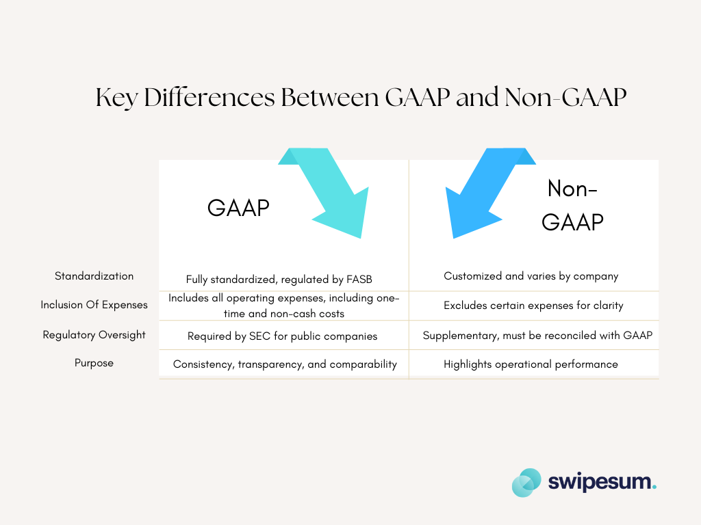

## Table of Contents

## What are Non-GAAP earnings?

Non-GAAP earnings are a way companies show their profits that's different from the official rules set by the government. These official rules are called GAAP, which stands for Generally Accepted Accounting Principles. Companies use non-GAAP earnings to give investors a clearer picture of how well the business is doing, without including certain costs that they think don't reflect the company's true performance.

For example, a company might leave out one-time expenses like costs from restructuring the business or losses from selling off assets. By doing this, they believe they can show a more accurate view of their ongoing operations. However, it's important for investors to be careful because non-GAAP numbers can sometimes make a company look more profitable than it really is. Always comparing these numbers with the GAAP earnings can help get a full picture.

## How do Non-GAAP earnings differ from GAAP earnings?

Non-GAAP earnings and GAAP earnings are two ways companies show how much money they've made, but they do it differently. GAAP, which stands for Generally Accepted Accounting Principles, is a set of rules that companies must follow when they report their earnings. These rules make sure that all companies report their earnings in the same way, so it's fair and clear for everyone. GAAP earnings include all the costs a company has, even if some of those costs are one-time or unusual.

On the other hand, non-GAAP earnings let companies leave out certain costs that they think don't show how well the business is really doing. For example, a company might not include costs from closing a factory or selling off a part of the business because they see these as one-time events that don't reflect their normal operations. By doing this, non-GAAP earnings can make a company look more profitable. But, it's important for people looking at these numbers to be careful because non-GAAP earnings can sometimes make a company's performance look better than it really is.

## Why do companies report Non-GAAP earnings?

Companies report non-GAAP earnings because they want to show investors a clearer picture of how well their business is doing. They think that the official GAAP rules sometimes include costs that don't really show how the business is performing day to day. For example, if a company has to pay a lot of money to close a factory, they might not want to include that cost in their earnings because it's a one-time thing and not part of their regular business.

By using non-GAAP earnings, companies can leave out these unusual costs and show what they believe is a more accurate view of their ongoing operations. This can help investors understand the company's true financial health without being distracted by one-time events. However, it's important for investors to look at both GAAP and non-GAAP earnings to get a full picture, because non-GAAP numbers can sometimes make a company look more profitable than it really is.

## What are some common adjustments made in Non-GAAP earnings?

When companies report non-GAAP earnings, they often make adjustments to show a clearer picture of how they're doing without certain costs that they think don't reflect their regular business. One common adjustment is leaving out one-time expenses. These can be things like the costs of closing a factory, paying for a lawsuit, or the expenses from selling off part of the business. By not including these, companies believe they can show investors what their normal operations look like without these unusual events getting in the way.

Another adjustment often made is not counting stock-based compensation. This is when a company gives its employees stock instead of cash, and it can make the company's expenses look higher under GAAP rules. By leaving this out, companies can show higher earnings in their non-GAAP reports. Also, companies might adjust for things like amortization of intangible assets, which are costs related to things like patents or trademarks that they've bought. These adjustments help companies highlight what they see as the true performance of their business.

## How can Non-GAAP earnings provide a clearer picture of a company's performance?

Non-GAAP earnings can give a clearer picture of a company's performance by leaving out costs that don't happen every day. For example, if a company has to pay a lot of money to close a factory, that's a one-time cost. By not including it in their earnings, the company can show investors how well it's doing without these unusual events getting in the way. This helps investors see what the company's regular business looks like, without being distracted by things that won't happen again.

Another way non-GAAP earnings help is by not counting stock-based compensation. When a company gives its employees stock instead of cash, it can make their expenses look higher. By leaving this out, the company can show higher earnings in their non-GAAP reports. This way, investors can get a better idea of how much money the company is really making from its day-to-day business, without the added cost of giving out stock.

## What are the potential risks of relying on Non-GAAP earnings?

Relying too much on non-GAAP earnings can be risky because these numbers can make a company look more profitable than it really is. Companies can choose what costs to leave out, and sometimes they might leave out too many costs. This can make their earnings look better than they are under the official GAAP rules. Investors might think the company is doing better than it actually is, which can lead to bad decisions like buying the company's stock when it might not be a good investment.

Another risk is that non-GAAP earnings can be hard to compare between different companies. Since each company decides what costs to leave out, their non-GAAP earnings might not be calculated the same way. This makes it tough for investors to compare how different companies are doing. It's important for investors to look at both GAAP and non-GAAP earnings to get a full picture of a company's financial health.

## How do investors and analysts use Non-GAAP earnings in financial analysis?

Investors and analysts use non-GAAP earnings to get a better idea of how a company is doing without being distracted by one-time costs or other unusual expenses. They look at these numbers to see how well the company's regular business is performing. For example, if a company had to pay a lot of money to close a factory, that cost might not be included in non-GAAP earnings. This helps investors understand the company's day-to-day operations better.

However, investors and analysts also know that non-GAAP earnings can sometimes make a company look more profitable than it really is. They are careful and always compare these numbers with the official GAAP earnings. By looking at both, they can get a full picture of the company's financial health. This helps them make smarter decisions about whether to invest in the company or not.

## Can Non-GAAP earnings be manipulated, and if so, how?

Yes, non-GAAP earnings can be manipulated because companies get to choose what costs they leave out. They might decide to not include a lot of expenses that make their earnings look better. For example, a company could leave out costs like paying for a lawsuit or closing a factory. By doing this, they can show higher earnings and make it seem like they are doing better than they really are. This can trick investors into thinking the company is more profitable than it actually is.

It's important for investors to be careful and look at both non-GAAP and GAAP earnings. GAAP earnings follow strict rules and include all costs, so they give a more complete picture of the company's financial health. By comparing the two, investors can see if the company is leaving out too many costs in their non-GAAP earnings. This helps them make better decisions about whether to invest in the company or not.

## What are the regulatory guidelines surrounding the reporting of Non-GAAP earnings?

When companies report non-GAAP earnings, they have to follow some rules set by the Securities and Exchange Commission (SEC). The SEC wants to make sure that companies are clear and honest about how they calculate their non-GAAP earnings. Companies have to explain why they are using non-GAAP numbers and what costs they are leaving out. They also have to show the GAAP earnings right next to the non-GAAP earnings so investors can see both and compare them easily.

The SEC also says that companies can't make their non-GAAP earnings look better than their GAAP earnings. For example, they can't leave out so many costs that their non-GAAP earnings are always higher than their GAAP earnings. This rule helps stop companies from tricking investors by making their earnings look too good. By following these rules, companies can use non-GAAP earnings to give a clearer picture of their business, but they have to be honest and clear about it.

## How do Non-GAAP earnings impact stock valuation and investor perception?

Non-GAAP earnings can affect how much investors think a company's stock is worth. When a company shows higher earnings by leaving out certain costs, it can make the stock look more valuable. Investors might see these higher earnings and think the company is doing better than it really is. This can lead them to buy more of the stock, pushing the price up. But if investors only look at non-GAAP earnings and not the official GAAP earnings, they might make bad decisions because they don't see the full picture of the company's financial health.

On the other hand, if investors are careful and look at both GAAP and non-GAAP earnings, they can get a better idea of how the company is really doing. They can see if the company is leaving out too many costs in their non-GAAP earnings, which might make them less excited about the stock. This can affect how they value the stock and whether they decide to buy or sell it. So, non-GAAP earnings can influence investor perception and stock valuation, but it's important for investors to use these numbers wisely and not rely on them too much.

## What are the best practices for comparing Non-GAAP earnings across different companies?

When comparing non-GAAP earnings across different companies, it's important to look at how each company calculates these numbers. Companies can choose what costs to leave out, so their non-GAAP earnings might not be calculated the same way. To get a fair comparison, you should read the company's explanations about what they include and exclude. This helps you understand if the numbers are really showing the same thing across different companies.

It's also a good idea to always compare non-GAAP earnings with GAAP earnings. GAAP earnings follow strict rules and include all costs, so they give a complete picture of a company's financial health. By looking at both, you can see if one company is leaving out more costs than another. This helps you make a better comparison and understand how each company is really doing.

## How do advanced financial models incorporate Non-GAAP earnings for forecasting and valuation?

Advanced financial models use non-GAAP earnings to help predict how a company will do in the future and to figure out how much the company is worth. These models take the non-GAAP earnings and look at them alongside other important numbers like sales, costs, and how much money the company is making from its regular business. By using non-GAAP earnings, the models can show a clearer picture of the company's day-to-day performance without being distracted by one-time costs or unusual expenses. This helps analysts and investors make better guesses about how the company will do in the future and what its stock might be worth.

However, these models also make sure to include GAAP earnings in their calculations. This is important because GAAP earnings follow strict rules and include all costs, giving a complete picture of the company's financial health. By comparing non-GAAP and GAAP earnings, the models can check if the non-GAAP numbers are leaving out too many costs. This helps make sure the forecasts and valuations are as accurate as possible. So, while non-GAAP earnings can be useful for showing the company's regular business performance, using both types of earnings together gives the best results for forecasting and valuation.

## References & Further Reading

[1]: ["Regulation G and Non-GAAP Financial Measures"](https://www.sec.gov/corpfin/non-gaap-financial-measures.htm) by U.S. Securities and Exchange Commission (SEC)

[2]: ["Investor Bulletin: Non-GAAP Financial Measures"](https://www.sec.gov/corpfin/non-gaap-financial-measures.htm) by U.S. Securities and Exchange Commission (SEC)

[3]: ["Non-GAAP Financial Measures: A Guide to the Perplexed"](https://kpmg.com/kpmg-us/content/dam/kpmg/pdf/2023/issues-in-depth-ngfm.pdf) by Harvard Business Review

[4]: ["Reporting and Disclosure of Non-GAAP Financial Measures"](https://www.sec.gov/corpfin/non-gaap-financial-measures.htm) by CFA Institute

[5]: ["Machine Learning for Asset Managers"](https://www.amazon.com/Machine-Learning-Managers-Elements-Quantitative/dp/1108792898) by Marcos Lopez de Prado

[6]: ["The SEC's Next Steps on Non-GAAP Financial Measures"](https://www.sec.gov/corpfin/non-gaap-financial-measures.htm) by PwC

[7]: ["International Financial Reporting Standards (IFRS) and Non-GAAP Reporting"](https://en.wikipedia.org/wiki/International_Financial_Reporting_Standards) by International Financial Reporting Standards (IFRS) Foundation