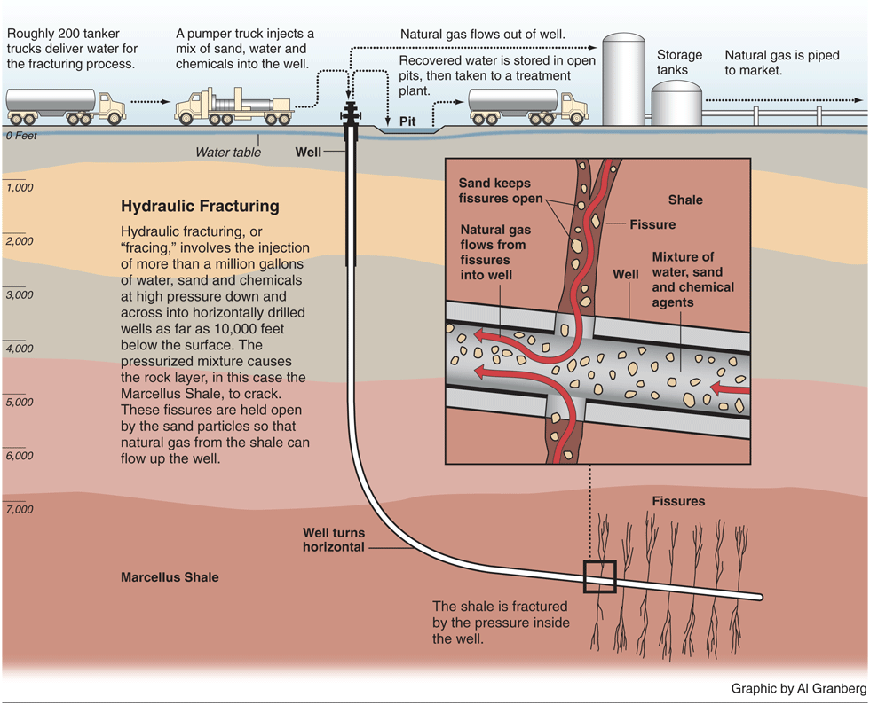

## Table of Contents

## What is non-hydraulic fracturing?

Non-hydraulic fracturing is a way to get oil and gas out of the ground without using water. Instead of water, other methods like using chemicals or heat are used to break the rock and release the oil and gas. This method is different from hydraulic fracturing, which is also called "fracking," where a lot of water mixed with sand and chemicals is pumped into the ground to break the rock.

People are interested in non-hydraulic fracturing because it can be better for the environment. Using less water is good, especially in places where water is scarce. Also, not using water can mean less chance of polluting water sources. However, non-hydraulic methods can be more expensive and might not work as well in all places, so they are not used as much as hydraulic fracturing.

## How does non-hydraulic fracturing differ from hydraulic fracturing?

Non-hydraulic fracturing and hydraulic fracturing are two different ways to get oil and gas out of the ground. Hydraulic fracturing, or fracking, uses a lot of water mixed with sand and chemicals. This mixture is pumped into the ground with high pressure to break the rock and release the oil and gas. On the other hand, non-hydraulic fracturing does not use water. Instead, it uses other methods like chemicals or heat to break the rock and get the oil and gas out.

The main difference between the two methods is the use of water. Hydraulic fracturing needs a lot of water, which can be a problem in places where water is hard to find. It can also lead to water pollution if the chemicals used in fracking get into water sources. Non-hydraulic fracturing is seen as better for the environment because it uses less water and might be safer for water sources. However, non-hydraulic methods can be more expensive and might not work as well in all places, so they are not used as much as hydraulic fracturing.

## What are the primary mechanisms involved in non-hydraulic fracturing?

Non-hydraulic fracturing uses different ways to break the rock and get oil and gas out without using water. One way is by using chemicals. These chemicals can help to break down the rock or make it easier for the oil and gas to flow out. Another way is by using heat. By heating up the rock, it can crack and release the oil and gas trapped inside. These methods are different from hydraulic fracturing, which uses water mixed with sand and chemicals to break the rock.

Both chemical and heat methods have their own challenges. Using chemicals can be tricky because they need to be chosen carefully to work well without causing harm to the environment. Heating the rock can be expensive because it takes a lot of energy to get the rock hot enough to crack. Despite these challenges, non-hydraulic fracturing is seen as a good option because it can use less water and might be safer for the environment. However, because it can be more expensive and might not work as well in all places, it is not used as much as hydraulic fracturing.

## What are the common applications of non-hydraulic fracturing in the industry?

Non-hydraulic fracturing is used in the oil and gas industry when people want to get oil and gas out of the ground without using a lot of water. This method is good for places where water is hard to find or where using a lot of water could be bad for the environment. For example, in dry areas, non-hydraulic fracturing can help get oil and gas without making the water problem worse.

Companies might also use non-hydraulic fracturing in places where they want to avoid the risks that come with hydraulic fracturing. Using chemicals or heat instead of water can help keep water sources clean and safe. Even though it can be more expensive and might not work as well everywhere, non-hydraulic fracturing is a choice for companies that want to be more careful with the environment.

## What types of rocks are most suitable for non-hydraulic fracturing?

Non-hydraulic fracturing works best with certain types of rocks that can be broken easily without using water. Shale is one of these rocks. Shale is a soft rock that can be broken using chemicals or heat. When shale is heated up, it can crack and let out the oil and gas that's trapped inside. This makes shale a good choice for non-hydraulic fracturing.

Another type of rock that can work well with non-hydraulic fracturing is sandstone. Sandstone is made up of sand grains that are stuck together. If the right chemicals are used, they can break the bonds between the sand grains and release the oil and gas. Sandstone can also be heated to make it crack, but it might need more heat than shale because it is a bit harder. Both shale and sandstone are good options for non-hydraulic fracturing because they can be broken without using water.

## How is the effectiveness of non-hydraulic fracturing measured?

The effectiveness of non-hydraulic fracturing is measured by looking at how much oil and gas it can get out of the ground. People compare the amount of oil and gas they get using non-hydraulic fracturing to what they get using other methods like hydraulic fracturing. If non-hydraulic fracturing gets out a lot of oil and gas, it is seen as effective. They also look at how long it takes to get the oil and gas out. If it takes less time, it is more effective.

Another way to measure effectiveness is by looking at the cost. Non-hydraulic fracturing can be more expensive because it uses chemicals or heat instead of water. So, people check if the extra cost is worth it by seeing if they get more oil and gas for the money they spend. They also think about the impact on the environment. If non-hydraulic fracturing uses less water and is safer for the environment, it might be seen as more effective even if it costs more.

## What are the environmental impacts of non-hydraulic fracturing compared to hydraulic fracturing?

Non-hydraulic fracturing is better for the environment than hydraulic fracturing because it uses less water. Hydraulic fracturing, or fracking, needs a lot of water mixed with sand and chemicals. This can be bad in places where water is hard to find. Non-hydraulic fracturing uses other things like chemicals or heat to break the rock and get oil and gas out. This means it does not use up as much water, which is good for the environment, especially in dry areas.

Another way non-hydraulic fracturing is better for the environment is that it is less likely to pollute water. In hydraulic fracturing, the chemicals used can get into water sources and make them dirty. Non-hydraulic fracturing uses different methods that do not involve water, so there is less chance of polluting water. However, non-hydraulic fracturing can still have some bad effects. Using chemicals can harm the environment if they are not handled carefully, and heating the rock uses a lot of energy, which can add to air pollution.

## What technologies and tools are used in the process of non-hydraulic fracturing?

Non-hydraulic fracturing uses special tools and technologies to get oil and gas out of the ground without water. One way is by using chemicals. Machines pump these chemicals into the rock through long pipes called wells. The chemicals help to break down the rock or make it easier for the oil and gas to flow out. Another way is by using heat. Special heaters are put into the ground to warm up the rock. When the rock gets hot enough, it cracks and lets the oil and gas escape.

These methods need different tools than hydraulic fracturing. For chemical fracturing, there are pumps and mixers that blend the chemicals just right before sending them down the well. For heat fracturing, there are heaters and temperature controls to make sure the rock gets hot enough but not too hot. Both ways use sensors to keep track of what's happening underground, like how much oil and gas is coming out and if the rock is breaking the way it should. Even though these tools can be more expensive and tricky to use, they help get oil and gas out without using a lot of water.

## What are the economic considerations of implementing non-hydraulic fracturing?

Non-hydraulic fracturing can be more expensive than hydraulic fracturing. It uses special chemicals or heat instead of water, and these methods cost more money. Companies have to buy the right chemicals and set up heaters in the ground, which can be pricey. They also need special tools and machines to do the job right. Even though it might get out less oil and gas than hydraulic fracturing, companies might still choose it if they want to be careful with the environment or if water is hard to find.

On the other hand, non-hydraulic fracturing can save money in some ways. It uses less water, so companies do not have to spend as much on water. It also might be safer for the environment, which can help avoid big fines or lawsuits that can come with polluting water. If non-hydraulic fracturing works well in certain places, like where the rock is easy to break, it could be worth the extra cost. But it all depends on how much oil and gas it gets out and how much it costs to do it.

## How does non-hydraulic fracturing affect the permeability and porosity of reservoir rocks?

Non-hydraulic fracturing changes the permeability and porosity of reservoir rocks by breaking them without using water. When chemicals or heat are used, they make cracks in the rock. These cracks make it easier for oil and gas to move through the rock. This means the permeability, or how easily fluids can flow through the rock, goes up. The porosity, or the space inside the rock where oil and gas can be stored, might also go up a bit because the cracks create more room.

But, the changes in permeability and porosity can be different depending on the type of rock and the method used. For example, if the rock is shale, it might break easily with heat and make a lot of small cracks. This can really boost the permeability. On the other hand, if the rock is sandstone, it might need more heat or stronger chemicals to break, and the cracks might not be as big or as many. So, the increase in permeability and porosity might not be as much. Overall, non-hydraulic fracturing can make reservoir rocks better at letting oil and gas flow out, but how much better depends on the rock and the method.

## What are the latest research and developments in non-hydraulic fracturing techniques?

Scientists and engineers are working on new ways to do non-hydraulic fracturing that are better for the environment and can get more oil and gas out of the ground. One new idea is using special chemicals that can break the rock without harming the environment. These chemicals are made to be safe and can be used in places where water is hard to find. Another new idea is using different kinds of heat, like microwaves or electric heaters, to warm up the rock. This can make the rock crack in a way that lets out more oil and gas. These new methods are still being tested to see if they work well and are worth the cost.

Researchers are also looking at how to make non-hydraulic fracturing work better in different types of rocks. They are studying how different rocks react to chemicals and heat. For example, they found that some rocks, like shale, can be broken easily with heat, while others, like sandstone, might need stronger chemicals. By understanding how different rocks work, scientists can pick the best method for each place. This can help make non-hydraulic fracturing more effective and cheaper. Even though these new ideas are promising, they still need more testing to make sure they are safe and good for the environment.

## What are the future prospects and potential advancements in non-hydraulic fracturing?

The future of non-hydraulic fracturing looks promising as researchers continue to find new ways to get oil and gas out of the ground without using water. They are working on using safer chemicals that do not harm the environment. These chemicals can break the rock and let out the oil and gas without using up a lot of water. Another idea is using different kinds of heat, like microwaves or electric heaters, to warm up the rock and make it crack. These new methods are being tested to see if they can work well and be cheaper than the old ways.

Scientists are also studying how different rocks react to these new methods. They found that some rocks, like shale, can be broken easily with heat, while others, like sandstone, might need stronger chemicals. By understanding how different rocks work, researchers can pick the best method for each place. This can make non-hydraulic fracturing more effective and less expensive. Even though these new ideas are still being tested, they could help make non-hydraulic fracturing a better choice for getting oil and gas out of the ground in the future.

## References & Further Reading

[1]: Rahm, D. (2011). "Regulating Hydraulic Fracturing in Shale Gas Plays: The Case of Texas." *Energy Policy*, 39(5), 2974-2981.

[2]: Bunger, A.P., Cardella, E.D., & Hicks, B.C. (2013). "Using Proppant to Enhance Maximum Width in Hydraulic Fracturing." *SPE Journal*, 18(05), 840-848.

[3]: Gupta, D.V.S. (2009). "A Review of CO2 Refracture and CO2 Huff-n-Puff Opportunities in the Fracturing Industry." *The Leading Edge*, 28(11), 1376-1381.

[4]: Economides, M.J., & Martin, T. (2007). "Modern Fracturing: Enhancing Natural Gas Production." *Energy Tribune*.

[5]: Brown, R.J., & Economides, M.J. (2010). "Advances in Carbon Dioxide Well Stimulation: CO2-Based Fracturing." *World Oil*, 231(1), 97-102.