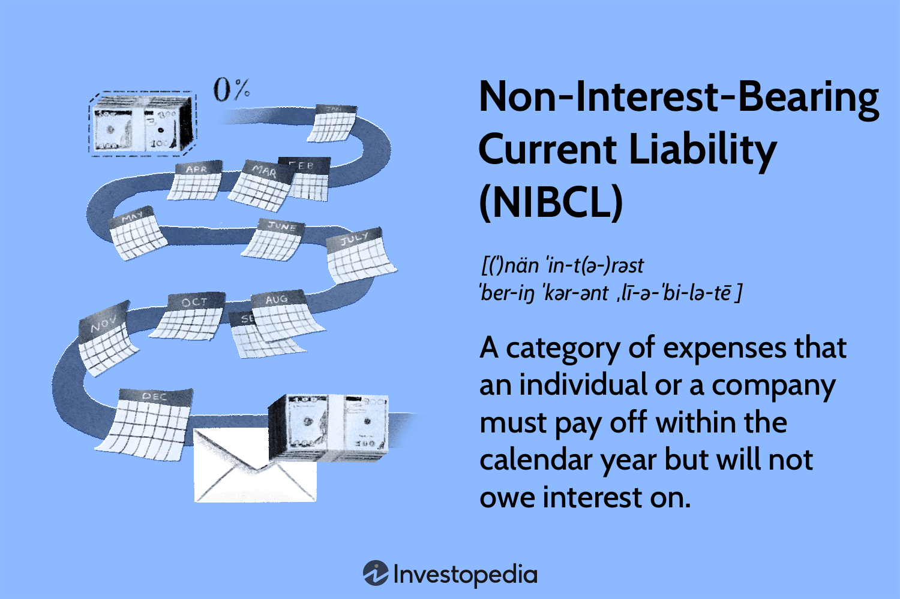

## Table of Contents

## What is a non-interest-bearing current liability?

A non-interest-bearing current liability is a type of debt that a company needs to pay back within a year, but it does not charge any interest. This means the company won't have to pay extra money on top of what they borrowed. Examples of these liabilities include accounts payable, taxes payable, and accrued expenses like wages or utilities that the company owes but hasn't paid yet.

These liabilities are important for managing a company's cash flow because they represent money that needs to be paid soon, but without the added cost of interest. Companies keep track of these liabilities on their balance sheet under current liabilities. By not having to pay interest, the company can use that money for other important things, like buying supplies or paying employees.

## Can you provide examples of non-interest-bearing current liabilities?

Non-interest-bearing current liabilities are debts that a company has to pay back within a year without any extra interest charges. One common example is accounts payable. This is money the company owes to suppliers for goods or services it has received but not yet paid for. For instance, if a company buys materials on credit, the amount they owe to the supplier is an accounts payable.

Another example is taxes payable. This is the amount of taxes a company owes to the government that it hasn't paid yet. Companies have to set aside money for taxes throughout the year, and the unpaid portion at any time is a non-interest-bearing current liability. 

Lastly, accrued expenses are also non-interest-bearing current liabilities. These are costs that the company has incurred but not yet paid, like wages for employees or utility bills. For example, if employees have worked but haven't been paid yet, the company lists the unpaid wages as an accrued expense on its balance sheet.

## How do non-interest-bearing current liabilities differ from interest-bearing liabilities?

Non-interest-bearing current liabilities are debts a company needs to pay back within a year, and they don't charge any interest. This means the company doesn't have to pay extra money on top of what they borrowed. Examples include accounts payable, taxes payable, and accrued expenses like wages or utilities that the company owes but hasn't paid yet. These liabilities are important for managing the company's cash flow because they represent money that needs to be paid soon, but without the added cost of interest.

On the other hand, interest-bearing liabilities are debts that do charge interest. This means the company has to pay back the original amount they borrowed plus extra money for the interest. These liabilities can be short-term, like a bank loan that needs to be paid back within a year, or long-term, like a mortgage that takes many years to pay off. Because of the interest, these liabilities can cost the company more money over time, so they need to be managed carefully.

## What is the impact of non-interest-bearing current liabilities on a company's financial statements?

Non-interest-bearing current liabilities affect a company's financial statements by showing up on the balance sheet under the current liabilities section. This part of the balance sheet lists all the debts the company needs to pay back within a year. When a company has more non-interest-bearing current liabilities, it means they owe more money that they need to pay soon. This can make the company look riskier to investors and lenders because it shows they have less cash on hand to cover their short-term debts.

These liabilities also affect the company's cash flow statement. The cash flow statement tracks how money moves in and out of the company. When the company pays off these non-interest-bearing current liabilities, it shows up as a use of cash in the operating activities section. This can make the company's cash flow look lower, which might worry investors if the company is using a lot of its cash to pay off these debts instead of investing in growth or other important things.

## How are non-interest-bearing current liabilities reported on the balance sheet?

Non-interest-bearing current liabilities are shown on the balance sheet under the section called "current liabilities." This part of the balance sheet lists all the money the company owes that it needs to pay back within a year. These liabilities include things like accounts payable, taxes payable, and accrued expenses like wages or utility bills that the company hasn't paid yet. When a company has more of these liabilities, it means they owe more money soon, which can make them look riskier to investors and lenders.

These liabilities are important because they show how much cash the company needs to have on hand to pay its short-term debts. If a company has a lot of non-interest-bearing current liabilities, it might mean they are using a lot of their cash to pay off these debts instead of investing in other important things like growing the business. This can affect how investors and lenders see the company's financial health.

## What are the typical terms and conditions associated with non-interest-bearing current liabilities?

Non-interest-bearing current liabilities usually come with terms and conditions that say the company has to pay back the money within a short time, often within a year. For example, with accounts payable, the company might have to pay the supplier within 30 or 60 days after getting the goods or services. Taxes payable might need to be paid by a certain date set by the government, like quarterly or yearly. Accrued expenses like wages or utilities might need to be paid at the end of the month or when the bill comes due.

These liabilities don't charge interest, which means the company doesn't have to pay extra money on top of what they owe. But, if the company doesn't pay on time, they might have to pay late fees or penalties. For example, if a company doesn't pay its taxes on time, the government might charge them a late fee. Or, if they don't pay their suppliers on time, the supplier might charge them a late payment fee or stop doing business with them. So, even though these liabilities don't have interest, it's still important for the company to pay them back on time to avoid other costs.

## How do businesses manage non-interest-bearing current liabilities effectively?

Businesses manage non-interest-bearing current liabilities by keeping a close eye on their cash flow. They need to make sure they have enough money coming in to pay their debts on time. For example, they might set up a schedule to pay their suppliers, taxes, and other bills before they are due. This helps them avoid late fees and keeps their suppliers happy. They might also use software to track their expenses and liabilities, so they know exactly how much money they need to set aside each month.

Another way businesses manage these liabilities is by negotiating better terms with their suppliers. If they can get more time to pay their bills, it can help them manage their cash flow better. They might also try to reduce the amount of these liabilities by paying bills more quickly when they have extra cash. This can help them build a good reputation with their suppliers and might even lead to discounts or better payment terms in the future. By managing these liabilities well, businesses can keep their finances healthy and avoid any problems that could come from not paying their debts on time.

## What are the tax implications of non-interest-bearing current liabilities?

Non-interest-bearing current liabilities like accounts payable, taxes payable, and accrued expenses do not directly create tax implications because they do not involve interest payments. This means the company does not have to report any interest income or expense related to these liabilities on its tax return. However, the timing of when these liabilities are paid can affect the company's taxable income. For example, if a company delays paying its taxes payable until the next tax year, it might temporarily reduce its current year's taxable income, which could lower its tax bill for that year.

On the other hand, if the company fails to pay these liabilities on time, it might face penalties or late fees, which could increase its expenses and affect its taxable income. For instance, if a company has to pay a late fee on its taxes payable, that fee is considered a business expense and can be deducted from its taxable income. So, while non-interest-bearing current liabilities themselves do not directly impact taxes, the way a company manages them can have indirect effects on its tax situation.

## How do non-interest-bearing current liabilities affect a company's liquidity and cash flow?

Non-interest-bearing current liabilities, like accounts payable and taxes payable, can affect a company's liquidity and cash flow. Liquidity is about how easily a company can turn its assets into cash to pay its debts. If a company has a lot of these liabilities, it means they need to have enough cash on hand to pay them off soon. This can make their liquidity look lower because they might not have as much cash available for other things.

These liabilities also affect the company's cash flow, which is how money moves in and out of the business. When the company pays off these liabilities, it uses up some of its cash. This can make the company's cash flow look lower, especially if they are paying off a lot of these debts at once. Good cash flow management is important because it helps the company make sure they have enough money to keep running smoothly and pay their bills on time.

## What are the risks associated with high levels of non-interest-bearing current liabilities?

High levels of non-interest-bearing current liabilities can pose risks to a company. These liabilities, like accounts payable and taxes payable, need to be paid back within a year. If a company has too many of these, it might not have enough cash to cover them all. This can make the company look riskier to investors and lenders, who might worry that the company could run out of money. If the company can't pay its bills on time, it might have to pay late fees or penalties, which can add to its costs.

Another risk is that high levels of these liabilities can affect the company's liquidity and cash flow. Liquidity is about how easily a company can turn its assets into cash to pay its debts. If a company has a lot of non-interest-bearing current liabilities, it might need to use up a lot of its cash to pay them off, leaving less money for other important things like buying supplies or paying employees. This can make the company's cash flow look lower, which might worry investors if the company is using a lot of its cash to pay off these debts instead of investing in growth or other important things.

## How do analysts and investors view non-interest-bearing current liabilities when assessing a company's financial health?

Analysts and investors look at non-interest-bearing current liabilities to see how well a company is managing its short-term debts. These liabilities, like accounts payable and taxes payable, need to be paid back within a year. If a company has a lot of these liabilities, it might mean they are using a lot of their cash to pay off these debts instead of investing in other important things like growing the business. This can make the company look riskier to investors and lenders because it shows they might not have enough cash on hand to cover their short-term debts.

On the other hand, if a company has low levels of non-interest-bearing current liabilities, it can be a good sign. It might mean the company is good at managing its cash flow and paying its bills on time. This can make the company look more financially stable and less risky to investors and lenders. So, when analysts and investors look at these liabilities, they are trying to understand how well the company is managing its money and whether it can keep paying its bills without running into problems.

## What strategies can companies use to optimize their use of non-interest-bearing current liabilities?

Companies can optimize their use of non-interest-bearing current liabilities by carefully managing their cash flow. This means they need to make sure they have enough money coming in to pay their bills on time. One way to do this is by setting up a schedule to pay suppliers, taxes, and other bills before they are due. This helps them avoid late fees and keeps their suppliers happy. They might also use software to track their expenses and liabilities, so they know exactly how much money they need to set aside each month. By paying their bills on time, companies can build a good reputation with their suppliers and might even get discounts or better payment terms in the future.

Another strategy is to negotiate better terms with suppliers. If a company can get more time to pay their bills, it can help them manage their cash flow better. For example, if a supplier agrees to extend the payment period from 30 days to 60 days, the company has more time to use its cash for other important things like buying supplies or paying employees. Companies might also try to reduce the amount of these liabilities by paying bills more quickly when they have extra cash. This can help them keep their cash flow healthy and avoid any problems that could come from not paying their debts on time.

## What is the importance of NIBCLs in financial analysis?

Non-interest-bearing current liabilities (NIBCLs) are instrumental in assessing a company's liquidity and overall financial health. These short-term obligations, such as accounts payable, accrued expenses, and deferred revenues, are crucial in determining a company's ability to meet its immediate financial commitments without the burden of interest payments.

Key to understanding the impact of NIBCLs is their role in working capital calculations. Working capital is calculated as:

$$
\text{Working Capital} = \text{Current Assets} - \text{Current Liabilities}
$$

Where current liabilities include NIBCLs. The balance between current assets and these liabilities reflects a firm’s operational efficiency and agility. A healthy working capital position enables businesses to maintain seamless operations, invest in growth opportunities, and manage unexpected financial setbacks. Conversely, excessive NIBCLs relative to current assets might indicate potential liquidity issues, impairing a company's operational capabilities.

Analyzing NIBCLs can also enhance cash flow management. By closely monitoring these liabilities, companies can anticipate cash outflows, thus optimizing financial planning and mitigating risks associated with cash shortages. The timely settlement of NIBCLs ensures that resources are available for strategic investments, supporting long-term financial stability.

Moreover, identifying trends in NIBCLs helps in recognizing potential financial risks. For instance, a significant increase in accounts payable without a corresponding increase in sales might suggest cash flow problems or strained supplier relationships. Such insights can guide managerial decisions, allowing for adjustments in purchasing practices or negotiation of better payment terms with suppliers.

Overall, the effective analysis and management of NIBCLs are essential in maintaining a balanced financial structure, contributing to better business performance and strategic agility.

## References & Further Reading

[1]: ["Financial Analysis: Tools and Techniques"](https://analystprep.com/cfa-level-1-exam/financial-reporting-and-analysis/financial-analysis-techniques-and-tools/) by Erich A. Helfert

[2]: ["Corporate Finance"](https://www.investopedia.com/terms/c/corporatefinance.asp) by Jonathan Berk and Peter DeMarzo

[3]: ["Modern Portfolio Theory and Investment Analysis"](https://www.amazon.com/Modern-Portfolio-Theory-Investment-Analysis/dp/1118469941) by Edwin J. Elton, Martin J. Gruber, Stephen J. Brown, and William N. Goetzmann

[4]: ["Algorithmic Trading: Winning Strategies and Their Rationale"](https://www.amazon.com/Algorithmic-Trading-Winning-Strategies-Rationale-ebook/dp/B00CY5HC0U) by Ernest P. Chan

[5]: ["Liquidity Risk: Managing Funding and Asset Risk"](https://link.springer.com/book/10.1057/9781137374400) by E. Bank

[6]: ["Handbook of Liquidity and Finance"](https://ebrary.net/256004/business_finance/concepts) by Greg N. Gregoriou and Rajesh Kumar