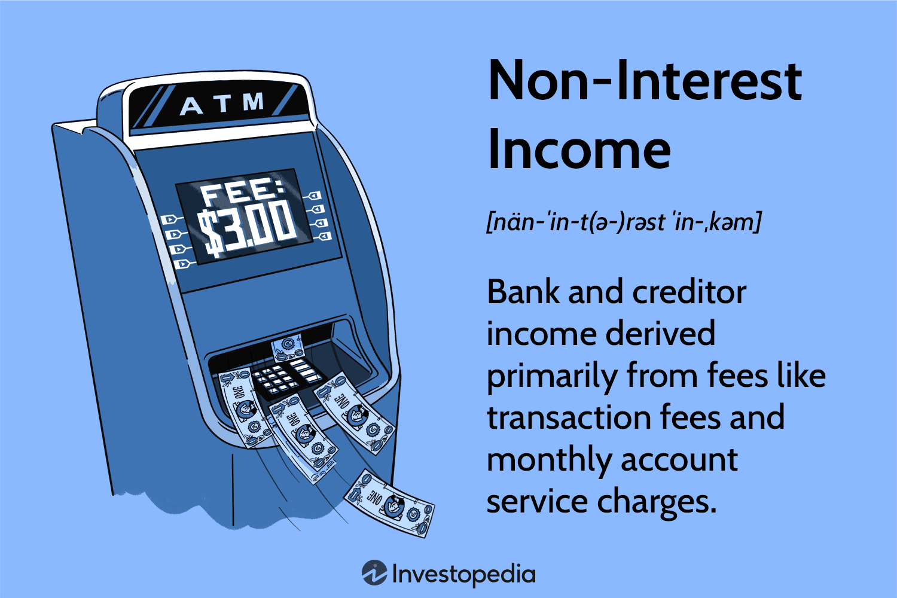

## Table of Contents

## What is non-interest income?

Non-interest income is money that banks and financial institutions earn from sources other than interest on loans and investments. This can include fees for services like account maintenance, ATM usage, and overdraft charges. It also covers income from activities like trading securities, selling insurance, and providing financial advice. Essentially, any revenue that doesn't come from interest falls into this category.

This type of income is important for banks because it helps them diversify their earnings and reduces their reliance on interest rates, which can fluctuate. For example, if interest rates drop, a bank's interest income might decrease, but its non-interest income from fees and other services can help stabilize its overall revenue. This diversification can make a bank more financially stable and resilient to economic changes.

## How does non-interest income differ from interest income?

Non-interest income and interest income are two different ways banks make money. Interest income is what banks earn from charging interest on loans and investments. When you take out a loan, the bank charges you interest, and that's how they make interest income. On the other hand, non-interest income is money banks earn from things other than interest. This includes fees they charge for services like using an ATM, keeping your account open, or going over your account balance. It also includes money from selling insurance or giving financial advice.

The main difference between the two is where the money comes from. Interest income depends on interest rates and how much money people borrow or invest. If interest rates go up, banks can earn more interest income. But if rates go down, their interest income might drop. Non-interest income, however, doesn't depend on interest rates. It comes from fees and other services, so it can help banks make money even when interest rates are low. This makes non-interest income important for banks because it helps them have a steady flow of money no matter what's happening with interest rates.

## What are common sources of non-interest income for banks?

Banks earn non-interest income from many different places. One big source is fees they charge for services. This includes fees for using an ATM, keeping your account open, or going over your account balance. Banks also make money from fees for things like transferring money, stopping payments, or using a debit card. These fees add up and can be a big part of a bank's income.

Another source of non-interest income comes from selling products and services that aren't related to loans. For example, banks can earn money by selling insurance, like life insurance or car insurance. They also make money by giving financial advice or managing investments for people. Some banks even earn money from trading securities, which means buying and selling stocks and bonds.

Overall, non-interest income helps banks make money in ways that don't depend on interest rates. This can make their earnings more stable and help them do well even when interest rates are low. It's an important part of how banks stay profitable and keep serving their customers.

## Why is non-interest income important for financial institutions?

Non-interest income is important for financial institutions because it helps them make money in ways that don't depend on interest rates. If interest rates go down, the money banks make from loans and investments might drop. But if banks can earn money from fees and other services, they can still make a good income even when interest rates are low. This makes their earnings more stable and helps them stay strong no matter what's happening with interest rates.

Another reason non-interest income is important is that it helps banks offer more services to their customers. Banks can earn money from selling insurance, giving financial advice, or helping people manage their investments. This not only brings in more money for the bank but also helps them meet more of their customers' needs. By having different ways to make money, banks can be more flexible and better at serving their customers.

## How does non-interest income impact a bank's profitability?

Non-interest income can make a big difference in how profitable a bank is. When a bank makes money from fees and services instead of just loans, it can keep [earning](/wiki/earning-announcement) even if interest rates go down. This means the bank's profits don't depend as much on what's happening with interest rates. If a bank can get a lot of non-interest income, it might be able to make more money overall and be more profitable.

Having non-interest income also helps a bank be more stable. If the bank only made money from loans, and interest rates dropped a lot, its profits could go down a lot too. But with non-interest income from things like ATM fees or selling insurance, the bank can keep making money even when loans aren't bringing in as much. This makes the bank's profits more steady and helps it stay strong no matter what's happening in the economy.

## Can you explain the role of fee income in non-interest income?

Fee income is a big part of non-interest income for banks. It's the money banks make from charging customers for using their services. This can include fees for things like using an ATM, keeping an account open, or going over your account balance. Banks also charge fees for services like transferring money, stopping payments, or using a debit card. All these fees add up and can be a big source of income for banks, helping them make money even when interest rates are low.

Having fee income is important for banks because it helps them stay profitable no matter what's happening with interest rates. If interest rates drop, the money banks make from loans might go down, but they can still earn a lot from fees. This makes their income more stable and helps them keep making money even during tough economic times. Fee income also lets banks offer more services to their customers, which can make the bank more useful and attractive to people.

## What are the risks associated with relying heavily on non-interest income?

Relying too much on non-interest income can be risky for banks. If a big part of a bank's money comes from fees, they might try to charge more fees or make them harder to avoid. This can make customers unhappy and might even make them leave the bank. If too many people leave, the bank could lose a lot of money. Also, if the economy gets bad, people might use fewer services, so the bank would make less money from fees.

Another risk is that rules and laws about fees can change. Governments might decide to limit how much banks can charge for certain fees. If this happens, a bank that depends a lot on fee income could see its profits drop a lot. Banks need to be careful and make sure they don't rely too much on non-interest income, so they can stay strong no matter what happens.

## How have regulatory changes affected non-interest income strategies?

Regulatory changes have had a big impact on how banks make money from non-interest income. Governments sometimes make new rules about what fees banks can charge. For example, they might say banks can't charge as much for using an ATM or going over your account balance. When this happens, banks have to find other ways to make money because they can't count on those fees as much. This means they might try to sell more insurance or financial advice to their customers to make up for the lost fee income.

These changes also make banks think more about how they treat their customers. If the rules make it harder to charge fees, banks might focus more on keeping their customers happy so they don't leave. They might offer better services or lower fees in other areas to keep people coming back. This can be good for customers, but it means banks have to be smart about how they make money and stay profitable.

## What trends are currently shaping non-interest income in the banking sector?

Right now, one big trend shaping non-interest income in banks is the move towards digital banking. More and more people are using their phones and computers to do their banking. This means banks are making less money from things like ATM fees because people aren't using ATMs as much. But it also means banks can make money in new ways, like charging for special digital services or offering new kinds of financial products online. Banks are trying to find the right balance between offering good digital services and making money from them.

Another trend is that customers are getting more aware of fees and are choosing banks that charge less. This has made banks rethink how they make money from fees. Some banks are lowering their fees or getting rid of them to attract more customers. At the same time, they're looking for other ways to make non-interest income, like selling more insurance or financial advice. It's a tricky balance because banks need to keep their customers happy while also staying profitable.

Overall, these trends are pushing banks to be more creative with how they make non-interest income. They're looking at new services and products to offer, and they're trying to keep up with what customers want. It's all about finding new ways to make money while keeping customers happy and following the rules.

## How can banks optimize their non-interest income streams?

Banks can optimize their non-interest income by focusing on offering more services that people want. For example, they can sell more insurance or give financial advice. By doing this, they can make money even if they can't charge as many fees. Banks can also use technology to their advantage. They can create special digital services that people are willing to pay for, like budgeting tools or investment apps. This way, they can make money from new sources and keep up with what customers want.

Another way banks can optimize non-interest income is by being smart about fees. They need to find the right balance between charging enough to make money and not charging so much that customers leave. Banks can look at which fees bring in the most money and focus on those, while maybe lowering or getting rid of fees that don't make as much. They also need to keep an eye on what the government says about fees and be ready to change their strategies if the rules change. By doing all these things, banks can make the most of their non-interest income and stay profitable.

## What advanced analytics are used to forecast non-interest income?

Banks use advanced analytics to predict how much non-interest income they will make. They look at a lot of data from the past, like how many people used their ATMs or how many insurance policies they sold. They use special computer programs to find patterns in this data. These programs can tell them things like when people are most likely to use certain services or buy certain products. By understanding these patterns, banks can guess how much money they will make from fees and other services in the future.

Another way banks use advanced analytics is by looking at what's happening in the world around them. They study things like the economy, what people are buying, and what other banks are doing. They use this information to make better guesses about their non-interest income. For example, if the economy is doing well, more people might buy insurance or use financial advice services. By keeping an eye on these trends, banks can plan ahead and make sure they are ready to make the most money possible from non-interest sources.

## How do global economic conditions influence non-interest income strategies?

Global economic conditions can really change how banks make money from non-interest income. When the economy is doing well, people might have more money to spend on things like insurance or financial advice. This means banks can make more money from selling these services. But if the economy is not doing well, people might not want to spend as much on these things. So, banks might have to focus more on fees from services like ATM use or account maintenance to keep making money.

Banks also need to think about what's happening in different countries. If one country's economy is doing better than another, banks might try to make more money from non-interest sources in that country. They might offer special deals or new services to attract customers there. On the other hand, if a country's economy is struggling, banks might need to be careful about how much they rely on non-interest income from that place. They might need to find other ways to make money or adjust their fees to keep their income steady.

## References & Further Reading

[1]: ["Advances in Financial Machine Learning"](https://www.amazon.com/Advances-Financial-Machine-Learning-Marcos/dp/1119482089) by Marcos Lopez de Prado

[2]: Bergstra, J., Bardenet, R., Bengio, Y., & Kégl, B. (2011). ["Algorithms for Hyper-Parameter Optimization."](https://dl.acm.org/doi/10.5555/2986459.2986743) Advances in Neural Information Processing Systems 24.

[3]: ["Quantitative Trading: How to Build Your Own Algorithmic Trading Business"](https://www.amazon.com/Quantitative-Trading-Build-Algorithmic-Business/dp/1119800064) by Ernest P. Chan

[4]: ["Machine Learning for Algorithmic Trading"](https://github.com/stefan-jansen/machine-learning-for-trading) by Stefan Jansen

[5]: ["MiFID II: A New Framework for European Financial Markets"](https://www.esma.europa.eu/trading/mifid-ii-and-mifir-review)542224_EN.pdf) European Parliamentary Research Service

[6]: U.S. Securities and Exchange Commission (SEC). ["Consolidated Audit Trail (CAT)."](https://www.sec.gov/about/divisions-offices/division-trading-markets/rule-613-consolidated-audit-trail)

[7]: Basel Committee on Banking Supervision. ["Basel III: International Regulatory Framework for Banks."](https://www.bis.org/bcbs/basel3.htm) 

[8]: ["Evidence-Based Technical Analysis: Applying the Scientific Method and Statistical Inference to Trading Signals"](https://www.amazon.com/Evidence-Based-Technical-Analysis-Scientific-Statistical/dp/0470008741) by David Aronson