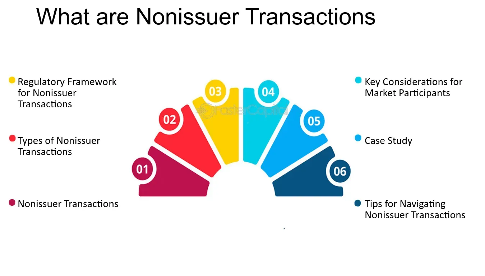

## Table of Contents

## What is a non-issuer transaction?

A non-issuer transaction is a type of stock sale where the company that originally issued the stock is not involved. Instead, the stock is sold between investors or shareholders without the company's participation. This means that the company does not receive any money from these sales.

These transactions are common in the secondary market, where investors buy and sell existing shares among themselves. Non-issuer transactions are important because they help keep the market active and liquid, allowing investors to easily buy and sell stocks without needing the company to issue new shares.

## How does a non-issuer transaction differ from an issuer transaction?

A non-issuer transaction is when someone sells their stock to another person, but the company that made the stock isn't part of the deal. It's like trading cards between friends; the company that made the cards doesn't get any money. These trades happen a lot in places like the stock market, where people buy and sell stocks that already exist. The company doesn't get any money from these trades, so it's called a non-issuer transaction.

An issuer transaction is different because it involves the company that made the stock. When a company does an issuer transaction, it's selling new stocks directly to people or investors. This is like when a company first goes public or when it wants to raise more money. The company gets the money from these sales, which it can use to grow or run its business. So, in an issuer transaction, the company is very much involved and benefits directly from the sale of its stocks.

## What are the common types of non-issuer transactions?

Non-issuer transactions happen a lot in the stock market. One common type is when people who already own stocks sell them to other people. This is like trading cards with friends; the company that made the stocks doesn't get any money. These trades can happen on big stock markets like the New York Stock Exchange or smaller ones. They help keep the market active because people can easily buy and sell stocks without the company needing to make new ones.

Another type of non-issuer transaction is when a company buys back its own stocks from shareholders. This is called a stock repurchase or buyback. The company uses its own money to buy back the stocks, but it's still considered a non-issuer transaction because it's not selling new stocks. Instead, it's taking stocks out of the market. This can make the remaining stocks more valuable because there are fewer of them.

There are also private sales between investors, which are another kind of non-issuer transaction. These happen outside of big stock markets and can be between friends, family, or other investors. They don't involve the company that made the stocks, so the company doesn't get any money from these deals. These private sales can be less regulated than trades on big stock markets, but they still help people move stocks around without the company's involvement.

## Can you explain the process of a non-issuer transaction?

A non-issuer transaction is when someone who owns stocks decides to sell them to someone else, and the company that made the stocks isn't involved. It's like trading cards with a friend; the company that made the cards doesn't get any money from the trade. These transactions usually happen on a stock market, like the New York Stock Exchange, where people can buy and sell stocks that already exist. When someone wants to sell their stocks, they put an order into the market, and someone else can buy those stocks if they want to. The money goes directly from the buyer to the seller, and the company that made the stocks doesn't get anything from this deal.

Another type of non-issuer transaction is when a company buys back its own stocks from shareholders. This is called a stock repurchase or buyback. The company uses its own money to buy the stocks, but it's still a non-issuer transaction because it's not selling new stocks. Instead, it's taking stocks out of the market. This can make the remaining stocks more valuable because there are fewer of them. Even though the company is involved in this type of transaction, it's still considered non-issuer because it's not issuing new stocks; it's just buying back existing ones.

## What are the regulatory requirements for non-issuer transactions?

Non-issuer transactions have some rules they need to follow, but they are usually less strict than rules for issuer transactions. When people trade stocks on big markets like the New York Stock Exchange, they have to follow the rules set by the market and the government. These rules help make sure that the trades are fair and that people know what they're buying and selling. For example, people who want to sell their stocks need to tell the truth about the stocks and can't lie to buyers.

For private sales between investors, which happen outside of big markets, the rules can be a bit different. These sales might not have to follow all the same rules as trades on big markets, but there are still some important things to keep in mind. For example, if someone is selling a lot of stocks, they might need to tell the government about it. Also, everyone involved in the trade needs to make sure they're following any laws about who can buy and sell stocks. Even though these private sales are less regulated, they still need to be fair and honest.

## How do non-issuer transactions impact the market?

Non-issuer transactions help keep the stock market active and lively. When people buy and sell stocks that already exist, it makes it easier for everyone to trade. This is good because it means people can quickly turn their stocks into money if they need to, or buy more stocks if they want to. It's like a busy marketplace where lots of people are trading, which helps keep the market moving and healthy.

These transactions can also affect the price of stocks. When a lot of people want to buy a certain stock, the price can go up because there are more buyers than sellers. On the other hand, if a lot of people want to sell a stock, the price can go down because there are more sellers than buyers. This constant buying and selling helps set the price of stocks based on what people think they're worth. So, non-issuer transactions play a big role in deciding how much stocks are worth in the market.

## What are the risks associated with non-issuer transactions?

Non-issuer transactions can have some risks. One risk is that the price of the stock can go up and down a lot. When people buy and sell stocks without the company being involved, the price can change quickly based on what people think the stock is worth. If a lot of people want to sell their stocks at the same time, the price might drop a lot. This can be scary if you own the stock and didn't expect the price to fall so much.

Another risk is that it can be hard to know if the person selling the stock is telling the truth. In private sales, where people trade stocks outside of big markets, there might not be as many rules to make sure everyone is honest. If someone lies about the stock or doesn't tell the whole truth, the person buying the stock might end up with something that's not as good as they thought. This can lead to losing money or feeling tricked.

## How can investors protect themselves in non-issuer transactions?

Investors can protect themselves in non-issuer transactions by doing their homework. Before buying a stock, it's a good idea to learn as much as you can about the company and the stock itself. Look at the company's financial reports and news to see if it's doing well. Also, check what other people are saying about the stock. This can help you make a smarter choice and avoid stocks that might not be a good deal.

Another way to stay safe is to use trusted places to buy and sell stocks. Big stock markets like the New York Stock Exchange have rules that help keep things fair and honest. If you're doing a private sale, make sure you trust the person you're trading with and maybe even get a lawyer to help make sure everything is done right. By being careful and using trusted sources, investors can lower the risks of non-issuer transactions.

## What role do intermediaries play in non-issuer transactions?

Intermediaries are important in non-issuer transactions because they help make the trading process easier and safer. When people buy and sell stocks on big markets like the New York Stock Exchange, they often use brokers, who are a type of intermediary. Brokers help match buyers with sellers, making sure the trade happens smoothly. They also make sure that all the rules are followed, which helps keep the market fair and honest. This can give investors more confidence that they're getting a good deal.

In private sales, intermediaries can also play a big role. For example, if two people want to trade stocks outside of a big market, they might use a lawyer or another trusted person to help them. This intermediary can make sure that everything is done correctly and that both people understand the deal. By having someone in the middle to help, investors can feel safer and more sure that they're making a good choice.

## Are there any specific examples of successful non-issuer transactions?

One example of a successful non-issuer transaction is when a big investor like Warren Buffett buys stocks from other investors on the stock market. For instance, when Buffett bought shares of Apple, he didn't buy them directly from Apple. Instead, he bought them from other people who already owned Apple stock. This helped make the market more active and showed other investors that Apple was a good company to invest in. Because Buffett is well-known and trusted, his buying helped push up Apple's stock price, which was good for other shareholders.

Another example is when companies buy back their own stocks, like when Microsoft announced a big stock buyback program. Microsoft used its own money to buy shares from its investors, not to sell new shares. This made the remaining shares more valuable because there were fewer of them. Investors who sold their shares to Microsoft got money, and the ones who kept their shares saw the value go up. This kind of non-issuer transaction can be a win-win for the company and its shareholders.

## How have non-issuer transactions evolved over time?

Non-issuer transactions have changed a lot over time. In the old days, people used to trade stocks by meeting in person or sending letters. It was slow and hard to do. But now, with computers and the internet, people can trade stocks much faster and easier. They can buy and sell stocks from their homes using online platforms. This has made non-issuer transactions more common and easier for more people to do.

Over the years, the rules for non-issuer transactions have also changed. Governments and big stock markets have made new rules to make sure these trades are fair and honest. For example, they've made rules about what people have to tell each other when they're trading stocks. These rules help protect investors and keep the market working well. As technology and the market keep changing, non-issuer transactions will probably keep evolving too.

## What future trends can we expect in non-issuer transactions?

In the future, non-issuer transactions will likely become even easier and faster thanks to new technology. More people might use apps and online platforms to buy and sell stocks without the company being involved. This could make the market even more active and lively. Also, new tools like [artificial intelligence](/wiki/ai-artificial-intelligence) might help people make smarter choices about which stocks to buy and sell. This could make non-issuer transactions safer and more reliable for everyone.

Another trend we might see is more rules to protect investors. As more people trade stocks online, governments and big stock markets might make new rules to make sure everyone is playing fair. These rules could help stop people from lying or cheating when they trade stocks. This would make non-issuer transactions safer and more trustworthy. As the market keeps changing, non-issuer transactions will probably keep getting better and more important.

## References & Further Reading

[1]: SEC (2019). ["Rule 144: Selling Restricted and Control Securities"](https://www.sec.gov/about/reports-publications/investorpubsrule144). U.S. Securities and Exchange Commission.

[2]: Harris, L. (2003). ["Trading and Exchanges: Market Microstructure for Practitioners"](https://www.amazon.com/Trading-Exchanges-Market-Microstructure-Practitioners/dp/0195144708). Oxford University Press.

[3]: ["Algorithmic Trading & DMA: An introduction to direct access trading strategies"](https://www.amazon.com/Algorithmic-Trading-DMA-introduction-strategies/dp/0956399207) by Barry Johnson

[4]: SEC (2023). ["Regulation M"](https://www.sec.gov/newsroom/press-releases/2023-105). U.S. Securities and Exchange Commission.

[5]: Hasbrouck, J. (2007). ["Empirical Market Microstructure: The Institutions, Economics, and Econometrics of Securities Trading"](https://academic.oup.com/book/52241). Oxford University Press.

[6]: ["MiFID II: A New Framework for European Financial Markets"](https://www.esma.europa.eu/trading/mifid-ii-and-mifir-review). European Banking Authority.

[7]: Aldridge, I. (2009). ["High-Frequency Trading: A Practical Guide to Algorithmic Strategies and Trading Systems"](https://www.ahmetbeyefendi.com/wp-content/uploads/2020/07/High-Frequency-Trading-Irene-Aldridge.pdf). Wiley.

[8]: Gomber, P., Arndt, B., Lutat, M., & Uhle, T. (2011). ["High-Frequency Trading"](https://papers.ssrn.com/sol3/papers.cfm?abstract_id=1858626). Springer. 

[9]: ["Understanding Market Liquidity"](https://www.thearmchairtrader.com/features/stock-market-liquidity-meaning-simple-terms-explained/) by Avinash D. Persaud