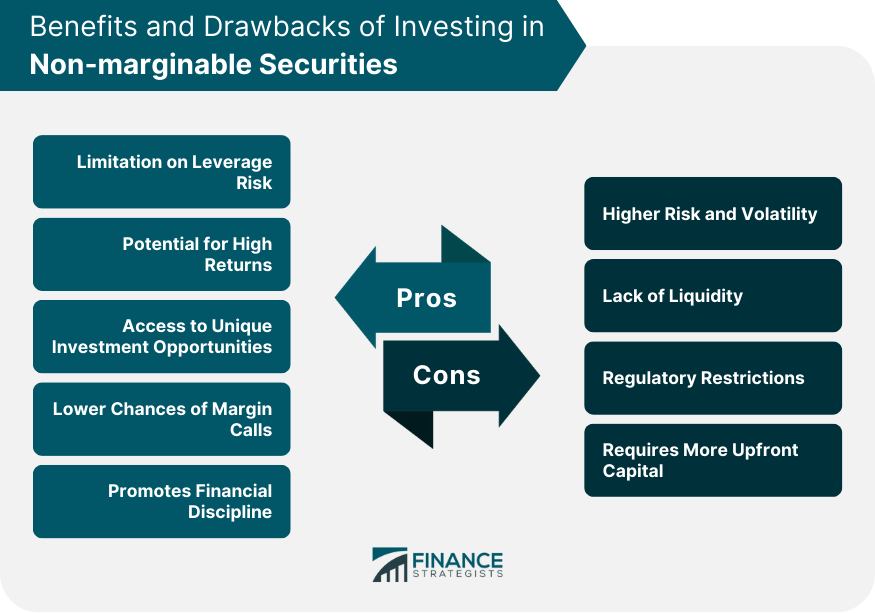

## Table of Contents

## What are securities?

Securities are financial instruments that represent some type of financial value. They can be traded between people or organizations, and they include things like stocks, bonds, and mutual funds. When you buy a security, you are essentially buying a small piece of a company or a loan to a company or government. This gives you the right to share in the profits or receive interest payments.

Securities are important because they help companies and governments raise money. For example, when a company issues stocks, it is selling pieces of ownership in the company to investors. The money from these sales can be used to grow the business or pay off debts. Similarly, when a government issues bonds, it is borrowing money from investors and promising to pay it back with interest. This helps the government fund public projects and services.

## What is the difference between marginable and non-marginable securities?

Marginable securities are stocks, bonds, or other investments that you can buy with borrowed money from your broker. This is called buying on margin. When you buy on margin, you only need to put down a part of the total cost, and the broker lends you the rest. This can help you buy more securities than you could with just your own money, but it's risky because if the value of the securities goes down, you might have to pay back more than you borrowed.

Non-marginable securities are investments that you can't buy with borrowed money from your broker. These are usually riskier or more volatile investments, like penny stocks or some types of mutual funds. Because they are riskier, brokers don't allow you to use margin to buy them. If you want to buy non-marginable securities, you have to pay the full amount yourself, which means you can only buy as much as you can afford with your own money.

## Why do investors use margin accounts?

Investors use margin accounts because they want to buy more stocks or other investments than they can afford with their own money. When they use a margin account, they can borrow money from their broker to buy more securities. This means they can own more investments and possibly make more money if the value of those investments goes up. It's like getting a loan to buy something you think will be worth more later.

But using a margin account is risky. If the value of the investments goes down, the investor might lose more money than they put in. They'll still have to pay back the loan, even if their investments are worth less. This can lead to big losses. So, while margin accounts can help investors buy more and possibly earn more, they also come with a lot of risk.

## What types of securities are typically non-marginable?

Non-marginable securities are investments that you can't buy with borrowed money from your broker. These are often riskier or more volatile investments. Some common examples include penny stocks, which are stocks that trade for less than a dollar, and certain types of mutual funds that might have high risk or be hard to sell quickly.

Brokers don't allow margin trading for these securities because they want to protect themselves and their clients from big losses. If the value of these investments drops a lot, it could be hard for the investor to pay back the borrowed money. So, if you want to buy non-marginable securities, you have to use your own money to pay the full price.

## Can you explain the risks associated with trading on margin?

Trading on margin can be risky because you're using borrowed money to buy investments. If the value of those investments goes down, you could lose more money than you put in. Imagine you borrow money to buy a stock, and then the stock price falls. Not only do you lose the money you invested, but you still have to pay back the loan. This means you could end up owing more money than you started with.

Another risk is something called a margin call. This happens when the value of your investments drops below a certain level. Your broker might ask you to put in more money or sell some of your investments to cover the loan. If you can't do this, the broker can sell your investments without asking you, and you might have to sell at a bad time when the prices are low. This can make your losses even bigger.

Using margin also means you might feel more pressure to take bigger risks. Since you're using borrowed money, you might try to make quick profits to pay back the loan. This can lead to making bad investment choices and losing more money. So, while margin can help you buy more investments, it's important to understand these risks and be careful.

## How does the classification of a security as marginable or non-marginable affect an investor's strategy?

When a security is classified as marginable, it means an investor can use borrowed money to buy it. This can be a big help if the investor wants to buy more stocks or other investments than they can afford with their own money. It's like getting a loan to buy something they think will go up in value. If the security's price goes up, the investor can make more money. But it's also riskier because if the price goes down, the investor might lose more than they put in. They'll still have to pay back the loan, which can be a big problem if their investments are worth less.

On the other hand, non-marginable securities are those that can't be bought with borrowed money. These are usually riskier or more unpredictable investments, like penny stocks or some mutual funds. Brokers don't allow margin trading for these because they want to avoid big losses. If an investor wants to buy non-marginable securities, they have to use their own money to pay the full price. This means they can only buy as much as they can afford, which can limit their investment strategy but also helps them avoid the extra risks that come with borrowing money.

## What are the regulatory requirements for marginable securities?

When it comes to marginable securities, there are rules set by the government and the Financial Industry Regulatory Authority (FINRA) to keep things fair and safe. The main rule is that you need to put down at least 50% of the total cost of the securities you want to buy on margin. This is called the initial margin requirement. For example, if you want to buy $10,000 worth of stocks, you need to have at least $5,000 in your account.

There's also something called the maintenance margin requirement. This is the minimum amount of equity you need to keep in your account after you buy the securities. Usually, it's about 25% of the total value of the securities. If the value of your investments goes down and your equity falls below this level, you might get a margin call. This means you'll need to put in more money or sell some of your investments to bring your equity back up to the required level. These rules help protect both you and your broker from big losses.

## How do brokerages determine which securities are marginable?

Brokerages decide which securities are marginable based on how safe and easy it is to buy and sell them. They look at things like how much the price of the security goes up and down, how easy it is to sell the security quickly, and how much the company or the security is worth. If a security is too risky or hard to sell, the brokerage might not let you use margin to buy it. They want to make sure that if they have to sell the security to cover a loan, they can do it without losing a lot of money.

For example, big company stocks that a lot of people trade are usually marginable because they are easy to buy and sell. But penny stocks, which are stocks that cost less than a dollar, are often not marginable. They can go up and down a lot in price, and it can be hard to sell them quickly. So, brokerages might say no to using margin for these kinds of securities to protect both you and themselves from big losses.

## What happens if a marginable security becomes non-marginable?

If a marginable security becomes non-marginable, it means you can't use borrowed money to buy it anymore. This can happen if the security becomes too risky or hard to sell. If you already own the security and bought it on margin, you might have to pay back the loan faster than you planned. This is because the brokerage wants to make sure they don't lose money if the security's value goes down a lot.

When a security changes from marginable to non-marginable, it can affect your investment strategy. You might need to sell some of your investments to cover the loan or put more of your own money into your account. It's important to keep an eye on the securities you own and understand the rules set by your brokerage. This way, you can be ready for any changes and make smart choices about your investments.

## Are there any strategies to use non-marginable securities effectively?

Using non-marginable securities can be a good way to invest if you understand how they work and are careful with your money. Since you can't use borrowed money to buy them, you need to use your own money to pay the full price. This means you can only buy as much as you can afford, which can help you avoid big losses. Non-marginable securities are often riskier, like penny stocks or some mutual funds, so it's important to do your research and pick ones that you think have a good chance of going up in value.

One strategy is to use non-marginable securities as part of a bigger investment plan. You might want to mix them with other, safer investments to spread out your risk. This way, if the non-marginable securities don't do well, you won't lose all your money. Another idea is to set clear goals for how much you want to make and how long you want to hold onto the securities. By having a plan, you can make better choices and know when it's time to sell or buy more.

## How do margin requirements vary between different types of marginable securities?

Margin requirements can be different for different types of marginable securities. For stocks, the rules say you need to put down at least 50% of the total cost when you buy them on margin. This is called the initial margin requirement. After you buy the stocks, you need to keep at least 25% of their total value in your account. This is the maintenance margin requirement. If the value of your stocks goes down and your account falls below this level, you might get a margin call and need to add more money or sell some stocks.

For other types of securities like bonds or mutual funds, the margin requirements can be different. Some bonds might need a higher initial margin, like 30% or more, because they can be riskier. Mutual funds might have their own rules set by the brokerage, and these can change based on how risky the fund is. It's important to check with your broker to know the exact margin requirements for the securities you want to buy. This helps you plan your investments and avoid surprises.

## What are the tax implications of trading with marginable versus non-marginable securities?

When you trade with marginable securities, you need to think about taxes. If you make money from selling these securities, you'll have to pay capital gains tax. This tax can be short-term if you held the security for less than a year, or long-term if you held it for more than a year. Short-term gains are taxed like your regular income, which can be higher. Long-term gains have a lower tax rate. Also, if you borrow money to buy securities on margin and you pay interest on that loan, you might be able to take a tax deduction for the interest. But, this can get complicated, so it's good to talk to a tax expert.

Trading with non-marginable securities has similar tax rules, but you don't have to worry about the interest from borrowing money. If you make money from selling these securities, you still have to pay capital gains tax. Just like with marginable securities, the tax rate depends on how long you held the security. Short-term gains are taxed at your regular income tax rate, and long-term gains have a lower rate. Since you can't use borrowed money to buy non-marginable securities, you won't have any interest to deduct from your taxes. It's always a good idea to keep track of your investments and talk to a tax professional to make sure you're doing everything right.

## References & Further Reading

[1]: Bergstra, J., Bardenet, R., Bengio, Y., & Kégl, B. (2011). ["Algorithms for Hyper-Parameter Optimization."](https://dl.acm.org/doi/10.5555/2986459.2986743) Advances in Neural Information Processing Systems 24.

[2]: ["Advances in Financial Machine Learning"](https://www.amazon.com/Advances-Financial-Machine-Learning-Marcos/dp/1119482089) by Marcos Lopez de Prado

[3]: ["Evidence-Based Technical Analysis: Applying the Scientific Method and Statistical Inference to Trading Signals"](https://www.amazon.com/Evidence-Based-Technical-Analysis-Scientific-Statistical/dp/0470008741) by David Aronson

[4]: ["Machine Learning for Algorithmic Trading"](https://github.com/stefan-jansen/machine-learning-for-trading) by Stefan Jansen

[5]: ["Quantitative Trading: How to Build Your Own Algorithmic Trading Business"](https://www.amazon.com/Quantitative-Trading-Build-Algorithmic-Business/dp/1119800064) by Ernest P. Chan