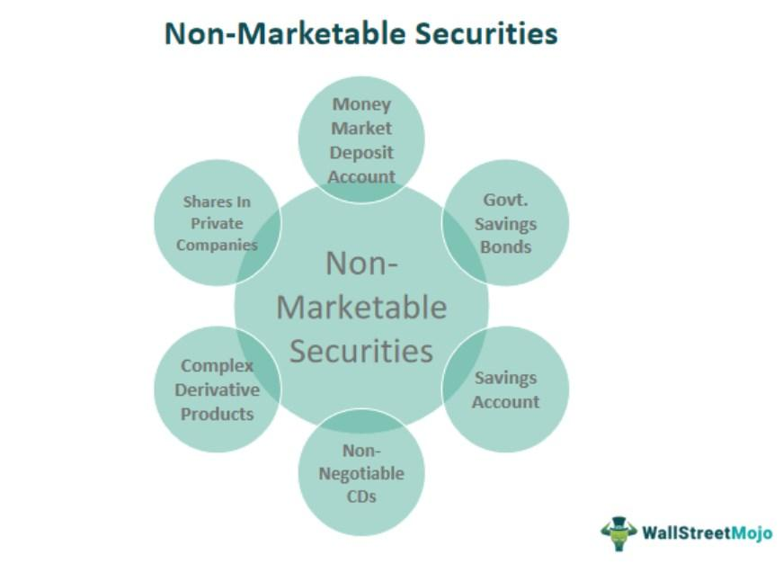

## Table of Contents

## What is a non-marketable security?

A non-marketable security is a type of investment that you can't easily buy or sell on the open market. These securities are usually issued by the government and are designed for specific purposes, like saving for retirement or education. Because they aren't traded on public exchanges, you can't just go to a stockbroker and buy or sell them whenever you want.

Examples of non-marketable securities include U.S. Savings Bonds and certain types of government savings plans. These investments are often seen as safe and stable because they are backed by the government. However, the trade-off is that you have less flexibility in managing them compared to marketable securities like stocks or bonds that you can trade on the stock market.

## How do non-marketable securities differ from marketable securities?

Non-marketable securities and marketable securities are different in a few key ways. Non-marketable securities are investments you can't easily buy or sell on the open market. They are often issued by the government and include things like U.S. Savings Bonds. These securities are usually meant for specific purposes, like saving for retirement or education. Because they aren't traded on public exchanges, you can't just go to a stockbroker and trade them whenever you want.

On the other hand, marketable securities are investments that you can buy and sell easily on public exchanges. These include stocks, bonds, and mutual funds. With marketable securities, you have a lot more flexibility to manage your investments. You can buy and sell them quickly, which makes them more liquid than non-marketable securities. However, this flexibility can come with more risk, as the value of marketable securities can go up and down more than the stable, government-backed non-marketable securities.

## What are some common types of non-marketable securities?

Some common types of non-marketable securities are U.S. Savings Bonds and certain types of government savings plans. U.S. Savings Bonds are issued by the U.S. Department of the Treasury and are meant to be a safe way for people to save money. They can't be bought or sold on the open market, and you usually have to hold onto them for a certain amount of time before you can cash them in.

Another type of non-marketable security is the Series EE and Series I Savings Bonds. These bonds are also issued by the U.S. government. Series EE Bonds earn a fixed rate of interest over time, while Series I Bonds earn interest based on a combination of a fixed rate and an inflation rate. Both types are designed to help people save money over the long term, and they can't be traded on stock exchanges.

## Can you explain what U.S. Savings Bonds are and why they are considered non-marketable?

U.S. Savings Bonds are a type of investment that you can buy from the U.S. government. They are meant to help people save money over time. There are different kinds of U.S. Savings Bonds, like Series EE and Series I Bonds. Series EE Bonds earn a fixed rate of interest, while Series I Bonds earn interest based on a mix of a fixed rate and an inflation rate. You can buy these bonds to save for things like retirement or education.

U.S. Savings Bonds are considered non-marketable because you can't buy or sell them on the open market like you can with stocks or other bonds. Instead, you have to buy them directly from the U.S. Treasury, and when you want to cash them in, you have to go back to the Treasury or a bank. This makes them less flexible than marketable securities, but they are also seen as very safe because they are backed by the U.S. government.

## What are Government Account Series (GAS) securities and who can invest in them?

Government Account Series (GAS) securities are special types of investments that are issued by the U.S. Department of the Treasury. They are meant for specific parts of the government to use, like Social Security and Medicare. These securities help these government programs manage their money and plan for the future. Unlike regular investments that people can buy and sell, GAS securities are not available to the general public.

Only certain parts of the government can invest in GAS securities. These include federal trust funds and other government accounts that need to save money for the long term. Because they are only for government use, regular people like you and me can't buy them. They are a way for the government to keep its own money safe and growing until it needs to use it for things like paying out Social Security benefits.

## How do State and Local Government Series (SLGS) securities function as non-marketable securities?

State and Local Government Series (SLGS) securities are special investments issued by the U.S. Department of the Treasury. They are designed to help state and local governments manage their money. These governments can buy SLGS securities to save up for projects or to meet other financial needs. Unlike regular investments that people can buy and sell on the open market, SLGS securities are non-marketable, meaning they can't be traded like stocks or bonds.

Only state and local governments can invest in SLGS securities. They are not available to the general public. This makes them different from other investments that anyone can buy. Because they are issued by the U.S. government, SLGS securities are seen as safe and reliable, but they are specifically meant to help governments handle their finances, not for regular people to invest in.

## What role do non-marketable securities play in personal financial planning?

Non-marketable securities can be a helpful part of personal financial planning, especially for people who want a safe place to save their money. U.S. Savings Bonds, like Series EE and Series I Bonds, are a good example. These bonds are backed by the U.S. government, so they are very safe. They are great for saving for things like retirement or education because they grow over time and you can't sell them on the open market. This means you are less likely to make quick decisions that could lose you money.

Using non-marketable securities in your financial plan can help you set money aside for the long term. Because you can't trade them easily, it encourages you to keep your money saved up for important goals. They might not make you rich quickly, but they are a steady and secure way to grow your savings without the ups and downs of the stock market. For people who want to keep their money safe and grow it slowly, non-marketable securities can be a smart choice.

## How are non-marketable securities valued, and what challenges do investors face in this regard?

Non-marketable securities are valued differently than marketable ones because they can't be bought or sold on the open market. For example, U.S. Savings Bonds are valued based on their [interest rate](/wiki/interest-rate-trading-strategies) and how long you've had them. If you have a Series EE Bond, you know it will earn a fixed rate of interest over time. Series I Bonds earn interest based on both a fixed rate and an inflation rate. So, the value of these bonds grows slowly and predictably, but you have to wait until they mature to get the full value.

Investors face some challenges with non-marketable securities. The biggest challenge is that you can't sell them whenever you want. If you need money quickly, you might have to wait until the bond matures or pay a penalty to cash it in early. Another challenge is that they usually offer lower returns compared to marketable securities like stocks. This means your money might grow more slowly. But, on the plus side, non-marketable securities are very safe because they are backed by the government, so they are good for long-term saving without the risk of losing money.

## What are the tax implications of investing in non-marketable securities?

Investing in non-marketable securities like U.S. Savings Bonds has some special tax rules. The interest you earn on these bonds is not taxed until you cash them in or they reach their final maturity date. This can be helpful if you want to save on taxes now and pay them later. Also, if you use the money from certain savings bonds to pay for education, you might not have to pay any federal tax on the interest at all. This is called the Education Savings Bond Program, and it can make these bonds even more attractive for saving for school.

However, there are some things to keep in mind. If you earn a lot of money, you might not be able to use the education tax break. And when you do have to pay taxes on the interest, it counts as regular income, so it could push you into a higher tax bracket. It's a good idea to talk to a tax advisor to understand how these rules apply to your situation. Overall, non-marketable securities can be a smart way to save money and possibly save on taxes, but it's important to know the rules.

## Can non-marketable securities be converted into marketable securities, and if so, how?

Non-marketable securities like U.S. Savings Bonds cannot be directly converted into marketable securities like stocks or bonds that you can trade on the stock market. These savings bonds are designed to be held until they mature or until you need to cash them in. If you want to invest in marketable securities, you would need to sell your non-marketable securities first and then use the money to buy marketable ones.

To do this, you would cash in your U.S. Savings Bonds at a bank or through the Treasury Department's website. Once you have the money, you can then use it to buy stocks, bonds, or other marketable securities through a brokerage account. This process is not a direct conversion but rather a two-step process of selling one type of investment and then buying another.

## What are the liquidity considerations one should be aware of when investing in non-marketable securities?

When you invest in non-marketable securities like U.S. Savings Bonds, you need to think about how easy it is to get your money back. These securities are not as liquid as marketable securities like stocks or bonds that you can sell quickly on the stock market. With non-marketable securities, you usually have to wait until they reach their maturity date before you can cash them in without losing some money. If you need to get your money back early, you might have to pay a penalty, which means you won't get as much money as you hoped.

This lack of [liquidity](/wiki/liquidity-risk-premium) can be a big deal if you need money fast for an emergency. Non-marketable securities are good for long-term savings goals, like saving for retirement or education, because they are safe and grow slowly over time. But if you think you might need to use the money sooner, you should be careful about putting too much into non-marketable securities. They are not the best choice if you need to be able to get your money quickly.

## How do non-marketable securities fit into broader investment strategies, particularly for institutional investors?

Non-marketable securities can be a useful part of an investment strategy, especially for institutional investors like government funds or pension plans. These investors often have long-term goals and need to keep their money safe and growing steadily. Non-marketable securities like Government Account Series (GAS) securities and State and Local Government Series (SLGS) securities are perfect for this because they are backed by the U.S. government, which makes them very safe. These securities help institutional investors manage their money without the risk of losing it in the ups and downs of the stock market.

For these investors, non-marketable securities are a way to balance their portfolio. While they might invest in riskier marketable securities to try to make more money, non-marketable securities give them a stable base. This means they can use non-marketable securities to save up for future expenses or to meet long-term obligations, like paying out Social Security benefits or funding public projects. By including non-marketable securities in their strategy, institutional investors can make sure they have money available when they need it, without worrying about the risks that come with other types of investments.

## How can non-marketable securities be integrated with algorithmic trading?

Non-marketable securities present unique challenges for [algorithmic trading](/wiki/algorithmic-trading), primarily due to their illiquidity and the lack of a secondary market for easy transaction execution. However, by employing hybrid strategies, algorithmic trading can effectively incorporate these instruments into broader investment strategies.

Algorithmic tools offer significant assistance in valuing non-marketable securities. Given their complexity and limited trading activity, sophisticated models are necessary to estimate their fair value accurately. Techniques such as discounted cash flow analysis, which involves calculating the present value of expected future cash flows, can be adapted and automated through algorithmic processes. For instance, an algorithm could apply the formula:

$$
\text{PV} = \sum_{t=1}^{n} \frac{CF_t}{(1 + r)^t}
$$

where $CF_t$ represents the cash flow at time $t$, $r$ is the discount rate, and $n$ is the number of periods. By adjusting the discount rate based on market conditions and specific risk factors, algorithms can refine valuation estimates.

Negotiating private transactions, another challenge posed by non-marketable securities, can be enhanced using algorithmic solutions. By employing [machine learning](/wiki/machine-learning) techniques, algorithms can analyze historical transaction data and market conditions to suggest optimal pricing and terms for private negotiations. This application of algorithmic trading reduces the time and effort required and increases the likelihood of successful transactions.

Advanced models further enhance trading strategies involving non-marketable securities by addressing their unique features. For example, certain algorithmic frameworks can simulate various market scenarios and stress test investment portfolios, allowing traders to assess how non-marketable securities might perform under different conditions. Additionally, algorithms can be programmed to identify potential [arbitrage](/wiki/arbitrage) opportunities or to optimize the composition of portfolios, balancing liquidity and stability by integrating non-marketable instruments with more liquid assets.

Programming languages like Python offer robust libraries such as NumPy for performing complex financial calculations or scikit-learn for implementing machine learning models, making them ideal for developing these advanced algorithmic solutions. Here's a simple Python snippet illustrating the setup for calculating a discounted cash flow:

```python
import numpy as np

def discounted_cash_flow(cash_flows, discount_rate):
    return np.sum([cf / (1 + discount_rate) ** t for t, cf in enumerate(cash_flows, start=1)])

cash_flows = [100, 150, 200]
discount_rate = 0.05
present_value = discounted_cash_flow(cash_flows, discount_rate)
print(f"Present Value: {present_value}")
```

By integrating these advanced algorithmic solutions, investors can effectively manage and leverage non-marketable securities alongside other financial instruments, optimizing their overall investment strategy.

## References & Further Reading

[1]: ["Advances in Financial Machine Learning"](https://www.amazon.com/Advances-Financial-Machine-Learning-Marcos/dp/1119482089) by Marcos Lopez de Prado

[2]: ["Evidence-Based Technical Analysis: Applying the Scientific Method and Statistical Inference to Trading Signals"](https://www.amazon.com/Evidence-Based-Technical-Analysis-Scientific-Statistical/dp/0470008741) by David Aronson

[3]: ["Machine Learning for Algorithmic Trading"](https://github.com/stefan-jansen/machine-learning-for-trading) by Stefan Jansen

[4]: ["Quantitative Trading: How to Build Your Own Algorithmic Trading Business"](https://www.amazon.com/Quantitative-Trading-Build-Algorithmic-Business/dp/1119800064) by Ernest P. Chan

[5]: Bergstra, J., Bardenet, R., Bengio, Y., & Kégl, B. (2011). ["Algorithms for Hyper-Parameter Optimization."](https://dl.acm.org/doi/10.5555/2986459.2986743) Advances in Neural Information Processing Systems 24.