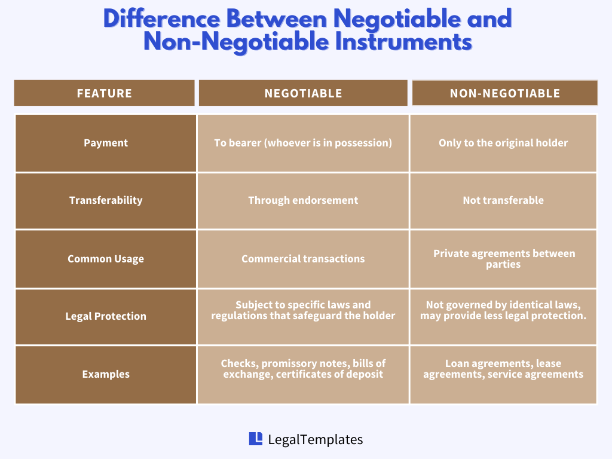

## Table of Contents

## What are non-negotiable items?

Non-negotiable items are things that you cannot change or discuss. They are very important and must stay the same. For example, if you are buying a house, the price might be non-negotiable. This means the seller will not lower the price no matter what.

These items can be found in many places, like at work or in personal life. At work, your job duties might be non-negotiable. This means you have to do them and cannot change them. In personal life, your values or beliefs might be non-negotiable. This means they are very important to you and you will not change them for anyone.

## Why are non-negotiable items important in personal life?

Non-negotiable items are important in personal life because they help you stay true to yourself. They are like rules that you set for yourself about what is really important to you. For example, if being honest is a non-negotiable item for you, you will always tell the truth, no matter what. This helps you live a life that feels right and makes you happy.

These items also help you make decisions. When you know what your non-negotiables are, you can say yes or no to things more easily. For instance, if spending time with family is non-negotiable, you will choose to be with them instead of doing something else. This way, your choices match what you believe is most important, and you feel good about the decisions you make.

## Can you give examples of non-negotiable items in a personal context?

In a personal context, non-negotiable items can include things like honesty. If honesty is a non-negotiable for you, it means you will always tell the truth. You won't lie, even if it's hard. This is important because it helps you feel good about yourself and keeps your relationships strong.

Another example is spending time with family. If this is non-negotiable, you will always make time for your family, no matter how busy you are. This helps you stay close to the people you love and makes sure you don't miss out on important moments with them.

Lastly, personal values like kindness can also be non-negotiable. If kindness is something you won't compromise on, you will always try to be kind to others, even when it's difficult. This can make the world a better place and helps you feel proud of who you are.

## How do non-negotiable items affect professional settings?

In professional settings, non-negotiable items help set clear boundaries and expectations. For example, if punctuality is a non-negotiable for a company, everyone knows they must be on time. This makes the workplace run smoothly because everyone follows the same rules. It also helps people know what is expected of them, so they can do their jobs well.

Non-negotiable items can also affect how people work together. If honesty is a non-negotiable, everyone will tell the truth, even when it's hard. This builds trust and makes the team stronger. But if someone doesn't follow these non-negotiables, it can cause problems. For example, if someone is always late and punctuality is important, it can make others feel frustrated and affect the whole team's performance.

## What are some common non-negotiable items in business negotiations?

In business negotiations, some common non-negotiable items include the price of a product or service. For example, if a company has set a minimum price they need to get for their product, they won't agree to sell it for less. This helps them make sure they can cover their costs and make a profit. Another common non-negotiable item is the timeline for delivery. If a business needs a product by a certain date, they might not be able to accept a later delivery time because it could affect their own deadlines and plans.

Another non-negotiable item in business negotiations can be the quality of the product or service. If a company has strict standards for quality, they won't accept anything that doesn't meet those standards. This is important because it helps them keep their customers happy and maintain their reputation. Lastly, confidentiality can also be a non-negotiable item. If a business is sharing sensitive information during negotiations, they might insist that the other party keeps it secret. This helps protect their business and maintain trust.

## How can someone identify their own non-negotiable items?

To identify your own non-negotiable items, start by thinking about what is really important to you. These are things that you will not change or give up, no matter what. They might be values like honesty, kindness, or spending time with family. Think about times when you felt really good about a choice you made. What was behind that choice? That can help you figure out what your non-negotiables are.

Another way to find your non-negotiable items is to think about what makes you upset or uncomfortable. If something bothers you a lot, it might be because it goes against one of your non-negotiables. For example, if lying makes you really angry, honesty might be a non-negotiable for you. Talking to people you trust can also help. They might see things in you that you don't see yourself, and their feedback can help you understand what you really care about.

## What is the process for setting non-negotiable items in a team or organization?

To set non-negotiable items in a team or organization, start by talking to everyone involved. Ask them what they think is really important for the team or the company. This could be things like being honest, working hard, or treating each other with respect. Everyone should have a chance to share their ideas. After everyone has spoken, look for common themes. These are the things that most people agree are very important. These common themes will be your non-negotiable items.

Once you have a list of non-negotiable items, write them down clearly. Make sure everyone understands what they mean and why they are important. Share these items with the whole team or organization. You can put them in a handbook, on a poster, or talk about them in meetings. It's important that everyone knows these non-negotiables and agrees to follow them. If someone doesn't follow them, there should be a clear way to handle it, like talking to them or having a meeting to solve the problem.

## How do non-negotiable items impact decision-making processes?

Non-negotiable items help make decision-making easier and clearer. When you know what your non-negotiables are, you can quickly say yes or no to things. For example, if being honest is a non-negotiable for you, you will always choose to tell the truth, even if it's hard. This makes it easier to decide what to do because you know what is most important to you.

In a team or organization, non-negotiable items help everyone make decisions that match the group's goals and values. If everyone agrees that hard work is non-negotiable, they will all work hard and support each other to do their best. This helps the team stay focused and makes sure everyone is working towards the same thing.

## What are the potential conflicts that can arise from non-negotiable items?

Non-negotiable items can cause conflicts when people have different ideas about what is really important. For example, if one person thinks being on time is very important, but another person doesn't, they might argue about when to start a meeting. This can make people feel frustrated because they can't agree on something that one of them sees as very important.

These conflicts can also happen in bigger groups like teams or organizations. If the team has rules about being honest, but someone tells a lie, it can cause a big problem. Other team members might feel upset or betrayed, and it can make it hard for the team to work together. It's important to talk about these conflicts and try to find a way to solve them so everyone can still work well together.

## How can non-negotiable items be effectively communicated to others?

To effectively communicate non-negotiable items to others, it's important to be clear and direct. Start by explaining what the non-negotiable items are and why they matter. For example, if honesty is a non-negotiable for your team, you can say, "Being honest is very important to us because it helps us trust each other and work better together." Make sure to use simple words so everyone can understand. You can also write down the non-negotiable items in a place where everyone can see them, like on a poster or in a handbook.

It's also helpful to talk about non-negotiable items often. Bring them up in meetings or when you're making decisions. This reminds everyone what is important and helps them remember to follow the non-negotiables. If someone doesn't follow a non-negotiable, talk to them about it calmly. Explain why it's important and how it affects the team or organization. By keeping the communication open and clear, you can make sure everyone understands and respects the non-negotiable items.

## What strategies can be used to handle situations where non-negotiable items clash?

When non-negotiable items clash, it's important to talk about it openly and calmly. Start by listening to everyone involved. Let them explain why their non-negotiable item is important to them. This helps everyone understand each other better. After listening, look for common ground. Maybe there's a way to meet in the middle that respects both non-negotiables. If not, it might help to bring in someone who can help solve the problem, like a manager or a mediator. They can help find a solution that works for everyone.

If talking doesn't solve the problem, you might need to make some tough choices. Sometimes, one non-negotiable has to give way to another. This can be hard, but it's important to think about what's best for the team or organization. If someone's non-negotiable is causing big problems, they might need to think about changing it or finding a different place where it fits better. Keeping the focus on what's most important for everyone can help handle these tough situations.

## How do cultural differences influence the concept of non-negotiable items?

Cultural differences can change what people think are non-negotiable items. In some cultures, family time might be very important and non-negotiable. In other cultures, work might be more important. These differences can cause problems when people from different cultures work together. For example, if someone from a culture where family comes first works with someone who thinks work should always come first, they might not agree on what is most important.

To handle these differences, it's good to talk openly about them. When people understand why others think something is non-negotiable, they can find ways to work together better. It's important to respect each other's values and try to find a middle ground. This way, everyone can feel heard and respected, even if their non-negotiables are different.

## References & Further Reading

[1]: Bergstra, J., Bardenet, R., Bengio, Y., & Kégl, B. (2011). ["Algorithms for Hyper-Parameter Optimization."](https://papers.nips.cc/paper/4443-algorithms-for-hyper-parameter-optimization) Advances in Neural Information Processing Systems 24.

[2]: ["Advances in Financial Machine Learning"](https://www.amazon.com/Advances-Financial-Machine-Learning-Marcos/dp/1119482089) by Marcos Lopez de Prado

[3]: ["Evidence-Based Technical Analysis: Applying the Scientific Method and Statistical Inference to Trading Signals"](https://www.amazon.com/Evidence-Based-Technical-Analysis-Scientific-Statistical/dp/0470008741) by David Aronson

[4]: ["Machine Learning for Algorithmic Trading"](https://github.com/PacktPublishing/Machine-Learning-for-Algorithmic-Trading-Second-Edition) by Stefan Jansen

[5]: ["Quantitative Trading: How to Build Your Own Algorithmic Trading Business"](https://books.google.com/books/about/Quantitative_Trading.html?id=j70yEAAAQBAJ) by Ernest P. Chan