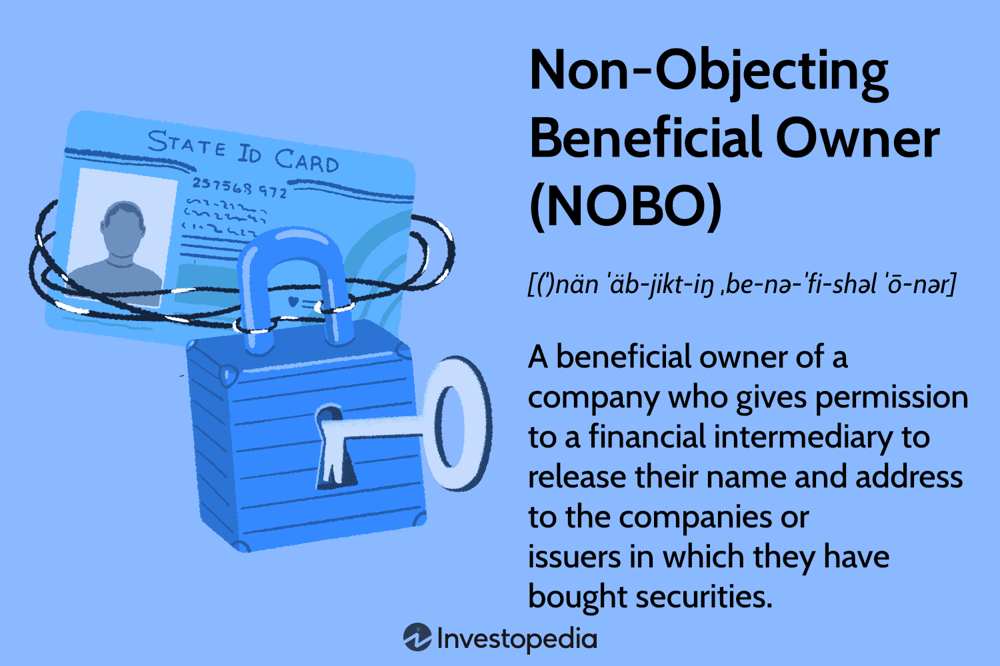

In the rapidly evolving world of finance, acquiring a nuanced understanding of shareholder structures, such as Non-Objecting Beneficial Owners (NOBOs), alongside the integration of algorithmic trading, presents a strategic advantage. NOBOs play a crucial role in shareholder communication, influencing how companies engage with and disseminate information to their investors. Their identification affects transparency and how shareholder interests are represented, particularly in voting proxies and financial discussions.

Algorithmic trading, meanwhile, represents a significant shift in how trading is conducted, leveraging computer algorithms to make swift, data-driven trading decisions. This technology has revolutionized financial markets by enhancing trading speed, accuracy, and cost efficiency. It is essential to comprehend how these algorithms can be employed not only to improve trading outcomes but also to address challenges related to shareholder data management and communication.

The interplay between NOBOs and algorithmic trading strategies raises important considerations regarding privacy and transparency. These aspects are critical, as they determine the extent to which shareholder information can be utilized effectively while safeguarding individual privacy. The objective of this article is to provide a thorough examination of how NOBOs and algorithmic trading coalesce within the modern trading landscape.

Understanding these elements is key to shaping informed investment strategies and influencing market behaviors. By the end of this exploration, readers will recognize how the synergy of NOBOs and algorithmic trading contributes to the overall dynamics of financial markets and the strategic opportunities they present.

## Table of Contents

## Understanding Non-Objecting Beneficial Owners (NOBOs)

A Non-Objecting Beneficial Owner (NOBO) is a shareholder who agrees to have their personal information disclosed to the companies in which they own shares. This consent allows issuers of securities to directly communicate with the NOBOs concerning various shareholder matters, including voting proxies and the receipt of financial reports. The concept of NOBOs is critical for issuers aiming to establish direct communication channels with their investors, thereby facilitating more effective shareholder engagement.

In contrast, Objecting Beneficial Owners (OBOs) prefer to maintain anonymity and do not consent to the sharing of their information. This anonymity often necessitates that companies reach these shareholders through intermediaries, such as brokers or financial institutions, which can complicate and delay communication. The distinction between NOBOs and OBOs is integral to understanding the dynamics of shareholder interactions, emphasizing the balance between privacy and transparency.

The regulatory framework surrounding NOBO status is primarily governed by the Securities and Exchange Commission (SEC) in the United States. The SEC's regulations are designed to ensure that companies respect shareholder preferences while also maintaining a structured flow of vital communication. According to SEC rules, companies are permitted to request and access the list of NOBOs, thus enabling them to communicate directly about significant corporate events and updates.

Choosing between being a NOBO or an OBO involves shareholders considering their privacy concerns versus the benefits of direct corporate communication. While being a NOBO facilitates seamless access to proxy materials and critical financial information, it also entails the risk of personal data exposure. Therefore, shareholders must weigh the advantages of being well-informed and directly engaged with potential privacy compromises inherent in such disclosures.

The decision-making process regarding NOBO status highlights broader considerations surrounding data privacy in financial markets. Ensuring that shareholder information is handled securely and ethically continues to be a priority for regulators, underscoring the importance of maintaining trust in the financial ecosystem.

## Impact of NOBO Status on Shareholders

The choice to assume Non-Objecting Beneficial Owner (NOBO) status significantly impacts shareholder engagement by facilitating direct communication with the corporations in which they invest. This direct communication capability allows companies to distribute proxy materials and financial reports more efficiently, thereby promoting active participation in corporate governance. Such transparency ensures that NOBOs are well-informed of corporate activities, upcoming votes, and other significant company matters, encouraging their involvement in decision-making processes.

Being a NOBO also streamlines the voting process during corporate elections and key decision-making events. By consenting to share their identifying information, NOBOs allow companies to reach out to them directly, which simplifies the dissemination of voting materials and instructions. This direct connection can lead to increased shareholder participation in elections and other crucial corporate decisions, fostering a more engaged and responsive shareholder base. 

However, the trade-off for this increased level of engagement is the potential compromise of personal privacy. NOBOs must share personal data with corporations, which raises legitimate concerns about data security and the potential for misuse. Shareholders need to weigh the advantages of enhanced communication and participation against the risks associated with providing personal information.

Companies can leverage this direct access to shareholder information by tailoring engagement strategies that enhance shareholder relationships and satisfaction. By analyzing the preferences and behaviors of NOBOs, corporations can provide personalized communication and offerings, ultimately leading to greater shareholder loyalty and potentially improved financial performance.

In essence, assuming NOBO status offers substantial benefits in terms of communication and engagement with corporations. However, it also necessitates carefully balanced considerations of privacy and data security, requiring both shareholders and corporations to navigate these dynamics with diligence and responsibility.

## Algorithmic Trading: An Overview

Algorithmic trading, often referred to as algo trading, utilizes computer algorithms to execute trading decisions at high speed and [volume](/wiki/volume-trading-strategy). These algorithms are designed to analyze vast amounts of market data to make rapid buy and sell decisions based on predefined criteria, such as timing, price, or quantity. The automation and precision provided by [algorithmic trading](/wiki/algorithmic-trading) offer several advantages, including enhanced speed, accuracy, and cost efficiency.

One of the primary benefits of algorithmic trading is its ability to execute orders at a speed and frequency that is impossible for human traders. Given the dynamic nature of financial markets, the ability to react promptly to fluctuations can be a significant advantage. For instance, algo trading can identify [arbitrage](/wiki/arbitrage) opportunities across different markets or assets, enabling traders to capitalize on price differentials that may exist momentarily.

The accuracy afforded by algorithmic trading is another crucial benefit. By removing human emotion and error from the trading process, algorithms can execute transactions based on a purely data-driven approach. This reduction in error rate is critical in high-frequency trading environments, where large volumes of transactions are processed in fractions of a second. Additionally, the cost efficiency of algorithmic trading is enhanced through the reduction of transaction costs associated with human intervention and the ability to manage trades on a 24/7 basis without the need for constant oversight.

Algorithmic trading has been predominantly utilized by institutional investors due to the substantial resources required for effective algorithm development and maintenance. However, recent advancements in financial technology (fintech) have made algo trading increasingly accessible to individual traders. Software platforms now offer customizable algorithms and user-friendly interfaces, enabling retail traders to develop and implement their own trading strategies based on the same principles used by institutional investors.

The role of technology in shaping trading strategies is significant, as it allows for the integration of real-time data analysis into decision-making processes. This integration can be particularly useful when considering informed trading strategies based on market trends and shareholder information, such as NOBO data. By analyzing shareholder patterns and market dynamics, algorithmic frameworks can adjust portfolios in real-time to optimize investment outcomes.

As algorithmic trading continues to evolve, its intersection with advancements in data processing and analysis highlights the importance of technological innovation in modern financial markets. The challenge lies in balancing the efficiency and opportunities offered by these technologies with the ethical and regulatory considerations necessary to ensure a fair and transparent trading environment.

## The Intersection of NOBOs and Algorithmic Trading

Combining Non-Objecting Beneficial Owner (NOBO) shareholder information with algorithmic trading strategies enables companies to refine investment decisions and enhance corporate strategies. The ability to tailor communication and engagement strategies using detailed NOBO analytics is facilitated by advanced algorithms. This customization emerges from the capacity of algorithms to process substantial quantities of shareholder data swiftly, revealing patterns and preferences that can be utilized in strategic decision-making.

Algorithmic trading frameworks, by nature, are adept at adjusting portfolios based on dynamic inputs. By integrating insights derived from NOBO data—such as voting behavior, dividend preferences, or stock holding patterns—these frameworks can optimize trade execution. For example, algorithms can identify shifts in shareholder sentiment and recalibrate trading strategies to either capitalize on or hedge against these shifts. This capability essentially creates a feedback loop where shareholder actions inform trading decisions, and trading actions, in turn, influence shareholder perspectives.

The intersection of NOBO information and algorithmic trading intensifies the debate over data privacy and ethics. While leveraging NOBO data can significantly enhance a company's market position, it introduces potential risks concerning unauthorized data use and market manipulation. The integrity of this data-driven strategy relies heavily on compliance with regulatory frameworks like those established by the Securities and Exchange Commission (SEC) and adherence to ethical standards.

In addition to safeguarding data privacy, companies must ensure transparency in how shareholder information influences trading strategies. This mandate becomes particularly critical as algorithmic models grow increasingly sophisticated, capable of making autonomous decisions based on complex data inputs. To maintain trust and accountability, companies should adopt stringent data security measures and clear protocols regarding the ethical use of NOBO information. Collaboration with regulators to establish guidelines that balance innovation with investor protections is imperative for fostering sustainable practices in this synergistic financial landscape.

## Challenges and Ethical Considerations

While merging Non-Objecting Beneficial Owner (NOBO) data with algorithmic trading strategies can offer significant benefits, primarily in terms of efficiency and precision, it also brings forth several ethical and regulatory challenges. One primary concern revolves around the protection of sensitive shareholder information and the potential for market manipulation.

The Securities and Exchange Commission (SEC) provides regulatory guidelines for the disclosure of beneficial ownership, balancing the need for financial transparency with individual privacy rights. Compliance with these regulations is non-negotiable to safeguard shareholder interests. The challenge is to ensure that while leveraging NOBO data for algorithmic trading, companies do not overstep regulatory boundaries.

One of the risks associated with the use of NOBO data in trading involves data privacy. Sharing detailed investor information raises concerns about unauthorized access and misuse. Companies need to implement comprehensive data protection strategies, such as encryption and access controls, to prevent breaches. Furthermore, they should adhere to data minimization principles, ensuring that only necessary information is utilized for trading purposes.

The potential for market manipulation is another significant ethical consideration. Leveraging detailed shareholder data could enable unfair trading practices, such as frontrunning or executing trades based on privileged information. Therefore, stringent monitoring and audit mechanisms are required to detect and deter such activities, ensuring that all market participants operate on a level playing field.

To navigate these challenges, collaboration between companies and regulators is paramount. Establishing clear guidelines on the ethical use of NOBO data and developing robust compliance frameworks can help foster an environment where innovation does not compromise privacy or market integrity. Additionally, companies should invest in transparency and accountability, regularly disclosing their data handling practices and algorithmic methodologies.

In conclusion, balancing technological advancement with ethical considerations is critical. By prioritizing data security and regulatory adherence, the financial sector can harness the potential of NOBO data and algorithmic trading, paving the way for a more efficient and equitable market.

## Conclusion

In the dynamic landscape of modern finance, the integration of Non-Objecting Beneficial Owners (NOBOs) and algorithmic trading signals a pivotal shift toward more sophisticated investment and trading strategies. The collaboration of NOBO data with algorithmic trading mechanisms enables companies and investors to refine their market insights and operations significantly. This synergy allows for tailored communication strategies and more informed trading decisions, fostering a deeper alignment with market demands.

However, embracing these advancements requires meticulous attention to ethical practices and regulatory compliance. The efficient use of NOBO information alongside algorithmic strategies must balance the drive for innovation with the necessity to maintain shareholder privacy and prevent market manipulation. This ensures that the financial markets remain robust, maintaining investor trust and market stability.

Future developments in this sector are likely to involve the convergence of increasingly sophisticated algorithms with more comprehensive datasets. Such integration promises enhanced insights into shareholder behaviors and market trends, potentially reshaping traditional investment approaches. As technology continues to evolve, these algorithms might offer unprecedented analysis capabilities, providing competitive edges in predicting market movements and preferences.

To effectively harness these advancements while preserving market integrity, stakeholders—comprising regulators, companies, and investors—must remain vigilant and informed. Understanding the complexities of these developments is crucial to safeguarding both investor interests and the long-term health of financial systems. By prioritizing transparency, accountability, and robust data security measures, the financial industry can ensure that it continues to thrive amidst these technological transformations.

## References & Further Reading

[1]: Bergstra, J., Bardenet, R., Bengio, Y., & Kégl, B. (2011). ["Algorithms for Hyper-Parameter Optimization."](https://dl.acm.org/doi/10.5555/2986459.2986743) Advances in Neural Information Processing Systems 24.

[2]: ["Advances in Financial Machine Learning"](https://www.amazon.com/Advances-Financial-Machine-Learning-Marcos/dp/1119482089) by Marcos Lopez de Prado

[3]: ["Evidence-Based Technical Analysis: Applying the Scientific Method and Statistical Inference to Trading Signals"](https://www.amazon.com/Evidence-Based-Technical-Analysis-Scientific-Statistical/dp/0470008741) by David Aronson

[4]: ["Machine Learning for Algorithmic Trading"](https://github.com/stefan-jansen/machine-learning-for-trading) by Stefan Jansen

[5]: ["Quantitative Trading: How to Build Your Own Algorithmic Trading Business"](https://www.amazon.com/Quantitative-Trading-Build-Algorithmic-Business/dp/1119800064) by Ernest P. Chan