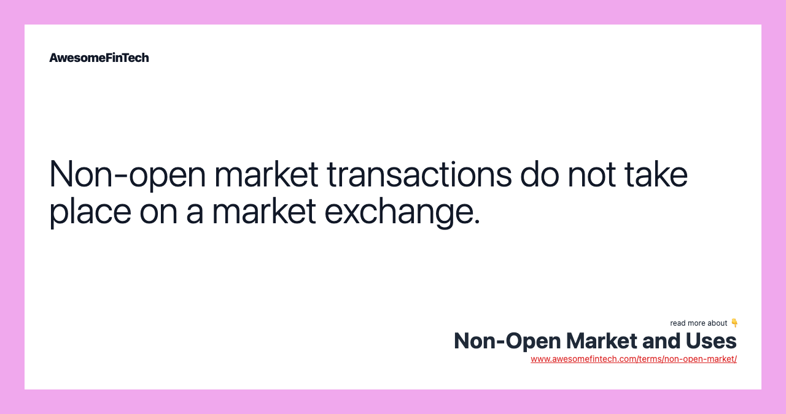

## Table of Contents

## What is a non-open market?

A non-open market is a type of market where trading is restricted and not open to everyone. This means that only certain people or groups can buy and sell things in this market. For example, some markets might only allow members of a specific club or organization to trade. This is different from an open market, where anyone can participate.

These kinds of markets can be found in various places, like private stock exchanges or exclusive trading networks. They often exist because the people involved want to keep their transactions private or because they want to control who can buy and sell. Non-open markets can be good for some things, like keeping sensitive information safe, but they can also make it harder for new people to join and can limit competition.

## How does a non-open market differ from an open market?

A non-open market is different from an open market because it limits who can trade. In an open market, anyone can buy and sell things. They can join the market easily and trade with anyone else in it. But in a non-open market, only certain people are allowed to trade. These people might be part of a special group or club. This means that if you're not in that group, you can't join the market or make trades.

Non-open markets can be useful for keeping things private or for controlling who gets to buy and sell. For example, a company might use a non-open market to trade shares only with its employees. This helps keep the company's information safe. But open markets are better for letting lots of people trade and for making competition fair. In an open market, more people can join, which can lead to more trades and better prices for everyone.

## What are the basic characteristics of a non-open market?

A non-open market is a place where only certain people can buy and sell things. It's not like a big store where anyone can come in and shop. Instead, it's more like a private club where you need to be a member to join. This means that if you're not part of the special group, you can't trade in this market. The people who can trade might be part of a company, a club, or another kind of group.

These markets are often used to keep things private or to control who gets to buy and sell. For example, a company might use a non-open market to trade shares only with its employees. This helps keep the company's information safe and makes sure that only certain people can own parts of the company. But because not everyone can join, non-open markets can make it harder for new people to start trading and can limit how much competition there is.

## Can you provide examples of non-open markets?

One example of a non-open market is a private stock exchange. This is a place where only certain people can buy and sell shares of a company. For example, a company might have a private stock exchange just for its employees. This means that only the people who work at the company can buy shares. This helps the company keep its information private and control who owns parts of it.

Another example is a members-only trading network. This is a group where only members can trade things with each other. For example, a club might have a trading network where only club members can buy and sell special items. This keeps the trades private and makes sure that only people in the club can join in. These kinds of markets can be good for keeping things secret, but they can also make it hard for new people to start trading.

## What are the advantages of operating in a non-open market?

Operating in a non-open market can help keep things private. For example, if a company wants to trade shares only with its employees, a non-open market makes sure that only those people can buy and sell. This helps keep the company's information safe because outsiders can't see what's happening. It also means the company can control who owns parts of it, which can be important for keeping things the way they want.

Another advantage is that non-open markets can make trading easier for the people who are allowed in. Since everyone in the market knows each other or has something in common, it can be easier to trust each other and make deals. This can be good for businesses or groups that want to trade quickly and safely without worrying about outsiders getting involved.

## What are the potential disadvantages or challenges in a non-open market?

One big challenge in a non-open market is that it can be hard for new people to join. Since only certain people can trade, if you're not part of the special group, you can't get in. This can make it tough for new businesses or traders to start working in that market. It can also make the market less competitive because there are fewer people trading, which can lead to higher prices and fewer choices for everyone involved.

Another problem is that non-open markets can be less fair. Because only a small group of people can trade, it can be easier for them to control prices or make deals that benefit them more than others. This can lead to unfair advantages and can make it harder for everyone to get a good deal. Plus, since the market is closed off, it can be harder to see if things are being done fairly or if there are any problems that need to be fixed.

## How do regulations affect non-open markets?

Regulations can have a big impact on non-open markets. They can set rules about who can trade and how they can do it. For example, a government might make laws that say only certain people can join a non-open market. These rules help make sure that the market stays private and that only the right people can trade. But they can also make it harder for new people to join, which can limit how much the market can grow.

On the other hand, regulations can also help keep non-open markets fair. They can stop people from doing things that are not right, like controlling prices or making unfair deals. By setting clear rules, regulations can make sure that everyone in the market has a fair chance to trade. This can help keep the market running smoothly and make sure that it's a good place for everyone involved.

## What role do government policies play in the formation and maintenance of non-open markets?

Government policies can help create and keep non-open markets going. They do this by making rules that say who can join these markets. For example, a government might say that only certain people, like members of a club or employees of a company, can trade in a non-open market. This helps keep the market private and makes sure that only the right people can buy and sell things. But these rules can also make it hard for new people to join, which can stop the market from growing bigger.

At the same time, government policies can help make sure non-open markets are fair. They can set rules to stop people from doing things that are not right, like setting prices too high or making deals that are unfair. These rules help make sure everyone in the market has a fair chance to trade. This can keep the market running smoothly and make it a good place for everyone involved.

## How can businesses strategically navigate a non-open market?

Businesses can do well in a non-open market by making good relationships with the people who are already in it. Since only certain people can trade in these markets, it's important to be friends with them. By working closely with these people, a business can learn about the market and find out what people want to buy and sell. This can help the business make good deals and grow in the market. It's also important to follow the rules of the market and make sure everyone trusts the business.

Another way for businesses to succeed in a non-open market is to use the market's private nature to their advantage. Because these markets are not open to everyone, businesses can keep their plans and deals secret. This can help them make special deals or try new ideas without worrying about other people copying them. By keeping things private and working well with the people in the market, a business can do well and grow even in a non-open market.

## What economic theories explain the functioning of non-open markets?

One economic theory that helps explain how non-open markets work is the theory of imperfect competition. In a non-open market, only a few people or groups can trade, which means the market is not open to everyone. This can lead to less competition because there are fewer people buying and selling. With less competition, the people in the market might be able to control prices or make deals that benefit them more than others. This is different from a perfectly competitive market, where lots of people can trade and no one can control prices.

Another theory that can explain non-open markets is the theory of information asymmetry. In these markets, not everyone has the same information. The people who can trade might know more about what's happening in the market than people outside of it. This can give them an advantage because they can make better deals or keep their plans secret. Information asymmetry can make non-open markets more private and can help the people in them do well, but it can also make it harder for new people to join and can lead to unfair advantages.

## How do non-open markets impact global trade and international relations?

Non-open markets can affect global trade by limiting who can buy and sell things. When only certain people or groups can trade in these markets, it can make it hard for other countries to join in. This can lead to less trade between countries and can make it harder for businesses from different places to work together. For example, if a country has a non-open market for a certain product, other countries might not be able to sell that product there. This can slow down global trade and can make it harder for countries to grow their economies.

Non-open markets can also affect international relations. When countries use non-open markets, it can make other countries feel left out or treated unfairly. This can lead to tension between countries and can make it harder for them to work together on other things. For example, if one country feels that another country's non-open market is hurting its businesses, it might get angry and start a trade fight. This can make it harder for countries to trust each other and can lead to bigger problems in international relations.

## What are the future trends and potential shifts in non-open market structures?

In the future, non-open markets might change because of new technology and rules. More people might start using online platforms to trade in private markets. This could make it easier for businesses to join these markets without being in the same place. But new rules from governments might also change how these markets work. Governments might make new laws to make sure non-open markets are fair and open to more people. This could mean that non-open markets become a bit more like open markets, where more people can join and trade.

Another trend could be that non-open markets become more important for keeping things private. As more businesses use these markets to trade special things or share secret information, they might become more common. But this could also lead to more problems with fairness and competition. If too many businesses use non-open markets, it might be hard for new businesses to start and grow. This could make governments and other groups want to change the rules to make sure everyone has a fair chance to trade.

## References & Further Reading

[1]: Bergstra, J., Bardenet, R., Bengio, Y., & Kégl, B. (2011). ["Algorithms for Hyper-Parameter Optimization."](https://dl.acm.org/doi/10.5555/2986459.2986743) Advances in Neural Information Processing Systems 24.

[2]: ["Advances in Financial Machine Learning"](https://www.amazon.com/Advances-Financial-Machine-Learning-Marcos/dp/1119482089) by Marcos Lopez de Prado

[3]: ["Evidence-Based Technical Analysis: Applying the Scientific Method and Statistical Inference to Trading Signals"](https://www.amazon.com/Evidence-Based-Technical-Analysis-Scientific-Statistical/dp/0470008741) by David Aronson

[4]: ["Machine Learning for Algorithmic Trading"](https://github.com/stefan-jansen/machine-learning-for-trading) by Stefan Jansen

[5]: ["Quantitative Trading: How to Build Your Own Algorithmic Trading Business"](https://www.amazon.com/Quantitative-Trading-Build-Algorithmic-Business/dp/1119800064) by Ernest P. Chan