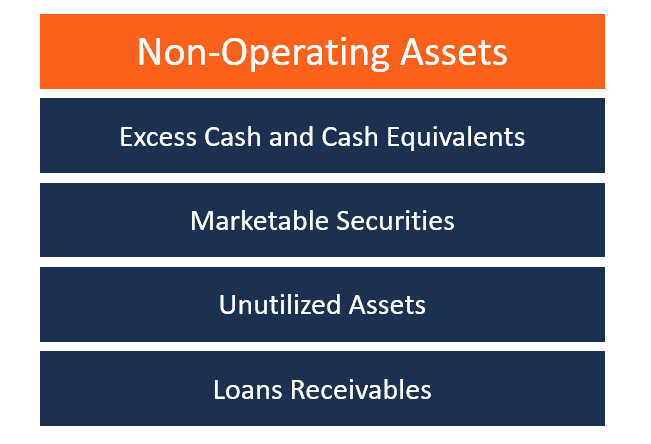

## Table of Contents

## What is a non-operating asset?

A non-operating asset is something a company owns that isn't used in its main business activities. These assets don't help the company make money from its main operations. Examples include extra land, unused buildings, or investments in other companies.

These assets can be sold if the company needs money. They are listed on the company's balance sheet but are separate from the assets used in daily business. Knowing about non-operating assets helps investors understand the total value of a company, beyond just its main business.

## Can you provide examples of non-operating assets?

Non-operating assets are things a company owns that don't help with its main business. For example, a car company might own some land that it's not using to make cars. This land is a non-operating asset because it doesn't help the company sell more cars. Another example is when a company has extra money and invests it in stocks or bonds. These investments are non-operating assets because they don't help the company's main job.

Another type of non-operating asset is an unused building. Imagine a tech company that owns an old factory it doesn't use anymore. That factory is a non-operating asset because it's not helping the company make or sell its tech products. Sometimes, companies also have artwork or collectibles that they own but don't use in their business. These items are also non-operating assets because they don't contribute to the company's main activities.

## How do non-operating assets differ from operating assets?

Operating assets are the things a company uses every day to do its main job. For example, if a company makes shoes, its operating assets might be the machines that make the shoes, the building where the shoes are made, and the trucks that deliver the shoes. These assets help the company make money from its main business.

Non-operating assets are different because they don't help with the main job of the company. They are things the company owns but doesn't use to make or sell its products or services. For instance, if that shoe company also owns a piece of land it's not using, or has some money invested in stocks, those are non-operating assets. They don't help make or sell shoes, but the company can sell them if it needs money.

## Why are non-operating assets important for a company?

Non-operating assets are important for a company because they can add extra value. Even though these assets don't help with the main business, they can be sold if the company needs money. For example, if a company is having a tough time and needs cash quickly, it can sell its non-operating assets like unused land or investments in other companies. This can help the company stay afloat without affecting its main business.

Also, non-operating assets can make a company look more valuable to investors. When people look at a company's balance sheet, they see not just the assets used for the main business but also these extra assets. This can make the company seem like a better investment because it has more resources. So, even though non-operating assets don't help with the day-to-day work, they can be very important for the overall health and value of the company.

## Where are non-operating assets typically placed on a balance sheet?

Non-operating assets are usually shown on a company's balance sheet under the "Assets" section. They are often listed separately from the operating assets, which are used for the main business. You might see them grouped under categories like "Investments" or "Other Assets." This helps people see the difference between what the company uses every day and what it has as extra.

For example, if a company has some money invested in stocks or bonds, those investments would be listed as non-operating assets. The same goes for unused land or buildings that the company owns but doesn't use for its main business. By showing these assets separately, the balance sheet gives a clearer picture of the company's total value, not just what it uses to make money from its main work.

## How do you identify non-operating assets on a balance sheet?

To identify non-operating assets on a balance sheet, look for assets that are not directly used in the company's main business activities. These are usually listed under sections like "Investments" or "Other Assets." For example, if a company that makes cars also owns some land it's not using, that land would be a non-operating asset. It's not helping the company make or sell cars, so it's listed separately from the machines and factories used for car production.

Non-operating assets can include things like investments in stocks or bonds, unused buildings, or even artwork and collectibles. They are important because they add to the overall value of the company, even if they don't contribute to the daily operations. By looking at the balance sheet and finding these items listed away from the main operating assets, you can see how much extra value the company has that it could use if needed.

## What is the impact of non-operating assets on a company's financial performance?

Non-operating assets can have a big impact on a company's financial performance. Even though these assets don't help the company make money from its main business, they can still be very important. For example, if a company is going through a tough time and needs cash, it can sell its non-operating assets like unused land or investments in other companies. This can help the company stay afloat without having to change its main business.

Also, non-operating assets can make a company look more valuable to investors. When people look at a company's balance sheet, they see not just the assets used for the main business but also these extra assets. This can make the company seem like a better investment because it has more resources. So, even though non-operating assets don't help with the day-to-day work, they can be very important for the overall health and value of the company.

## How should non-operating assets be valued on the balance sheet?

Non-operating assets should be valued on the balance sheet at their fair market value or the price they could be sold for today. This means if a company owns a piece of land it's not using, it should list that land's value on the balance sheet based on what someone would pay for it now. The same goes for investments in stocks or bonds; they should be valued at what they're worth in the market at the time the balance sheet is made.

It's important to value non-operating assets correctly because it helps show the true value of the company. If these assets are undervalued or overvalued, it can give a wrong picture of how much the company is really worth. By using the fair market value, the balance sheet gives a clear and honest view of the company's total assets, which is helpful for investors and anyone else looking at the company's financial health.

## What are the tax implications of non-operating assets?

Non-operating assets can have tax implications when a company decides to sell them. If a company sells a non-operating asset like unused land or investments in stocks, it might have to pay capital gains tax. Capital gains tax is the tax you pay on the profit you make from selling something. If the asset was sold for more than what the company originally paid for it, the company has to pay tax on that extra money. The tax rate can be different depending on how long the company owned the asset and the country's tax laws.

On the other hand, if the company sells the non-operating asset for less than what it paid, it might be able to claim a loss on its taxes. This loss can sometimes be used to reduce the amount of tax the company has to pay on other income. It's important for companies to keep good records of their non-operating assets because these records will help them figure out the tax they owe or the tax benefits they can claim when they sell these assets.

## How do non-operating assets affect a company's valuation and investment decisions?

Non-operating assets can make a big difference in how much a company is worth. When people want to know the value of a company, they look at everything the company owns. This includes the things used every day for the main business, like machines and buildings, but also non-operating assets like extra land or investments in other companies. These extra assets add to the total value of the company. Investors like to see a company with a lot of non-operating assets because it means the company has more resources it can use if it needs money.

Non-operating assets can also affect the decisions investors make. If a company has a lot of these extra assets, it might be seen as a safer investment. This is because the company can sell these assets if it runs into financial trouble, without having to change its main business. Investors might be more willing to put money into a company that has these extra resources. On the other hand, if a company doesn't have many non-operating assets, it might be seen as riskier because it has fewer options if it needs cash quickly.

## What are the strategic considerations for managing non-operating assets?

Managing non-operating assets is important for a company because these assets can be used to help the company in different ways. A big part of managing these assets is deciding when to keep them and when to sell them. If a company is doing well and doesn't need extra money, it might choose to keep these assets. They can make the company look more valuable to investors because they show that the company has extra resources. But if the company is struggling and needs cash, selling non-operating assets like unused land or investments in other companies can be a smart move. This can help the company stay afloat without having to change its main business.

Another strategic consideration is how to use non-operating assets to grow the company. Sometimes, a company can use these assets to invest in new projects or to buy other businesses. For example, if a company has extra money from non-operating assets, it might decide to invest that money in a new product line or to buy a smaller company that can help it grow. This can be a good way to use these assets to make the company stronger and more successful in the future. By thinking carefully about how to manage and use non-operating assets, a company can make better decisions that help it grow and stay strong.

## How can non-operating assets be leveraged for financial optimization?

Non-operating assets can be used to make a company's money situation better. If a company has extra things it's not using, like land or investments, it can sell these to get cash. This cash can help the company pay off debts, invest in new projects, or just keep running smoothly if it's having a tough time. By selling these non-operating assets, the company doesn't have to change its main business to get money, which can be a smart way to keep things stable.

Another way to use non-operating assets for financial optimization is by using them to grow the company. If a company has extra money from these assets, it can invest in new products or even buy other businesses. This can help the company make more money in the future and become stronger. By thinking carefully about how to use these extra assets, a company can make smart choices that help it do better financially.

## What is the Role of Non-Operating Assets on the Balance Sheet?

Non-operating assets are typically delineated from operating assets on a company's balance sheet. This distinction provides stakeholders with a clear visualization of the allocation of assets and their specific roles within the company's financial structure. Operating assets are directly involved in the company's core business activities, whereas non-operating assets are not essential to these operations but still hold value and potential for income generation.

The complexity in valuing non-operating assets arises from their diverse nature and the methods required for accurate assessment. Common methods include market appraisals, which determine an asset's value based on current market conditions, and discounted cash flow (DCF) analyses, which estimate the value of an asset based on its expected future cash flows. For example, the DCF method involves projecting future cash inflow and outflow, discounting them to present value using an appropriate discount rate. The formula for DCF valuation is:

$$

\text{DCF} = \sum_{t=1}^{n} \frac{C_t}{(1 + r)^t}
$$

where $C_t$ is the cash flow in period $t$, $r$ is the discount rate, and $n$ is the number of periods.

Properly accounting for non-operating assets is crucial for accurate financial reporting and analysis. Accurate asset classification ensures that financial statements faithfully represent the company's financial position, aiding analysts and investors in making informed decisions. Failure to properly account for these assets may lead to financial misrepresentation, affecting the perceived value of the company. Therefore, companies must implement rigorous accounting and valuation practices to ensure precision in reporting non-operating assets.

## References & Further Reading

[1]: Damodaran, A. (2012). ["Investment Valuation: Tools and Techniques for Determining the Value of Any Asset."](https://books.google.com/books/about/Investment_Valuation.html?id=5SRHAAAAQBAJ) Wiley Finance.

[2]: Bodie, Z., Kane, A., & Marcus, A. J. (2014). ["Investments."](https://books.google.com/books/about/EBOOK_Investments_Global_edition.html?id=BMsvEAAAQBAJ) McGraw-Hill Education.

[3]: Hull, J. C. (2017). ["Options, Futures, and Other Derivatives."](https://www.semanticscholar.org/paper/Options%2C-Futures%2C-and-Other-Derivatives-Hull/89bdee500c8623864fc9eb7a471546aa713acc44) Pearson.

[4]: Fabozzi, F. J., & Markowitz, H. M. (2011). ["The Theory and Practice of Investment Management: Asset Allocation, Valuation, Portfolio Construction, and Strategies."](https://onlinelibrary.wiley.com/doi/book/10.1002/9781118267028) Wiley.

[5]: Aldridge, I. (2013). ["High-Frequency Trading: A Practical Guide to Algorithmic Strategies and Trading Systems."](https://www.amazon.com/High-Frequency-Trading-Practical-Algorithmic-Strategies/dp/1118343506) Wiley Trading.