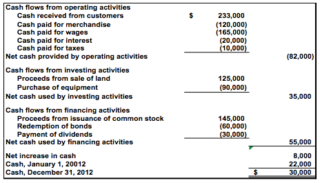

## Table of Contents

## What is non-operating cash flow?

Non-operating cash flow refers to the money a company makes or spends that is not related to its main business activities. This can include things like investment income, interest expenses, or gains and losses from selling assets. For example, if a company sells a piece of land it no longer needs, the money it gets from that sale is considered non-operating cash flow.

Understanding non-operating cash flow is important because it helps investors and analysts see the full picture of a company's financial health. While operating cash flow shows how well a company is doing in its core business, non-operating cash flow can show other sources of income or expenses that might affect the company's overall financial situation. By looking at both, people can make better decisions about the company's performance and future prospects.

## How is non-operating cash flow different from operating cash flow?

Operating cash flow is the money a company makes from its main business activities, like selling products or services. It shows how well a company is doing in its day-to-day operations. For example, if a company makes toys, the money it gets from selling those toys is its operating cash flow. This is important because it tells us if the company's core business is healthy and making money.

Non-operating cash flow, on the other hand, is the money a company makes or spends that is not from its main business. This can include things like money made from investments, interest paid on loans, or profits from selling old equipment. For instance, if the toy company sells an old factory, the money from that sale is non-operating cash flow. This type of cash flow helps us see other parts of the company's finances that can affect its overall health, but it's not directly related to making and selling toys.

## What are some common sources of non-operating cash flow?

Non-operating cash flow comes from activities that are not part of a company's main business. One common source is investment income. This can be money earned from stocks, bonds, or other investments that the company owns but doesn't use for its daily operations. Another source is interest income, which is money earned from loans the company has given to others. Companies might also get non-operating cash flow from selling assets they no longer need, like old buildings or machinery.

Another source of non-operating cash flow can be from foreign exchange gains or losses. If a company does business in different countries, changes in currency values can affect its cash flow. For example, if the dollar gets stronger against the euro, a U.S. company might make more money when converting euros back to dollars. Finally, non-operating cash flow can also come from one-time events, like lawsuit settlements or insurance payouts. These are not regular parts of the business but can still impact the company's cash flow.

## Why is it important to distinguish between operating and non-operating cash flows?

It's important to tell the difference between operating and non-operating cash flows because it helps us understand how well a company is doing in its main business. Operating cash flow shows the money a company makes from selling its products or services. This is the core of what the company does every day. If a company has a good operating cash flow, it means its main business is healthy and making money. This is really important for investors and managers because it tells them if the company can keep going and growing in the future.

Non-operating cash flow, on the other hand, comes from things that aren't part of the main business. This can be money from investments, selling old equipment, or even one-time events like lawsuit settlements. Knowing about non-operating cash flow helps us see the whole picture of a company's finances. It shows other ways the company can make or lose money, which can affect its overall health. By looking at both types of cash flow, people can make better decisions about the company's performance and future plans.

## How do you calculate non-operating cash flow?

To calculate non-operating cash flow, you need to look at the cash a company gets or spends that isn't from its main business. Start with the company's total cash flow from the cash flow statement. Then, subtract the operating cash flow, which is the money made from selling products or services. What's left is the non-operating cash flow. This can include money from investments, interest income, or selling old equipment.

For example, if a company's total cash flow for the year is $100,000 and its operating cash flow is $80,000, the non-operating cash flow would be $20,000. This $20,000 could come from things like selling a piece of land or [earning](/wiki/earning-announcement) interest on a bank account. By separating these two types of cash flow, you can see how much money the company is making from its main business versus other activities.

## Can non-operating cash flow be negative? What does that indicate?

Yes, non-operating cash flow can be negative. This happens when a company spends more money on things outside its main business than it makes from those activities. For example, if a company loses money on investments or has to pay a lot of interest on loans, its non-operating cash flow will be negative.

A negative non-operating cash flow isn't always a bad thing. It might mean the company is making smart investments for the future, even if they don't pay off right away. But if it keeps happening, it could be a sign that the company needs to be careful with its money and maybe focus more on its main business to stay healthy.

## What role does non-operating cash flow play in financial analysis?

Non-operating cash flow is important in financial analysis because it helps us see the whole picture of a company's money situation. It shows the money a company makes or spends that isn't from selling its main products or services. This can include money from investments, interest on loans, or selling old equipment. By looking at non-operating cash flow, analysts can understand if a company is making smart choices with its extra money or if it's spending too much on things that aren't part of its main business.

Understanding non-operating cash flow also helps analysts see if a company's overall financial health is good or if it's relying too much on money from outside its main business. For example, if a company has a lot of negative non-operating cash flow, it might mean they're losing money on investments or paying too much interest on loans. This can be a warning sign that the company needs to focus more on its main business to stay healthy. By looking at both operating and non-operating cash flows, analysts can make better decisions about the company's future and how well it's doing overall.

## How does non-operating cash flow affect a company's valuation?

Non-operating cash flow can affect a company's valuation by showing how much money the company makes or loses from activities outside its main business. If a company has a lot of positive non-operating cash flow, it might look more valuable because it's making extra money from investments or selling old equipment. This can make investors think the company is doing well overall, even if its main business isn't the strongest. But if the non-operating cash flow is negative, it could make the company look less valuable because it's losing money on things that aren't part of its main business.

Analysts and investors look at both operating and non-operating cash flows to get a full picture of a company's financial health. If a company's main business is doing well but it's losing money on investments, the valuation might not be as high as it could be. On the other hand, if the non-operating cash flow is positive and the company is making smart investments, it could boost the company's valuation. The key is to see how the non-operating cash flow fits into the bigger picture of the company's money situation and future plans.

## What are the tax implications of non-operating cash flows?

Non-operating cash flows can affect a company's taxes because they can be treated differently from the money made from the main business. For example, if a company makes money from selling an old building, that money might be taxed as a capital gain. Capital gains can have different tax rates than the money a company makes from selling its products or services. Also, if a company gets money from investments, like interest or dividends, those might be taxed at different rates too. So, non-operating cash flows can make a company's tax situation more complicated.

On the other hand, some non-operating cash flows can help lower a company's taxes. For example, if a company loses money on an investment, it might be able to use that loss to reduce its taxable income. This is called a tax loss, and it can help the company pay less in taxes. Also, if a company has to pay interest on loans, those interest payments can sometimes be deducted from the company's income, which can lower its taxes. So, non-operating cash flows can have both positive and negative effects on a company's taxes, depending on what they are and how they're treated by tax laws.

## How do non-operating cash flows impact investment decisions?

Non-operating cash flows can affect investment decisions because they show investors where a company's money is coming from or going, outside of its main business. If a company is making a lot of money from investments or selling old equipment, it might look like a good investment. Investors might think the company is smart with its money and can make extra profits. But if the company is losing money on those things, investors might be worried. They might think the company isn't making good choices with its extra money and that could make them less likely to invest.

Understanding non-operating cash flows helps investors see the whole picture of a company's financial health. If a company's main business is doing well but it's losing money on investments, investors might be cautious. They might want to see if the company can fix those problems before they invest. On the other hand, if the company is making smart investments and those investments are paying off, investors might feel more confident. They might see the company as a good long-term investment because it's using its money wisely to grow and make more profits in the future.

## What are some strategies to manage or optimize non-operating cash flows?

One way to manage or optimize non-operating cash flows is by making smart investments. A company can look for investments that will give them a good return on their money. This could be buying stocks, bonds, or even investing in other businesses. The key is to choose investments that fit with the company's goals and can help them make more money over time. By doing this, the company can turn its extra cash into more profits, which can help its overall financial health.

Another strategy is to sell assets that the company no longer needs. This can include old buildings, machinery, or other things that aren't being used. Selling these assets can bring in extra cash that the company can use for its main business or to invest in other ways. It's important to sell these assets at the right time and for a good price, so the company gets the most benefit from them. This can help keep the company's non-operating cash flows positive and improve its financial situation.

Lastly, managing debt wisely can also help optimize non-operating cash flows. If a company has loans, it needs to make sure it's not paying too much interest. They can do this by paying off high-interest loans first or by refinancing their debt to get better terms. By keeping interest payments low, the company can save money and improve its non-operating cash flows. This can make the company look more attractive to investors and help it stay financially healthy.

## How do industry-specific factors influence non-operating cash flows?

Industry-specific factors can really change how much non-operating cash flow a company has. For example, in the tech industry, companies often invest a lot in other tech startups or new technologies. If those investments do well, the company can make a lot of extra money, which shows up as positive non-operating cash flow. But if the investments don't do well, the company might lose money, leading to negative non-operating cash flow. Also, tech companies might have a lot of old equipment they don't need anymore, like old computers or servers. Selling this old stuff can bring in extra cash, which helps their non-operating cash flow.

In the real estate industry, non-operating cash flow can come from selling properties that the company doesn't need anymore. If the real estate market is doing well, the company can make a lot of money from these sales, which boosts their non-operating cash flow. But if the market is bad, they might not get as much money, or they might even lose money on the sale. Also, real estate companies might have a lot of debt from buying properties, and the interest they pay on that debt can affect their non-operating cash flow. So, the health of the real estate market and how the company manages its debt can really change their non-operating cash flow.

## References & Further Reading

[1]: ["The Essentials of Trading: From the Basics to Building a Winning Strategy"](https://www.amazon.com/Essentials-Trading-Building-Winning-Strategy/dp/047179063X) by John Forman.

[2]: ["Finance and Strategy: Accounting for Long-Term Performance"](https://accountinginsights.org/strategic-financial-impact-on-long-term-growth-and-valuation/) by Stewart Hamilton and Alicia Micklethwait.

[3]: ["Financial Statement Analysis and Security Valuation"](https://www.amazon.com/Financial-Statement-Analysis-Security-Valuation/dp/0073379662) by Stephen H. Penman.

[4]: ["Advanced Techniques in Day Trading: A Practical Guide to High Probability Strategies and Methods"](https://www.amazon.com/Advanced-Techniques-Day-Trading-Probability/dp/1721151265) by Andrew Aziz.

[5]: ["Using Python for Introductory Econometrics"](https://urfie.net/downloads/PDF/UPfIE_web.pdf) by Florian Heiss.

[6]: Bodie, Z., Kane, A., & Marcus, A. J. (2013). ["Investments and Portfolio Management"](https://www.amazon.com/Investments-Portfolio-Management-Zvi-Bodie/dp/0071289143). McGraw-Hill Education.

[7]: ["Trading and Exchanges: Market Microstructure for Practitioners"](https://www.amazon.com/Trading-Exchanges-Market-Microstructure-Practitioners/dp/0195144708) by Larry Harris.