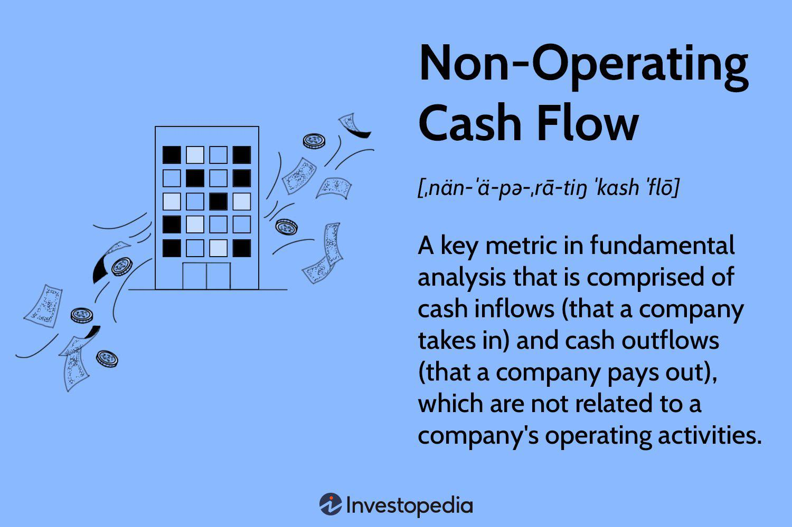

Understanding non-operating cash flow is essential in the fast-paced field of finance, particularly for algorithmic traders seeking a comprehensive analysis. Non-operating cash flow pertains to cash inflows and outflows that do not originate from a company's core business activities. These typically arise from investing and financing actions, such as sales of assets, investment income, or capital raised through debt and equity. Distinct from operating cash flow, which covers day-to-day business transactions, non-operating cash flow captures strategic financial decisions that impact a company's long-term fiscal health.

Algorithmic trading, which utilizes sophisticated financial models to automate buying and selling decisions, can significantly benefit from insights gained through non-operating cash flow analysis. By incorporating these insights, trading algorithms can achieve a finer resolution in interpreting a company's financial status. This approach offers traders a more detailed understanding of a firm's financial performance, going beyond basic profit and loss metrics. Leveraging this information, algorithmic models can align more closely with a company's financial dynamics, potentially leading to more accurate trading predictions.



This article will break down the complexities of non-operating cash flow, examining its role in financial analysis and its implications within algorithmic trading strategies. Additionally, the integration of cash flow insights into trading algorithms can guide traders toward more informed investment decisions, underscoring the synergy between financial analysis and automated trading systems. By utilizing non-operating cash flow metrics, algorithmic traders can enhance the predictive accuracy and sophistication of their trading models, ultimately aiming for improved investment outcomes.

## Table of Contents

## Understanding Non-Operating Cash Flow

Non-operating cash flow comprises cash activities that extend beyond a company's primary business operations. These activities often involve transactions linked to investing or financing, rather than operational activities like sales revenue or production expenses. Key examples of non-operating cash flow include cash generated from selling assets, such as real estate or equipment, and income from investments, which may encompass dividends or interest from financial securities. Additionally, issuing shares to raise equity and acquiring loans for capital injection are also categorized under non-operating cash flow.

In financial statements, these activities are recorded in either the cash-flow-from-investing or cash-flow-from-financing sections of a cash flow statement. The cash-flow-from-investing typically includes transactions involving asset purchases and sales or investment income, while cash-flow-from-financing consists of activities such as issuing debt or equity, repurchasing shares, and paying dividends.

Analyzing non-operating cash flow is essential for assessing how a company manages its liquidity and capital resources. By focusing on these cash flows, financial analysts can evaluate a company's strategic decisions regarding investments and financing, providing insights into its long-term growth plans and financial flexibility. Understanding non-operating cash flow dynamics enables stakeholders to gauge a company's ability to sustain its operations and expansion without solely relying on its core business activities.

## Importance of Non-Operating Cash Flow in Financial Analysis

Non-operating cash flow is an invaluable marker when assessing a company's financial health and strategic direction. Unlike operating cash flow, which stems from the core business activities, non-operating cash flow includes transactions that offer insights into the company's financial strategies over the long term. This perspective is crucial for analysts and investors, as it reveals how the company is maneuvering beyond its primary operations to manage growth and financial obligations.

Understanding how a company funds its growth provides insights into its strategic planning and risk management. Companies may resort to various methods of raising capital, including debt issuance, equity sales, or even asset liquidation. Each of these methods impacts the company's financial flexibility differently. For instance, financing through debt may increase leverage but could also pressure future cash flows due to interest obligations. Conversely, issuing new equity may dilute existing shareholders' value but provides cash without these obligatory repayments.

Evaluating non-operating cash flows also enables investors and analysts to understand the company's ability to handle external capital influxes or constraints. A healthy non-operating cash flow might indicate a company's robust ability to attract funding, invest in growth initiatives, or weather financial downturns without severely affecting its operations. For investors, this aspect is critical for assessing risk and potential return on investment, as it provides a more comprehensive view of financial resilience.

Moreover, monitoring non-operating cash flow metrics helps analysts determine how effectively a company is leveraging its capital structure to maximize shareholder value. The capital structure is the blend of debt and equity that a company uses to finance its operations and growth. An optimal capital structure is crucial as it minimizes the cost of capital and thus increases the firm's value. By observing changes in non-operating cash flows, analysts can infer strategic shifts in how management is leveraging this structure — whether they are adopting a more aggressive growth posture or prioritizing debt reduction and financial prudence.

In summary, non-operating cash flow is a critical metric that extends the scope of financial analysis beyond traditional operational performance, offering a window into a company's strategic maneuvers and financial adaptability.

## Algorithmic Trading and Financial Statements

Algorithmic trading leverages computational power to automate trading strategies, and its efficacy is enhanced by incorporating comprehensive financial data, including non-operating cash flow information. Non-operating cash flow data, found in cash flow statements, offers valuable insights into a company's financial health, which traders can utilize to improve the precision of their trading algorithms. 

Cash flow statements, integral to financial reporting, break down into three main categories: operating, investing, and financing activities. Non-operating cash flow data typically falls under investing and financing sections, providing insights into activities like asset sales, investment income, and the acquisition of loans. These activities, although not related to core business operations, significantly impact a company’s [liquidity](/wiki/liquidity-risk-premium) and financial standing.

Algorithmic trading strategies aim to predict market trends and execute trades based on these predictions. By integrating non-operating cash flow data into their algorithms, traders can enhance their models' robustness. For example, an increase in cash from asset sales might indicate potential reinvestment opportunities or strategic shifts, impacting future profitability and, consequently, the stock performance. This type of data enables algorithms to make more nuanced trading decisions that reflect the company's comprehensive financial situation.

Moreover, cash flow analysis can generate predictive signals. For instance, substantial cash inflows from financing activities could signal increased leverage, affecting a company's risk profile and future cash demands. Algorithms can monitor these trends, adjusting trading signals to reflect changes in risk and strategic positioning. 

Python, a widely used language in [algorithmic trading](/wiki/algorithmic-trading), allows for effective integration of these financial insights into trading algorithms. A simple example of utilizing non-operating cash flow data in Python might look like this:

```python
import pandas as pd

# Load cash flow data
cash_flow_data = pd.read_csv('cash_flow_statement.csv')

# Calculate non-operating cash flow by summing investing and financing activities
non_operating_cash_flow = cash_flow_data['InvestingActivities'] + cash_flow_data['FinancingActivities']

# Define a threshold for cash flow change
threshold = 1000000 # Change this value based on strategy

# Determine potential trading signals based on changes in non-operating cash flow
cash_flow_trends = non_operating_cash_flow.diff()

signal = 'Hold'
if cash_flow_trends.iloc[-1] > threshold:
    signal = 'Buy'
elif cash_flow_trends.iloc[-1] < -threshold:
    signal = 'Sell'

print(f'Trading Signal: {signal}')
```
This script exemplifies a basic framework for how traders might incorporate non-operating cash flow changes into trading decisions. In practice, more sophisticated models would incorporate additional financial metrics and leverage [machine learning](/wiki/machine-learning) techniques to refine the decision-making processes. 

Ultimately, integrating non-operating cash flow insights enhances the predictive capabilities of algorithmic models, allowing traders to align their strategies with a company's financial dynamics and market conditions.

## Integrating Non-Operating Cash Flow into Algo Trading Strategies

Traders can enhance algorithmic trading strategies by incorporating non-operating cash flow metrics, which facilitates a more nuanced analysis of a company's liquidity and capital strategies. By transforming cash flow data into actionable insights, traders can anticipate stock price movements based on underlying financial health trends. Incorporating non-operating cash flow metrics into algorithmic models offers distinct advantages as these cash flows, such as those derived from the disposal of assets or new debt issuance, provide unique indicators of a company's strategic capital decisions.

Cash flow metrics can inform algorithmic models by serving as independent variables that indicate potential shifts in stock prices. For example, a significant change in non-operating cash flow could indicate a major strategic decision, such as refinancing existing debt or selling off a non-core asset. These events often result in temporary fluctuations in stock prices, which can be leveraged in a well-modelled trading algorithm. 

To illustrate, consider a Python-based approach to integrate non-operating cash flow data into a trading algorithm:

```python
import pandas as pd
import numpy as np
from sklearn.linear_model import LinearRegression

# Sample data
data = pd.DataFrame({
    'stock_price': [100, 102, 101, 105, 107, 110, 115],
    'non_operating_cash_flow': [5, 6, 3, 7, 6, 4, 5]
})

# Feature and target variable
X = data[['non_operating_cash_flow']]
y = data['stock_price']

# Linear regression model
model = LinearRegression()
model.fit(X, y)

# Predicting future stock prices
data['predicted_stock_price'] = model.predict(X)

# Display results
print(data)
```

This script uses a basic linear regression model to predict stock prices based on non-operating cash flow data. By analyzing historical cash flow data, traders can create predictive models that significantly enhance decision-making processes and optimize portfolio performance. The predictive accuracy of such models depends on the quality and granularity of the cash flow data.

Significant variations in non-operating cash flow can signal impending changes in a company’s capital strategy, prompting adjustments in trading algorithms. Historical cash flow analysis provides a blueprint for predicting future financial behavior, enabling traders to anticipate shifts and adapt strategies accordingly.

A crucial consideration is that the integration of non-operating cash flow into algorithmic trading requires consistent monitoring of cash flow reports and real-time financial updates. Such analytics-driven approaches help in ensuring that the trading strategies are aligned with the evolving financial dynamics of companies, ultimately leading to more informed investment decisions and improved portfolio outcomes.

## Challenges and Considerations

Utilizing cash flow data in algorithmic trading involves several significant challenges that need careful management. One primary concern is ensuring the accuracy and timeliness of financial data. Algorithmic trading systems depend on precise data to make informed decisions, and any inaccuracies can lead to erroneous trading signals, potentially resulting in financial losses.

To achieve this, traders and developers must implement robust data validation processes. These processes ensure that all incoming data is correctly formatted, free from errors, and sourced from reliable providers. Additionally, it is essential to integrate real-time data feeds into the algorithms to allow for the swift adaptation of strategies as market conditions change.

Another key consideration is the ability of algorithmic models to adapt to evolving market environments. Financial markets are highly dynamic, with prices and conditions changing rapidly. Therefore, algorithms must be designed to adjust trading signals based on updated non-operating cash flow data, capturing insights into potential shifts in corporate financial strategies.

Furthermore, combining quantitative data with qualitative insights adds depth to trading models. While quantitative data such as non-operating cash flow metrics provide a numerical basis for decision-making, qualitative factors such as management decisions, market positioning, and industry trends can offer context and more nuanced interpretations. This blend of data types helps create comprehensive models capable of withstanding market [volatility](/wiki/volatility-trading-strategies) and capturing complex financial dynamics effectively.

In conclusion, addressing these challenges requires a disciplined approach to data management, a flexible architecture for trading algorithms, and a holistic perspective that integrates various data formats. This methodology enhances the robustness and reliability of algorithmic trading strategies, facilitating better investment outcomes.

## Conclusion

Non-operating cash flow plays a crucial role in financial analysis and trading, offering insights that extend beyond the scope of a company's usual operational metrics. For algorithmic traders, the ability to leverage non-operating cash flow metrics can significantly enhance the predictive accuracy of trading models. These metrics provide a more comprehensive picture of a company's financial health, particularly in areas such as investment and financing activities.

Integrating these insights allows traders to develop trading strategies that are closely aligned with a company's overall financial dynamics and strategic direction. By understanding non-operating cash flows, traders can assess how a company manages its liquidity and capital, which in turn affects its market performance. This understanding can lead to better-informed trading strategies that take into account potential alterations in a company’s capital strategies, whether through debt, equity, or asset management.

The ability to analyze and apply non-operating cash flow data empowers traders to refine their trading algorithms for optimal results. Incorporating these insights can lead to the creation of more robust models that are capable of predicting market trends with greater fidelity. By focusing on both quantitative data and qualitative insights, traders can tailor their strategies to the evolving market conditions and ensure their investments are well-aligned with the company's long-term strategic goals. This comprehensive approach can result in strategies that not only anticipate market shifts but also optimize portfolio performance.

## References & Further Reading

[1]: ["The Essentials of Trading: From the Basics to Building a Winning Strategy"](https://www.amazon.com/Essentials-Trading-Building-Winning-Strategy/dp/047179063X) by John Forman.

[2]: ["Finance and Strategy: Accounting for Long-Term Performance"](https://accountinginsights.org/strategic-financial-impact-on-long-term-growth-and-valuation/) by Stewart Hamilton and Alicia Micklethwait.

[3]: ["Financial Statement Analysis and Security Valuation"](https://www.amazon.com/Financial-Statement-Analysis-Security-Valuation/dp/0073379662) by Stephen H. Penman.

[4]: ["Advanced Techniques in Day Trading: A Practical Guide to High Probability Strategies and Methods"](https://www.amazon.com/Advanced-Techniques-Day-Trading-Probability/dp/1721151265) by Andrew Aziz.

[5]: ["Using Python for Introductory Econometrics"](https://urfie.net/downloads/PDF/UPfIE_web.pdf) by Florian Heiss.

[6]: Bodie, Z., Kane, A., & Marcus, A. J. (2013). ["Investments and Portfolio Management"](https://www.amazon.com/Investments-Portfolio-Management-Zvi-Bodie/dp/0071289143). McGraw-Hill Education.

[7]: ["Trading and Exchanges: Market Microstructure for Practitioners"](https://www.amazon.com/Trading-Exchanges-Market-Microstructure-Practitioners/dp/0195144708) by Larry Harris.