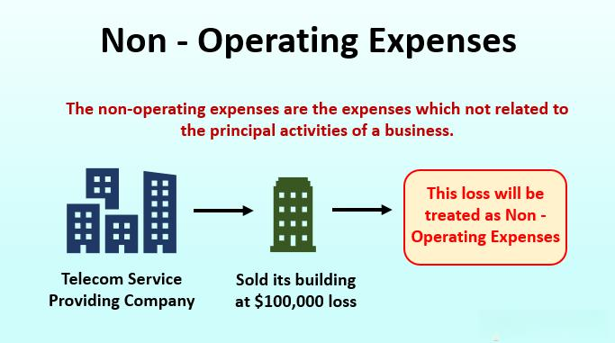

Understanding financial terminology is crucial for businesses operating in today's dynamic economic environment. As organizations navigate complex financial landscapes, a clear grasp of financial terms can significantly impact decision-making processes and overall business health. This article focuses on the pivotal roles of non-operating expenses and business expenses, specifically within the context of algorithmic trading—a field where precision and efficiency are paramount.

Algorithmic trading involves using computer algorithms to execute a large number of trades in financial markets at high speed. Within this domain, distinguishing between various types of expenses becomes essential, as these expenses can directly influence financial statements and, consequently, the organization's financial condition. Non-operating expenses, for instance, include costs not tied to the core operations of a business, such as interest expenses, losses from asset disposals, or currency exchange losses. These expenses, while not directly impacting day-to-day trading operations, can substantially affect a company's profitability.



This article will discuss the differences between operating and non-operating expenses and why recognizing these distinctions is important for evaluating financial health. Through this exploration, insights will emerge on how these expenses impact financial statements and strategic decision-making processes. In the context of algorithmic trading, the classification and management of expenses are crucial, as they inform trading strategies and affect financial outcomes.

Readers will gain insights into how these expenses influence financial health and strategic decision-making, gaining an understanding of their role in maintaining business efficiency and profitability. By shedding light on these financial elements, the article will enable businesses engaged in algorithmic trading to enhance their strategic growth prospects and financial resilience.

## Table of Contents

## What Are Non-Operating Expenses?

Non-operating expenses are costs that a business incurs which are not directly tied to its core functions. These differentiate from operating expenses, as they do not stem from the company's primary business operations. Recognizing and understanding non-operating expenses is crucial for accurately assessing a company's core profitability and overall financial performance. 

Common examples of non-operating expenses include:

1. **Interest Payments**: These are costs incurred from borrowing funds and paying interest on loans. They are not linked to the company's primary business activities. For instance, a retail company may need a loan for expansion purposes; the interest paid on that loan would be classified as a non-operating expense.

2. **Losses from Asset Sales**: When a business sells an asset for less than its book value, the resulting loss is considered a non-operating expense. An example would be selling obsolete machinery at a loss because it is no longer required for production.

3. **Foreign Exchange Losses**: Companies operating internationally may incur losses due to fluctuations in exchange rates, which are recognized as non-operating expenses. These losses are significant for businesses engaged in global trade and can affect financial results independently of core business efficiency.

4. **Litigation Costs**: Legal fees and settlements from lawsuits not related to routine business operations may also be classified under non-operating expenses. This could occur if a company faces a lawsuit unrelated to its production or commercial activities.

Financial reporting reflects these expenses separately from operating expenses to provide a clear view of a company's performance exclusive of irregular or non-core financial activities. For investors and analysts, this distinction helps isolate operational efficiency from financial and investment strategies. For example, a company may show reduced net income due to high interest expenses when core business operations are thriving.

Accounting standards require businesses to provide detailed categorizations of non-operating expenses in financial statements. This transparency assists stakeholders in making informed decisions regarding the financial health and managerial effectiveness of the company. In practice, understanding and accurately reporting non-operating expenses play a pivotal role in strategic planning, taxation, and investor relations.

## Differentiating Business Expenses: Operating vs. Non-Operating

Distinguishing between operating and non-operating expenses is a crucial aspect of financial analysis. This differentiation provides clarity in understanding a business’s core profitability and aids in strategic financial planning.

Operating expenses are the recurring costs that are essential for a company’s daily functions. These include salaries, rent, utilities, and costs related to the production of goods or services. Essentially, they are expenses that enable a company to conduct its primary operations. For example, a manufacturer would categorize materials, labor, and overhead costs as operating expenses since these are directly tied to the production process.

In contrast, non-operating expenses comprise costs that do not originate from the primary business activities. These expenses typically occur sporadically and may include interest payments on debts, losses from the sale of assets, or expenses linked to restructuring activities. Since they are not a part of the core business operations, they are reported separately in financial statements to provide a clear picture of how much profit is generated from primary operations alone.

The separation of these expenses is significant because it impacts the financial health analysis of a company. Financial metrics such as operating profit focus exclusively on the core operational costs, excluding non-operating expenses. This helps stakeholders evaluate the inherent profitability and efficiency of the business without the influence of irregular and unrelated financial activities.

Accurate reporting and categorization also ensure compliance with financial regulations and enable better prediction and management of tax liabilities. Furthermore, investors and analysts rely on these distinctions to assess operational performance and make informed investment decisions.

By understanding the core differences between operating and non-operating expenses, businesses can present clearer financial insights and drive more effective strategic decision-making processes.

## Importance of Expense Classification in Business

Proper classification of expenses plays a pivotal role in the financial management of any business. This practice not only enhances the accuracy and transparency of financial statements but also facilitates informed decision-making by stakeholders. By clearly differentiating between various types of expenses, businesses can present a more accurate financial picture, ensuring that all costs are appropriately categorized either as operating or non-operating expenses.

Accurate classification of expenses is essential for compliance with financial regulations. Different jurisdictions may have specific requirements regarding how certain expenses should be recorded and reported. By adhering to these regulations, businesses can avoid penalties, audits, and reputational damage. Furthermore, precise classification helps organizations optimize their tax liabilities. Certain expenses may be deductible under tax laws, providing businesses with opportunities for tax optimization.

There are various tools and techniques available to assist businesses in the precise categorization of their expenses. These tools range from manual processes to sophisticated software solutions designed for automating expense management. Accounting software such as QuickBooks, Xero, and SAP Business One are popular choices that offer functionalities to classify expenses efficiently. These platforms come with features like rule-based categorization, which automatically assigns transactions to the correct accounts based on predefined criteria.

Additionally, using [machine learning](/wiki/machine-learning) and [artificial intelligence](/wiki/ai-artificial-intelligence) can significantly enhance the accuracy of expense classification. These technologies can analyze historical expense data, recognize patterns, and predict classifications for new transactions. Here's a simple Python script that uses a machine learning library, like scikit-learn, to classify expenses based on provided data:

```python
from sklearn.model_selection import train_test_split
from sklearn.tree import DecisionTreeClassifier
import pandas as pd

# Load your expense data
data = pd.read_csv('expenses.csv')  # Ensure you have a CSV file with labeled expense data
features = data[['amount', 'transaction_type', 'vendor']]
labels = data['category']

# Split the data
X_train, X_test, y_train, y_test = train_test_split(features, labels, test_size=0.2, random_state=42)

# Train the model
clf = DecisionTreeClassifier()
clf.fit(X_train, y_train)

# Predict categories
predictions = clf.predict(X_test)

# Display predictions
print(predictions)
```

This script will require a CSV file with columns representing different attributes of each expense, such as amount, transaction type, and vendor, and a column for the category label, which indicates whether the expense is operational or non-operational. While this is a basic example, more advanced models and feature engineering techniques can be employed for higher accuracy in more complex datasets.

By embracing both technological and manual approaches to expense classification, businesses can ensure robust financial management practices that support strategic growth and operational efficiency.

## Recurring vs. Non-Recurring Expenses in Algorithmic Trading

In [algorithmic trading](/wiki/algorithmic-trading), the distinction between recurring and non-recurring expenses is pivotal for optimizing strategies and managing risks effectively. Recurring expenses in this domain typically include costs that are consistently incurred over time. Examples are subscription fees for financial data services, cloud server costs for maintaining trading algorithms, and software license renewals. These expenses are predictable and often form a part of the fixed operational costs, allowing for more accurate budgeting and financial forecasting.

In contrast, non-recurring expenses represent irregular, often one-time costs that can arise due to specific circumstances. These may include technology upgrades, such as new hardware investments, major software overhauls, or cybersecurity enhancements. While these expenses are less predictable, they are critical as they often involve significant enhancements to the trading infrastructure, potentially resulting in increased efficiency and profitability in the long term.

The impact of these expense types on trading models is considerable. Recurring expenses directly affect the overall cost structure and, in turn, the net profitability of trading operations. These costs must be accounted for in profit-and-loss (P&L) calculations to ensure that trading strategies are financially viable. Meanwhile, non-recurring expenses, while not regularly impacting monthly cash flows, need to be capitalized and amortized over their useful life. This process helps in spreading the cost of the asset over time and avoids sudden financial pressure on any single financial period.

For algorithmic traders, mastering the categorization and management of these expenses can mean the difference between sustained profitability and financial strain. By incorporating tools such as budget forecasts that account for both types of expenses, traders can optimize resource allocation and maintain flexibility in strategy development. This balanced approach allows traders to leverage technical advancements without compromising financial stability. 

Overall, effectively understanding and managing recurring and non-recurring expenses not only supports better risk management but also enhances the strategic decision-making process, ensuring that algorithmic trading operations remain both efficient and resilient.

## Managing Non-Operating and Business Expenses Effectively

Effective management of both operating and non-operating expenses is crucial for sustaining business growth. Implementing budgeting techniques, accurate forecasting, and leveraging technology are key practices that enhance expense management, ensuring financial reports are reliable and precise.

Budgeting plays a fundamental role in managing expenses. A well-structured budget outlines expected revenues and expenditures, creating a roadmap for financial health. This tool aids businesses in controlling their spending and identifying areas where costs can be reduced. For operating and non-operating expenses, a budget helps track regular business costs and sporadic expenses, respectively. By distinguishing between these categories, companies can allocate resources more efficiently, directing funds towards profitable areas and reducing waste in non-essential operations.

Forecasting complements budgeting by predicting future financial outcomes based on historical data and market trends. Accurate forecasting allows businesses to anticipate changes in expenses due to external factors such as [interest rate](/wiki/interest-rate-trading-strategies) fluctuations, technological advancements, or regulatory changes. Utilizing statistical methods or machine learning algorithms can improve the accuracy of these predictions. For instance, time series analysis can model and predict future expenses, providing insights that guide strategic financial decisions.

Technology plays an indispensable role in managing expenses effectively. Modern accounting software automates the recording, classification, and analysis of financial data, reducing the risk of errors and saving time. Solutions like Enterprise Resource Planning (ERP) systems integrate various business processes, providing a comprehensive view of financial performance across departments. Additionally, adopting cloud-based platforms facilitates real-time data access and collaboration, ensuring that all stakeholders have up-to-date information for decision-making.

Implementing these best practices requires a strategic approach. Regular reviews and audits of the financial processes ensure compliance with standards and identify any discrepancies early. Engaging financial experts to tailor these practices to specific business needs enhances their effectiveness. Training staff in financial management tools and methodologies further supports accurate reporting and informed decision-making.

Accurate financial reporting hinges on these practices. A robust management strategy for operating and non-operating expenses helps maintain transparency, boosting investor and stakeholder confidence. Through effective expense management, businesses not only safeguard their financial health but also position themselves for sustained growth and competitive advantage in the marketplace.

## The Role of Automation in Expense Management

Automation plays a pivotal role in the modern management of business expenses, offering efficiencies that are particularly beneficial in data-driven sectors such as trading. By automating the classification and tracking of expenses, businesses can achieve greater accuracy and efficiency in their financial operations. Automated accounting software, for instance, improves the precision of financial statements by reducing human error and enabling faster data processing. This accuracy is crucial for effective strategic planning, as it provides decision-makers with reliable financial insights.

Automated solutions in expense management range from simple tools that categorize expenses to advanced platforms that integrate with business systems to provide comprehensive financial analytics. Many accounting software options, such as QuickBooks, Xero, and FreshBooks, offer features that automatically sync with bank accounts, categorize transactions based on predefined rules, and generate detailed financial reports. These capabilities free up time for finance teams and allow them to focus on more strategic tasks.

Moreover, automation enhances the scalability of financial operations. As businesses grow, the [volume](/wiki/volume-trading-strategy) of transactions increases, making manual processes inefficient and error-prone. Automated systems can handle large datasets with ease, ensuring that the classification and reporting of expenses remain accurate and timely. For example, in algorithmic trading, where transaction volumes can be high, automation ensures that all relevant trading fees, subscription costs, and other expenses are correctly categorized and recorded.

The benefits of automation in managing business expenses extend beyond accuracy and efficiency. These systems also provide real-time insights into financial performance, enabling businesses to respond promptly to financial challenges. For instance, automated alerts can notify managers of unusual expense patterns, aiding in fraud detection and financial oversight.

In conclusion, automation is a powerful tool in expense management, enhancing accuracy, efficiency, and strategic decision-making. By leveraging automated solutions, businesses can streamline their financial operations and better position themselves for growth and profitability.

## Conclusion

Accurate expense classification and management are crucial elements in maintaining a business's financial health, providing a clear picture of where resources are allocated and enabling effective decision-making. In algorithmic trading, the integration and understanding of expense data are vital for developing trading strategies that are both efficient and profitable. By categorizing expenses meticulously, businesses gain the ability to isolate and analyze the impact of costs associated with core trading activities versus those incurred outside the regular business operations. This demarcation assists in identifying areas for cost optimization and performance improvement.

In algorithmic trading, where decisions are driven by data and speed, the precision of financial data, including the accuracy of expense classification, can directly affect the success of trading algorithms. Algorithms require not only execution speed but also precise cost calculation to maximize profitability. For instance, trading strategies often include transaction costs as a crucial component in calculating net returns; hence, understanding both recurring and non-recurring expenses within this framework empowers traders to adjust algorithms accordingly.

By focusing on expense classification, businesses not only comply with financial regulations but also optimize their overall financial strategy. This careful approach enhances the transparency of financial statements, aiding stakeholders in understanding a company’s financial health. Furthermore, businesses can utilize this information to strategically allocate resources and, if needed, restructure operations to improve efficiency and productivity.

Moreover, with the advent of sophisticated expense management tools and automation, managing expenses has become more streamlined, minimizing human error and increasing accuracy in financial reporting. Automation in expense management allows for continuous monitoring and real-time expense tracking, offering businesses the agility to respond swiftly to financial discrepancies or emerging cost patterns.

Ultimately, by emphasizing accurate classification and management of both operating and non-operating expenses, businesses are better equipped to maintain sustained growth and profitability. This strategic focus enables them to adapt to changing market conditions and exploit new opportunities, thereby strengthening their competitive advantage in the marketplace.

## References & Further Reading

[1]: Bergstra, J., Bardenet, R., Bengio, Y., & Kégl, B. (2011). ["Algorithms for Hyper-Parameter Optimization."](https://dl.acm.org/doi/10.5555/2986459.2986743) Advances in Neural Information Processing Systems 24.

[2]: ["Advances in Financial Machine Learning"](https://www.amazon.com/Advances-Financial-Machine-Learning-Marcos/dp/1119482089) by Marcos Lopez de Prado

[3]: ["Evidence-Based Technical Analysis: Applying the Scientific Method and Statistical Inference to Trading Signals"](https://www.amazon.com/Evidence-Based-Technical-Analysis-Scientific-Statistical/dp/0470008741) by David Aronson

[4]: ["Machine Learning for Algorithmic Trading"](https://github.com/stefan-jansen/machine-learning-for-trading) by Stefan Jansen

[5]: ["Quantitative Trading: How to Build Your Own Algorithmic Trading Business"](https://www.amazon.com/Quantitative-Trading-Build-Algorithmic-Business/dp/1119800064) by Ernest P. Chan