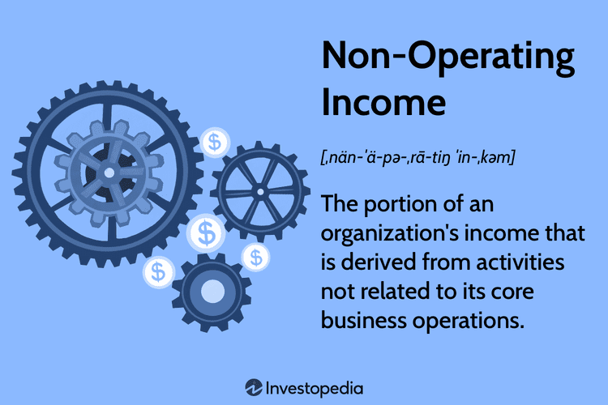

Understanding non-operating income is essential for comprehensive financial analysis as it provides insights into parts of a company’s financial activities that are not directly related to its core business operations. Non-operating income encompasses revenues and gains that arise from sources other than the primary activities of a business, such as investment dividends, asset sales, and foreign exchange gains. Distinguishing between operating and non-operating income is crucial for accurate financial assessment, helping stakeholders evaluate the true performance of a company's operational activities separately from supplementary sources of income.

Operating income, often referred to as operating profit, results from the core business functions of a company and reflects the efficiency and profitability of its primary operations. In contrast, non-operating income can fluctuate due to external factors, such as market conditions. For investors and analysts, separating these income types clarifies whether growth is driven by actual business performance or by extraneous financial decisions.



Algorithmic trading, the use of computer algorithms to automate trading decisions, plays a significant role in modern financial analysis. It enables the processing of large data sets, including non-operating income data, to identify trends and derive trading strategies with minimal human intervention. Algorithmic trading systems are designed to factor in both operating and non-operating income components, thus empowering financial professionals to make timely and informed trading decisions.

The purpose of this article is to explore practical examples of non-operating income and essential financial terms within the context of algorithmic trading. By understanding the distinct roles of operating and non-operating income, traders and financial analysts can optimize their investment strategies, leading to a more nuanced approach to trading decisions. This exploration will further elucidate the implications of non-operating income on financial markets and provide insights into how algorithmic strategies can harness this data effectively.

## Table of Contents

## What is Non-Operating Income?

Non-operating income is a category of financial income that is derived from secondary activities not directly related to the core business operations of a company. This distinction is crucial for investors and analysts as it provides insights into the stability and sustainability of a company's revenue streams. Operating income, by contrast, is generated from the primary activities of the business, such as sales of goods and services.

Examples of non-operating income include dividend income, capital gains, and foreign exchange gains. Dividend income refers to the cash payments received from equities owned in other companies, representing a share of the profits allocated by the board of directors. Capital gains occur when equities or other investments are sold at a price higher than their purchase cost. Foreign exchange gains arise when the valuation of foreign currency transactions results in a positive impact due to favorable exchange rate movements.

Recognizing non-operating income in company financials is important for several reasons. It provides a more comprehensive view of a company’s financial performance that goes beyond the core business operations. For example, substantial capital gains can significantly inflate overall profit figures, potentially masking weaknesses in operating income. Therefore, distinguishing between these income types helps analysts and investors assess the genuine health and long-term sustainability of profitability.

Non-operating income affects a company's financial health by influencing various financial ratios and metrics used in performance assessments. For instance, high non-operating income can enhance net income, thereby improving profitability ratios like net profit margin (Net Income/Revenue). However, reliance on non-operating income makes companies susceptible to [volatility](/wiki/volatility-trading-strategies) and unpredictability associated with such income streams, potentially affecting their risk profiles. Understanding the role of non-operating income allows stakeholders to make informed decisions by evaluating both the core and peripheral income sources of a company.

## Components and Examples of Non-Operating Income

Non-operating income, a critical component of a company’s financial profile, consists of various income sources that fall outside of its core business operations. This section explores the main components of non-operating income, highlighting interest income, dividend income, capital gains, rental income, royalties, and foreign exchange gains.

**Interest Income**

Interest income stems from the interest earned on financial assets held by a company, such as bonds, fixed deposits, or other interest-bearing accounts. This income is categorized as non-operating because it does not arise from the company’s primary business activities. Interest income can significantly influence a company’s financial health, especially if the company holds substantial cash reserves or investments in interest-bearing instruments.

**Dividend Income**

Dividend income originates from the company’s investments in shares of other corporations. When these companies pay dividends to shareholders, the receiving company records this as non-operating income. Dividend income can provide a steady cash inflow, thus enhancing the financial position of a company with strategic equity investments.

**Capital Gains**

Capital gains occur when a company sells financial assets, real estate, or other investments at a higher price than their purchase cost. These gains are realized when the investments' market value appreciates beyond the purchase price, offering an additional income stream. Capital gains are typically recorded separately to highlight non-recurring profit contributions, distinct from regular operating performance.

**Examples of Other Non-Operating Income Sources**

1. **Rental Income**: Companies owning real estate or property may earn rental income from leasing these assets. This is classified as non-operating because such activities are often secondary to the company’s main business objectives. Rental income can provide a stable and predictable revenue source, aiding financial planning and stability.

2. **Royalties**: Royalties arise when a company provides licensing rights or patents to another entity, earning periodic payments based on usage or sales. Royalty streams can be an advantageous non-operating income source, especially for companies with valuable intellectual property assets.

3. **Foreign Exchange Gains**: Companies engaged in international trade might experience gains from currency exchange rate fluctuations. These gains arise when a favorable movement in exchange rates occurs between the time of a financial commitment and its settlement. For companies operating across borders, foreign exchange gains can contribute positively to financial performance, albeit with associated risks due to market volatility. 

Understanding these components is crucial for assessing the true financial performance of a company, as non-operating income can significantly impact overall profitability and cash flows. By analyzing these sources, financial analysts and investors can make more informed decisions regarding a company’s financial stability and strategic position.

## Non-Operating Income vs. Operating Income

Non-operating income refers to the financial gains a company earns from activities that are not related to its core business operations. In contrast, operating income stems directly from the primary business activities, such as sales of goods or services. Recognizing the distinction between these two types of income is crucial for both financial analysts and investors to assess the true operational performance and profitability of a business.

### Key Differences Between Non-Operating and Operating Income

**Nature of Income:**
- **Operating Income**: This is derived from the primary revenue-generating activities of a business. It includes revenue from sales of products or services and is reduced by the cost of goods sold (COGS) and operating expenses like salaries, rent, and utilities. This income serves as a key indicator of a company's core business efficiency.
- **Non-Operating Income**: This consists of income that a company realizes from activities not central to its main business operations. Examples include interest income, dividends from investments, capital gains, and rental income. These forms of income may fluctuate widely due to external factors such as market conditions.

**Calculation and Reporting:**
Operating income is calculated as follows:
$$
\text{Operating Income} = \text{Gross Profit} - \text{Operating Expenses}
$$
where Gross Profit is the difference between sales and COGS.

Non-operating income is separately reported in the income statement after operating income. This distinction segregates the impacts of non-operational activities from core business performance.

**Predictability and Control:**
Operating income is generally more predictable and within management's control, given it arises from recurring business operations. Non-operating income, however, can be volatile and less predictable, often influenced by external factors such as [interest rate](/wiki/interest-rate-trading-strategies) changes or asset sales.

### Importance of Separation for Investors

**Transparency and True Performance Assessment:**
Investors require clear differentiation between operating and non-operating income to evaluate a company's core business health without external noise. For instance, a company might show strong net income due to a one-time asset sale rather than ongoing operations. 

**Valuation and Perception:**
- **Valuation Models**: Many valuation models, such as the discounted cash flow (DCF) model, primarily focus on cash flows generated from operating activities. Thus, understanding the portion of income derived from operations versus non-operational activities helps in accurate forecasting and valuation.

- **Investor Perception**: Companies with stable and growing operating incomes are often perceived as more stable and reliable investments. However, reliance on non-operating income can signal vulnerability to market shifts or internal inefficiencies.

### Impact on Company Valuation and Investor Perception

The impact of non-operating income on valuation can be substantial, particularly if it comprises a significant portion of total income. An investor might view a hefty non-operating income as a red flag if it overshadows operating income, potentially indicating that the business's core operations are underperforming. Conversely, stable and predictable operating income can bolster investor confidence by affirming effective management and business resilience.

Properly analyzing these income distinctions enables investors to make informed decisions, ensuring they are aware of what drives a company's profitability and growth. By doing so, they can evaluate whether profits are sustainable based on primary activities or largely contingent on external, possibly erratic factors.

## Algorithmic Trading and Non-Operating Income

Algorithmic trading represents a significant evolution in the financial markets, leveraging advanced mathematical models and computing power to execute trades with precision and speed. This method of trading involves the use of algorithms to analyze multiple market parameters and execute orders based on preset criteria. Its significance lies in its ability to process vast amounts of financial data, execute trades at speeds unattainable by human traders, and minimize the impact of human emotions on trading decisions.

Non-operating income, which encompasses revenues and expenses not directly tied to the core business activities, provides critical inputs for [algorithmic trading](/wiki/algorithmic-trading) systems. These systems are designed to parse through financial statements and extract non-operating income components such as interest income, dividend income, and capital gains. By comprehensively analyzing such data, algorithms can make informed predictions about a company's financial health and future earnings potential.

To automate such tasks, algorithmic trading systems often employ techniques from data science and financial analysis. For example, Python, a popular programming language in finance, can be used to perform data extraction and analysis. Here's a simple Python code snippet illustrating how algorithms might analyze non-operating income data:

```python
import pandas as pd

# Sample financial data
data = {
    'Year': [2020, 2021, 2022],
    'Operating Income': [500000, 600000, 650000],
    'Interest Income': [20000, 25000, 23000],
    'Dividend Income': [15000, 18000, 16000],
    'Capital Gains': [10000, 22000, 15000]
}

# Load data into a DataFrame
df = pd.DataFrame(data)

# Calculate Total Non-Operating Income
df['Non-Operating Income'] = df['Interest Income'] + df['Dividend Income'] + df['Capital Gains']

# Output the DataFrame
print(df)
```

Financial algorithms also play a crucial role in optimizing strategies related to non-operating income. They can assess the risk and return profile of non-operating components and advise on portfolio adjustments that align with the predicted market conditions. For instance, an algorithm may suggest reallocating investments by weighing the benefits of higher dividend returns against potential foreign exchange losses.

Furthermore, algorithmic trading systems utilize complex econometric models to forecast potential non-operating income changes and advise on strategic decisions. These models often incorporate various financial indicators, leveraging regression analysis to establish relationships and identify trends within the data. By continuously updating these models with real-time information, algorithms can adapt strategies in response to emerging opportunities or risks in the non-operating income domain.

Overall, the integration of algorithmic trading and non-operating income analysis not only enhances trading efficiency but also empowers investors to make strategic decisions grounded in comprehensive financial insights.

## Case Studies

Examining case studies in various industries can provide valuable insights into how non-operating income affects corporate earnings and investor decisions. This section outlines examples from the retail and technology sectors, illustrating the significance of non-operating income.

**Retail Company: Non-Operating Income from Financial Investments**

A well-known retail company, widely operating in the consumer goods sector, capitalized on strategic financial investments to boost its non-operating income. Traditionally, such companies primarily generate revenue through direct sales of goods; however, those with substantial excess cash might opt for financial investments as an additional income stream. This retail company invested in short-term and long-term marketable securities, which periodically brought in interest and dividend income. Furthermore, strategic timing in the sale of these securities allowed the company to realize capital gains. In financial reports, these proceeds were classified as non-operating income, distinctly separated from its core operating revenues derived from sales.

The company reported $20 million in interest and dividend income and an additional $15 million from capital gains over a fiscal year. This $35 million contributed to an otherwise modest increase in annual earnings, significantly impacting investors' perception of the company’s financial health. Investors often scrutinize such figures to assess if similar non-core revenue streams might sustain future earnings, affecting decisions on stock valuation and investment stability.

**Technology Firm: Effect of a Subsidiary Sale on Earnings**

In the technology sector, a prominent firm undertook a strategic restructuring by selling one of its non-core subsidiaries. Non-operating income emerged from this transaction as the pre-tax profit realized from the sale amounted to $100 million. This sale’s impact on the technology firm’s earnings was profound, as the non-operating income from the sale constituted a sizable portion of the year’s total earnings.

The accounting treatment of this transaction involved capturing it under gains on asset sales in the non-operating income section. Investors keenly analyzed the firm's decision to divest its subsidiary, evaluating whether the move aligned with long-term growth strategies or served as a short-term boost to earnings. By highlighting such transactions distinctly in financial statements, the technology firm provided transparency, aiding investors in distinguishing between ongoing operational income and significant one-time financial events.

**Influence on Investor Decisions**

These case studies demonstrate that substantial fluctuations in non-operating income can sway investor decisions by altering perceived risk and stability. Non-operating income acts as a double-edged sword—it can significantly enhance reported earnings and enhance investor confidence if perceived as part of a strategic growth initiative. However, reliance on such income can also evoke caution among investors if core operational performance appears lacking without it. Therefore, discerning investors are often advised to evaluate the sustainability of non-operating income in the context of the company’s broader financial strategy and growth prospects.

Incorporating non-operating income data into algorithmic trading models can further optimize investment strategies by allowing traders to quantify the expected impact of such income on stock value and volatility. This analytics-driven approach enables more nuanced decision-making by factoring in non-operating income as a potential variable influencing stock performance.

## Special Considerations and Risks

Non-operating income, while an integral part of a company's comprehensive financial analysis, presents certain risks that must be carefully considered. Misleading non-operating income can arise through various mechanisms, often impacting the accuracy of a company's reported financial health.

### Potential Risks Associated with Misleading Non-Operating Income

One of the primary risks of non-operating income is its potential to be misunderstood as a sustainable source of revenue. For example, significant capital gains reported within a period might arise from one-time asset sales rather than ongoing business operations. Investors and analysts who fail to distinguish these earnings as non-recurring might overvalue a company's long-term profitability.

#### Common Pitfalls and Identifying Inflated Non-Operating Income Figures

A common pitfall is the inclusion of extraordinary items in non-operating income. These can include legal settlements, asset write-offs, or gains from the disposal of major business components. While these items can significantly boost a company's reported earnings in the short term, they are non-recurring by nature. Therefore, inflating these figures can create a false narrative of financial health.

To spot inflated non-operating income figures, analysts often look beyond the income statement. They assess cash flow statements and balance sheets to verify the source and sustainability of income. Comparing income across multiple periods, adjusting for extraordinary items, and corroborating with external sources are effective strategies.

```python
def detect_inflated_non_operating_income(income_statement_articles, additional_data_sources):
    suspicious_entries = []
    for entry in income_statement_articles:
        if entry['type'] == 'non-operating' and entry['value'] > expected_trend(entry['historical_data']):
            # Further verification needed for entries significantly above the trend
            additional_verification = verify_with_data_sources(entry, additional_data_sources)
            if not additional_verification:
                suspicious_entries.append(entry)
    return suspicious_entries

def expected_trend(historical_data):
    # A simple model of exponential smoothing could be used here for trend prediction
    smoothed = sum(historical_data) / len(historical_data)
    return smoothed

def verify_with_data_sources(income_entry, external_sources):
    # Placeholder function to represent further verification
    # Would include cross-checking with market data, news events, etc.
    return True  # Assume entry is verified for simplicity
```

### Impact on Long-Term Financial Stability

Over-reliance on non-operating income can lead to misguided strategic decisions by companies. Since non-operating income is typically inconsistent and non-recurring, businesses that heavily rely on such sources may face financial instability in the absence of diversified revenue streams.

In the long term, consistently high non-operating income figures can lead to volatile earnings, affecting stock price stability and investor confidence. Companies must ensure stable operations-driven income to safeguard against potential downturns when non-operating income sources dry up.

Realizing the risks associated with non-operating income should prompt both internal corporate strategists and external stakeholders, such as investors and analysts, to maintain caution. Recognizing and understanding the factors contributing to these figures will aid in forming a more complete picture of a company's financial health.

## Conclusion

Non-operating income plays a critical role in comprehensive financial analysis, offering insights that extend beyond the day-to-day operations of a company. It encompasses elements that are crucial for investors and analysts seeking a complete understanding of a company's financial health. Non-operating income sources, such as dividends, capital gains, and foreign exchange gains, provide additional dimensions to financial statements that can significantly impact company valuations and shareholder value.

Integrating non-operating income insights into trading strategies is becoming increasingly important, especially in the context of algorithmic trading. These trading systems can leverage non-operating income data to refine their models and improve predictive accuracy in decision-making processes. For instance, understanding the potential volatility introduced by foreign exchange gains or the transient nature of income from asset sales can guide algorithms in establishing more robust trading protocols.

Continued education and awareness of financial terms related to non-operating income are essential for anyone involved in the investment landscape. As companies continue to generate revenue through diverse and sometimes non-traditional channels, staying informed about these components is crucial. It provides a more nuanced perspective on a company's performance and future prospects, ultimately leading to more informed investment decisions.

With the rapidly evolving financial environment, particularly with advancements in technology like algorithmic trading, keeping abreast of changes and trends in non-operating income and its implications remains indispensable for investors, analysts, and financial professionals alike.

## References & Further Reading

[1]: Bergstra, J., Bardenet, R., Bengio, Y., & Kégl, B. (2011). ["Algorithms for Hyper-Parameter Optimization."](https://dl.acm.org/doi/10.5555/2986459.2986743) Advances in Neural Information Processing Systems 24.

[2]: ["Advances in Financial Machine Learning"](https://www.amazon.com/Advances-Financial-Machine-Learning-Marcos/dp/1119482089) by Marcos Lopez de Prado

[3]: ["Evidence-Based Technical Analysis: Applying the Scientific Method and Statistical Inference to Trading Signals"](https://www.amazon.com/Evidence-Based-Technical-Analysis-Scientific-Statistical/dp/0470008741) by David Aronson

[4]: ["Machine Learning for Algorithmic Trading"](https://github.com/stefan-jansen/machine-learning-for-trading) by Stefan Jansen

[5]: ["Quantitative Trading: How to Build Your Own Algorithmic Trading Business"](https://www.amazon.com/Quantitative-Trading-Build-Algorithmic-Business/dp/1119800064) by Ernest P. Chan