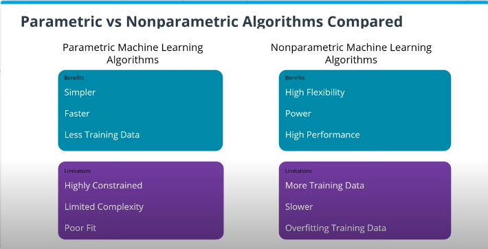

## Table of Contents

## What is non-parametric classification in machine learning?

Non-parametric classification in machine learning refers to a type of classification method that does not make strong assumptions about the underlying data distribution. Unlike parametric methods, which assume a specific form for the data's distribution and estimate parameters from this assumed model, non-parametric methods let the data speak for itself. This makes non-parametric approaches more flexible and adaptable to various types of data, especially when the data does not fit well into traditional parametric models.

A common example of a non-parametric classification method is the k-Nearest Neighbors (k-NN) algorithm. In k-NN, a new data point is classified based on the majority class of its k nearest neighbors in the training data. The distance between points can be calculated using various metrics, such as Euclidean distance. This method does not assume any underlying distribution of the data; instead, it relies on the actual data points to make predictions. This can be particularly useful in real-world scenarios where the data might be complex or not well understood.

Another advantage of non-parametric methods is their ability to handle high-dimensional data and adapt to local structures within the data. For instance, kernel density estimation can be used to estimate the probability density function of the data without assuming a specific distribution. This flexibility makes non-parametric classification a powerful tool in machine learning, particularly when dealing with datasets that do not conform to standard parametric assumptions.

## How does non-parametric classification differ from parametric classification?

Non-parametric classification and parametric classification are two different approaches in [machine learning](/wiki/machine-learning) that handle data in distinct ways. Parametric classification assumes that the data follows a specific distribution, like a normal distribution, and uses this assumption to build a model. This model has a fixed number of parameters that are estimated from the data, such as the mean and variance in a normal distribution. Once these parameters are estimated, the model can be used to classify new data points. For example, if we assume the data follows a normal distribution, we might use the formula $$P(x) = \frac{1}{\sqrt{2\pi\sigma^2}} e^{-\frac{(x-\mu)^2}{2\sigma^2}}$$ to model the probability of a data point $x$, where $\mu$ is the mean and $\sigma^2$ is the variance.

On the other hand, non-parametric classification does not make such assumptions about the data's distribution. Instead, it relies on the actual data to make predictions. A common method in non-parametric classification is the k-Nearest Neighbors (k-NN) algorithm. In k-NN, a new data point is classified based on the majority class of its k nearest neighbors in the training data. This method does not need to estimate any parameters from an assumed model; it simply uses the data itself to determine the classification. This makes non-parametric methods more flexible and capable of adapting to various types of data, especially when the true distribution of the data is unknown or complex.

In summary, the key difference between parametric and non-parametric classification lies in their approach to modeling the data. Parametric methods assume a specific model and estimate its parameters, which can be efficient but may fail if the data does not fit the assumed model. Non-parametric methods, conversely, do not assume a specific model and instead use the data directly, offering greater flexibility and the ability to handle complex, real-world data more effectively.

## What are some common non-parametric classification algorithms?

Some common non-parametric classification algorithms include k-Nearest Neighbors (k-NN), Decision Trees, and Kernel Density Estimation. k-NN is a simple yet powerful method where a new data point is classified based on the majority class of its k nearest neighbors. For example, if k is set to 5 and three out of the five nearest neighbors belong to class A, the new point will be classified as class A. This method does not assume any underlying distribution of the data; it just uses the actual data points to make predictions. Decision Trees work by splitting the data into branches based on different features, creating a tree-like structure where each leaf represents a class. They are flexible and can capture complex relationships in the data without making any assumptions about its distribution.

Kernel Density Estimation is another non-parametric approach used for classification. It estimates the probability density function of the data without assuming a specific distribution. This method can be particularly useful when dealing with data that does not fit well into traditional parametric models. For example, if we want to estimate the density of a dataset, we can use a kernel function like the Gaussian kernel $$K(u) = \frac{1}{\sqrt{2\pi}} e^{-\frac{u^2}{2}}$$. By summing up the contributions of each data point using this kernel, we can get a smooth estimate of the underlying density, which can then be used for classification purposes. These non-parametric methods are valuable because they adapt to the actual data, making them suitable for real-world applications where the data might be complex or not well understood.

## Can you explain how the k-Nearest Neighbors (k-NN) algorithm works for classification?

The k-Nearest Neighbors (k-NN) algorithm is a simple yet effective method for classifying new data points. When you want to classify a new point, k-NN looks at the k closest points in your training data. These closest points are called the "nearest neighbors." The algorithm then counts how many of these neighbors belong to each class. The new point gets classified into the class that has the most neighbors. For example, if k is set to 5 and three out of the five nearest neighbors are from class A, the new point will be classified as class A.

To find the nearest neighbors, k-NN uses a distance metric, like the Euclidean distance. The Euclidean distance between two points, let's say point A with coordinates (x1, y1) and point B with coordinates (x2, y2), can be calculated using the formula $$ \text{distance} = \sqrt{(x2 - x1)^2 + (y2 - y1)^2} $$. Once you have the distances, you pick the k points with the smallest distances. This method does not make any assumptions about the data's distribution, which makes it very flexible. It's like asking your neighbors for advice; if most of your nearby neighbors like a certain type of food, you might try that food too.

## What is the role of Gaussian Processes in non-parametric classification?

Gaussian Processes (GPs) are a type of non-parametric model used in machine learning for classification. Unlike traditional methods that assume a specific form for the data, GPs let the data itself guide the model. They do this by considering all possible functions that could fit the data and then weighting them based on how well they match the observed data. This approach allows GPs to be very flexible and capture complex patterns without making rigid assumptions about the data's distribution.

In classification, Gaussian Processes work by estimating the probability that a new data point belongs to a certain class. They do this by creating a function that maps the input data to a probability of being in a class. For example, if you want to classify whether an email is spam or not, a GP would look at features like the email's content and sender, and then use these to estimate the probability of the email being spam. The function used by the GP is not fixed but is instead learned from the data, making it a powerful tool for handling complex and varied datasets.

## How does Support Vector Machine (SVM) function as a non-parametric classifier?

Support Vector Machines (SVMs) can be used as non-parametric classifiers when they use a kernel trick. This means they don't assume a specific shape for the data. Instead, SVMs find the best way to separate different classes by drawing a line, or hyperplane, that keeps the classes as far apart as possible. This line is chosen so that the distance, or margin, between the line and the closest points from each class is maximized. These closest points are called support vectors. By using different kernels, like the Gaussian kernel $$K(x, x') = \exp\left(-\frac{\|x - x'\|^2}{2\sigma^2}\right)$$, SVMs can handle complex data shapes without assuming a specific form for the data.

In practice, SVMs work by transforming the data into a higher-dimensional space where it becomes easier to separate the classes. The kernel trick allows SVMs to do this transformation without actually calculating the coordinates in the new space, which saves a lot of computation. This makes SVMs very flexible and able to handle data that doesn't fit into simple shapes. By not making assumptions about the data's distribution, SVMs can adapt to various types of data, making them a powerful tool for non-parametric classification.

## What are the advantages of using non-parametric methods like k-NN and SVM over parametric methods?

Non-parametric methods like k-Nearest Neighbors (k-NN) and Support Vector Machines (SVM) offer several advantages over parametric methods. One key benefit is their flexibility. Parametric methods assume the data follows a specific shape, like a normal distribution, and use formulas to estimate this shape. Non-parametric methods, on the other hand, do not make these assumptions. They let the data itself guide the model. For example, k-NN classifies a new point by looking at its closest neighbors in the training data, without assuming any specific data distribution. This makes non-parametric methods better at handling real-world data, which often doesn't fit neatly into assumed shapes.

Another advantage of non-parametric methods is their ability to capture complex patterns. Parametric methods might struggle if the data has complicated relationships that don't fit their assumed model. SVMs, for instance, can use different kernels, like the Gaussian kernel $$K(x, x') = \exp\left(-\frac{\|x - x'\|^2}{2\sigma^2}\right)$$, to transform the data into a space where it's easier to separate classes. This flexibility allows SVMs to handle data that's not easily separated in its original form. Similarly, k-NN can adapt to local structures in the data, making it effective for datasets with varying densities or structures. This adaptability makes non-parametric methods a powerful choice for many classification tasks.

## Can you describe the MFF (Multi-Feature Fusion) approach in non-parametric classification?

The Multi-Feature Fusion (MFF) approach in non-parametric classification is a method that combines different types of data to make better predictions. Imagine you're trying to decide if a fruit is an apple or an orange. You might look at its color, shape, and smell. MFF takes all these different features and uses them together to classify the fruit more accurately. By using multiple features, MFF can capture more information about the data, which can lead to better results, especially when the data is complex or comes from different sources.

In practice, MFF can be used with algorithms like k-Nearest Neighbors (k-NN) or Support Vector Machines (SVM). For example, if you're using k-NN with MFF, you would calculate the distance between a new data point and the training data points using all the features. This could be done with a formula like $$ \text{distance} = \sqrt{(x2 - x1)^2 + (y2 - y1)^2 + (z2 - z1)^2} $$, where x, y, and z represent different features. By considering all these features together, k-NN can find the most similar neighbors and classify the new point more accurately. This approach helps to make the most out of the available data and can improve the performance of non-parametric classification methods.

## What is ZLaP and how does it improve upon traditional non-parametric classification methods?

ZLaP, which stands for Zero-shot Learning and Prediction, is a new way to do non-parametric classification. It's special because it can classify things even if it has never seen them before. Imagine you're trying to guess what kind of animal is in a picture, but you've only seen cats and dogs before. ZLaP can still take a good guess if the picture is of a horse, by using what it knows about other animals and their features. It does this by looking at a lot of different features all at once, kind of like how Multi-Feature Fusion works, but it goes a step further by using what it knows about one thing to help guess about something totally new.

ZLaP improves on traditional methods like k-Nearest Neighbors (k-NN) and Support Vector Machines (SVM) because it doesn't just rely on what it has seen before. Instead, it uses a smart way to guess about new things. For example, if ZLaP knows that cats have whiskers and dogs have a certain bark, it can use this information to help guess that a horse, which it has never seen, might have a mane or neigh. This makes ZLaP really good at handling new or unusual data, making it a powerful tool for classification tasks where you might encounter things you've never seen before.

## How does ZLaP* extend the capabilities of ZLaP in non-parametric classification?

ZLaP* takes the idea of ZLaP a step further by not only guessing about new things but also by learning from them as it goes along. Imagine you're trying to guess what kind of animal is in a picture. ZLaP can take a good guess even if it has never seen that animal before. But ZLaP* goes beyond that. If it guesses right, it remembers what it learned about that new animal and uses it to make even better guesses next time. This means ZLaP* can keep getting smarter and better at classifying things, even if they are totally new to it.

This ability to learn and adapt makes ZLaP* really useful for tasks where the data keeps changing or where you keep seeing new kinds of things. For example, if ZLaP* guesses that a picture is of a horse, and it turns out to be right, it will remember what a horse looks like. The next time it sees a picture of a horse, or even something similar like a pony, it will use what it learned to make a better guess. This makes ZLaP* a powerful tool for non-parametric classification because it can handle new and changing data better than traditional methods like k-Nearest Neighbors (k-NN) or Support Vector Machines (SVM).

## What are the computational challenges associated with scaling non-parametric classification algorithms like Gaussian Processes?

Gaussian Processes (GPs) are great for non-parametric classification because they can handle complex data without making strong assumptions. But they can be hard to use when you have a lot of data. The main problem is that GPs need to do a lot of calculations to figure out how all the data points relate to each other. This can take a long time and use a lot of computer memory, especially if you have thousands or millions of data points. For example, if you want to classify emails as spam or not spam, and you have a huge number of emails, a GP might take too long to process all of them.

To make GPs work better with big datasets, people have come up with some tricks. One common trick is called "sparse approximations." This means you use only a smaller set of the data points, called "inducing points," to do the calculations instead of using all the data. This can make the process faster and use less memory. Another trick is to use special math formulas that break down the big problem into smaller, easier pieces. For example, you might use a formula like $$K(x, x') = \exp\left(-\frac{\|x - x'\|^2}{2\sigma^2}\right)$$ to help the computer do the calculations more quickly. These methods help make GPs more practical for big datasets, but they still need careful tuning to work well.

## How can one evaluate the performance of non-parametric classification models, and what metrics are typically used?

To evaluate the performance of non-parametric classification models, you can use several common metrics that help you understand how well the model is doing. One popular metric is accuracy, which tells you the percentage of correct predictions out of all predictions made. For example, if your model correctly classifies 90 out of 100 emails as spam or not spam, its accuracy is 90%. Another useful metric is the confusion matrix, which shows you how many times the model got each class right or wrong. From the confusion matrix, you can calculate other important metrics like precision, which measures how many of the positive predictions were actually correct, and recall, which measures how many of the actual positive cases were correctly identified. The F1 score combines precision and recall into one number, giving you a balanced measure of the model's performance.

In addition to these basic metrics, you might also use the Receiver Operating Characteristic (ROC) curve and the Area Under the Curve (AUC). The ROC curve plots the true positive rate against the false positive rate at different classification thresholds, showing how well the model can distinguish between classes. The AUC is a single number that summarizes the ROC curve; a higher AUC means the model is better at telling the classes apart. For example, if your model's AUC is close to 1, it's doing a great job, but if it's close to 0.5, it's not much better than guessing. These metrics help you see different aspects of your model's performance and decide if it's good enough for your needs.

## References & Further Reading

[1]: Bishop, C. M. (2006). ["Pattern Recognition and Machine Learning."](https://www.cs.uoi.gr/~arly/courses/ml/tmp/Bishop_book.pdf) Springer.

[2]: Cover, T. M., & Hart, P. E. (1967). ["Nearest neighbor pattern classification."](https://ieeexplore.ieee.org/document/1053964) IEEE Transactions on Information Theory, 13(1), 21-27.

[3]: Shawe-Taylor, J., & Cristianini, N. (2000). ["Support Vector Machines and Other Kernel-based Learning Methods."](https://www.cambridge.org/core/books/an-introduction-to-support-vector-machines-and-other-kernelbased-learning-methods/A6A6F4084056A4B23F88648DDBFDD6FC) Cambridge University Press.

[4]: Rasmussen, C. E., & Williams, C. K. I. (2005). ["Gaussian Processes for Machine Learning."](http://gaussianprocess.org/gpml/chapters/RW.pdf) MIT Press.

[5]: Hastie, T., Tibshirani, R., & Friedman, J. (2009). ["The Elements of Statistical Learning."](https://link.springer.com/book/10.1007/978-0-387-84858-7) Springer Series in Statistics.

[6]: Duda, R. O., Hart, P. E., & Stork, D. G. (2000). ["Pattern Classification."](https://www.researchgate.net/publication/228058014_Pattern_Classification) Wiley-Interscience.