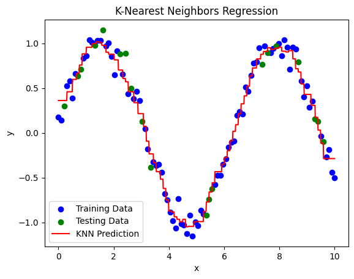

## Table of Contents

## What is non-parametric regression and how does it differ from parametric regression?

Non-parametric regression is a type of statistical method used to find patterns in data without making strict assumptions about the form of the relationship between variables. Unlike parametric regression, which assumes a specific functional form (like a straight line or a curve defined by a specific equation), non-parametric regression allows the data itself to determine the shape of the relationship. This makes it more flexible and useful when you're not sure what the relationship looks like or when the relationship is complex.

Parametric regression, on the other hand, uses a predefined mathematical model to describe the relationship between variables. For example, in simple linear regression, the relationship is modeled as $$ y = \beta_0 + \beta_1 x + \epsilon $$, where $$ \beta_0 $$ and $$ \beta_1 $$ are parameters estimated from the data, and $$ \epsilon $$ represents the error. The advantage of parametric regression is that it can be more straightforward to interpret and requires less data to achieve reliable results. However, it can be less accurate if the true relationship doesn't match the assumed model.

In summary, the key difference between the two lies in their approach to modeling: parametric regression assumes a specific form and estimates parameters within that form, while non-parametric regression lets the data shape the model without such assumptions. This makes non-parametric methods more adaptable but potentially more complex to interpret and compute.

## Can you explain the concept of a Gaussian Process in the context of non-parametric regression?

A Gaussian Process (GP) is a way to do non-parametric regression by treating the function we want to learn as a random process. Imagine you have a bunch of data points, and you want to predict what the function looks like between those points. A Gaussian Process helps you do this by assuming that any set of function values follows a multivariate normal distribution. This means that if you know some points on the function, you can make predictions about other points using the properties of normal distributions. The key to a Gaussian Process is the covariance function, also called the kernel, which describes how similar two points on the function are likely to be.

In practice, using a Gaussian Process involves choosing a kernel that reflects your beliefs about the function's behavior. For example, if you think nearby points on the function should have similar values, you might use a squared exponential kernel. Once you have your kernel, you can use the data to compute the mean and variance of the function at any new point. This gives you a way to predict the function's value at that point, along with a measure of uncertainty. The beauty of Gaussian Processes is that they can capture complex relationships in the data without assuming a specific form for the function, making them very flexible for non-parametric regression.

Here's a simple example of how you might use a Gaussian Process in Python with the `scikit-learn` library:

```python
from sklearn.gaussian_process import GaussianProcessRegressor
from sklearn.gaussian_process.kernels import RBF, ConstantKernel as C
import numpy as np

# Sample data
X = np.array([[1], [2], [3], [4], [5]])
y = np.array([3, 4, 5, 6, 7])

# Define the kernel
kernel = C(1.0, (1e-3, 1e3)) * RBF(10, (1e-2, 1e2))

# Create and fit the Gaussian Process
gp = GaussianProcessRegressor(kernel=kernel, n_restarts_optimizer=9)
gp.fit(X, y)

# Make predictions
X_test = np.array([[6]])
mean_prediction, std_prediction = gp.predict(X_test, return_std=True)

print(f"Predicted mean at x=6: {mean_prediction[0]}")
print(f"Predicted standard deviation at x=6: {std_prediction[0]}")
```

This code shows how to set up a Gaussian Process with a radial basis function (RBF) kernel, fit it to some data, and make predictions at new points.

## How does Support Vector Machine (SVM) regression work as a non-parametric method?

Support Vector Machine (SVM) regression is a non-parametric method that tries to find a function that fits the data as closely as possible, but with a twist. Instead of trying to fit the data exactly, SVM regression aims to keep the function as flat as possible while still staying within a certain distance from the data points. This distance is called the "epsilon-insensitive tube." The idea is to balance the trade-off between fitting the data well and keeping the function simple. The function can be linear or non-linear, depending on the kernel you choose. For example, if you use a radial basis function (RBF) kernel, the function can be very flexible and capture complex patterns in the data.

In SVM regression, the goal is to minimize a cost function that includes two parts: the flatness of the function and the errors outside the epsilon-insensitive tube. The flatness is controlled by a parameter called the regularization parameter, often denoted as $$ C $$. A smaller $$ C $$ makes the function flatter but may not fit the data as well, while a larger $$ C $$ allows the function to fit the data more closely but may result in a more complex function. The errors outside the tube are penalized, but only if they are larger than the epsilon value. This approach helps to avoid overfitting by not trying to fit every single data point perfectly, which is especially useful when dealing with noisy data.

## What is the k-Nearest Neighbors (k-NN) algorithm and how is it used in non-parametric regression?

The k-Nearest Neighbors (k-NN) algorithm is a simple but powerful method used in non-parametric regression. It works by looking at the 'k' closest data points to a new point where you want to make a prediction. Instead of fitting a specific equation to the data, k-NN uses the values of these nearby points to estimate the value at the new point. For example, if you want to predict a house price, k-NN would find the prices of the 'k' most similar houses and use those to estimate the price of the new house. The value of 'k' is chosen by the user and can affect how smooth or detailed the predictions are.

In non-parametric regression, k-NN can be used to predict continuous outcomes. When you want to predict a value at a new point, k-NN finds the 'k' closest data points and then calculates the average of their values. This average is used as the prediction for the new point. The distance between points can be measured in different ways, but a common method is the Euclidean distance. The choice of 'k' is important because a small 'k' can make the predictions very sensitive to noise in the data, while a large 'k' can make the predictions too smooth and miss important patterns. By adjusting 'k', you can balance the trade-off between fitting the data closely and keeping the predictions stable.

## How do Generalized Additive Models (GAMs) function in non-parametric regression?

Generalized Additive Models (GAMs) are a type of non-parametric regression that let you build a model by adding together different functions, each one focusing on a single predictor variable. Instead of assuming a simple straight line like in regular regression, GAMs use smooth functions that can capture more complex patterns in the data. These smooth functions can be things like splines, which are flexible curves that can bend and twist to fit the data better. By adding these smooth functions together, GAMs can model the relationship between the predictors and the outcome in a way that's more flexible than traditional parametric models.

In a GAM, you can think of the model as a sum of several parts, where each part is a smooth function of one of the predictor variables. For example, if you're trying to predict house prices based on size and age, a GAM might look like this: $$ \text{Price} = f_1(\text{Size}) + f_2(\text{Age}) + \text{Error} $$. Here, $$ f_1 $$ and $$ f_2 $$ are smooth functions that you estimate from the data. The advantage of GAMs is that they let you see how each predictor affects the outcome separately, which can be very helpful for understanding your data. Plus, because they're non-parametric, they don't force you to assume a specific shape for the relationship between variables, making them great for exploring complex data.

## What are Multi-Factor Energy Consumption (MFEC) models and their role in non-parametric regression?

Multi-Factor Energy Consumption (MFEC) models are used to understand how different factors affect energy use in buildings or other systems. These models look at things like the weather, how many people are in a building, and what kind of equipment is being used. Instead of assuming a simple formula for how these factors work together, MFEC models use non-parametric methods. This means they can capture complex patterns in the data without forcing it into a specific shape, making them very useful for figuring out energy use in real-world situations.

In non-parametric regression, MFEC models help by letting the data itself show how different factors influence energy consumption. For example, an MFEC model might show that energy use goes up more sharply on very hot days than on cooler days. By using smooth functions, like those in Generalized Additive Models (GAMs), MFEC models can represent these relationships without making strict assumptions. This makes them a powerful tool for energy analysts who need to understand and predict energy use based on multiple, often interacting, factors.

## Can you describe the Energy Based Process approach in non-parametric regression?

The Energy Based Process approach in non-parametric regression is a way to model how different factors affect energy use without making strict assumptions about the shape of the relationship. Imagine you're trying to predict how much energy a building will use based on things like the weather, the number of people inside, and the types of equipment being used. Instead of using a simple formula, this approach looks at the data and lets it show how these factors work together. It's like letting the data draw its own picture of how energy use changes, which can be really helpful when the relationships are complicated and not easy to put into a simple equation.

In this approach, you might use something called a kernel function to figure out how similar different situations are. For example, if today's weather is a lot like yesterday's, the kernel function helps the model see that and use yesterday's energy use to predict today's. The model then uses these similarities to make predictions without forcing the data into a specific shape. This makes the Energy Based Process approach very flexible and good at capturing the real-world complexities of energy use, which can change in unexpected ways depending on a lot of different factors.

## What is the Hybrid AWT method and how does it apply to non-parametric regression?

The Hybrid AWT method, or Hybrid Adaptive Wavelet Transform, is a way to do non-parametric regression that mixes different techniques to get better results. It uses something called wavelets, which are small waves that help break down data into different parts. By using wavelets, the Hybrid AWT method can capture both the big trends and the small details in the data. It's like using a zoom lens to look at a picture: you can see the whole thing at once, but also zoom in on the tiny parts that matter. This method is great for data that changes a lot or has sudden jumps, because it can adapt to these changes without needing a specific formula.

In non-parametric regression, the Hybrid AWT method helps by letting the data itself guide how the model works. Instead of assuming a simple straight line or curve, it uses the wavelets to find the best way to fit the data. This means the model can handle complex patterns and sudden changes without making strict assumptions. For example, if you're trying to predict how much electricity a building will use, the Hybrid AWT method can catch the big patterns like daily and weekly cycles, but also the sudden spikes when something unusual happens. This makes it a powerful tool for understanding and predicting data that doesn't follow a simple rule.

## How does the Non-Linear-Bounding-Function method work in non-parametric regression?

The Non-Linear-Bounding-Function method is a way to do non-parametric regression that uses a special kind of curve to fit the data. Instead of using a straight line or a simple curve, this method uses a non-linear function that can bend and twist to match the data better. Imagine you're trying to draw a line through a bunch of points, but the points are all over the place. A straight line might not work well, but a curve that can bend and twist can get much closer to all the points. This method is great for data that has complex patterns or sudden changes, because it can adapt to these changes without needing a specific formula.

In non-parametric regression, the Non-Linear-Bounding-Function method helps by letting the data itself guide how the curve is shaped. It uses a function that can be adjusted to fit the data as closely as possible, without making strict assumptions about what the relationship should look like. For example, if you're trying to predict how much energy a building uses based on the weather, this method can catch the big patterns like daily and weekly cycles, but also the sudden spikes when something unusual happens. This makes it a powerful tool for understanding and predicting data that doesn't follow a simple rule.

## Can you explain the 'Calculation of Price Graphs Reversal Point Using Average Regression Lines Method' in non-parametric regression?

The 'Calculation of Price Graphs Reversal Point Using Average Regression Lines Method' is a way to find important turning points in price graphs without using a specific formula. Imagine you're looking at a graph of stock prices over time. Instead of trying to fit a straight line or a simple curve to the data, this method uses average regression lines to find where the price might change direction. It's like drawing a bunch of lines through different parts of the graph and then seeing where they cross each other. This crossing point can tell you where the price might start going up or down, which is really helpful for people who trade stocks or other things.

In non-parametric regression, this method helps by letting the data itself show where the important changes happen. Instead of assuming a simple relationship between time and price, it uses the average of many small lines to find the reversal points. For example, if you're looking at a stock's price over a month, this method can help you see where the price might start to go up after going down, or vice versa. This makes it a useful tool for understanding and predicting changes in prices without needing a specific formula.

## What are the advantages and limitations of using non-parametric regression methods in machine learning?

Non-parametric regression methods offer several advantages in [machine learning](/wiki/machine-learning). They are very flexible and can capture complex patterns in data without making strict assumptions about the shape of the relationship between variables. This means they can adapt to data that changes a lot or has sudden jumps. For example, if you're trying to predict how much energy a building uses based on the weather, non-parametric methods can catch the big patterns like daily and weekly cycles, but also the sudden spikes when something unusual happens. They're also great for exploring data because they let the data itself guide how the model works, which can help you understand your data better.

However, non-parametric regression methods also have some limitations. They often need a lot more data to work well than parametric methods because they rely on the data to shape the model. If you don't have enough data, the model might not be able to capture the true relationship accurately. They can also be harder to interpret and explain to others because they don't use a simple formula like $$ y = mx + b $$. Instead, they might use complex functions or averages of many small lines, which can make it tricky to see exactly how each variable affects the outcome. This complexity can also make them slower to compute, especially with large datasets.

## How can one evaluate the performance of different non-parametric regression models?

To evaluate the performance of different non-parametric regression models, you can use several methods. One common way is to split your data into a training set and a test set. You use the training set to build your model, and then you use the test set to see how well the model predicts new data. A good way to measure how well the model is doing is to look at the mean squared error (MSE), which is the average of the squared differences between the predicted values and the actual values. The formula for MSE is $$ \text{MSE} = \frac{1}{n} \sum_{i=1}^{n} (y_i - \hat{y}_i)^2 $$, where $$ y_i $$ is the actual value, $$ \hat{y}_i $$ is the predicted value, and $$ n $$ is the number of observations. A smaller MSE means the model is doing a better job at predicting the data.

Another way to evaluate non-parametric regression models is to use cross-validation. This method involves dividing your data into several parts, or folds. You then train the model on all but one of these folds and test it on the remaining fold. You repeat this process, using each fold as the test set once, and then average the results. This helps you see how well the model performs across different parts of the data. You can also look at other metrics like the mean absolute error (MAE) or the coefficient of determination (R-squared) to get a fuller picture of how well your model is doing. By comparing these metrics across different models, you can choose the one that best fits your data and your needs.

## References & Further Reading

[1]: Rasmussen, C. E., & Williams, C. K. I. (2006). ["Gaussian Processes for Machine Learning."](https://www.scirp.org/reference/referencespapers?referenceid=1792317) MIT Press.

[2]: Bishop, C. M. (2006). ["Pattern Recognition and Machine Learning."](https://www.cs.uoi.gr/~arly/courses/ml/tmp/Bishop_book.pdf) Springer.

[3]: Hastie, T., Tibshirani, R., & Friedman, J. (2009). ["The Elements of Statistical Learning: Data Mining, Inference, and Prediction."](https://link.springer.com/book/10.1007/978-0-387-84858-7) Springer.

[4]: Murphy, K. P. (2012). ["Machine Learning: A Probabilistic Perspective."](https://www.cs.ubc.ca/~murphyk/MLbook/pml-toc-1may12.pdf) MIT Press.

[5]: James, G., Witten, D., Hastie, T., & Tibshirani, R. (2013). ["An Introduction to Statistical Learning: With Applications in R."](https://link.springer.com/book/10.1007/978-1-0716-1418-1) Springer.

[6]: Vapnik, V. N. (1998). ["Statistical Learning Theory."](https://link.springer.com/book/10.1007/978-1-4757-3264-1) Wiley.

[7]: Schölkopf, B., & Smola, A. J. (2002). ["Learning with Kernels: Support Vector Machines, Regularization, Optimization, and Beyond."](https://direct.mit.edu/books/monograph/1821/Learning-with-KernelsSupport-Vector-Machines) MIT Press.

[8]: Friedman, J. H., & Silverman, B. W. (1989). ["Flexible Parsimonious Smoothing and Additive Modeling."](https://sites.stat.washington.edu/courses/stat527/s14/readings/FriedmanSilverman1989.pdf) Technometrics, 31(1), 3-21.

[9]: Altman, N. S. (1992). ["An Introduction to Kernel and Nearest-Neighbor Nonparametric Regression."](https://www.tandfonline.com/doi/abs/10.1080/00031305.1992.10475879) The American Statistician, 46(3), 175-185.

[10]: Hastie, T., & Tibshirani, R. (1986). ["Generalized Additive Models."](https://www.jstor.org/stable/2245459) Statistical Science, 1(3), 297-310.