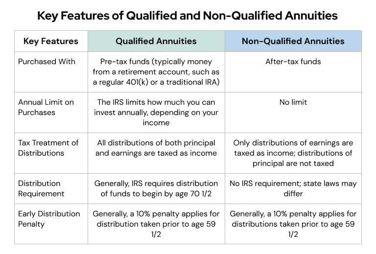

The landscape of investments is diverse and complex, influenced heavily by tax implications. This article provides a detailed examination of non-qualifying investments and their role in the broader investment ecosystem. Taxation is a critical factor affecting investment decisions, influencing how assets are allocated and managed.

Understanding the differences between qualifying and non-qualifying investments can significantly affect an investor's portfolio and tax strategy. Qualifying investments, such as those held within retirement accounts like 401(k)s or IRAs, typically benefit from tax deferral or exemption on earnings until withdrawal. In contrast, non-qualifying investments are made with after-tax dollars and do not enjoy such tax benefits. This distinction is crucial, as the tax treatment of investment gains can greatly impact overall returns.



We will walk through defining non-qualifying investments, providing examples, and examining their tax implications. These investments, which include assets such as real estate, collectibles, and certain securities, are taxed on gains annually. The strategic consideration of their tax treatment is essential for effective portfolio management.

Moreover, we will touch on the emerging trend of algorithmic trading and its impact on investment strategies. Algorithmic trading, which utilizes computer algorithms to execute trades at high speeds, is reshaping how investments are approached, offering both opportunities and challenges. Its role in managing and optimizing portfolios, including those containing non-qualifying assets, is increasingly significant in the modern financial landscape.

The aim is to equip readers with a comprehensive view of how various investment types interact with taxation policies, especially in the context of non-qualifying investments. A thorough understanding of these dynamics is vital for making informed investment decisions, optimizing tax efficiency, and leveraging emerging technologies like algorithmic trading to enhance portfolio performance. This article seeks to provide the necessary insights and tools to navigate these complexities effectively.

## Table of Contents

## Understanding Non-Qualifying Investments

Non-qualifying investments are financial assets that do not enjoy the advantages of tax-deferred or tax-exempt status, meaning they are subject to taxation on an ongoing basis. Typically financed with after-tax income, these investments are frequently maintained within tax-deferred accounts, plans, or trusts, allowing for growth and accumulation of gains. However, any gains realized, whether through interest, dividends, or appreciation, are liable to annual taxation.

Unlike their qualifying counterparts—such as stocks or bonds held within tax-advantaged accounts like 401(k)s or IRAs—non-qualifying investments do not offer the benefit of delaying tax payments to the future or enjoying tax-free growth. Instead, any income generated is immediately taxable, impacting the investment strategy and potential returns.

Common examples of non-qualifying investments include annuities, antiques, collectibles, jewelry, and real estate. Each type has distinct characteristics and implications for taxation:

1. **Annuities**: These investment vehicles consist of insurance contracts designed to pay out income and are quite popular for retirement savings, even though they do not typically qualify for tax-advantaged treatment unless held within a specific retirement account. They accumulate capital over time with tax-deferred growth, but withdrawals are taxed as ordinary income.

2. **Antiques and Collectibles**: Items like stamps, coins, art, or vintage vehicles fall under this category. They can appreciate significantly but are subject to a higher collectibles capital gains tax rate, often 28%, compared to the standard long-term capital gains rate applicable to other assets.

3. **Jewelry and Precious Metals**: These tangible assets can act as hedges against inflation, though they do not provide income and gains realized upon sale are taxable. The same collectible tax rate (28%) generally applies.

4. **Real Estate**: Holding real property as an investment can offer both cash flow from rent and potential appreciation. However, the gains derived when selling a property are subject to capital gains taxes, with specific exclusions and deferrals provided under certain conditions.

Understanding these distinctions is crucial for investors seeking to optimize their portfolios and tax strategies. Qualifying investments present opportunities for tax efficiency via income deferral and tax-free growth, while non-qualifying investments need careful consideration to mitigate their tax burden. Investors must navigate the landscape of investment taxation to align with their financial goals effectively, prioritizing the balance between risk, return, and tax liabilities.

## Investment Taxation: Key Considerations

Taxation significantly influences investment strategies, impacting the decision-making process of investors with varying financial objectives. Non-qualifying investments are those that do not offer tax-deferred or tax-exempt benefits, which results in annual taxes on any gains accrued, such as interest and appreciation. This can affect an investor's overall return on investment and necessitate a thorough understanding of the tax implications associated with these assets.

Qualifying investments, such as 401(k) plans, typically provide tax advantages, including tax-deferred growth and potential tax deductions on contributions, albeit within specific limits. For instance, the contribution limits for 401(k)s are set annually by the IRS and include catch-up contributions for individuals aged 50 and above. The benefit of tax deferral can be observed in a scenario where a $5,000 investment in a tax-deferred account grows at an annual rate of 5%. Assuming a tax rate of 20%, the tax-deferred account will compound without taxation on the gains until withdrawal, enabling a potentially greater accumulation of wealth compared to a non-tax-deferred scenario in which taxes on gains are paid annually.

In contrast, non-qualifying investments offer unique advantages and flexibility, such as having no maximum contribution limits. Investors can allocate substantial amounts of capital into these assets without the restrictions imposed on tax-advantaged accounts. However, understanding the taxation at the time of withdrawal becomes critical, particularly because the tax treatment varies with different income types generated from non-qualifying investments, such as dividends, interest, and capital gains.

Key considerations include the penalties associated with early withdrawals, which are generally more straightforward for qualifying investments due to the regulatory framework surrounding retirement accounts. For example, withdrawing from a 401(k) before the age of 59½ usually incurs a 10% penalty along with ordinary income taxes on the amount withdrawn. Conversely, non-qualifying investments do not impose similar penalties, thus offering more [liquidity](/wiki/liquidity-risk-premium) and access to funds, albeit at the expense of being taxed on annual gains.

In real-world scenarios, tax considerations can deeply influence investment decisions, dictating the timing and nature of transactions. For instance, an investor holding collectibles—a common non-qualifying investment—anticipates a particular tax liability associated with the capital gains tax upon selling the item. In certain jurisdictions, the capital gains tax on collectibles can be higher than for other asset classes, which might lead investors to reconsider their asset allocation strategy.

Overall, while non-qualifying investments offer flexibility, they also entail careful planning to mitigate tax burdens effectively. Informed investment strategies incorporate an understanding of both immediate tax consequences and the long-term impact on returns, taking into consideration the dynamic interplay between investment choices and tax policies.

## Examples of Non-Qualifying Investments

Non-qualifying investments encompass a diverse range of asset classes, each offering unique benefits and considerations critical for strategic financial planning. These investment types do not benefit from tax-deferred treatment, requiring investors to pay taxes on any income or gains annually. 

One prominent category within non-qualifying investments is tangible assets, such as antiques, jewelry, and art. These items hold intrinsic value and are often sought after for their historical significance and aesthetic appeal, potentially appreciating significantly over time. However, their market demand can be highly variable, influenced by trends and collector interest. Liquidity in these markets can be a challenge, as finding buyers may require time and a deep understanding of niche demographics.

Precious metals, including gold and silver, are another common non-qualifying investment. These assets are prized for their ability to act as an inflation hedge. Their value typically remains stable or increases in inflationary environments as they are perceived as safe-haven assets. Despite their stability, storage and insurance costs can be substantial, and price [volatility](/wiki/volatility-trading-strategies) due to economic and geopolitical factors can pose risks to investors.

Real estate is a tangible investment that offers potential for both income and appreciation. It provides an income stream through rentals and can appreciate over time due to market demand and improvements. However, real estate investments are subject to property taxes, management costs, and market fluctuations, which can impact their overall returns.

Over-the-counter (OTC) securities represent another category. These include stocks not listed on formal exchanges, which may provide unique opportunities for nimble investors willing to accept higher risk. OTC securities often involve smaller, less established companies that are more susceptible to market volatility, potentially offering high rewards but also greater risks.

Each non-qualifying investment type requires careful consideration of market dynamics and investor objectives. For instance, art and collectibles might see a surge in demand based on cultural trends, while precious metals may gain value during economic uncertainty. Practical historical examples include the art market boom of the late 1980s or the surge in gold prices during the 2008 financial crisis, demonstrating how economic conditions can dramatically affect performance.

Ultimately, non-qualifying investments play a crucial role in diversifying portfolios and safeguarding against inflation, despite lacking tax-deferred benefits. A strategic approach tailored to these unique asset classes can optimize financial outcomes in varying economic landscapes.

## Algorithmic Trading and Investment Strategies

Algorithmic trading leverages advanced computer programs to automate the trading of stocks and other financial assets. This approach has dramatically transformed investment strategies across various asset classes, including non-qualifying investments. At its core, [algorithmic trading](/wiki/algorithmic-trading) relies on predefined sets of instructions—algorithms—that execute trades at speeds and frequencies beyond human capability. This automation enables investors to capitalize on market opportunities in real-time, enhancing portfolio management efficiency.

### Basics of Algorithmic Trading

An algorithm in trading might be tasked with identifying specific market conditions and executing trades when those conditions are met. For instance, a simple algorithm might buy stocks when their 50-day moving average surpasses their 200-day moving average, a strategy commonly known as the "golden cross." Python provides a range of libraries, such as NumPy for numerical calculations and pandas for data manipulation, which can be used to design and implement such trading algorithms. A basic outline of a Python script for this strategy might look as follows:

```python
import pandas as pd

# Assuming 'data' is a DataFrame with historical stock prices
data['50_MA'] = data['Close'].rolling(window=50).mean()
data['200_MA'] = data['Close'].rolling(window=200).mean()

# Define a buy condition
data['Signal'] = 0
data.loc[data['50_MA'] > data['200_MA'], 'Signal'] = 1
```

### Optimization of Investment Portfolios

Algorithmic trading holds significant potential for optimizing investment portfolios by enabling dynamic rebalancing and diversification strategies. For non-qualifying investments, such as real estate or precious metals—which might not benefit from the same tax arrangements or liquidity as stocks—algorithms can provide an efficient mechanism for timing entry and [exit](/wiki/exit-strategy) points, thereby enhancing returns and minimizing risks.

### Benefits and Risks

The primary advantages of algorithmic trading include its speed, precision, and ability to process vast datasets to make informed decisions. Algorithms can react to market changes faster than any human trader, reducing latency and potentially improving trade execution prices. Additionally, by eliminating human emotion from trading, algorithms can adhere more strictly to pre-defined strategies.

However, algorithmic trading is not without risks. Technical glitches or errors in the code can lead to significant trading losses, as seen in historical incidents like the 2010 Flash Crash. Furthermore, the high-speed nature of algorithmic trading can exacerbate market volatility and result in liquidity issues, particularly in less liquid asset classes like certain non-qualifying investments.

### Regulatory Considerations

Regulatory bodies worldwide have recognized the critical impact of algorithmic trading on financial markets and have implemented measures to govern its use. The European Union's Markets in Financial Instruments Directive (MiFID II) and the United States' Securities and Exchange Commission have established guidelines requiring stringent testing and monitoring of trading algorithms. These regulations mandate that firms must implement "kill switches" and other safeguards to mitigate systemic risks associated with automated trading activities.

In conclusion, while algorithmic trading offers substantial benefits in optimizing investment strategies, especially for non-qualifying assets, investors must remain vigilant about the associated risks and regulatory obligations. Balancing automation benefits with prudent risk management is crucial for leveraging algorithmic trading effectively in today's dynamic financial markets.

## Conclusion

Understanding non-qualifying investments is pivotal for investors aiming to make strategic financial decisions. Their tax implications, potential for growth, and market dynamics are distinct from qualifying investments and require careful consideration. This article has underscored the significant effect of tax policies on investment choices, highlighting the need for a strategic approach that aligns with individual financial goals. Non-qualifying investments often offer greater flexibility and variety but come with the complexity of annual taxation on gains. These aspects can influence an investor's decision-making process significantly.

Moreover, the rise of algorithmic trading provides new opportunities to enhance returns and manage risks effectively. Through high-speed transactions and data-driven analytics, algorithmic trading can be utilized to optimize portfolios, including those comprising non-qualifying investments. However, it's essential to navigate the risks associated with such trading, including technical errors and regulatory scrutiny.

In conclusion, making informed investment decisions requires a comprehensive understanding of financial objectives and the overall tax environment. By evaluating these elements, investors can enhance their financial strategies, ensuring they are well-equipped to handle the challenges and opportunities presented by both non-qualifying investments and modern trading technologies.

## References & Further Reading

[1]: Marcos Lopez de Prado. ["Advances in Financial Machine Learning."](https://www.amazon.com/Advances-Financial-Machine-Learning-Marcos/dp/1119482089) Wiley, 2018.

[2]: David Aronson. ["Evidence-Based Technical Analysis: Applying the Scientific Method and Statistical Inference to Trading Signals."](https://www.amazon.com/Evidence-Based-Technical-Analysis-Scientific-Statistical/dp/0470008741) Wiley, 2006.

[3]: Stefan Jansen. ["Machine Learning for Algorithmic Trading."](https://github.com/stefan-jansen/machine-learning-for-trading) Packt Publishing, 2020.

[4]: Ernest P. Chan. ["Quantitative Trading: How to Build Your Own Algorithmic Trading Business."](https://www.amazon.com/Quantitative-Trading-Build-Algorithmic-Business/dp/0470284889) Wiley, 2008.

[5]: U.S. Securities and Exchange Commission. ["Algorithmic Trading."](https://www.sec.gov/files/Algo_Trading_Report_2020.pdf) SEC Spotlight.

[6]: MarketWatch. ["Understanding the Tax Implications of Investment Income."](https://www.marketwatch.com/story/filing-your-taxes-watch-out-for-these-red-flags-in-your-investing-tax-forms-3a532d2f) 

[7]: Investopedia. ["Non-Qualifying Investment."](https://www.investopedia.com/terms/n/non-qualifying-investment.asp) 