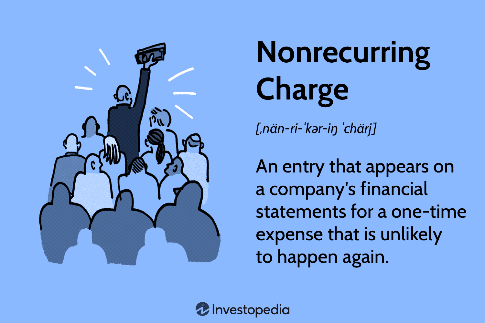

In the complex world of finance, understanding the intricacies of different accounting terms and financial charges is pivotal, particularly in algorithmic trading. This article examines the concept of non-recurring charges and their significance in the financial world, especially within the framework of automated trading systems. Non-recurring charges, often appearing as one-time expenses on financial statements, can vastly impact financial analysis and decision-making processes. As financial markets increasingly rely on automation, comprehending how these charges are classified and managed becomes essential for maintaining financial accuracy and strategic planning.

Non-recurring charges represent expenses that are not anticipated to recur regularly. Examples include costs related to restructuring, asset impairments, or legal settlements. These charges can significantly skew a company's financial health assessment if not properly adjusted for in analyses. For example, restructuring costs are typically incurred during strategic realignments and are not reflective of ongoing operational expenses. If analysts fail to adjust for such charges, it may appear as though a company's recurring profitability is lower than it truly is.



In algorithmic trading, accurate classification and management of non-recurring charges are paramount. These trading systems depend on historical data and performance metrics to develop profitable strategies. Mistakenly incorporating non-recurring charges as typical operating expenses can lead to flawed predictions and suboptimal trading decisions. As a result, algorithmic traders must ensure precise identification and separation of these extraordinary charges from regular financial data.

As the scope of this article unfolds, we will explore the nature of these charges, their impact on financial performance, and their role in algorithmic trading. This understanding will aid in maintaining a clear and precise financial outlook, critical for developing adaptable trading operations in the ever-evolving financial landscape.

## Table of Contents

## Understanding Non-Recurring Charges

Non-recurring charges are specific types of expenditures that emerge sporadically in a company's financial records, typically linked to unforeseen events or single-instance situations. These charges differ from regular or recurring expenses, which consistently appear in financial operations. Their sporadic nature necessitates meticulous review and adjustment in financial analysis processes, as they have the potential to substantially impact a company’s reported finances.

Common examples of non-recurring charges include restructuring costs, asset impairments, and expenditures resulting from extraordinary circumstances such as natural disasters or legal liabilities. For illustrative purposes, restructuring costs may arise when a company reorganizes its operations or workforce structure. Asset impairments could occur if there is a significant decline in the recoverability of an asset's value. Legal fees classified as non-recurring might result from major litigation or regulatory settlements.

The accurate assessment of these charges is imperative for presenting a realistic view of a company’s financial situation and operational efficiency. When analyzing a company's financial health, it is essential to distinguish between routine operational expenses and non-recurring charges, as the latter can distort the true operational performance. Incorrectly interpreting these figures can skew profitability estimates and lead to misguided decisions if the temporary financial impacts are perceived as continuous operational inefficiencies.

To effectively analyze non-recurring charges, financial analysts may adjust financial statements by excluding such charges when evaluating a company's operational performance. For instance, while evaluating earnings before interest and taxes (EBIT), non-recurring charges might be subtracted to gain a clearer insight into the company's core operating earnings. This exclusion can reflect what is termed as adjusted EBIT, providing a sharper focus on ongoing operations:

$$
\text{Adjusted EBIT} = \text{EBIT} + \text{Non-recurring Charges}
$$

The objective is to avoid inflating or understating the company's [earning](/wiki/earning-announcement) power by factoring in anomalies that have no bearing on future financial expectations. In conclusion, distinguishing and properly accounting for non-recurring charges enhances the accuracy and transparency of financial reporting, thus leading to sound strategic decision-making.

## The Financial Impact of Non-Recurring Charges

Non-recurring charges present distinct challenges when analyzing a company's financial health due to their atypical nature. These charges can cause pronounced distortions in income and expense reports, presenting an uneven picture of a company's financial performance over a specific period. Unlike recurring expenses, which are predictable and constant, non-recurring charges are often sudden and significant, making them critical to discern and adjust accordingly.

The presence of non-recurring charges complicates financial forecasting and valuation processes. Investors and stakeholders depend heavily on financial reports to formulate strategic decisions, and unexpected, large expenditures can cloud the judgment of a company's financial trajectory. Accurately identifying and accounting for these charges are essential steps in presenting a transparent view into an organization's genuine operational performance. 

Forecasting future earnings or profitability hinges upon the handling of these non-recurring charges. By understanding which expenses are unlikely to recur, analysts can create models that better align with the company's core operational activities. Consider the equation for adjusted net income, excluding non-recurring charges:

$$
\text{Adjusted Net Income} = \text{Net Income} + \text{Non-Recurring Charges}
$$

This formula allows analysts to separate and isolate non-recurring expenses, offering clarity on what would be the financial outcome under normal operational circumstances. Such adjustments are pivotal in ensuring an accurate representation of the company's profitability and financial health without the noise induced by unusual, one-off events.

Moreover, the accurate identification of non-recurring charges is vital to prevent these temporary setbacks from being construed as ongoing issues. For instance, a natural disaster leading to one-time damages could be misleadingly interpreted as poor operational performance if not properly classified. Thus, distinguishing these charges from regular business fluctuations is not only a matter of numerical accuracy but also strategic clarity.

When integrating non-recurring charges into financial assessments, transparency is paramount for fostering investor trust. This involves detailed documentation and explanation of these charges in financial statements, enabling stakeholders to make informed decisions based on a complete understanding of a company's financial status.

## Expense Classification in Algorithmic Trading

In [algorithmic trading](/wiki/algorithmic-trading), precise classification of expenses as recurring or non-recurring is crucial for effective strategy formulation and risk management. Recurring expenses are predictable and regularly occurring costs, such as software subscription fees or salaries for IT staff. In contrast, non-recurring charges are typically unexpected and infrequent, for instance, costs stemming from legal disputes or system upgrades. Despite their rarity, non-recurring expenses can notably affect financial outcomes, potentially skewing the perception of profitability and stability. Recognizing these distinct categories is imperative for developing accurate financial forecasts and models, which are integral to algorithmic trading systems.

Algorithmic trading systems, relying heavily on data and predictive modeling, necessitate precise expense classification to maintain robust financial forecasting. Misclassification can lead to faulty predictions, ultimately affecting strategy success. Automated systems that classify expenses can reduce errors and enhance the resilience of trading strategies. These systems utilize algorithms that flag unusual transactions as potential non-recurring expenses, allowing traders to adjust models accordingly. For example, consider the following simplified Python code snippet to automate non-recurring expense detection:

```python
def classify_expense(amount, threshold=10000):
    # Assume expenses above a threshold are non-recurring
    if amount >= threshold:
        return "Non-recurring"
    else:
        return "Recurring"

expenses = [5000, 15000, 2000, 12000]
classified_expenses = [classify_expense(expense) for expense in expenses]

print(classified_expenses)  # Output: ['Recurring', 'Non-recurring', 'Recurring', 'Non-recurring']
```

This streamlined classification enriches strategy development by enabling clearer distinction between operational costs and irregular disruptions. Achieving this differentiation fortifies trading models against unexpected shifts, ensuring they remain resilient and profitable over time. Furthermore, advanced [machine learning](/wiki/machine-learning) techniques can further refine expense classification, dynamically adapting to changing financial patterns and improving algorithmic sensitivity to cost variations.

By embedding these practices within algorithmic trading frameworks, organizations can better assess financial health, effectively managing risk while enhancing strategy precision and reliability in volatile markets.

## Managing Financial Charges Effectively

Effective management of financial charges, including non-recurring expenses, plays a critical role in maintaining financial stability and achieving organizational objectives. A key component of this management involves strategic budgeting and forecasting. By leveraging advanced financial management systems, organizations can enhance their ability to anticipate and mitigate the impacts of unexpected financial charges. These systems provide robust tools for modeling various financial scenarios, which can aid in planning for potential non-recurring expenses.

Incorporating regular audits into financial management practices is another essential element. Audits ensure that financial records are accurate and transparent, providing stakeholders with a true representation of the company's fiscal health. Technology, particularly automated expense tracking solutions, can significantly enhance these audits. Using such technology reduces human errors and provides real-time insights into financial transactions, contributing to more accurate forecasting and better financial decision-making.

In algorithmic trading, the integration of automated tools and methods is critical for refining trading strategies. These technologies must be adept at distinguishing between recurring and non-recurring expenses to optimize trading strategies effectively. By incorporating sophisticated algorithms and machine learning techniques, trading systems can better analyze and interpret financial data. This process includes the identification of non-recurring charges, which helps in modifying trading strategies to be both profitable and resilient.

Automation in expense classification can play a crucial role in identifying financial deviations promptly. For instance, Python, with its extensive libraries like Pandas and NumPy, provides powerful tools for data analysis and automation in financial charges management. Here's a simple Python example of processing financial data to identify non-recurring charges:

```python
import pandas as pd

# Sample data
data = {
    'Date': ['2023-01-01', '2023-02-01', '2023-03-01'],
    'Expense_Type': ['Recurring', 'Non-Recurring', 'Recurring'],
    'Amount': [1000, 5000, 1000]
}

# Create a DataFrame
df = pd.DataFrame(data)

# Identify and separate non-recurring charges
non_recurring = df[df['Expense_Type'] == 'Non-Recurring']

print("Non-Recurring Charges:")
print(non_recurring)
```

This example demonstrates the use of a basic DataFrame to track and identify non-recurring expenses, which can be expanded into more complex systems that automatically update and analyze financial data. By implementing such automated solutions, organizations and traders can ensure their financial strategies remain robust and adapt to unexpected financial disruptions.

## Conclusion

Classifying and managing non-recurring charges accurately is essential for maintaining a precise financial outlook, especially in the rapidly changing landscape of algorithmic trading. These charges, although not frequent, have a significant impact on financial reporting and strategy development. Their presence can skew the perception of a company's financial health if not properly adjusted, necessitating meticulous attention to detail in financial analysis.

For traders, effectively incorporating expense classification into their algorithms can provide a substantial competitive advantage. By accurately recognizing and adjusting for non-recurring charges, traders can ensure that their financial models more accurately predict true operational performance. This ability allows for the development of more profitable and adaptable trading strategies that can withstand the unpredictable nature of financial markets.

As financial environments continue to evolve, mastering the identification and management of non-recurring charges becomes increasingly critical. The ability to discern these charges and adjust business strategies accordingly is key to sustainable growth and operation. Automated systems and intelligent algorithms that can adapt to these financial nuances will likely lead the charge in maintaining robust and resilient trading operations.

## References & Further Reading

[1]: Bergstra, J., Bardenet, R., Bengio, Y., & Kégl, B. (2011). ["Algorithms for Hyper-Parameter Optimization."](https://dl.acm.org/doi/10.5555/2986459.2986743) Advances in Neural Information Processing Systems 24.

[2]: ["Advances in Financial Machine Learning"](https://www.amazon.com/Advances-Financial-Machine-Learning-Marcos/dp/1119482089) by Marcos Lopez de Prado

[3]: ["Evidence-Based Technical Analysis: Applying the Scientific Method and Statistical Inference to Trading Signals"](https://www.amazon.com/Evidence-Based-Technical-Analysis-Scientific-Statistical/dp/0470008741) by David Aronson

[4]: ["Machine Learning for Algorithmic Trading"](https://github.com/stefan-jansen/machine-learning-for-trading) by Stefan Jansen

[5]: ["Quantitative Trading: How to Build Your Own Algorithmic Trading Business"](https://www.amazon.com/Quantitative-Trading-Build-Algorithmic-Business/dp/1119800064) by Ernest P. Chan