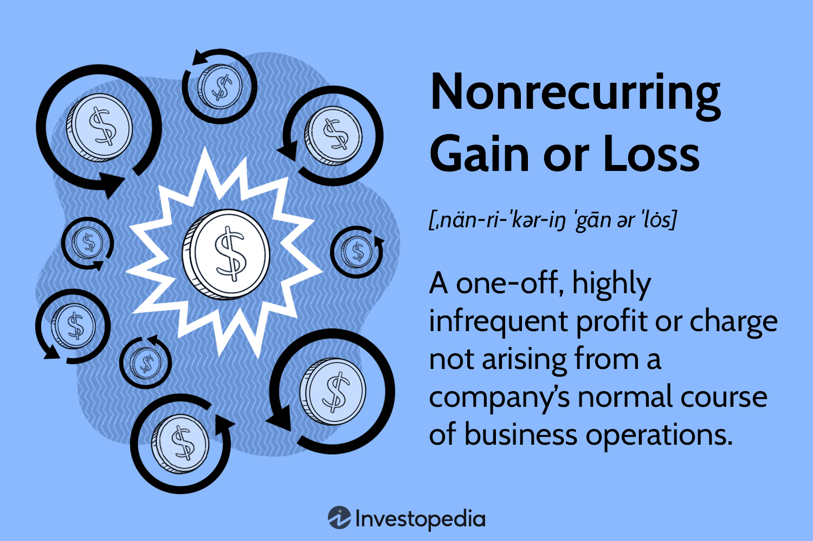

Financial accounting is a fundamental component of business operations, encompassing the systematic process of recording, summarizing, and reporting financial transactions. This structured approach ensures that stakeholders have access to reliable and timely financial information, crucial for making informed decisions. A pivotal aspect of financial accounting is the accurate representation of non-recurring gains and losses. These financial transactions are characterized by their infrequent nature and lack of association with a company’s standard business activities. Examples of non-recurring items include gains from the sale of a subsidiary or losses due to natural disasters. 

Non-recurring gains and losses hold significant importance because they can obscure the true operational performance of a company. When these items are recorded without distinction, they can distort financial statements and mislead investors or analysts trying to gauge the company's routine profitability and operational efficiency. Consequently, these items are typically reported separately within financial statements. This segregation allows for a clearer presentation of the company's ongoing operations, facilitating a more precise analysis of its core business activities.



In addition to their impact on accounting, non-recurring gains and losses also intersect with the domain of algorithmic trading. This form of trading, which leverages complex algorithms to execute trades at high speed and volume, depends heavily on precise financial data. The presence of non-recurring items can inject volatility and anomalies into the financial metrics that these algorithms evaluate. Therefore, understanding the nature and impact of non-recurring gains and losses is vital for developing robust algorithmic trading strategies that correctly interpret financial data and guide trading decisions.

This article aims to examine the intricacies of non-recurring gains and losses, analyze their influence on financial statements, and discuss their relevance in algorithmic trading environments. By highlighting these elements, the article seeks to provide readers with a comprehensive understanding of how these factors play a critical role in both financial reporting and advanced trading systems.

## Table of Contents

## Understanding Non-Recurring Gains and Losses

Non-recurring gains and losses refer to those financial transactions that occur outside the normal operational activities of a business. They are considered atypical due to their infrequent or unusual nature, distinguishing them from the regular revenue and expense streams that the company experiences. These transactions might stem from various events or circumstances that are not part of the day-to-day transactions. 

Common examples of non-recurring items include litigation charges, which are one-time legal expenses or settlements that a company might have to pay or receive. Restructuring costs also fall into this category, encompassing expenses that arise from reorganizing and streamlining company operations to enhance efficiency. Profits realized from the sale of assets, such as selling property, plant, or equipment that the company no longer requires or that yields a financial benefit, are also categorized as non-recurring gains.

The separate reporting of non-recurring gains and losses in financial statements serves an essential purpose. By distinguishing these items from regular operational activities, companies provide a more accurate and meaningful representation of their ongoing financial performance. For example, if a company reports a significant gain from the sale of a building, this should not be combined with its regular sales revenue, as it would distort the true picture of its operational effectiveness.

To encapsulate these impacts clearly and effectively, non-recurring items are typically disclosed either on a separate line in the income statement or through detailed notes in the financial statements. This practice aligns with accounting standards aimed at enhancing transparency, allowing investors, analysts, and stakeholders to adjust their evaluations and predictions regarding the company's future operational performance without being misled by anomalies that do not reflect the core business's health and sustainability.

## Impact on Financial Statements

Non-recurring items can have a profound impact on a company's net income and its perceived financial health. These items, by their unusual nature and infrequency, can cause significant fluctuations in financial results from one period to another. When these items are large, they can obscure the company's operational performance, leading to distorted views of its long-term profitability and stability.

The primary impact of non-recurring items is seen in the calculation of net income. For instance, a significant profit from the sale of an unused asset or a substantial charge from a legal settlement can either inflate or deflate net income for that reporting period. As a result, using this figure without adjustments can mislead stakeholders about the ongoing profitability of the company. Therefore, analysts typically adjust net income to exclude these items for a more accurate representation of operational performance.

In the context of earnings per share (EPS) calculations, analysts often make adjustments to exclude non-recurring items. EPS is a critical metric used by investors to assess a company's profitability on a per-share basis. The formula for calculating EPS is:

$$
\text{EPS} = \frac{\text{Net Income} - \text{Preferred Dividends}}{\text{Average Outstanding Shares}}
$$

If non-recurring items are included in the net income used in this calculation, it could lead to an EPS that is not reflective of the company's true earnings power. To provide a clearer picture, companies might report an adjusted EPS, which excludes the effects of these items. This adjusted metric allows investors and financial analysts to evaluate an entity's performance without the noise introduced by irregular events.

Understanding the impact of non-recurring items helps investors and analysts make better predictions about a company’s future performance. By adjusting financial metrics to account for these aberrations, stakeholders can focus on the underlying trends and assess the company's operational efficacy and financial trajectory without the distortions caused by these infrequent events. This approach leads to more informed decision-making, better valuation models, and ultimately, sound investment decisions.

## Non-Recurring Items and Algorithmic Trading

Algorithmic trading is a sophisticated method of executing orders using automated pre-programmed trading instructions based on variables such as time, price, and [volume](/wiki/volume-trading-strategy). It significantly relies on data accuracy and consistency. Non-recurring items, which are infrequent or unusual financial transactions not tied to normal business activities, can disrupt this accuracy by introducing [volatility](/wiki/volatility-trading-strategies) into financial analysis. Consequently, traders using algorithmic systems must devise ways to account for these anomalies to prevent decisions grounded on distorted earnings figures.

Non-recurring gains and losses can obscure the true operational performance of a company, making it challenging for algorithmic traders to ascertain a company's consistent earnings potential. If non-recurring items are mistakenly considered as part of regular earnings in trading algorithms, it can result in misleading analyses and suboptimal trading strategies. For instance, a one-time gain from asset sales, if not adjusted for, could artificially inflate the perceived profitability of a company within the algorithm's analysis framework.

To mitigate these risks, traders can implement several strategies to adjust their algorithms. One approach is to design the algorithm to parse and extract the relevant sections from financial statements and footnotes where companies disclose non-recurring items. By programmatically identifying these items, algorithms can be adjusted to exclude them from core earnings calculations. 

In Python, this might involve using a combination of libraries like Pandas for data manipulation and Natural Language Processing (NLP) techniques for parsing text data. For example, an algorithm could use the following pseudocode to adjust earnings calculations:

```python
import pandas as pd

# Assume 'financial_data' is a DataFrame containing financial statement data
def adjust_for_nonrecurring(financial_data):
    # Identify non-recurring items
    non_recurring = financial_data.loc[financial_data['item'].str.contains('non-recurring|extraordinary', case=False)]

    # Calculate adjusted earnings
    adjusted_earnings = financial_data['net_income'] - non_recurring['amount'].sum()

    return adjusted_earnings

# Example usage
adjusted_earnings = adjust_for_nonrecurring(financial_data)
```

Moreover, [machine learning](/wiki/machine-learning) models can be trained to classify and adjust these items over time, incorporating historical data to improve the precision of adjustments. This approach allows algorithms to dynamically learn and improve their filtering mechanisms, ensuring that the strategies remain aligned with true operational performance rather than being swayed by transient and irregular financial events.

By carefully addressing non-recurring items, algorithmic traders can enhance the robustness of trading strategies, thereby fostering more reliable and effective capital market activities.

## Recording and Reporting Standards

The Financial Accounting Standards Board (FASB) establishes guidelines that mandate the clear reporting of non-recurring items in financial statements. These guidelines are crucial to ensure that investors and analysts receive an accurate representation of a company's financial performance, free from the distortions that can be caused by irregular transactions. To facilitate transparency, companies are required to disclose non-recurring items separately, usually in the footnotes of their financial statements. This delineation is designed to prevent these atypical gains or losses from skewing the perceived consistency of earnings, which is essential for evaluating a company's operational effectiveness.

For instance, the FASB stipulates that any gains or losses from discontinued operations must be separately reported, along with any related tax effects. This requirement allows for a clearer differentiation between regular operational earnings and those derived from non-recurring events. To comply with these regulations, entities often provide detailed descriptions of each significant non-recurring item, explaining its nature and the reasons for its occurrence. Such disclosures help stakeholders assess whether the reported earnings truly reflect the company's ongoing business performance.

The practice of clearly identifying and documenting non-recurring items enhances the reliability of financial analysis and forecasting. By highlighting these irregularities, organizations enable analysts to adjust their assessment models more accurately, stripping out the noise introduced by such events. This approach supports better decision-making regarding the company's future prospects. Additionally, transparent reporting aligned with FASB standards fosters trust among investors, as it signals a commitment to full disclosure and ethical accounting practices.

## Distinguishing Non-Recurring Items from Extraordinary Items

Non-recurring items and extraordinary items have historically been separated in financial reporting, but they possess distinct definitions and implications that influence how financial statements are analyzed. Historically, U.S. Generally Accepted Accounting Principles (GAAP) differentiated between these two categories. Non-recurring items are those financial events that are unusual or infrequent, yet can reasonably be expected to occur more than once over the foreseeable future of a company. These include instances like the sale of a business unit or significant restructuring costs.

In contrast, extraordinary items were defined by U.S. GAAP as both unusual in nature and infrequent in occurrence. Examples might have included damages from a natural disaster in an area where such events are rare. However, following convergence efforts with International Financial Reporting Standards (IFRS), as of 2015, the U.S. GAAP has eliminated the concept of extraordinary items, aligning more closely with IFRS, which does not recognize extraordinary items as a distinct category within financial statements ([FASB, 2015](https://www.fasb.org)).

This distinction is pivotal in financial reporting and analysis since both non-recurring and extraordinary items can alter a company's bottom line, affecting net income and misleading stakeholders if not accounted for properly. Prior to this convergence, the ascertainment and presentation of extraordinary items required clear delineation on income statements to prevent them from skewing perceptions of a company’s regular operating performance. With the elimination of extraordinary items, companies are now required to include such events in the standard income statement as part of continuing operations, albeit with detailed disclosures when necessary.

For financial analysts and investors, understanding these changes is crucial. Accurate financial analysis relies on the distinction between regular profit and loss generators and those anomalies which should not be anticipated as part of ongoing operational results. This comprehension assists in developing more accurate performance forecasts and valuation models, ensuring that any anomalies do not unduly influence decision-making processes. Analysts must be diligent, employing critical scrutiny to identify any impactful non-recurring items and adjusting analyses accordingly to reflect a genuine picture of company performance.

## Special Considerations for Investors and Analysts

Investors and analysts must pay close attention to a company's financial reports to accurately interpret the effects of non-recurring gains and losses. These items have the potential to significantly skew a firm's financial health, as they are not indicative of the company's core operational performance. A company might report high net income due to a large one-time asset sale, but this does not necessarily reflect future earnings potential. Therefore, failing to adjust for such items can lead to misconceptions when assessing the company's financial standing.

The concept of creative accounting further complicates this analysis. Creative accounting entails legally manipulating financial entries to present a more favorable picture of the company's financial position or to meet specific financial goals. This may involve strategic timing of the recognition of revenues or expenses, thus impacting the appearance of non-recurring items on financial statements. While such practices are within legal boundaries, they can obscure the true financial state of a company, making it essential for investors to critically appraise whether figures accurately reflect sustainable operational performance.

As a tool for investors and analysts, adjusted earnings metrics can provide a clearer view by excluding non-recurring items. Commonly adjusted metrics include adjusted net income or adjusted earnings before interest, taxes, depreciation, and amortization (EBITDA). The formula for adjusted net income is as follows:

$$
\text{Adjusted Net Income} = \text{Net Income} - \text{Non-Recurring Gains} + \text{Non-Recurring Losses}
$$

Analysts frequently use these adjusted figures to devise more reliable financial models and forecasts. Additionally, software tools and programming languages such as Python can assist in automating the adjustment process. For instance, a basic Python function could iterate through financial data to exclude non-recurring items:

```python
def calculate_adjusted_net_income(net_income, gains, losses):
    return net_income - gains + losses

# Example usage
net_income = 1000000  # Example net income
non_recurring_gains = 250000  # Example non-recurring gains
non_recurring_losses = 100000  # Example non-recurring losses

adjusted_income = calculate_adjusted_net_income(net_income, non_recurring_gains, non_recurring_losses)
print(f"Adjusted Net Income: {adjusted_income}")
```

This simple function demonstrates how adjustments can be systematically applied to financial metrics, enabling investors and analysts to derive clearer insights from a company's financial statements. Recognizing and accounting for non-recurring items is indispensable for maintaining accurate and realistic evaluations of a company's financial health.

## Conclusion

Non-recurring gains and losses are essential components for comprehending a company's financial performance comprehensively. They provide insights into the events and transactions that do not occur during regular business cycles but can nevertheless have significant short-term impacts on financial statements. Properly accounting for these items enables a more precise evaluation of an entity's true operational efficiency and financial condition.

For accurate valuation models, non-recurring items must be carefully analyzed and adjusted for, as they can distort earnings reports and financial metrics such as the earnings per share (EPS). An accurate analysis involves excluding these items to understand the consistent [earning](/wiki/earning-announcement) power of a company. Investors and analysts who incorporate these adjustments tend to form more reliable forecasts about a firm’s prospective performance, thereby facilitating informed investment decisions.

Algorithmic trading systems, which rely on precise and consistent data, must integrate mechanisms to account for the anomalies introduced by non-recurring gains and losses. By incorporating logic in their algorithms to segregate these non-recurring items from routine financial data, traders can formulate strategies that are less susceptible to misleading financial figures. For example, sophisticated algorithms may involve coding practices such as:

```python
def adjust_for_non_recurring(items, data):
    """
    Adjusts data set by removing non-recurring items.

    :param items: List of non-recurring items (could be a collection of indices or keys)
    :param data: Original financial data
    :return: Adjusted financial dataset
    """
    adjusted_data = data.copy()
    for item in items:
        adjusted_data.pop(item, None)
    return adjusted_data
```

This approach ensures that trading strategies remain robust, taking into account only the consistent revenue streams and operational profitability, thereby mitigating the risk attributed to temporary financial spikes or declines.

Overall, understanding and accurately accounting for non-recurring gains and losses are not just important for financial reporting but also critically influence effective investment and trading strategies. When these factors are adequately addressed, they enhance the [fundamental analysis](/wiki/fundamental-analysis) necessary for making sound financial judgments.

## References & Further Reading

[1]: ["Statement of Financial Accounting Standards No. 144: Accounting for the Impairment or Disposal of Long-Lived Assets"](http://www.xavierpaper.com/documents/usgaap/n.Fas144.pdf) Financial Accounting Standards Board.

[2]: ["ASC 225-20 - Extraordinary and Unusual Items"](https://viewpoint.pwc.com/dt/us/en/fasb_financial_accou/asus_fulltext/2015/asu_201501income_sta/asu_201501income_sta_US/asu_201501income_sta_US.html) Financial Accounting Standards Board.

[3]: ["Advances in Financial Machine Learning"](https://www.amazon.com/Advances-Financial-Machine-Learning-Marcos/dp/1119482089) by Marcos Lopez de Prado.

[4]: ["Quantitative Trading: How to Build Your Own Algorithmic Trading Business"](https://www.amazon.com/Quantitative-Trading-Build-Algorithmic-Business/dp/1119800064) by Ernest P. Chan.

[5]: ["Evidence-Based Technical Analysis: Applying the Scientific Method and Statistical Inference to Trading Signals"](https://www.amazon.com/Evidence-Based-Technical-Analysis-Scientific-Statistical/dp/0470008741) by David Aronson.

[6]: ["Financial Reporting and Analysis"](https://www.wallstreetmojo.com/financial-reporting/) by Charles H. Gibson.

[7]: ["International Financial Reporting Standards (IFRS)"](https://en.wikipedia.org/wiki/International_Financial_Reporting_Standards) IFRS Foundation.