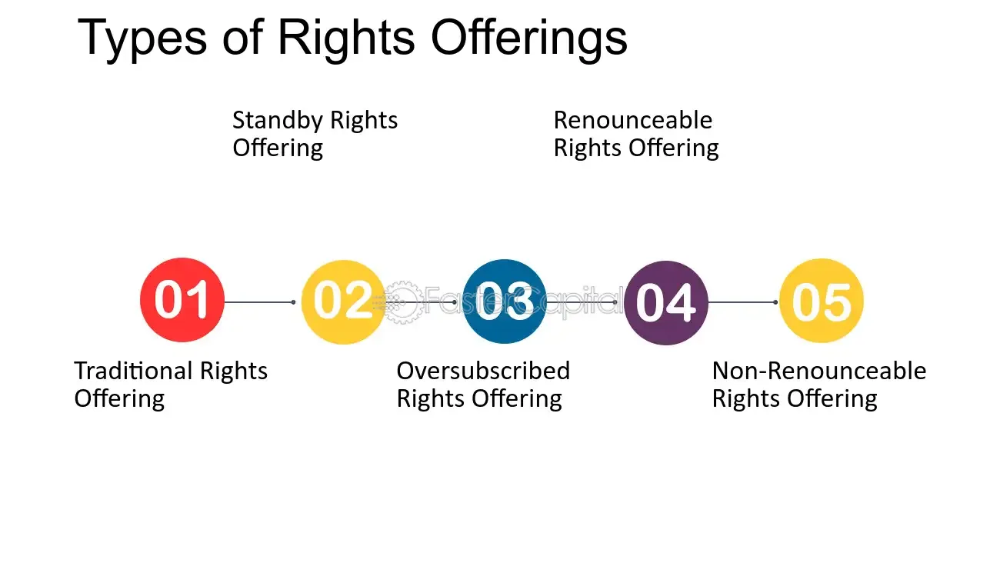

## Table of Contents

## What are non-renounceable rights?

Non-renounceable rights are basic rights that people have just because they are human. These rights cannot be taken away or given up, no matter what. They include things like the right to life, freedom, and fairness. These rights are important because they help protect people and make sure everyone is treated equally.

These rights come from ideas like the Universal Declaration of Human Rights, which many countries have agreed to follow. Even if a person tries to give up these rights, they still have them. This is because these rights are seen as part of being human, not something that can be traded or lost. Governments and societies are supposed to respect and protect these rights for everyone.

## Can you provide examples of non-renounceable rights?

Non-renounceable rights are rights that everyone has just because they are human. These rights cannot be taken away or given up. One example is the right to life. This means that everyone has the right to live and no one can take that away from them. Another example is the right to freedom. This means that people should be free to make their own choices and live their lives without being unfairly controlled by others.

Another important non-renounceable right is the right to fairness, also known as the right to equality. This means that everyone should be treated the same, no matter who they are or where they come from. For example, everyone should have the same chance to get a job or go to school. The right to not be tortured is also a non-renounceable right. This means that no one can hurt someone on purpose to make them suffer or to get information from them.

These rights are written down in documents like the Universal Declaration of Human Rights. Many countries have agreed to follow these rules. Even if someone says they don't want these rights, they still have them because they are part of being human. Governments and societies are supposed to make sure these rights are protected for everyone.

## Why are some rights considered non-renounceable?

Some rights are considered non-renounceable because they are seen as basic to being human. These rights, like the right to life, freedom, and fairness, are so important that they cannot be taken away or given up. They are part of what makes us human, and everyone should have them no matter what. This idea comes from the belief that all people are equal and deserve to be treated with respect and dignity.

These non-renounceable rights are written in important documents like the Universal Declaration of Human Rights. Many countries have agreed to follow these rules to make sure everyone's rights are protected. Even if someone says they don't want these rights, they still have them because they are part of being human. Governments and societies are supposed to make sure these rights are respected and protected for everyone.

## How do non-renounceable rights differ from renounceable rights?

Non-renounceable rights are rights that everyone has just because they are human. These rights cannot be taken away or given up, no matter what. They include things like the right to life, freedom, and fairness. These rights are important because they help protect people and make sure everyone is treated the same. Even if someone says they don't want these rights, they still have them because they are part of being human.

Renounceable rights, on the other hand, are rights that a person can choose to give up. These rights are not as basic as non-renounceable rights and can be affected by choices or agreements. For example, someone might give up their right to privacy by agreeing to be part of a reality TV show. Renounceable rights are important too, but they can be changed or given up if someone wants to.

## What legal mechanisms protect non-renounceable rights?

Non-renounceable rights are protected by different legal rules and documents. One important document is the Universal Declaration of Human Rights, which many countries have agreed to follow. This document says that everyone has rights like the right to life, freedom, and fairness. Countries that agree to this document must make laws to protect these rights. For example, they might make laws against torture or unfair treatment to make sure everyone's rights are safe.

Another way non-renounceable rights are protected is through national laws and constitutions. Many countries have their own laws that say these rights are important and cannot be taken away. Courts can also help protect these rights. If someone's rights are not being respected, they can go to court and ask for help. The court can then make sure the person's rights are protected. This helps make sure that everyone's non-renounceable rights are respected and safe.

## How are non-renounceable rights enforced in different countries?

Non-renounceable rights are enforced differently in each country, but many countries use similar ways to make sure these rights are protected. One common way is through laws and constitutions. Many countries have laws that say everyone has rights like the right to life, freedom, and fairness. These laws help make sure that people's rights are respected. For example, a country might have laws against torture or unfair treatment to protect these rights. If someone's rights are not being respected, they can go to court and ask for help. The court can then make sure the person's rights are protected.

Another way non-renounceable rights are enforced is through international agreements. Many countries have agreed to follow documents like the Universal Declaration of Human Rights. This document says that everyone has basic rights and that countries should make laws to protect them. If a country does not follow these rules, other countries or international groups can speak out and put pressure on them to change. This helps make sure that non-renounceable rights are respected all over the world.

## What are the historical origins of non-renounceable rights?

The idea of non-renounceable rights comes from a long time ago. People started thinking about these rights during the Enlightenment, a time when many thinkers in Europe were talking about freedom and fairness. One important person was John Locke. He said that everyone has natural rights like the right to life, freedom, and property. These rights are part of being human and cannot be taken away. Locke's ideas helped shape important documents like the United States Declaration of Independence, which says that everyone has rights that cannot be taken away.

Over time, more people and countries started to agree that everyone should have these basic rights. After World War II, many countries came together to write the Universal Declaration of Human Rights. This document says that everyone has rights like the right to life, freedom, and fairness, no matter where they live. It was a big step because many countries agreed to follow these rules. Today, these rights are still important, and many countries have laws to make sure they are protected.

## How do international treaties and conventions influence non-renounceable rights?

International treaties and conventions are important because they help make sure that non-renounceable rights are protected all over the world. These treaties are agreements between countries that say everyone has basic rights like the right to life, freedom, and fairness. One big example is the Universal Declaration of Human Rights. Many countries have agreed to follow this document, which means they have to make laws to protect these rights. If a country does not follow these rules, other countries or international groups can speak out and put pressure on them to change.

These treaties also help make sure that everyone's rights are respected, no matter where they live. For example, the International Covenant on Civil and Political Rights is another important treaty that many countries have agreed to follow. It says that everyone has rights like the right to not be tortured and the right to a fair trial. By agreeing to these treaties, countries promise to protect these rights for everyone. This helps make sure that non-renounceable rights are respected and protected all over the world.

## What challenges do governments face in upholding non-renounceable rights?

Governments face many challenges when trying to uphold non-renounceable rights. One big challenge is making sure that everyone's rights are respected, no matter who they are or where they live. This can be hard because different groups of people might have different needs and face different problems. For example, some people might not have enough money to live well, and this can make it hard for them to enjoy their rights. Governments need to find ways to help everyone, but this can be difficult and expensive.

Another challenge is dealing with conflicts and emergencies. During times of war or disaster, it can be hard to protect everyone's rights. Governments might need to make quick decisions that can affect people's rights. For example, they might need to limit some freedoms to keep people safe. But they still need to make sure they are not taking away people's basic rights. Balancing these needs can be very hard. Governments also need to work with other countries and international groups to make sure rights are respected everywhere, which adds another layer of complexity.

## How do non-renounceable rights impact social and economic policies?

Non-renounceable rights have a big impact on social and economic policies. Governments have to make sure everyone's rights are protected, which means they need to create policies that help people live well. For example, the right to life means governments need to make sure people have enough food, clean water, and healthcare. This can lead to policies like providing free healthcare or food programs for people who need them. The right to fairness means everyone should have the same chances, so governments might make policies to help people get jobs or go to school, no matter where they come from or how much money they have.

These rights also affect economic policies. The right to work and have a good life means governments need to make sure there are enough jobs and that people are paid fairly. This can lead to policies like setting a minimum wage or helping businesses grow so they can hire more people. The right to freedom can also impact economic policies because it means people should be able to start their own businesses or choose their own jobs. Governments need to make sure their economic policies help everyone enjoy their rights, which can be hard but is very important.

## What role do non-governmental organizations play in advocating for non-renounceable rights?

Non-governmental organizations (NGOs) play a big role in advocating for non-renounceable rights. They work to make sure everyone's rights are respected, no matter where they live. NGOs often help people who are having their rights taken away. They do this by speaking out about problems, helping people get the help they need, and working with governments to change laws. For example, an NGO might help people who are being treated unfairly because of their race or religion. They can also help make sure people have enough food and a safe place to live, which are part of the right to life.

NGOs also work together with other groups and people all over the world to make sure non-renounceable rights are protected. They can join forces to put pressure on governments to change bad laws or to help people in emergencies. For example, during a war or a natural disaster, NGOs might work together to make sure people get the help they need, like food, water, and medical care. By working together, NGOs can make a big difference in helping everyone enjoy their basic rights.

## How might future legal and technological developments affect the concept of non-renounceable rights?

Future legal developments could change how non-renounceable rights are protected. As new laws are made, they might help make sure everyone's rights are respected even more. For example, new laws might make it easier for people to go to court if their rights are not being respected. Countries might also agree to new international treaties that say everyone has even more rights. These changes could help make sure that non-renounceable rights are protected better all over the world. But, it could also be hard because different countries might not agree on what rights should be protected.

Technology could also affect non-renounceable rights. New technology like the internet and social media can help people learn about their rights and speak out if their rights are not being respected. For example, people can use social media to tell others about unfair treatment and ask for help. But, technology can also make it harder to protect rights. For example, new technology might be used to watch people too closely, which could take away their right to privacy. Governments and companies need to be careful to make sure technology helps protect rights and does not take them away.

## References & Further Reading

[1]: Bergstra, J., Bardenet, R., Bengio, Y., & Kégl, B. (2011). ["Algorithms for Hyper-Parameter Optimization."](https://dl.acm.org/doi/10.5555/2986459.2986743) Advances in Neural Information Processing Systems 24.

[2]: ["Advances in Financial Machine Learning"](https://www.amazon.com/Advances-Financial-Machine-Learning-Marcos/dp/1119482089) by Marcos Lopez de Prado

[3]: ["Evidence-Based Technical Analysis: Applying the Scientific Method and Statistical Inference to Trading Signals"](https://www.amazon.com/Evidence-Based-Technical-Analysis-Scientific-Statistical/dp/0470008741) by David Aronson

[4]: ["Machine Learning for Algorithmic Trading"](https://github.com/stefan-jansen/machine-learning-for-trading) by Stefan Jansen

[5]: ["Quantitative Trading: How to Build Your Own Algorithmic Trading Business"](https://www.amazon.com/Quantitative-Trading-Build-Algorithmic-Business/dp/1119800064) by Ernest P. Chan

[6]: "Tesla raises $5 billion in new stock offering," Reuters, December 2020.

[7]: "Alibaba raises $11 billion in record-breaking secondary listing in Hong Kong," CNBC, November 2019.