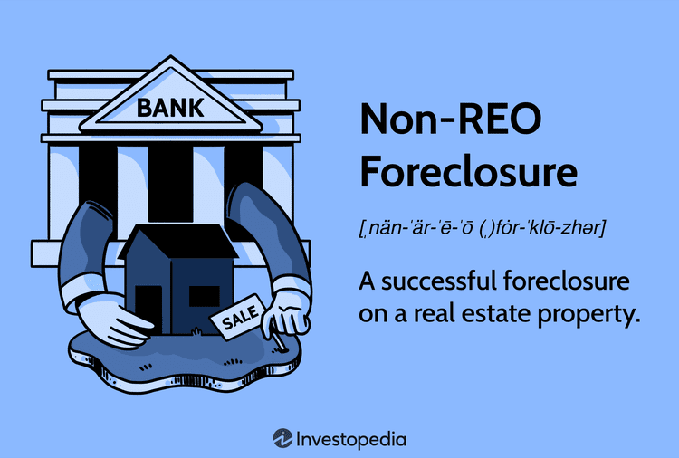

The intersection of foreclosure, real estate, and algorithmic trading is notably reshaping traditional investment strategies and opportunities within the property market. At the core of this transformation is the concept of non-REO foreclosure, which provides investors a chance to acquire properties at a discounted rate before these assets transition to bank-owned status. Non-REO properties are sold through auction without reverting to the bank, presenting a prime opportunity to benefit from reduced prices and increased availability of foreclosed assets.

Algorithmic trading further enhances strategic decision-making in the real estate domain through sophisticated data analysis and predictive modeling. By leveraging large datasets and employing machine learning algorithms, investors can identify patterns and trends that were previously invisible in real time, thereby gaining a competitive edge. These tools facilitate more informed decision-making processes by predicting shifts in market conditions and valuing property assets accurately.



This article examines the potential synergy between real estate foreclosure, non-REO properties, and algorithmic trading, highlighting how they collectively unlock a new frontier for investment opportunities. By integrating human expertise with algorithmic precision, investors can better navigate the complexities inherent in this investment landscape and maximize opportunities presented by technological advancements. The aim is to equip investors with the necessary knowledge to effectively operate and succeed within this evolving real estate market.

## Table of Contents

## Understanding Non-REO Foreclosure

Non-REO foreclosures present a unique opportunity for investors interested in purchasing properties at a discount. Unlike Real Estate Owned (REO) properties that fall into bank ownership after the foreclosure process, non-REO properties are sold at auction before reaching this stage. This means that investors can acquire properties at potentially undervalued prices, bypassing the additional costs and complexities often associated with properties that become bank-owned.

The foreclosure process typically begins when a homeowner misses mortgage payments, leading to a series of legal notices and, ultimately, the auctioning of the property. Understanding the stages of foreclosure is critical for investors looking to capitalize on non-REO opportunities. The process generally includes the following stages:

1. **Pre-foreclosure**: After a homeowner misses a series of payments, the lender issues a notice of default, starting the formal foreclosure process.

2. **Auction**: If the homeowner fails to rectify the situation during the pre-foreclosure period, the property is put up for auction. This stage is crucial for acquiring non-REO properties as investors can bid on the property directly, often at lower prices than market value.

Strategic timing during these stages can significantly benefit investors. By entering the auction phase prepared, with a comprehensive understanding of the market value and potential returns, investors can make informed bids that optimize their investment potential.

Acquiring properties through non-REO foreclosures requires navigating complex legal processes and rapidly fluctuating market conditions. Investors must be well-versed in both state and federal foreclosure laws to effectively participate in auctions. Additionally, recognizing current market trends and property values is essential for making competitive yet financially sound bids.

A deep understanding of non-REO foreclosure nuances allows investors to position themselves advantageously in the market. Effective strategies include thorough due diligence on properties before auction and having financing readily available to close deals promptly. By mastering these elements, investors can capitalize on unique opportunities presented by non-REO foreclosures, leading to potentially lucrative real estate investments.

## The Role of Algorithmic Trading in Real Estate

Algorithmic trading in real estate involves leveraging mathematical models and data analytics to optimize property transactions. This approach enables the rapid processing of vast amounts of data, allowing investors to identify patterns and market trends that can guide investment decisions. Incorporating tools such as [machine learning](/wiki/machine-learning) and [artificial intelligence](/wiki/ai-artificial-intelligence) (AI) further enhances predictive capabilities, granting investors strategic advantages in competitive markets.

The core of [algorithmic trading](/wiki/algorithmic-trading) lies in processing real-time data to make informed decisions that minimize risks while maximizing returns. Machine learning algorithms, for instance, can analyze historical market data to predict future property values and trends. Commonly used models might include regression analysis, decision trees, or neural networks, each providing insights into potential investment opportunities.

```python
# Example of a simple linear regression model to predict property prices
from sklearn.linear_model import LinearRegression
import numpy as np

# Sample data: square footage and corresponding prices
square_footage = np.array([1500, 1600, 1700, 1800, 1900]).reshape(-1, 1)
prices = np.array([300000, 320000, 340000, 360000, 380000])

# Create a linear regression model
model = LinearRegression()
model.fit(square_footage, prices)

# Predict price for a 2000 square foot property
predicted_price = model.predict(np.array([[2000]]))
print(f"Predicted price for 2000 sq ft: ${predicted_price[0]:.2f}")
```

Despite its undeniable benefits, algorithmic trading also faces technical and ethical challenges. The quality and accuracy of data are paramount, as flawed or biased data can lead to erroneous predictions. Additionally, algorithmic bias can occur if models are trained on datasets that do not represent the broader market, potentially skewing investment decisions. Therefore, ongoing management and tuning of algorithms are necessary to ensure reliability and fairness.

Furthermore, the ethical use of algorithms in real estate necessitates transparency and accountability. Ensuring that these tools are used to augment human decision-making rather than replacing it completely is crucial. A balanced approach that combines human intuition with algorithmic precision can address these challenges, maximizing the potential of algorithmic trading to revolutionize real estate investing.

## Integrating Non-REO Properties and Algorithmic Trading

Investors seeking to enhance their strategies in acquiring non-REO properties can capitalize on the potential of algorithmic trading to streamline both the purchase and management processes. Non-REO foreclosures offer a competitive edge, as they allow for the acquisition of properties at auction before they revert to bank ownership. The integration of algorithmic trading can optimize these transactions by leveraging data-driven insights and predictive modeling.

Predictive models play a crucial role in assessing the potential value and inherent risks of foreclosed properties. By analyzing historical data and real-time market trends, algorithms can identify patterns indicative of future performance. These models utilize techniques such as machine learning and statistical analysis to forecast property values and market dynamics. An example of a simple linear regression model in Python that forecasts property price based on historical data might look like this:

```python
from sklearn.linear_model import LinearRegression
import numpy as np

# Example dataset
X = np.array([[1], [2], [3], [4], [5]])  # historical data features
y = np.array([300, 350, 400, 450, 500])  # property prices

# Create and train the model
model = LinearRegression().fit(X, y)

# Predict future property price
future_data = np.array([[6]])
predicted_price = model.predict(future_data)
print(f"Predicted property price: {predicted_price[0]}")
```

While algorithmic insights provide a significant advantage, a balanced investment strategy also requires human expertise. Expert knowledge is essential in interpreting model outputs, considering qualitative factors that algorithms may overlook, such as neighborhood dynamics or potential development projects. Thus, the synergy between human intuition and algorithmic precision enhances decision-making.

Key considerations for effectively integrating algorithmic trading with non-REO property investments include ensuring data accuracy and adapting algorithms to accommodate the complexities of real estate transactions. Real estate markets are characterized by unique aspects, such as variable transaction timelines and specific legal requirements, which necessitate tailored algorithmic approaches. Addressing these considerations ensures that predictive models are reliable and applicable to real-world scenarios.

The successful integration of algorithmic trading in acquiring and managing non-REO properties can lead to increased profitability and reduced risk. By leveraging technological innovation, investors can optimize their strategies, make informed decisions, and maximize returns in the competitive real estate sector. This approach not only enhances financial outcomes but also provides a scalable framework for sustained growth in real estate investments.

## Challenges and Opportunities

Navigating the legal and logistical challenges of purchasing non-REO properties at auction requires a thorough understanding of the process and potential hurdles. Legal complexities often arise from different state laws governing foreclosure sales and the rights of homeowners during the foreclosure process. Ensuring clear title transfers and understanding redemption periods are crucial for investors, who must also assess property conditions without full access prior to bidding.

Balancing algorithmic precision with human intuition is essential to address market nuances in real estate transactions. Algorithms can rapidly analyze vast data sets to identify potential investment opportunities, but they may overlook qualitative factors such as neighborhood dynamics and local economic conditions. Human insight can complement algorithmic outputs, ensuring well-rounded decision-making.

The potential for market manipulation in algorithmic trading is a valid concern, necessitating an ethical approach to using these technologies in real estate. Algorithmic models could inadvertently favor certain data patterns or market movements, potentially distorting pricing or availability. Ensuring transparency and incorporating ethical guidelines within algorithmic processes can mitigate these risks.

Opportunities for higher returns exist through strategic investment and technological innovation. By combining predictive analytics with foreclosed property acquisitions, investors can more accurately forecast market trends and property values. This strategic advantage can translate to improved investment returns.

Ongoing advancements in data analytics and artificial intelligence continue to enhance the real estate investment landscape. As AI models become more sophisticated, their ability to predict market trends and assess investment risks improves. This advancement not only facilitates better decision-making but also promotes growth and profitability in the evolving digital age of real estate investing.

## Conclusion

The fusion of real estate foreclosure opportunities, particularly non-REO properties, with algorithmic trading strategies is reshaping the investment landscape, offering substantial growth potential. By leveraging technological advancements, investors can refine their strategies to better capitalize on the attractive pricing of foreclosures before they transition to bank-owned status. These technologies provide a framework for analyzing vast datasets to identify lucrative investment opportunities, making it critical for investors to integrate both machine intelligence and human expertise effectively.

In this evolving market, success hinges on maintaining a balance between algorithmic precision and the nuanced understanding that only human intuition can provide. A multifaceted approach enables investors to navigate the complexities of real estate transactions while also optimizing their portfolios for maximum profitability. Keeping abreast of technological advancements will be crucial, as they offer insights that can translate into competitive advantages in an increasingly dynamic market.

In essence, the marriage of real estate investments with digital innovation lays a promising foundation for both growth and profitability. As the digital age progresses, those who adapt to these innovations while staying informed about market trends are well-positioned to exploit new opportunities and secure leadership within the industry.

## FAQs

**What is the difference between REO and non-REO properties?**

REO (Real Estate Owned) properties are those that have gone through the foreclosure process and have become the property of the bank or lender. This typically happens when a property fails to sell at a foreclosure auction, leading the bank to take ownership. Consequently, REO properties are usually sold by banks to recover the unpaid loan amounts.

In contrast, non-REO properties refer to those still in the foreclosure process but not yet owned by the bank. These properties are sold at foreclosure auctions before they transition to bank ownership. Investors may acquire non-REO properties often at lower prices, allowing the purchase of properties at a discount before they become bank assets.

**How does algorithmic trading benefit real estate investors?**

Algorithmic trading in real estate applies mathematical models and sophisticated data analysis to enhance investment strategies. One key benefit is the ability to process and analyze vast amounts of data rapidly, identifying market patterns and trends that can guide decision-making. Algorithms can incorporate factors like property value fluctuations, market demand, and economic indicators to optimize timing and pricing decisions.

Additionally, machine learning and AI can improve predictive accuracy, offering real-time insights and strategic advantages in competitive markets. This efficiency can help investors reduce risks and maximize returns, making informed decisions grounded in data rather than intuition alone.

**What are potential challenges in using algorithms in real estate?**

Using algorithms in real estate investment brings technical and ethical challenges. Data quality is crucial, as inaccurate or outdated information can lead to flawed decisions. There's also the risk of algorithmic bias, where models may perpetuate existing inequalities or fail to consider unquantifiable human factors influencing real estate markets.

Moreover, the complexity of real estate transactions, involving legal, financial, and regulatory considerations, may not always be captured fully by algorithms. Over-reliance on technology without human oversight can lead to suboptimal outcomes. Hence, integrating algorithmic insights with human expertise is essential for successful real estate investment strategies.

**How can investors mitigate risks associated with non-REO properties?**

Investors can mitigate risks with non-REO properties through thorough due diligence and strategic analysis. Understanding local market conditions, property valuations, and legal requirements is crucial. Engaging with real estate professionals, such as appraisers and legal advisors, can provide valuable insights into specific opportunities and risks associated with a property.

Timing is also essential; being strategic about when to buy can impact returns significantly. Algorithmic tools can aid by assessing risk factors and evaluating the property's potential value prior to purchase. Balancing data-driven insights with human judgment can enhance decision-making and risk management when venturing into non-REO property investments.

**What future trends could impact real estate investing?**

Several trends are poised to shape the future of real estate investing. Technological advancements in data analytics and AI continue to revolutionize market analysis, offering new tools for predicting market shifts and identifying investment opportunities.

Sustainable and green building practices are becoming more prevalent, driven by increasing awareness of climate change and consumer demand for environmentally friendly properties. Additionally, changes in urbanization patterns and work-from-home trends may influence property values and demand in both rural and urban markets.

Moreover, regulatory developments and economic policies can impact real estate demand and pricing. Staying abreast of these changes will be crucial for investors seeking to adapt and capitalize on emerging opportunities in the evolving real estate landscape.

## References & Further Reading

[1]: Bergstra, J., Bardenet, R., Bengio, Y., & Kégl, B. (2011). ["Algorithms for Hyper-Parameter Optimization."](https://dl.acm.org/doi/10.5555/2986459.2986743) Advances in Neural Information Processing Systems 24.

[2]: ["Advances in Financial Machine Learning"](https://www.amazon.com/Advances-Financial-Machine-Learning-Marcos/dp/1119482089) by Marcos Lopez de Prado

[3]: ["Evidence-Based Technical Analysis: Applying the Scientific Method and Statistical Inference to Trading Signals"](https://www.amazon.com/Evidence-Based-Technical-Analysis-Scientific-Statistical/dp/0470008741) by David Aronson

[4]: ["Machine Learning for Algorithmic Trading"](https://github.com/stefan-jansen/machine-learning-for-trading) by Stefan Jansen

[5]: ["Quantitative Trading: How to Build Your Own Algorithmic Trading Business"](https://www.amazon.com/Quantitative-Trading-Build-Algorithmic-Business/dp/1119800064) by Ernest P. Chan