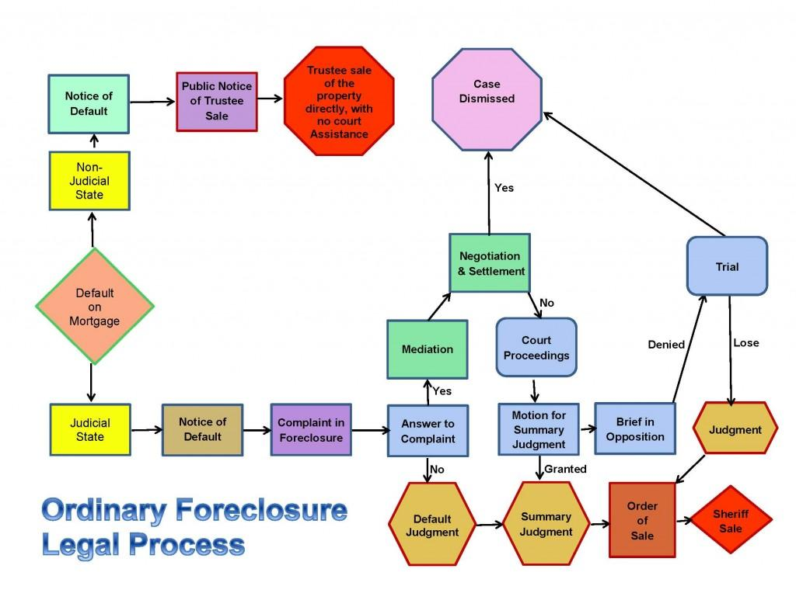

## Table of Contents

## What is a non-REO foreclosure?

A non-REO foreclosure is a type of foreclosure where the property is sold at a public auction to the highest bidder before the bank takes ownership. This happens when a homeowner can't pay their mortgage, and the lender decides to sell the property to recover the money owed. If someone other than the bank buys the property at the auction, it is called a non-REO foreclosure.

In a non-REO foreclosure, the new owner of the property is usually someone who attended the auction and made the highest bid. This can be an individual investor or a company that specializes in buying foreclosed homes. The new owner then takes over the property and can decide to live in it, rent it out, or sell it for a profit. This process is different from an REO foreclosure, where the bank ends up owning the property because no one bought it at the auction.

## How does the non-REO foreclosure process differ from an REO foreclosure?

The non-REO foreclosure process happens when a homeowner can't pay their mortgage, and the lender decides to sell the home at a public auction. At this auction, anyone can bid on the property. If someone other than the bank buys the home, it becomes a non-REO foreclosure. The person who wins the auction gets the property and can decide what to do with it, like living in it, renting it out, or selling it again.

An REO foreclosure, or "Real Estate Owned" foreclosure, happens when no one buys the home at the public auction. In this case, the bank ends up owning the property because it couldn't sell it to anyone else. The bank then becomes responsible for the home and usually tries to sell it later to recover the money they lost. The main difference is who ends up owning the property after the auction: in a non-REO foreclosure, it's a bidder at the auction, and in an REO foreclosure, it's the bank.

## What are the initial steps in a non-REO foreclosure?

When someone can't pay their mortgage, the lender starts the foreclosure process. The first step is usually sending the homeowner a notice of default. This is a letter that says the homeowner is behind on payments and needs to catch up or the lender will take the home. If the homeowner doesn't fix the problem, the lender will then file a notice of foreclosure with the local government. This is a public record that says the home will be sold at an auction.

After the notice of foreclosure is filed, the lender sets a date for the auction. They advertise the auction to let people know the home will be sold to the highest bidder. Anyone can come to the auction and bid on the home. If someone other than the bank buys the home at the auction, it becomes a non-REO foreclosure. The new owner gets the property and can decide what to do with it next.

## Who are the key parties involved in a non-REO foreclosure?

The key parties in a non-REO foreclosure are the homeowner, the lender, and the buyer at the auction. The homeowner is the person who can't pay their mortgage and is at risk of losing their home. The lender is the bank or mortgage company that gave the homeowner the loan and starts the foreclosure process when payments are missed.

The buyer at the auction is the person or company that bids on and buys the home during the public auction. This buyer could be an individual investor or a company that specializes in buying foreclosed properties. After winning the auction, the buyer takes ownership of the home and can decide to live in it, rent it out, or sell it for a profit.

## What legal notices are required during a non-REO foreclosure?

When a homeowner can't pay their mortgage, the lender starts the foreclosure process by sending a notice of default. This is a letter that tells the homeowner they are behind on payments and need to catch up, or the lender will take the home. If the homeowner doesn't fix the problem, the lender files a notice of foreclosure with the local government. This is a public record that says the home will be sold at an auction.

After the notice of foreclosure is filed, the lender sets a date for the auction and advertises it. This lets people know the home will be sold to the highest bidder. Anyone can come to the auction and bid on the home. If someone other than the bank buys the home at the auction, it becomes a non-REO foreclosure. These legal notices are important because they make sure everyone knows what is happening with the home and gives the homeowner a chance to fix the problem before losing their home.

## How can a homeowner respond to a non-REO foreclosure notice?

When a homeowner gets a notice of default, it means they are behind on their mortgage payments. The notice tells them they need to catch up on payments or the lender will start the foreclosure process. The homeowner can respond by trying to pay what they owe. They can also talk to the lender about setting up a payment plan or modifying their loan to make the payments more affordable. Sometimes, the homeowner can even sell the home themselves before the auction to avoid foreclosure.

If the homeowner can't fix the problem and the lender files a notice of foreclosure, the home will be sold at a public auction. The homeowner can still try to stop the foreclosure by working out a deal with the lender. They might be able to get a loan modification, a forbearance agreement, or even a short sale, where the lender agrees to let them sell the home for less than what they owe. It's important for the homeowner to act quickly and talk to the lender as soon as possible to find a solution and keep their home.

## What are the potential outcomes of a non-REO foreclosure?

When a home goes through a non-REO foreclosure, it means someone other than the bank bought the home at the auction. The new owner, who could be an individual or a company, takes over the property. They can choose to live in the house, rent it out to others, or sell it again. This gives them a chance to make money if they can fix up the house and sell it for more than they paid at the auction.

For the homeowner who lost their home, a non-REO foreclosure means they no longer own the property. They have to move out and find a new place to live. If they had any equity in the home, they might not get any of it back. However, they might be able to avoid a non-REO foreclosure by paying what they owe, working out a deal with the lender, or selling the home themselves before the auction. It's important for homeowners to talk to their lender as soon as they know they can't make their payments to see if they can find a way to keep their home.

## What are the timelines associated with each stage of a non-REO foreclosure?

When a homeowner misses mortgage payments, the lender sends a notice of default. This usually happens after the homeowner is behind for a few months, like 90 days. The notice gives the homeowner a chance to catch up on payments, often within a 30-day period. If the homeowner can't pay, the lender files a notice of foreclosure with the local government. This step can take another 30 to 60 days, depending on the state's laws.

Once the notice of foreclosure is filed, the lender sets a date for the auction. This can take anywhere from 21 to 120 days after the notice of foreclosure, depending on state laws. The auction is advertised to the public, and anyone can bid on the home. If someone other than the bank buys the home at the auction, it becomes a non-REO foreclosure. The whole process from the notice of default to the auction can take around 6 to 12 months, but it varies by state and the specific situation of the homeowner.

## How does the auction process work in a non-REO foreclosure?

When a home is going through a non-REO foreclosure, it means the lender is selling it at a public auction because the homeowner couldn't pay their mortgage. The auction happens after the lender sends a notice of default and files a notice of foreclosure. Anyone can come to the auction and bid on the home. The auction is usually advertised in newspapers or online, so people know when and where it will happen. The highest bidder at the auction wins and gets to buy the home.

The person who wins the auction has to pay the amount they bid right away. This could be in cash or a cashier's check. Once they pay, they get the deed to the home and become the new owner. They can then decide to live in the house, rent it out, or fix it up and sell it for a profit. If no one bids on the home or the highest bid isn't enough, the bank might end up buying it back, but in a non-REO foreclosure, someone else buys it before that happens.

## What are the financial implications for the homeowner in a non-REO foreclosure?

When a homeowner goes through a non-REO foreclosure, it means they lose their home because they couldn't pay their mortgage. They have to move out and find a new place to live. If they had any money in the home, like if the home was worth more than what they owed on the mortgage, they might not get any of that money back. This can be really hard because they lose their home and any money they put into it.

Also, a non-REO foreclosure can hurt the homeowner's credit score a lot. It stays on their credit report for seven years and makes it harder to get loans or credit cards in the future. They might have to pay higher interest rates if they can get a loan. It's important for homeowners to talk to their lender as soon as they know they can't make their payments to see if they can find a way to keep their home and avoid these financial problems.

## What are the common challenges and pitfalls in managing a non-REO foreclosure?

Managing a non-REO foreclosure can be tough for both the homeowner and the new buyer. For the homeowner, the biggest challenge is trying to keep their home. They might not know how to talk to the lender or understand all the legal notices. It can be hard to find the money to catch up on payments or work out a new deal with the lender. If they lose their home, they have to move out and find a new place to live, which can be stressful and expensive. They also have to deal with the hit to their credit score, which can make it harder to borrow money in the future.

For the new buyer, the challenges start right after they win the auction. They need to pay the full amount they bid right away, which can be a lot of money. They also have to make sure the home is in good shape, because they might not know about any problems until after they buy it. If the home needs a lot of repairs, it can cost more money and time. The new buyer has to decide what to do with the home, like whether to live in it, rent it out, or sell it again. Each choice has its own risks and costs, so they need to be careful and plan well to make the most of their investment.

## How can legal and financial advisors assist in navigating a non-REO foreclosure?

Legal and financial advisors can help a lot when someone is going through a non-REO foreclosure. They can explain all the legal notices and what they mean, so the homeowner knows what's happening and what they need to do. Advisors can also help the homeowner talk to the lender and try to work out a deal to keep their home. They might suggest things like changing the loan terms to make payments smaller or setting up a plan to catch up on missed payments. This can be really helpful because it gives the homeowner a better chance of staying in their home.

For the new buyer at the auction, advisors can help make sure they understand all the rules and what they're getting into. They can check the home for any problems before the buyer bids on it, so the buyer knows if they need to fix anything. Advisors can also help the buyer figure out what to do with the home after they buy it, like whether to live in it, rent it out, or sell it again. They can give advice on how to make the most money from the home and avoid any big mistakes.

## References & Further Reading

[1]: Bergstra, J., Bardenet, R., Bengio, Y., & Kégl, B. (2011). ["Algorithms for Hyper-Parameter Optimization."](https://dl.acm.org/doi/10.5555/2986459.2986743) Advances in Neural Information Processing Systems 24.

[2]: ["Advances in Financial Machine Learning"](https://www.amazon.com/Advances-Financial-Machine-Learning-Marcos/dp/1119482089) by Marcos Lopez de Prado

[3]: ["Evidence-Based Technical Analysis: Applying the Scientific Method and Statistical Inference to Trading Signals"](https://www.amazon.com/Evidence-Based-Technical-Analysis-Scientific-Statistical/dp/0470008741) by David Aronson

[4]: ["Machine Learning for Algorithmic Trading"](https://github.com/stefan-jansen/machine-learning-for-trading) by Stefan Jansen

[5]: ["Quantitative Trading: How to Build Your Own Algorithmic Trading Business"](https://www.amazon.com/Quantitative-Trading-Build-Algorithmic-Business/dp/1119800064) by Ernest P. Chan