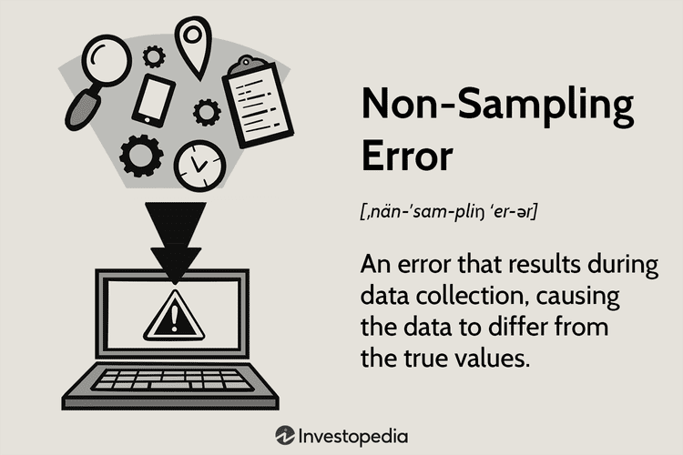

Accurate data collection and analysis are paramount in today's data-driven world, influencing critical decisions across fields such as finance, healthcare, and public policy. Accuracy ensures that conclusions drawn from data are reliable and valid, which is especially crucial when these decisions can have far-reaching impacts. Errors in data collection not only diminish the quality of analysis but can also lead to erroneous conclusions that may adversely affect decision-making processes.

Non-sampling errors represent a significant concern in data collection and analysis, encompassing all errors not related to the sample selection process. These errors can arise from various sources, including faulty measurement instruments, inaccurate data processing, non-responses, or inadequate data collection practices. Their mitigation is crucial as they can heavily skew research findings, adversely impacting the reliability and validity of the data collected. Unlike sampling errors, which can often be estimated and accounted for due to their statistical nature, non-sampling errors are more insidious, as they can remain undetected and difficult to quantify or correct.



Algorithmic trading exemplifies a domain where data accuracy is exceptionally critical. This form of trading involves using algorithms to make financial decisions at speeds and frequencies far beyond human capabilities. The precision of the data that feeds these algorithms directly impacts trading decisions. Errors, including non-sampling errors, can lead to significant financial losses, emphasizing the importance of minimizing such errors in algorithmic trading. Accurate data is essential to develop robust trading algorithms capable of adapting to and predicting market conditions effectively.

In summary, the significance of non-sampling errors in surveys and data-driven fields cannot be overstated. Understanding and mitigating these errors are important for ensuring data integrity, which in turn supports reliable decision-making across multiple sectors, including finance, where algorithmic trading relies heavily on precise, accurate data.

## Table of Contents

## Understanding Non-Sampling Errors

### Understanding Non-Sampling Errors

In the realm of statistical analysis and data collection, errors are often categorized into two primary types: sampling errors and non-sampling errors. Sampling errors arise from the inherent randomness of selecting a particular sample from a population. They can often be quantified and reduced by increasing the sample size or employing more robust sampling techniques.

Non-sampling errors, on the other hand, are deviations that occur not from the act of sampling itself, but from other aspects of the data collection and analysis process. These errors can occur at various stages: during data collection, data entry, processing, or even at the reporting stage. Non-sampling errors are often more elusive and difficult to detect and correct, primarily because they arise from a wide array of sources beyond statistical randomness.

**Examples of Non-Sampling Errors**

1. **Measurement Errors:** These errors occur when there is a discrepancy between the actual value and the measured value. This could be due to faulty instruments, poorly designed survey questions, or respondent misunderstanding. For example, in financial data, if a trader inputs a stock price incorrectly due to decimal misplacement, it can lead to significant analytical errors.

2. **Processing Errors:** Such errors happen during the data manipulation stage, such as data entry or coding errors. An example is transposing numbers, which can lead to entirely incorrect data sets. In computer systems, a simple misplacement of a line of code can affect the integrity of an algorithm’s outputs.

3. **Sampling Frame Errors:** These errors occur when the list from which the sample is drawn does not accurately represent the target population. This could happen if a survey is conducted using outdated contact information, leading to a non-representative sample.

4. **Non-Response Errors:** When individuals selected for a survey do not respond, there could be a non-response bias if the reasons for non-response are related to the survey topic. For instance, in a financial survey, individuals who have not invested might refrain from answering, skewing the results.

5. **Coverage Errors:** These occur when there is a mismatch between the target population and the sample population. An example is conducting a survey over landlines when a significant portion of the target population only uses mobile phones.

6. **Interviewer Errors:** Human interactions can introduce bias, either through the phrasing of questions, the interviewer's tone, or inadvertent cues given to respondents, affecting the responses gathered.

**Impact of Non-Sampling Errors on Data Reliability and Validity**

Non-sampling errors significantly impact data reliability and validity. Reliability pertains to the consistency of a measure, while validity concerns the accuracy of what is being measured. When non-sampling errors are present, they can distort findings, leading to conclusions that do not truly reflect the reality of the data. For instance, measurement errors can reduce the reliability of survey results if respondents misunderstand questions, thereby giving inconsistent answers. Similarly, coverage errors can jeopardize validity, as they might exclude important segments of the population, thereby generating biased results.

In statistical analysis, the presence of non-sampling errors means that results can have a wider margin of error than calculated from sampling error alone. This undetected variability introduces biases that can heavily influence decision-making processes, particularly in fields like finance, where data-driven decisions are paramount.

Mitigating these errors involves rigorous data validation processes, comprehensive data entry training, and deploying technology-based solutions to detect and correct anomalies as early as possible in the data collection process. Prioritizing these measures ensures that the integrity of data-driven insights is maintained, enabling more accurate analysis and conclusions.

## Types of Non-Sampling Errors

Non-sampling errors are critical issues in data collection and analysis that can significantly affect the reliability and validity of conclusions drawn from data. Unlike sampling errors, which are associated with the selection of samples, non-sampling errors can occur in virtually every stage of data handling and are typically more challenging to quantify and rectify.

### Measurement Errors

Measurement errors arise when there is a discrepancy between the actual value and the value obtained by a measurement process. In financial data, a common cause is the use of outdated or inaccurate exchange rates or stock prices. In surveys, these errors often stem from ambiguous questions or poorly defined measurement criteria, leading respondents to misinterpret or give inaccurate answers. Measurement errors can skew financial analyses, resulting in flawed financial models and potentially disastrous trading decisions.

### Processing Errors

Processing errors occur during data entry, coding, editing, or analysis. In [algorithmic trading](/wiki/algorithmic-trading), even a minor input error can lead to significant financial consequences. For example, if a typographical error results in the wrong stock being purchased (e.g., entering 'DISH' instead of 'DIS'), the financial ramifications can be substantial. Effective data management systems and checks are necessary to prevent and detect these errors in real-time.

### Sampling Frame Errors

Sampling frame errors occur when the list from which a sample is drawn doesn't accurately represent the target population. This can lead to skewed research findings. For instance, if a survey designed to understand consumer behavior excludes a segment of the population, the results will not accurately reflect the behaviors and preferences of the entire market. Ensuring a comprehensive and representative sampling frame is crucial to avoid bias in research findings.

### Non-Response Errors

Non-response errors happen when a significant number of selected respondents do not participate in a survey, leading to potential bias if the non-respondents differ in meaningful ways from those who do respond. In statistical analysis, non-response can challenge the significance of the findings. Methods like follow-up surveys and statistical adjustments can mitigate these errors by accounting for missing data.

### Coverage Errors

Coverage errors result when there is a mismatch between the target population and the sample from which data is drawn. This often occurs when some sections of the target population are systematically excluded, such as by using a sampling method that only includes urban residents when trying to infer nationwide conclusions. Coverage errors undermine the generalizability of findings and must be addressed through careful design and execution of the sampling process.

### Interviewer Errors

Interviewer errors are introduced when the person administering the survey influences the outcomes, either through bias or incorrect recording of responses. This can affect the validity of survey data, especially when questions are open to interpretation. Effective interviewer training and standardization protocols are necessary to minimize these errors and to ensure data integrity. 

Addressing these non-sampling errors requires meticulous planning, robust systems, and continual vigilance in all phases of data collection and analysis to ensure data-driven decisions are based on accurate and reliable information.

## The Role of Non-Sampling Errors in Algorithmic Trading

Algorithmic trading refers to the use of computer algorithms to automate trading decisions based on pre-defined criteria. It relies heavily on data accuracy for its operations. High-frequency trading ([HFT](/wiki/high-frequency-trading-strategies)), a subset of algorithmic trading, demands accurate and timely data to execute a vast number of transactions in milliseconds. Data accuracy is paramount in algorithmic trading because any error, particularly non-sampling errors, can result in substantial financial losses.

Non-sampling errors arise from various sources, including measurement inaccuracies, data entry mistakes, or erroneous data processing. In the context of algorithmic trading, such errors can profoundly impact the effectiveness of trading algorithms. For instance, an incorrect price input or missing data points can lead to incorrect trading signals. This might result in a strategy executing trades at the wrong time, in the wrong quantities, or based on faulty assumptions.

Consider the case study of the 2012 Knight Capital incident, where a trading software error led to the loss of $440 million in less than an hour. Here, a non-sampling error in the form of a software bug caused the trading algorithm to execute numerous unintended trades. The incident highlights the potential catastrophic impact of non-sampling errors. It underscored the need for rigorous testing and validation of algorithms to mitigate such risks.

A notable example of an approach to avoid such errors involves integrating real-time error-checking systems. These systems can be designed to constantly audit datasets for anomalies and inconsistencies. A Python snippet implementing a basic form of real-time data validation in algorithmic trading could look like this:

```python
def validate_data_point(data_point):
    if data_point is None or not isinstance(data_point, (int, float)):
        raise ValueError("Invalid data point detected!")
    return data_point

data_stream = [135.5, 136, None, 137.2]  # Simulated data stream

for point in data_stream:
    try:
        validated_point = validate_data_point(point)
        # Proceed with trading logic using validated_point
    except ValueError as e:
        print(e)
```

This mockup checks for basic data validity before passing data into the trading algorithm, ensuring that anomalies are flagged early. Such real-time validation processes are essential for trading algorithms to function correctly and minimize the risk associated with non-sampling errors.

In summary, algorithmic trading critically depends on data accuracy, and non-sampling errors can adversely affect financial decisions. By understanding the sources and impacts of these errors, trading systems can be designed with robust error-checking mechanisms to prevent significant financial mishaps.

## Strategies for Mitigating Non-Sampling Errors

Mitigating non-sampling errors is crucial for ensuring the reliability and validity of data used in surveys and algorithmic trading. This involves implementing strategies that minimize measurement discrepancies and enhance the overall data quality, which can have profound impacts on decision-making processes and financial outcomes.

### Data Validation: Importance of Consistency Checks and Outlier Detection

Data validation is a foundational strategy for minimizing non-sampling errors. Consistency checks involve verifying that data points adhere to expected ranges and logical relationships, ensuring internal coherence. For instance, in financial datasets, transactions with negative prices or future-dated timestamps can signify potential errors. Outlier detection helps identify anomalies that might suggest incorrect data or unusual activities. Techniques such as Z-scores or Interquartile Range (IQR) can be used to flag these outliers.

```python
import numpy as np

def detect_outliers(data, threshold=1.5):
    Q1, Q3 = np.percentile(data, [25, 75])
    IQR = Q3 - Q1
    lower_bound = Q1 - (IQR * threshold)
    upper_bound = Q3 + (IQR * threshold)
    return [x for x in data if x < lower_bound or x > upper_bound]

# Example usage:
data = [10, 12, 12, 14, 15, 12, 102, -1, 23, 24]
outliers = detect_outliers(data)
```

### Algorithmic Checks: Real-Time Error Correction Mechanisms in Trading Systems

Algorithmic trading systems rely heavily on accurate data streams and are particularly sensitive to errors. Implementing real-time error correction mechanisms can significantly reduce the impact of non-sampling errors. For example, deploying algorithms that highlight anomalous data patterns or abrupt deviations helps prevent the propagation of faulty decisions throughout trading systems. Strategies may include [machine learning](/wiki/machine-learning) models that continuously learn and adapt to identify and correct errors as they occur.

### Comprehensive Data Collection: Using Multiple Data Sources for Robustness

Collecting data from multiple sources can mitigate biases and fill gaps caused by non-response or coverage errors. For instance, in trading, combining data from different market feeds ensures that a broader perspective is captured, reducing susceptibility to errors from any single source. Aggregating data from diverse types ensures robustness and increases reliability, providing a more comprehensive view for decision-makers.

### Training and Standardization: Enhancing Survey and Interview Techniques

Standardization procedures ensure that data collection carries consistent quality across different contexts and personnel. This includes training interviewers thoroughly to avoid introducing their biases during data collection and implementing standardized questionnaires to eliminate variations in responses. In the financial context, data analysts and system operators should be trained in best practices for maintaining and handling data to prevent non-sampling errors.

### Redundancy and Regular Audits: Safeguarding Against Data Loss and Corruption

Creating data redundancy and conducting regular audits safeguard the integrity and security of data. Redundant systems enable backup recovery, ensuring that data loss or corruption does not lead to significant gaps in datasets. Regular audits help identify errors that may not have been caught by real-time checks. These practices reinforce data integrity by maintaining systematic checks and balances, preserving data accuracy over time.

## The Future of Data Integrity in Financial Markets

Emerging technologies continue to transform data integrity protocols within financial markets. As data accuracy is paramount, various technological advancements are being explored to enhance reliability and mitigate errors. One promising development is blockchain technology, which provides a decentralized ledger that offers transparency and immutability of records. This technology reduces the likelihood of data tampering and enhances trust in financial transactions.

Machine learning (ML) plays a significant role in predicting and correcting data errors. ML algorithms can be trained to identify patterns and anomalies in financial data, enabling early detection of inaccuracies. For instance, anomaly detection algorithms can automatically flag outliers and suspicious transactions, allowing for timely intervention and correction. An example of a basic anomaly detection algorithm in Python is as follows:

```python
import numpy as np
import pandas as pd
from sklearn.ensemble import IsolationForest

# Sample dataset
data = pd.DataFrame({'Values': [100, 102, 104, 99, 250, 107, 109]})

# Initialize the Isolation Forest model
model = IsolationForest(contamination=0.1)

# Fit the model
model.fit(data)

# Detect anomalies
data['Anomaly'] = model.predict(data)

print(data)
```

In this code, the `IsolationForest` model identifies anomalies within a dataset based on a specified contamination [factor](/wiki/factor-investing). Anomalies are flagged with a distinct label, facilitating their subsequent review and correction.

Future trends in algorithmic trading focus heavily on incorporating [artificial intelligence](/wiki/ai-artificial-intelligence) (AI) and [deep learning](/wiki/deep-learning) models. These advanced algorithms allow for more adaptive and responsive trading strategies by dynamically adjusting to real-time market conditions. For instance, [reinforcement learning](/wiki/reinforcement-learning) algorithms in trading can optimize decision-making processes by learning from historical data and exploring a range of strategies to maximize returns.

Moreover, the integration of predictive analytics within algorithmic trading frameworks promises to enhance data quality assurance. Predictive models can forecast potential system failures or data discrepancies, enabling preemptive measures that uphold data integrity.

In conclusion, as financial markets become increasingly reliant on sophisticated technologies, the focus on data accuracy and integrity will remain critical. The combined utilization of blockchain, machine learning, and AI marks a significant step toward improved data management in finance, ensuring robust and reliable trading environments.

## Conclusion

Minimizing non-sampling errors is fundamentally important to ensuring the accuracy and reliability of data-driven decisions, particularly in sectors where precision is paramount, such as financial markets and algorithmic trading. These errors, which arise from various sources such as measurement inaccuracies, processing mistakes, and coverage mismatches, can significantly distort the insights derived from data analysis. Unlike sampling errors, which are largely predictable and quantifiable, non-sampling errors are often subtle and insidious, potentially leading to systemic biases and flawed strategies if not adequately addressed.

Maintaining data integrity in financial and trading sectors is increasingly critical. As trading strategies rely more on complex algorithms and extensive datasets, even minor errors in data can have amplified consequences. A single error can trigger incorrect trading decisions, resulting in financial losses or systemic risk exposure. Thus, instituting robust error detection and correction mechanisms is crucial. Methods such as data validation, real-time algorithmic checks, and the use of redundant data sources serve as bulwarks against the perils of data imperfection. Furthermore, rigorous training and standardization of data collection processes, along with regular audits, help in minimizing the incidence of non-sampling errors.

A call to action is necessary for ongoing improvements in data collection methods. As technology evolves, so too must the techniques for ensuring data quality. Emerging technologies such as machine learning offer promising avenues not only for detecting anomalies in data but also for preemptively correcting them, thereby fortifying data integrity. Continued investment in research and development aimed at enhancing data accuracy will be indispensable for fostering trust and efficiency in data-dependent sectors.

Ultimately, minimizing non-sampling errors is not merely a technical objective but a strategic imperative. By prioritizing data integrity, organizations can safeguard against erroneous conclusions and ensure that their data-driven insights are both accurate and actionable. This focus on continuous improvement in data collection and validation processes will sustain the integrity of financial markets and contribute to the overall robustness of data analysis frameworks.

## References & Further Reading

[1]: Lohr, S. (2009). ["Sampling: Design and Analysis."](https://www.taylorfrancis.com/books/mono/10.1201/9780429296284/sampling-sharon-lohr) Cengage Learning.

[2]: Tourangeau, R., Rips, L. J., & Rasinski, K. (2000). ["The Psychology of Survey Response."](https://psycnet.apa.org/record/2000-03511-000) Cambridge University Press.

[3]: Groves, R. M. (1989). ["Survey Errors and Survey Costs."](https://onlinelibrary.wiley.com/doi/book/10.1002/0471725277) Wiley-Interscience.

[4]: Tibshirani, R., & Hastie, T. (2009). ["The Elements of Statistical Learning: Data Mining, Inference, and Prediction."](https://link.springer.com/book/10.1007/978-0-387-84858-7) Springer Series in Statistics.

[5]: Gorard, S. (2004). ["Combating Nonresponse: External Evidences and Freedom of Information."](https://journals.sagepub.com/doi/abs/10.1177/1741143205051050) International Journal of Social Research Methodology.