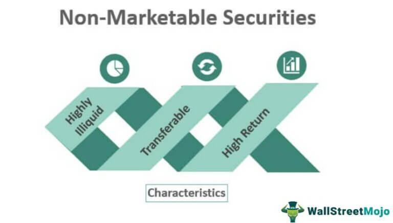

In the evolving landscape of finance, the valuation of financial mechanisms, particularly non-security instruments, has garnered significant interest. Non-security instruments, often overlooked, encompass a broad range of assets including derivatives, commodities, and insurance contracts. These instruments differ fundamentally from traditional securities like stocks and bonds as they do not represent either ownership in a company or a debt obligation.

Derivatives, for instance, are financial contracts whose value is derived from an underlying asset, index, or interest rate. They are crucial for hedging risks and can offer speculative opportunities because of their complex pay-off structures. Commodities, on the other hand, are basic goods used in commerce that are interchangeable with other goods of the same type, such as gold, oil, or agricultural products. These are often traded in futures markets, allowing producers and buyers to hedge against price volatility. Insurance contracts provide another perspective, offering risk management tools that protect against uncertain future events.

While traditional securities rely heavily on established financial models and market indicators for valuation, non-securities present unique opportunities and challenges due to their inherent diversity and complexity. The advancement of technology and the emergence of algorithmic trading have opened new avenues for efficiently managing the complexity associated with these instruments. Algorithmic trading utilizes computing power to execute trades at high speeds and with high precision, and it plays an increasingly crucial role in assessing and executing transactions involving non-security instruments. 

This article aims to explore the methodologies employed in valuing non-security financial mechanisms and the role of algorithmic trading in this process. Understanding these approaches is essential for navigating the financial markets of the future and capitalizing on the unique opportunities presented by non-security financial instruments.

## Table of Contents

## Understanding Non-Security Financial Instruments

Non-security financial instruments are diverse entities in the financial world, encompassing derivatives, commodities, insurance contracts, and currencies. Unlike traditional securities, such as stocks and bonds, these instruments do not confer ownership in a company nor represent a debt obligation. This fundamental distinction categorizes them separately from securities and underscores their individual characteristics and applications in finance.

Derivatives are financial contracts whose value is derived from an underlying asset, index, or [interest rate](/wiki/interest-rate-trading-strategies). They can be used for hedging purposes, allowing entities to mitigate potential losses from adverse price movements. Similarly, commodities—including agricultural products, metals, and energy resources—serve as fundamental building blocks in various industries and can be traded in spot or futures markets. These markets provide opportunities for speculation and hedging, enabling market participants to manage risk associated with price volatilities.

Insurance contracts are agreements where an insurer indemnifies the insured against specific potential losses in exchange for a premium. These contracts play a significant role in risk management, offering protection against financial losses from events such as accidents, natural disasters, and health-related issues. Meanwhile, currencies are traded in the foreign exchange markets and are crucial for global trade, investment flows, and speculation on macroeconomic trends.

The function of non-security instruments extends beyond mere trading. They facilitate risk management by allowing individuals and organizations to safeguard against unfavorable events and potential financial losses. Moreover, these instruments present speculative opportunities to take advantage of market inefficiencies or expected movements in prices. Additionally, they contribute to portfolio diversification by providing exposure to distinct asset classes, potentially reducing overall portfolio risk.

In summary, non-security financial instruments are integral to effective risk management, speculation, and diversification strategies within the financial sector. Their unique characteristics and applications differentiate them from traditional securities, offering both opportunities and complexities to financial professionals.

## Valuation of Non-Security Instruments

Valuing non-security financial instruments necessitates specialized techniques due to their varied characteristics and functions within the financial system. Unlike traditional securities, which often have standardized methods for valuation, non-security instruments like derivatives, commodities, insurance contracts, and currencies require bespoke approaches tailored to their unique attributes.

### Diverse Valuation Approaches

**1. Derivatives:**
Valuing derivatives typically involves calculating the present value of expected future cash flows. Common models include the Black-Scholes model for options pricing and the Binomial Options Pricing Model. These models rely on inputs such as [volatility](/wiki/volatility-trading-strategies), interest rates, and the underlying asset price to estimate a derivative's fair value.

**2. Commodities:**
The valuation of commodities depends significantly on market supply and demand dynamics, geopolitical factors, and macroeconomic indicators. Commodities are often priced using futures contracts, which provide a market-based estimation of commodity value at a future date.

**3. Insurance Contracts:**
Insurance contract valuation involves assessing the present value of future liabilities, often requiring actuarial analysis to predict claim occurrences and financial solvency. Risk assessment models and loss distribution metrics are commonly employed to estimate the expected payouts and risk margins.

**4. Currencies:**
Currencies are valued based on exchange rates, which are influenced by interest rates, inflation, political stability, and economic performance indicators. Currency valuation models like the Purchasing Power Parity (PPP) and the Interest Rate Parity (IRP) are used for assessing the relative value of currencies.

### The Role of Market Experts

Market experts often play a critical role in appraising these non-security assets. Their expertise is instrumental in conducting due diligence and employing valuation models that account for the specific market conditions and characteristics influencing the value of these instruments. Authentication and registration can be part of this process, ensuring that the assets are legitimate and their values accurately assessed.

### Impact on Liquidity

Unlike securities such as stocks and bonds, non-security instruments are not typically subject to underwriting or extensive documentation processes. This can lead to varying levels of [liquidity](/wiki/liquidity-risk-premium). For instance, while certain derivatives and commodities may experience high liquidity due to active trading markets, insurance contracts may face liquidity constraints due to the complexity and specificity of the underlying agreements. The absence of underwriters further differentiates the market dynamics of non-securities, often necessitating a more in-depth examine of market conditions to understand price movements. 

In summary, the valuation of non-security instruments is an intricate process that requires tailored methodologies to capture their unique market dynamics, ensuring accurate pricing and effective risk management.

## Algorithmic Trading and Its Application

Algorithmic trading involves the use of advanced computational algorithms for the execution of financial transactions, with a focus on achieving optimal speed and precision. This method leverages automated software systems to process trades based on pre-defined instructions such as timing, price, and [volume](/wiki/volume-trading-strategy). The primary aim is to capitalize on market conditions that a human trader might overlook due to limitations in speed and processing power.

The evolution of [algorithmic trading](/wiki/algorithmic-trading) has been marked by significant advancements, particularly in high-frequency trading ([HFT](/wiki/high-frequency-trading-strategies)). High-frequency trading represents a subset of algorithmic trading characterized by high-speed trade execution and the handling of large volumes of transactions in microseconds. HFT enhances market efficiency by providing liquidity and narrowing bid-ask spreads, thus reducing transaction costs.

In the valuation and trading of non-security financial instruments, algorithmic trading plays a crucial role. These instruments, which include derivatives, commodities, and insurance contracts, often possess inherent complexities due to their diverse nature and varying market dynamics. Algorithmic trading systems manage these complexities by rapidly analyzing vast datasets and executing trades that align with specific strategic objectives.

One key application of algorithmic trading in this context is the utilization of quantitative models to assess the fair value of non-securities. These models incorporate various market inputs such as historical prices, volatility metrics, and macroeconomic indicators to predict future price movements. An example of such a model is the Black-Scholes formula, traditionally used for pricing options:

$$
C(S, t) = S_0 \cdot N(d_1) - X \cdot e^{-r \cdot (T-t)} \cdot N(d_2)
$$

where:
- $C(S, t)$ is the call option price
- $S_0$ is the current stock price
- $X$ is the strike price
- $T$ is the time to maturity
- $r$ is the risk-free interest rate
- $N(d)$ is the cumulative distribution function of the standard normal distribution
- $d_1$ and $d_2$ are intermediary calculations based on the model inputs

Algorithmic trading operates not only to optimize trade execution but also to mitigate risks associated with price volatility. Through [machine learning](/wiki/machine-learning) techniques, algorithms can identify patterns and predict price changes, thereby allowing traders to adapt rapidly to changing market conditions.

Moreover, algorithmic trading systems can be integrated with risk management protocols to ensure adherence to regulatory requirements and to limit exposure to unanticipated market movements. By automating both the valuation and execution processes, financial institutions can focus on strategic decision-making, leaving the minutiae of trade mechanics to advanced systems.

The continuous improvement of technology and computational power promises further advancements in algorithmic trading practices. These developments will likely provide more sophisticated tools for managing and valuing non-security instruments, driving further innovation in financial markets.

## Challenges and Opportunities

Algorithmic trading of non-security instruments, while advantageous, also encounters specific challenges that necessitate careful consideration. One of the primary concerns is the regulatory environment. Given that non-securities include assets like derivatives and commodities, they are subject to different regulatory standards compared to traditional securities. Regulatory bodies such as the Commodity Futures Trading Commission (CFTC) in the United States or the European Securities and Markets Authority (ESMA) in Europe establish guidelines and requirements that traders must adhere to. However, these regulations can vary significantly across jurisdictions, complicating international trading strategies and requiring firms to invest in compliance infrastructure.

Market volatility is another critical challenge. The prices of non-security instruments can be highly volatile due to various factors, such as geopolitical events, economic indicators, and changes in supply and demand dynamics. Algorithmic trading systems must be designed to handle such volatility without making erroneous trades that can lead to significant financial losses. This requires sophisticated risk management tools and predictive analytics to anticipate and react to market changes promptly.

Opportunities in algorithmic trading of non-securities largely stem from technological advancements. Machine learning and [artificial intelligence](/wiki/ai-artificial-intelligence) offer substantial potential to enhance trading efficiencies. These technologies can process vast amounts of data rapidly to identify trends and make informed trading decisions. Additionally, advancements in network infrastructure increase the speed of transactions, enabling traders to exploit fleeting market opportunities that manual trading cannot capitalize on.

Moreover, algorithmic trading can significantly expand market access. With algorithms capable of monitoring and trading multiple markets simultaneously, investors can diversify their portfolios by accessing non-securities markets that were previously challenging to navigate due to geographical or logistical constraints. This diversification can lead to improved risk distribution and potentially higher returns.

For investors and financial institutions, understanding and managing these challenges is essential. For instance, implementing robust compliance programs helps mitigate regulatory risks, while adopting advanced analytics can assist in minimizing the impact of market volatility. Furthermore, continuous investment in technology is crucial to remain competitive in the rapidly evolving landscape of non-security trading.

By leveraging these opportunities and effectively addressing the accompanying challenges, stakeholders can optimize their algorithmic trading strategies in non-security markets, ultimately enhancing their market position and profitability.

## Conclusion

The valuation of non-security financial instruments represents a multifaceted yet lucrative aspect of the financial industry. Unlike traditional securities, these instruments, which include derivatives, commodities, insurance contracts, and currencies, require unique valuation methodologies that address their distinct characteristics and varied roles in risk management and diversification.

Algorithmic trading emerges as a transformative solution to many of the intrinsic challenges associated with non-securities. By leveraging automated software, algorithmic trading enhances the speed and accuracy of transactions, thereby facilitating more efficient market participation. This technological application not only aids in the valuation processes but also helps manage the complexities inherent in trading these diverse instruments. High-frequency trading, a subset of algorithmic trading, further contributes to increased market efficiency, reflecting the dynamic interplay between technology and financial markets.

As both technology and market conditions continually evolve, so too do the strategies employed in the valuation and trading of non-security financial instruments. Financial institutions and investors must remain agile, adapting to these advancements to harness the opportunities they present while navigating associated challenges, such as regulatory concerns and market volatility. This dynamic environment underscores the importance of innovative solutions to maintain robust and efficient market engagement. The ongoing development in algorithmic trading technologies holds promise for further optimizing the valuation and trading processes, ensuring their alignment with the ever-changing financial landscape.

## References & Further Reading

[1]: Black, F., & Scholes, M. (1973). ["The Pricing of Options and Corporate Liabilities."](https://www.cs.princeton.edu/courses/archive/fall09/cos323/papers/black_scholes73.pdf) Journal of Political Economy, 81(3), 637-654.

[2]: Hull, J. C. (2018). ["Options, Futures, and Other Derivatives"](https://www.semanticscholar.org/paper/Options%2C-Futures%2C-and-Other-Derivatives-Hull/89bdee500c8623864fc9eb7a471546aa713acc44) (10th Edition). Pearson.

[3]: Jarrow, R., & Turnbull, S. (1995). ["Pricing Derivatives on Financial Securities Subject to Credit Risk."](https://onlinelibrary.wiley.com/doi/abs/10.1111/j.1540-6261.1995.tb05167.x) The Journal of Finance, 50(1), 53-85.

[4]: Wilmott, P. (2006). ["Paul Wilmott Introduces Quantitative Finance"](https://www.amazon.com/Paul-Wilmott-Quantitative-Finance-Set/dp/0470018704) (2nd Edition). Wiley.

[5]: Harris, L. (2003). ["Trading and Exchanges: Market Microstructure for Practitioners."](https://www.amazon.com/Trading-Exchanges-Market-Microstructure-Practitioners/dp/0195144708) Oxford University Press.

[6]: Lopez de Prado, M. M. (2018). ["Advances in Financial Machine Learning."](https://www.amazon.com/Advances-Financial-Machine-Learning-Marcos/dp/1119482089) Wiley.

[7]: Chan, E. P. (2009). ["Quantitative Trading: How to Build Your Own Algorithmic Trading Business."](https://github.com/ftvision/quant_trading_echan_book) Wiley.

[8]: Jansen, S. (2018). ["Machine Learning for Algorithmic Trading: Predictive models to extract signals from market and alternative data for systematic trading strategies with Python."](https://github.com/stefan-jansen/machine-learning-for-trading) Packt Publishing.