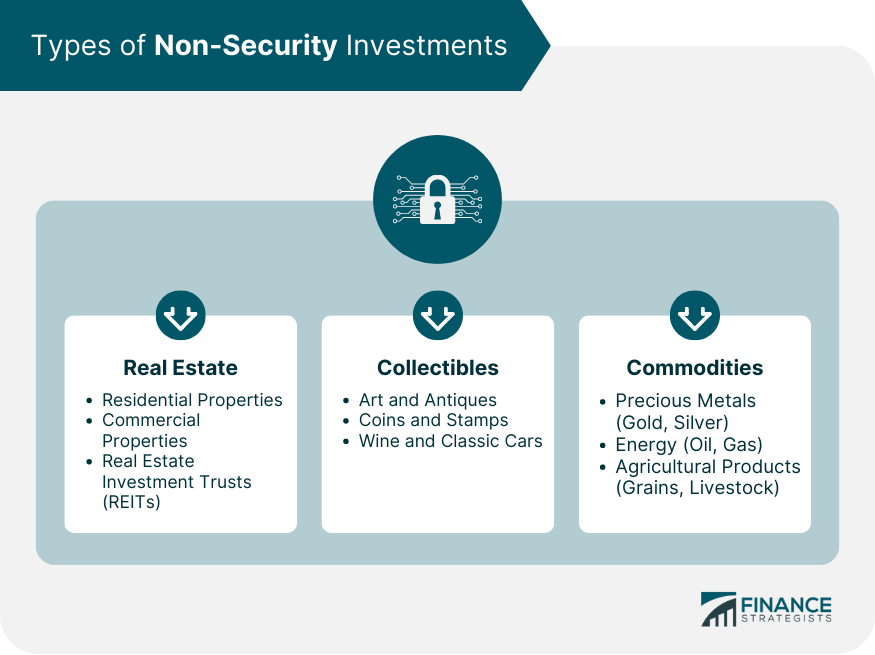

## Table of Contents

## What is the concept of non-security?

Non-security is a way of thinking about safety and protection that goes beyond just physical security measures like locks and cameras. It focuses on making people feel safe by building trust and good relationships within a community. Instead of relying only on guards and fences, non-security encourages open communication and cooperation among people to create a safer environment.

This approach recognizes that true safety comes from understanding and addressing the root causes of insecurity, such as social tensions or economic inequality. By working together and supporting each other, communities can reduce the need for strict security measures. Non-security is about creating a sense of belonging and mutual respect, which can lead to a more peaceful and secure society for everyone.

## How does non-security differ from traditional security concepts?

Non-security is different from traditional security because it doesn't just focus on things like guards, cameras, and locks. Traditional security is all about using these tools to keep people and places safe. It's like putting up a big wall to stop bad things from happening. But non-security thinks that safety is more than just walls and locks. It believes that feeling safe comes from having good relationships and trust with the people around you.

In non-security, the goal is to make everyone in a community feel like they belong and are looked after. This means talking openly, working together, and understanding each other's needs. Instead of just reacting to problems with more security, non-security tries to fix the reasons why people might feel unsafe in the first place. It's about building a strong community where everyone helps each other, so there's less need for strict security measures.

## What are the key mechanisms involved in non-security?

Non-security works by focusing on building strong relationships and trust within a community. Instead of using locks and cameras, it encourages people to talk openly and work together. When people feel connected and supported, they are more likely to look out for each other. This sense of community helps everyone feel safer because they know they are not alone. It's about creating a friendly and welcoming environment where everyone feels like they belong.

Another key mechanism is addressing the root causes of insecurity. Non-security looks at why people might feel unsafe, like social tensions or economic problems, and tries to fix these issues. By understanding and solving these problems, the need for strict security measures can be reduced. It's like fixing a leaky roof instead of just putting a bucket under it. When the community works together to solve these underlying issues, it creates a more peaceful and secure place for everyone.

## Can you explain the role of non-security in modern systems?

Non-security plays a big role in modern systems by focusing on building trust and strong relationships within communities. Instead of relying on guards and cameras, non-security encourages people to talk openly and work together. When people feel connected and supported, they are more likely to look out for each other. This sense of community helps everyone feel safer because they know they are not alone. It's about creating a friendly and welcoming environment where everyone feels like they belong.

In modern systems, non-security also helps by addressing the root causes of insecurity. It looks at why people might feel unsafe, like social tensions or economic problems, and tries to fix these issues. By understanding and solving these problems, the need for strict security measures can be reduced. It's like fixing a leaky roof instead of just putting a bucket under it. When the community works together to solve these underlying issues, it creates a more peaceful and secure place for everyone.

## What are the common applications of non-security?

Non-security is often used in schools and neighborhoods to make people feel safe. Instead of having lots of guards and cameras, schools might focus on having teachers and students talk openly and help each other. This way, everyone feels like they are part of a big family and are more likely to look out for each other. In neighborhoods, non-security means neighbors getting to know each other and working together to solve problems, like starting a community watch or helping those in need.

Another common place for non-security is in workplaces. Instead of just relying on security guards, companies might encourage team-building activities and open communication. This helps employees feel trusted and valued, which can make them more loyal and less likely to cause trouble. By focusing on building a good work environment, companies can create a safer and more productive place for everyone.

Non-security is also used in public spaces like parks and community centers. Instead of putting up lots of fences and signs, these places might focus on hosting events where people can come together and get to know each other. This builds a sense of community and makes people feel safer because they are surrounded by friends and familiar faces. By encouraging people to connect and support each other, these public spaces become more welcoming and secure.

## How is non-security implemented in software and hardware?

In software, non-security is implemented by focusing on building trust and cooperation among users. Instead of just using passwords and firewalls, software developers might create features that encourage open communication and teamwork. For example, a project management tool might have a chat feature where team members can easily talk to each other and solve problems together. This way, everyone feels included and supported, which can make them more careful and responsible with the software. By making the software easy to use and encouraging users to work together, it can become a safer and more reliable tool for everyone.

In hardware, non-security can be implemented by designing devices that promote a sense of community and trust. Instead of just relying on locks and alarms, hardware designers might create devices that are easy to share and use together. For example, a smart home system might allow family members to easily control and monitor the house together, making everyone feel more connected and safe. By focusing on creating user-friendly and collaborative hardware, it can help build a safer environment where everyone feels like they are part of a team.

## What are the potential risks associated with non-security?

Non-security can be risky because it relies a lot on people trusting and working together. If people don't get along or don't feel connected, non-security might not work well. For example, if neighbors don't talk to each other, they might not look out for each other, and bad things could still happen. Also, if someone in the group doesn't follow the rules or tries to cause trouble, it can make the whole community feel less safe.

Another risk is that non-security might not be enough to stop serious problems. While building trust and relationships is important, sometimes you still need locks and cameras to keep people safe. If a community only uses non-security and ignores other security measures, it might not be prepared for big threats like crime or violence. It's important to find a balance between non-security and traditional security to make sure everyone stays safe.

## How can non-security be evaluated and measured?

Non-security can be evaluated and measured by looking at how well people in a community trust and help each other. You can do this by asking people if they feel safe and supported, and if they think their neighbors or coworkers look out for them. Surveys and interviews can help gather this information. Another way is to see how often people work together to solve problems, like starting a neighborhood watch or helping someone in need. If people are working together and feeling connected, it's a good sign that non-security is working.

Another way to measure non-security is by looking at how well the community addresses the root causes of insecurity. This means checking if social tensions or economic problems are being solved. For example, if a school is helping students who are struggling with their studies or if a neighborhood is working to reduce poverty, these efforts can be signs of successful non-security. By looking at these factors, you can get a good idea of how well non-security is being implemented and if it's making a difference in making people feel safer.

## What are the advanced techniques for enhancing non-security?

Advanced techniques for enhancing non-security involve using technology to help people connect and work together better. For example, apps and websites can be used to create online communities where people can talk, share ideas, and help each other. These tools can make it easier for people to organize events or start projects that bring the community together. By using technology in this way, it can help build stronger relationships and trust, which are key parts of non-security.

Another technique is to focus on education and training to teach people how to work together and solve problems as a team. Workshops and classes can help people learn important skills like communication, conflict resolution, and teamwork. When people have these skills, they are better at building strong and supportive communities. This kind of education can also help people understand and address the root causes of insecurity, like social or economic issues, making non-security more effective.

## What are the current trends and future directions in non-security research?

Current trends in non-security research focus on using technology to help build stronger communities. Researchers are looking at how apps and online platforms can be used to bring people together and help them work together better. They are studying how these tools can make it easier for people to talk, share ideas, and solve problems as a team. Another trend is looking at how education and training can teach people important skills like communication and teamwork. By helping people learn these skills, researchers hope to make communities more supportive and safer.

Future directions in non-security research will likely continue to explore the role of technology in building trust and cooperation. Researchers might look at new ways to use [artificial intelligence](/wiki/ai-artificial-intelligence) and data to understand and address the root causes of insecurity, like social and economic issues. They could also study how virtual reality and other immersive technologies can help people feel more connected, even if they are far apart. As non-security becomes more important, research will focus on finding the best ways to make people feel safe and supported in their communities.

## How does non-security integrate with other security paradigms?

Non-security works well with other security ideas by making them stronger. Instead of just using locks and cameras, non-security focuses on making people feel safe by building trust and good relationships. When people trust each other and work together, they are more likely to look out for each other. This means that traditional security measures like guards and fences can work better because people are already feeling safer and more connected. For example, in a neighborhood with good relationships, people might be more likely to report suspicious activities to security, making the whole area safer.

In a workplace, non-security can help other security methods by creating a good team spirit. When employees feel valued and supported, they are more likely to follow security rules and help keep the workplace safe. For example, a company might use non-security by encouraging open communication and teamwork, while still having security cameras and access controls. By combining non-security with traditional security, the company can create a safer and more productive environment where everyone feels part of a team.

## What are the ethical considerations in the deployment of non-security systems?

When using non-security systems, it's important to think about fairness and respect for everyone. Non-security is about building trust and good relationships, so it's key to make sure that everyone in the community feels included and valued. If some people are left out or treated unfairly, it can hurt the trust and cooperation that non-security depends on. It's also important to be clear about what non-security means and how it works, so people understand and support it. If people don't know what's going on, they might feel unsure or unsafe, which can make non-security less effective.

Another big thing to consider is privacy. Non-security often involves people sharing information and working together, but it's important to protect personal information and respect people's privacy. If people feel like their privacy is being invaded, they might not want to participate in non-security efforts. It's also important to make sure that non-security doesn't take away from other important security measures. While building trust and community is good, it shouldn't make people less safe by ignoring things like locks and cameras when they are needed. Finding the right balance between non-security and traditional security can help make sure everyone stays safe and feels respected.

## What is Algorithmic Trading and How is it Applied?

Algorithmic trading involves the use of advanced computational algorithms for the execution of financial transactions, with a focus on achieving optimal speed and precision. This method leverages automated software systems to process trades based on pre-defined instructions such as timing, price, and [volume](/wiki/volume-trading-strategy). The primary aim is to capitalize on market conditions that a human trader might overlook due to limitations in speed and processing power.

The evolution of [algorithmic trading](/wiki/algorithmic-trading) has been marked by significant advancements, particularly in high-frequency trading ([HFT](/wiki/high-frequency-trading-strategies)). High-frequency trading represents a subset of algorithmic trading characterized by high-speed trade execution and the handling of large volumes of transactions in microseconds. HFT enhances market efficiency by providing [liquidity](/wiki/liquidity-risk-premium) and narrowing bid-ask spreads, thus reducing transaction costs.

In the valuation and trading of non-security financial instruments, algorithmic trading plays a crucial role. These instruments, which include derivatives, commodities, and insurance contracts, often possess inherent complexities due to their diverse nature and varying market dynamics. Algorithmic trading systems manage these complexities by rapidly analyzing vast datasets and executing trades that align with specific strategic objectives.

One key application of algorithmic trading in this context is the utilization of quantitative models to assess the fair value of non-securities. These models incorporate various market inputs such as historical prices, [volatility](/wiki/volatility-trading-strategies) metrics, and macroeconomic indicators to predict future price movements. An example of such a model is the Black-Scholes formula, traditionally used for pricing options:

$$
C(S, t) = S_0 \cdot N(d_1) - X \cdot e^{-r \cdot (T-t)} \cdot N(d_2)
$$

where:
- $C(S, t)$ is the call option price
- $S_0$ is the current stock price
- $X$ is the strike price
- $T$ is the time to maturity
- $r$ is the risk-free interest rate
- $N(d)$ is the cumulative distribution function of the standard normal distribution
- $d_1$ and $d_2$ are intermediary calculations based on the model inputs

Algorithmic trading operates not only to optimize trade execution but also to mitigate risks associated with price volatility. Through [machine learning](/wiki/machine-learning) techniques, algorithms can identify patterns and predict price changes, thereby allowing traders to adapt rapidly to changing market conditions.

Moreover, algorithmic trading systems can be integrated with risk management protocols to ensure adherence to regulatory requirements and to limit exposure to unanticipated market movements. By automating both the valuation and execution processes, financial institutions can focus on strategic decision-making, leaving the minutiae of trade mechanics to advanced systems.

The continuous improvement of technology and computational power promises further advancements in algorithmic trading practices. These developments will likely provide more sophisticated tools for managing and valuing non-security instruments, driving further innovation in financial markets.

## References & Further Reading

[1]: Black, F., & Scholes, M. (1973). ["The Pricing of Options and Corporate Liabilities."](https://www.cs.princeton.edu/courses/archive/fall09/cos323/papers/black_scholes73.pdf) Journal of Political Economy, 81(3), 637-654.

[2]: Hull, J. C. (2018). ["Options, Futures, and Other Derivatives"](https://www.semanticscholar.org/paper/Options%2C-Futures%2C-and-Other-Derivatives-Hull/89bdee500c8623864fc9eb7a471546aa713acc44) (10th Edition). Pearson.

[3]: Jarrow, R., & Turnbull, S. (1995). ["Pricing Derivatives on Financial Securities Subject to Credit Risk."](https://onlinelibrary.wiley.com/doi/abs/10.1111/j.1540-6261.1995.tb05167.x) The Journal of Finance, 50(1), 53-85.

[4]: Wilmott, P. (2006). ["Paul Wilmott Introduces Quantitative Finance"](https://www.amazon.com/Paul-Wilmott-Quantitative-Finance-Set/dp/0470018704) (2nd Edition). Wiley.

[5]: Harris, L. (2003). ["Trading and Exchanges: Market Microstructure for Practitioners."](https://www.amazon.com/Trading-Exchanges-Market-Microstructure-Practitioners/dp/0195144708) Oxford University Press.

[6]: Lopez de Prado, M. M. (2018). ["Advances in Financial Machine Learning."](https://www.amazon.com/Advances-Financial-Machine-Learning-Marcos/dp/1119482089) Wiley.

[7]: Chan, E. P. (2009). ["Quantitative Trading: How to Build Your Own Algorithmic Trading Business."](https://github.com/ftvision/quant_trading_echan_book) Wiley.

[8]: Jansen, S. (2018). ["Machine Learning for Algorithmic Trading: Predictive models to extract signals from market and alternative data for systematic trading strategies with Python."](https://github.com/stefan-jansen/machine-learning-for-trading) Packt Publishing.