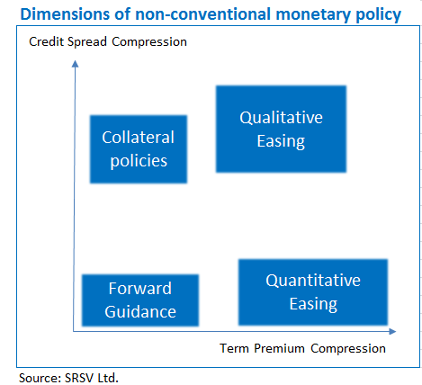

## Table of Contents

## What is non-standard monetary policy?

Non-standard monetary policy refers to unconventional methods that central banks use to influence the economy when traditional tools like interest rates are not enough. These methods are often used during times of economic crisis, like a deep recession or when inflation is very low. Instead of just changing interest rates, central banks might buy large amounts of government bonds or other financial assets to put more money into the economy and encourage spending and investment.

One common type of non-standard monetary policy is called quantitative easing (QE). In QE, a central bank buys financial assets, like government bonds, from banks and other financial institutions. This increases the amount of money in the economy and can help lower long-term interest rates, making it cheaper for people and businesses to borrow money. Another type is forward guidance, where the central bank tells the public about its future plans for interest rates, helping people and businesses make better financial decisions.

## How does non-standard monetary policy differ from traditional monetary policy?

Traditional monetary policy mainly involves changing the interest rate that central banks charge to commercial banks. When the central bank raises this rate, borrowing money becomes more expensive, which usually slows down spending and helps control inflation. On the other hand, lowering the rate makes borrowing cheaper, encouraging more spending and helping to boost the economy. This tool works well when the economy is running smoothly, but it can hit its limits during severe economic downturns or when interest rates are already very low.

Non-standard monetary policy comes into play when traditional methods aren't enough. Instead of just adjusting interest rates, central banks use other strategies like quantitative easing, where they buy large amounts of financial assets, like government bonds, to pump more money into the economy. This can help lower long-term interest rates and encourage more spending and investment when the economy is struggling. Another method is forward guidance, where the central bank communicates its future plans for interest rates, helping people and businesses plan their finances better. These unconventional tools are crucial during times of crisis when traditional methods fall short.

## What are the main types of non-standard monetary policies?

Non-standard monetary policies are special ways central banks help the economy when normal methods don't work well. One main type is called quantitative easing, or QE. In QE, the central bank buys lots of financial things like government bonds from banks and other places. This puts more money into the economy and can make long-term borrowing cheaper. It's like giving the economy a big push when it's stuck.

Another type is forward guidance. This is when the central bank tells everyone what they plan to do with interest rates in the future. By sharing their plans, people and businesses can make better choices about saving and spending money. It's like giving everyone a heads-up so they can plan better. These non-standard policies are really important when the economy is in a tough spot and needs extra help.

## When and why might a central bank implement non-standard monetary policies?

A central bank might use non-standard monetary policies when the economy is in big trouble and normal methods aren't working. This often happens during a deep recession or when inflation is too low. When the economy is struggling, just changing interest rates might not be enough to help. That's when the central bank needs to try something different to get things moving again.

These special policies, like buying lots of government bonds or telling everyone about future plans for interest rates, are used to put more money into the economy and make borrowing cheaper. By doing this, the central bank hopes to encourage people and businesses to spend and invest more, which can help the economy recover. Non-standard policies are like extra tools in the central bank's toolbox, used when the usual tools aren't strong enough to fix the problem.

## What is quantitative easing and how does it work?

Quantitative easing, or QE, is a special tool that central banks use to help the economy when it's in big trouble. It's like giving the economy a big push when it's stuck. When a central bank does QE, it buys a lot of financial things, like government bonds, from banks and other places. This puts more money into the economy, kind of like adding more water to a pond.

By buying these bonds, the central bank makes long-term borrowing cheaper. When borrowing is cheaper, people and businesses are more likely to take out loans to buy things or start new projects. This extra spending and investing can help the economy grow again. QE is like a big boost that helps the economy get moving when normal methods aren't working.

## Can you explain the concept of negative interest rates?

Negative interest rates are when banks have to pay to keep their money at the central bank instead of [earning](/wiki/earning-announcement) interest. It's like the opposite of what usually happens. Normally, when you put money in a bank, you get interest as a reward for saving. But with negative interest rates, banks are charged for holding onto their money, which is meant to encourage them to lend it out instead.

Central banks use negative interest rates to try and boost the economy when it's not doing well. By making it costly for banks to keep money parked at the central bank, they hope banks will lend more to people and businesses. More lending can lead to more spending and investing, which helps the economy grow. It's a way to get things moving when other methods aren't working.

## What are the potential benefits of non-standard monetary policies?

Non-standard monetary policies can help the economy when it's in big trouble. When normal ways of helping the economy, like changing interest rates, don't work, these special policies can step in. By doing things like quantitative easing, where the central bank buys lots of government bonds, more money gets into the economy. This can make borrowing cheaper for people and businesses, which might encourage them to spend and invest more. That extra spending and investing can help the economy start growing again.

Another benefit is that non-standard policies can help fight against really low inflation or even deflation, when prices keep going down. When inflation is too low, people might hold off on spending because they think prices will drop even more. Non-standard policies can put more money into the economy, which can help push prices up a bit and get people spending again. Overall, these special tools give central banks more ways to help the economy when it's really struggling.

## What are the risks and criticisms associated with non-standard monetary policies?

Non-standard monetary policies can have some downsides and people often criticize them. One big worry is that they might cause too much inflation if too much money gets into the economy. When central banks buy lots of bonds and put more money out there, prices could go up too fast. Another risk is that these policies might make it harder for banks to make money. If banks have to pay to keep their money at the central bank because of negative interest rates, they might struggle to stay profitable.

People also worry that non-standard policies might create bubbles in the economy. When borrowing is really cheap because of things like quantitative easing, people might take on too much debt and invest in things like houses or stocks, pushing their prices up too high. If these bubbles burst, it could hurt the economy a lot. Critics also say that these policies might not be fair. They can help big businesses and rich people more than others, because those groups are more likely to have the money and know-how to take advantage of low borrowing costs.

Overall, while non-standard monetary policies can help in tough times, they come with risks. They need to be used carefully to avoid causing more problems than they solve. Central banks have to watch closely to make sure these policies don't lead to too much inflation, hurt banks, create bubbles, or make the economy less fair.

## How have non-standard monetary policies been used historically?

Non-standard monetary policies have been used a lot since the big financial crisis in 2008. Back then, the economy was in big trouble and regular ways of helping it, like changing interest rates, weren't working. So, central banks in places like the United States, Europe, and Japan started using special tools. The Federal Reserve in the U.S. started buying lots of government bonds and other financial things in a program called quantitative easing. This put more money into the economy and helped make borrowing cheaper, which was meant to get people spending and investing again.

In Europe, the European Central Bank also used quantitative easing and even tried negative interest rates. This was a big deal because it was the first time a major central bank had ever charged banks to keep their money there. The idea was to make it more expensive for banks to just hold onto money, so they would lend it out instead. Japan used these policies too, trying to fight against really low inflation and a slow economy. Over the years, these non-standard policies have become important tools for central banks around the world, especially when the economy is in a tough spot.

## What is the impact of non-standard monetary policies on inflation and economic growth?

Non-standard monetary policies can help boost economic growth when the economy is struggling. When central banks use tools like quantitative easing, they put more money into the economy by buying government bonds and other financial assets. This can make borrowing cheaper for people and businesses, encouraging them to spend and invest more. When more money is spent and invested, it can help the economy grow again. For example, after the 2008 financial crisis, many central banks used these policies to help their economies recover.

However, these policies can also affect inflation. If too much money gets into the economy because of non-standard policies, it might cause prices to go up too fast, leading to high inflation. Central banks have to be careful to balance the need to boost the economy with the risk of causing too much inflation. On the other hand, these policies can also help fight against very low inflation or deflation, when prices keep going down. By putting more money into the economy, central banks can help push prices up a bit and get people spending again. Overall, non-standard monetary policies are powerful tools that need to be used carefully to help the economy without causing new problems.

## How do non-standard monetary policies affect financial markets?

Non-standard monetary policies can have a big impact on financial markets. When central banks do things like quantitative easing, they buy lots of financial assets like government bonds. This puts more money into the economy and can make the prices of these assets go up. When bond prices go up, their interest rates, or yields, go down. This can make borrowing cheaper, which might make people and businesses more likely to take out loans and invest in things like stocks. So, these policies can make financial markets more active and push up the prices of different investments.

But these policies can also cause some problems in financial markets. If too much money gets into the economy because of non-standard policies, it might create bubbles. A bubble happens when the prices of things like houses or stocks go up way too high because everyone is buying them. If these bubbles burst, it can cause big problems in the financial markets. Also, if people expect these policies to keep going, they might take on too much debt, thinking borrowing will always be cheap. This can make the financial markets riskier and less stable. So, while non-standard monetary policies can help financial markets in the short term, they need to be used carefully to avoid causing bigger problems later.

## What are the latest developments and future prospects for non-standard monetary policies?

Non-standard monetary policies have been used a lot in recent years, especially after big economic problems like the 2008 financial crisis and the economic effects of the COVID-19 pandemic. Central banks around the world have kept using tools like quantitative easing and negative interest rates to help their economies. For example, during the COVID-19 crisis, the Federal Reserve in the U.S. and the European Central Bank ramped up their bond-buying programs to put more money into the economy and keep things from getting worse. These policies have become a normal part of how central banks work, and they're ready to use them again if the economy runs into more trouble.

Looking ahead, non-standard monetary policies will probably keep being important tools for central banks. As economies change and new problems come up, central banks might need to find new ways to use these policies. They might try new things or change how they do quantitative easing and forward guidance. But central banks also have to be careful. They need to watch out for problems like too much inflation or bubbles in financial markets. The future of these policies will depend on how well central banks can balance helping the economy with keeping it stable and fair for everyone.

## References & Further Reading

[1]: Galí, J. (2015). ["Monetary Policy, Inflation, and the Business Cycle: An Introduction to the New Keynesian Framework."](https://archive.org/details/monetarypolicyin0000gali) Princeton University Press.

[2]: Aldridge, I. (2013). ["High-Frequency Trading: A Practical Guide to Algorithmic Strategies and Trading Systems."](https://www.amazon.com/High-Frequency-Trading-Practical-Algorithmic-Strategies/dp/1118343506) Wiley.

[3]: Cochrane, J. H. (2001). ["The Effects of Quantitative Easing on Interest Rates: Channels and Implications."](https://www.nber.org/papers/w17555) National Bureau of Economic Research.

[4]: Menkveld, A. J. (2013). ["High Frequency Trading and the New-Market Makers."](https://www.sciencedirect.com/science/article/pii/S1386418113000281) Review of Financial Studies, 27(3), 723-749.

[5]: Bank for International Settlements. (2020). ["Central Bank Digital Currencies: Foundational Principles and Core Features."](https://www.bis.org/publ/othp33.htm)

[6]: International Monetary Fund. (2023). ["World Economic Outlook Reports."](https://www.imf.org/en/Publications/WEO/Issues/2023/10/10/world-economic-outlook-october-2023)

[7]: Friedman, M. (1968). ["The Role of Monetary Policy."](https://www.aeaweb.org/aer/top20/58.1.1-17.pdf) American Economic Review, 58(1), 1-17.

[8]: Lopez de Prado, M. (2018). ["Advances in Financial Machine Learning."](https://www.amazon.com/Advances-Financial-Machine-Learning-Marcos/dp/1119482089) Wiley.

[9]: Jansen, S. (2020). ["Machine Learning for Algorithmic Trading."](https://github.com/stefan-jansen/machine-learning-for-trading) Packt Publishing.