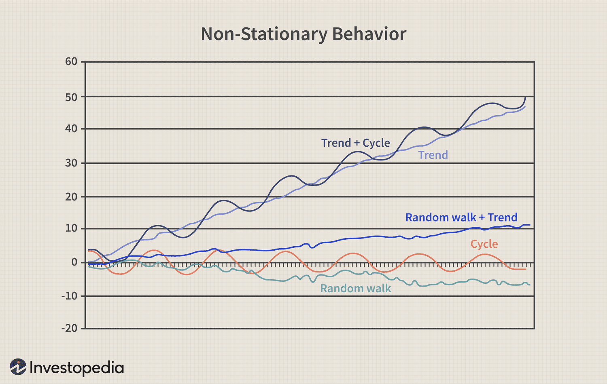

## Table of Contents

## What is non-stationarity in the context of financial data?

Non-stationarity in financial data means that the statistical properties of the data, like the mean and variance, change over time. This is important because many financial models assume that data is stationary, meaning these properties stay the same. If data is non-stationary, using these models can lead to wrong predictions and bad decisions. For example, stock prices often show non-stationarity because their trends and volatility can change due to economic events, policy changes, or market sentiment shifts.

Understanding non-stationarity is crucial for financial analysts and traders. They need to use special techniques to handle this kind of data. One common method is to transform the data to make it stationary, like taking the difference between consecutive values. This can help in making better forecasts and managing risks more effectively. Recognizing and dealing with non-stationarity helps in building more reliable financial models and strategies.

## Why is understanding non-stationarity important for financial analysis?

Understanding non-stationarity is important for financial analysis because it helps analysts and traders make better predictions and decisions. If financial data is non-stationary, it means that things like the average value or how much the data swings around can change over time. Many common financial models assume that data stays the same, so if it doesn't, using these models can lead to mistakes. By knowing that data can be non-stationary, analysts can adjust their methods to account for these changes, leading to more accurate forecasts and better risk management.

For example, stock prices often change in ways that are non-stationary. Economic news, policy changes, or shifts in what people think about the market can make stock prices move differently over time. If analysts don't recognize this, they might think a stock will keep going up just because it has been going up, without considering that the trend might change. By understanding non-stationarity, analysts can use special techniques, like looking at the differences between prices instead of the prices themselves, to make their models work better and help them make smarter investment choices.

## How can non-stationarity affect financial models and predictions?

Non-stationarity can mess up financial models and predictions because these models often assume that data stays the same over time. But if the data is non-stationary, things like the average value or how much the data moves around can change. When models don't account for these changes, they can give wrong predictions. For example, a model might predict that a stock will keep going up because it has been going up, but if the trend changes due to new economic news, the model won't see it coming.

To deal with non-stationarity, analysts need to use special methods to make the data more stable before using it in models. One common way is to look at the differences between values instead of the values themselves. This can help make the data more predictable and the models more accurate. By understanding and handling non-stationarity, analysts can make better forecasts and manage risks more effectively, leading to smarter investment decisions.

## What are the common types of non-stationarity observed in financial time series?

In financial time series, one common type of non-stationarity is trend non-stationarity. This happens when the average value of the data changes over time. For example, stock prices might go up or down over the long term due to economic growth or decline. If a model doesn't account for this trend, it might predict that the stock will stay at its current level, which could lead to wrong investment decisions.

Another type is seasonal non-stationarity. This is when the data changes in a regular pattern over time, like going up in some months and down in others. For instance, retail stocks might rise during the holiday season every year. If a model doesn't recognize this pattern, it might miss out on predicting these regular ups and downs, affecting how well it can forecast future prices.

A third type is [volatility](/wiki/volatility-trading-strategies) non-stationarity, where the amount of change in the data varies over time. This can happen when there are sudden events like financial crises or policy changes that make the market more unpredictable. If a model doesn't adjust for these changes in volatility, it might underestimate or overestimate the risk, leading to poor risk management and investment choices.

## What are some basic statistical tests used to detect non-stationarity in financial data?

One common test to check for non-stationarity in financial data is the Augmented Dickey-Fuller (ADF) test. This test helps figure out if the data has a trend that changes over time. It does this by looking at the differences between values to see if they are random or if they follow a pattern. If the test shows that the data is non-stationary, it means that the average value or how much the data moves around might be changing, and you might need to adjust your financial models to account for this.

Another test is the KPSS test, which works a bit differently. Instead of assuming the data is non-stationary and trying to prove it's stationary, the KPSS test assumes the data is stationary and tries to prove it's non-stationary. This test looks at the trend in the data and sees if it's strong enough to say the data is non-stationary. Using both the ADF and KPSS tests together can give a better picture of whether the data is really non-stationary, helping analysts make more accurate predictions and better decisions in finance.

## How does one differentiate between trend and seasonality in non-stationary financial data?

To tell the difference between trend and seasonality in non-stationary financial data, you need to look at how the data changes over time. A trend is a long-term movement in the data, like stock prices slowly going up or down over years. You can spot a trend by drawing a line through the data that shows its general direction. If the data keeps moving in one direction over a long time, that's a trend. On the other hand, seasonality is when the data goes up and down in a regular pattern, like every year or every month. For example, if a stock goes up every December because of holiday shopping, that's seasonality.

To separate these two, you can use statistical methods. One way is to use a method called decomposition, which breaks the data into trend, seasonality, and random parts. By looking at these parts, you can see if the data has a clear long-term direction (trend) or if it follows a repeating pattern (seasonality). Another way is to use a moving average to smooth out the data and see the trend more clearly, while looking at the data over shorter periods can help you spot the seasonal patterns. Understanding both trend and seasonality helps in making better financial predictions and decisions.

## What are the implications of ignoring non-stationarity when analyzing financial data?

Ignoring non-stationarity when analyzing financial data can lead to big problems. If you think the data's average or how much it moves around stays the same when it doesn't, your predictions can be way off. For example, if you're looking at stock prices and you don't realize they have a trend or seasonal pattern, you might think the stock will stay the same when it's actually going to go up or down. This can make you miss out on good investments or make bad ones.

Also, not dealing with non-stationarity can mess up how you manage risk. If the data's volatility changes over time and you don't account for it, you might think an investment is safer than it really is. This can lead to big losses if the market suddenly becomes more unpredictable. By understanding and handling non-stationarity, you can make better forecasts and keep your investments safer.

## Can you explain how to transform non-stationary financial data into stationary data?

To make non-stationary financial data into stationary data, you can use a method called differencing. This means you take the difference between one value and the next in the series. For example, if you have stock prices over time, you would subtract each price from the one that came before it. This helps get rid of trends because the differences between values are usually more stable than the values themselves. By doing this, you can make the data's average and how much it moves around stay the same over time, which is what makes it stationary.

Another way to transform non-stationary data is by using a technique called log transformation. This can help if the data is growing at a rate that keeps changing. You take the natural log of each value in your data series. This can make the data grow at a more steady rate, which can help make it stationary. Sometimes, you might need to do both differencing and log transformation to make the data really stable. By using these methods, you can make your financial models work better and make more accurate predictions.

## What advanced techniques exist for modeling non-stationary financial time series?

One advanced technique for modeling non-stationary financial time series is using autoregressive integrated moving average (ARIMA) models. ARIMA models are good at dealing with trends in data. They work by first making the data stationary through differencing, and then using the patterns in the data to predict future values. This method can help analysts understand how past values and trends affect what might happen next, making their predictions more accurate. ARIMA models are especially useful for financial data that has clear trends over time, like stock prices that slowly go up or down.

Another technique is using GARCH (Generalized Autoregressive Conditional Heteroskedasticity) models, which are great for dealing with changes in volatility. Financial data often gets more or less unpredictable over time, and GARCH models can handle this by looking at how the volatility changes. These models help predict not just the average value of the data, but also how much it might move around. This is really important for managing risk in finance, as it helps investors understand how likely big swings in prices are. By using GARCH models, analysts can better prepare for and manage the ups and downs in the market.

## How do machine learning approaches handle non-stationarity in financial data?

Machine learning approaches can handle non-stationarity in financial data by using techniques like recurrent neural networks (RNNs) and [long short](/wiki/equity-long-short)-term memory (LSTM) networks. These models are good at understanding patterns that change over time. They learn from past data, including how trends and volatility change, and use this information to make predictions. By looking at the whole history of the data, these models can adapt to new patterns and trends, making them useful for dealing with non-stationary financial time series.

Another way [machine learning](/wiki/machine-learning) helps is through online learning methods. These methods let the model keep learning as new data comes in, so it can adjust to changes in the data over time. This is important for financial data because markets can change quickly due to news or economic events. By constantly updating with new information, these models can stay accurate even when the data is non-stationary. This helps analysts and traders make better decisions in a changing market.

## What are the challenges in forecasting with non-stationary financial data?

Forecasting with non-stationary financial data is tough because the data keeps changing in ways that are hard to predict. The average value or how much the data moves around can shift over time, which means the patterns you see in the past might not be the same in the future. This makes it hard to use simple models that assume the data stays the same. If you don't account for these changes, your predictions can be way off, leading to bad investment decisions. For example, if you think a stock will keep going up just because it has been going up, you might miss out on signs that the trend is about to change.

Another challenge is that non-stationary data can be affected by many things, like economic news, policy changes, or shifts in what people think about the market. These factors can make the data move in unexpected ways, making it hard to find a reliable pattern to base your forecasts on. To deal with this, you need to use special methods to make the data more stable before you can use it in your models. This can be tricky and requires a lot of skill and understanding of how financial markets work. By recognizing and handling non-stationarity, you can make better forecasts, but it's a complex process that takes time and effort.

## How do regulatory bodies view the use of models that account for non-stationarity in financial markets?

Regulatory bodies see the use of models that account for non-stationarity in financial markets as important for keeping the markets safe and fair. They know that financial data can change a lot over time, and if models don't account for these changes, they can lead to wrong predictions and risky decisions. So, regulators want financial firms to use models that can handle non-stationarity. This helps make sure that the firms are managing their risks well and making good decisions based on accurate data.

Regulators also keep an eye on how these models are used to make sure they are doing their job right. They might set rules or guidelines about how to test and use these models. This is to make sure that everyone in the market is playing by the same rules and that the models are helping to keep the market stable. By encouraging the use of models that can deal with non-stationarity, regulators are trying to protect investors and keep the financial system strong.

## What is the key to understanding non-stationary time series data?

Non-stationary time series data exhibit dynamic statistical properties that vary over time, affecting the ability to accurately forecast and model such data. In financial markets, this non-stationarity often manifests as observable trends, cycles, or random walks, each bringing unique challenges to predictive modeling. Time series data that is non-stationary has statistical properties—such as mean, variance, and autocorrelation—that change over time, making it difficult to apply traditional statistical models which typically assume stationarity.

Non-stationarity is prevalent in financial datasets because markets are influenced by an array of variables including economic policies, geopolitical events, and investor behavior which inherently change over time. For instance, stock prices often follow a random walk, suggesting that future price movements are independent of past behavior and primarily driven by new information. Trends within such data might indicate persistent movement in one direction over a period, while cycles may reflect recurring patterns tied to economic conditions or consumer behavior.

A key strategy for dealing with non-stationary data is transforming it into a stationary format to facilitate more accurate forecasting. Stationary data is characterized by a constant mean and variance over time, enabling the application of various statistical and econometric tools designed for stationary processes.

Transformative techniques often used include differencing and detrending. Differencing involves subtracting the previous observation from the current one, which can help stabilize the mean of a time series by removing changes in the level of a series, thereby eliminating trend components. For example, applying first-order differencing can be seen as:

$$
Y'_t = Y_t - Y_{t-1}
$$

where $Y'_t$ is the differenced series. Detrending, on the other hand, aims to remove trends from the data, isolating cyclical and irregular components.

Advanced methodologies also incorporate the use of statistical tests such as the Augmented Dickey-Fuller (ADF) test and the Kwiatkowski-Phillips-Schmidt-Shin (KPSS) test to identify non-stationarity in the data. The ADF test, for instance, evaluates whether a unit root is present in an autoregressive model, which indicates non-stationarity.

In summary, understanding and managing non-stationary time series data is critical in financial analytics. By transforming non-stationary data into its stationary counterpart, analysts leverage econometric techniques for more robust and reliable forecasting, crucial for decision-making and strategic planning in financial markets.

## What are the types of non-stationary processes?

Non-stationary processes in financial data are characterized by statistically dynamic properties that evolve over time, presenting challenges for modeling and prediction. These processes can be categorized into various types based on their nature and behavior, significantly influencing financial forecasting and strategic decision-making.

Pure Random Walks represent a fundamental type of non-stationary process commonly encountered in financial markets. A pure random walk is a stochastic process where each variable's value is the sum of the previous value and a random shock. Mathematically, this can be expressed as:

$$
X_t = X_{t-1} + \epsilon_t
$$

where $X_t$ is the current value, $X_{t-1}$ is the previous value, and $\epsilon_t$ is a white noise error term with a mean of zero. This process implies that future values cannot be predicted from past values, as they are entirely driven by random disturbances.

Random Walks with Drift arise when there's a constant trend component in addition to the random shocks. The mathematical expression for this model is:

$$
X_t = \alpha + X_{t-1} + \epsilon_t
$$

where $\alpha$ represents the drift component, indicating a constant average change over time. In financial markets, this drift often reflects macroeconomic factors or persistent market sentiment, impacting long-term asset price predictions.

Deterministic Trends are another form of non-stationary processes in which the time series exhibits a predictable pattern, typically linear or nonlinear, over time. Such trends can be represented using polynomial functions or exponential growth models and often arise from structural economic changes or regulatory impacts within financial markets.

Stochastic Trends, contrasting deterministic trends, involve time series that appear to follow a path influenced by random influences yet exhibit some form of predictable pattern over time. This type of process can be modeled through differencing or other statistical transformations to enable effective forecasting.

Identifying and understanding these types of non-stationary processes is crucial for appropriate modeling and forecasting in finance, guiding the development of robust trading strategies and enhancing the accuracy of economic predictions.

## What is the conclusion?

Handling non-stationary data is fundamental to achieving reliable outcomes in financial modeling and [algorithmic trading](/wiki/algorithmic-trading). Such data presents unique challenges due to its dynamic nature, which can lead to inaccuracies if not addressed effectively. Key techniques such as differencing and adaptive algorithms are instrumental in transforming non-stationary data into a more stable form that can be effectively modeled and predicted.

Differencing is a widely used method to stabilize the mean of a time series by subtracting the previous observation from the current observation. This operation helps in eliminating trends and cycles, making the series stationary and more amenable to analysis. For instance, given a time series $X_t$, the differenced series $\Delta X_t$ is defined as:

$$
\Delta X_t = X_t - X_{t-1}
$$

This transformation is crucial for ensuring that statistical models produce reliable predictions.

Adaptive algorithms take this a step further by adjusting to changing market conditions in real time. Such algorithms often employ machine learning techniques to update and refine their predictive models continually. Online learning methods, which allow models to learn dynamically as new data becomes available, are particularly effective in non-stationary contexts.

Looking to the future, advancements in machine learning are poised to further enhance trading systems by better leveraging dynamic market conditions. Techniques involving [reinforcement learning](/wiki/reinforcement-learning), for example, enable models to make sequential decisions by learning optimal strategies through trial and error. This process is essential in environments where the decision-making process is sequential and feedback is received over time.

Continuous innovations in these areas will likely lead to more robust trading systems that can not only cope with non-stationarity but capitalize on it, ultimately driving more informed financial decision-making and improved market predictions.

## References & Further Reading

Raicharoen, T., Lursinsap, C., & Sanguanbhokai, P. (2003) present a study on the use of critical support vector machines (SVM) for time series prediction, a method which is particularly relevant for addressing non-stationarity in financial data. This research provides insights into how machine learning algorithms can be adapted to handle dynamic, non-stationary environments, maintaining the robustness of predictions across evolving market conditions.

Box, G.E.P., Jenkins, G.M., Reinsel, G.C., & Ljung, G.M. (2015) offer an in-depth examination in "Time Series Analysis: Forecasting and Control", which serves as an essential reference for understanding the foundational statistical methods for converting non-stationary time series data into a stationary form. Their comprehensive treatment includes techniques such as autoregressive integrated moving average (ARIMA) models, which are central to time series forecasting with an emphasis on practical application.

Hamilton, J. D. (1994) in "Time Series Analysis" provides a rigorous treatment of both stationary and non-stationary time series data, with methodologies for understanding and addressing non-stationarity. This text is crucial for those developing algorithmic trading strategies, covering theoretical and applied aspects of econometrics that equip practitioners with tools to effectively model and predict financial markets within non-stationary contexts. 

These references collectively offer a foundation for addressing the complexities of non-stationary processes in financial data analysis, emphasizing the transformation of such data into a form suitable for reliable forecasting and creating adaptive financial models.

