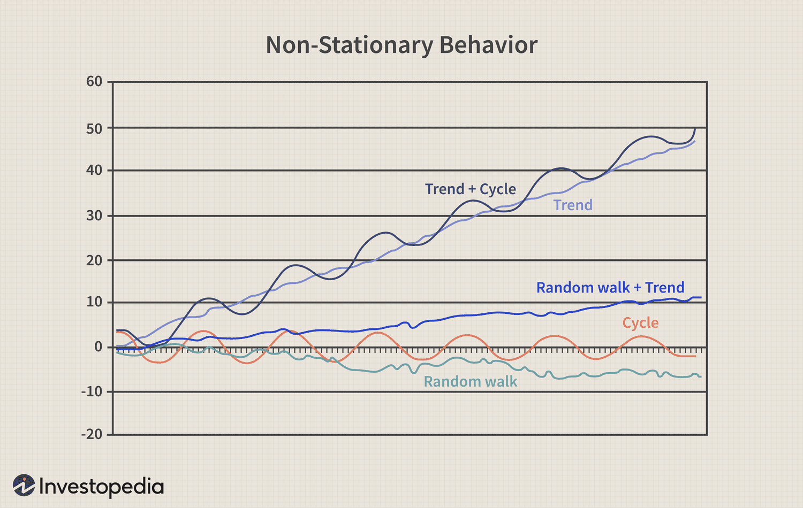

In the world of finance, understanding and analyzing time series data is crucial for decision-making. Time series analysis involves exploring datasets to identify patterns and trends over time. This allows financial analysts and traders to make informed predictions and decisions about future market movements, asset prices, and economic conditions. Effective time series analysis can lead to improved strategies and increased profitability in trading and investment.

Not all time series data are stationary, meaning their statistical properties like mean, variance, and autocorrelation can change over time. A stationary process has constant mean, variance, and autocorrelation structure over time, making it inherently easier to model. In contrast, non-stationary processes exhibit characteristics that fluctuate, posing challenges for traditional modeling techniques. Understanding non-stationary processes is essential in financial markets where many data points exhibit such behavior. This is because financial data often displays trends, seasonal patterns, and structural breaks which make straightforward modeling inaccurate unless these non-stationary elements are accounted for.



Financial markets, characterized by their dynamic environment, frequently present data that are non-stationary. Stock prices, for example, can display long-term growth trends, abrupt changes due to economic announcements, or cycles influenced by investor behavior, all contributing to their non-stationary nature. Therefore, financial analysts need to identify these patterns and apply transformations or models that can make the data stationary, facilitating improved forecasting and analysis.

This article discusses the types of non-stationary processes, how they can be transformed into stationary ones, and their significance in algorithmic trading. By leveraging the right approaches, traders and analysts can convert these complex datasets into reliable models, thus enhancing their ability to predict market behaviors and optimize trading strategies. Understanding these concepts is vital for developing robust models capable of navigating the volatile and ever-changing financial landscape.

## Table of Contents

## Understanding Non-Stationary Time Series Data

Non-stationary time series data is characterized by dynamic statistical properties, such as changing means, variances, and autocorrelations over time. Such data presents significant challenges in modeling and forecasting because the lack of constant statistical attributes implies that the historical patterns in the data cannot simply be extrapolated into the future. 

In financial markets, non-stationary processes are commonplace and manifest themselves as trends, cycles, or random walks. A trend indicates a long-term movement in the series that might be increasing or decreasing. Cycles could highlight oscillations due to economic expansions and contractions. Meanwhile, a random walk, which is prevalent in stock prices, exhibits a path that is impossible to predict given its dependence solely on a sequence of uncorrelated random variables.

To establish effective models and reliable forecasts, it's necessary to convert non-stationary data into stationary form. Stationarity allows for the utilization of various statistical and econometric tools. These tools assume that the properties of the series are constant over time, thus enabling predictions based on the assumption that the pattern identified will hold into the future. For instance, a simple autoregressive model assumes that the current output depends linearly on its previous outputs plus a stochastic term, which would only be fitting for stationary data.

The transformation of non-stationary series into stationary ones often involves techniques such as differencing, which involves calculating the differences between consecutive data points to eliminate trends. Another approach is detrending, which separates the deterministic trend from the stationary residuals. These methods aim to stabilize the mean of a time series by removing changes in the level of a series.

Despite these transformations, certain series may retain some features of non-stationarity even after becoming stationary. Understanding these characteristics is essential for decision-making, especially in a field as dynamic as finance, where the ability to anticipate future movements is indispensable for making educated decisions in investments and risk management.

## Types of Non-Stationary Processes

Non-stationary processes are distinctive in their lack of constant statistical properties, presenting challenges in financial modeling and prediction. Their behavior complicates efforts to forecast or analyze time-dependent data due to evolving mean, variance, and autocorrelation over time. Different non-stationary processes require specific approaches for transformation into stationary series, which is a necessary condition for many statistical models. Herein, we explore the prevalent types of non-stationary processes and their significance in financial analysis.

### Pure Random Walk
A pure random walk is a simple non-stationary process where the current value is equal to the previous value plus a stochastic error term. It is mathematically expressed as:

$$
Y_t = Y_{t-1} + \epsilon_t
$$

where $\epsilon_t$ is a white noise error term with constant variance. Pure random walks do not revert to a long-term mean, displaying paths heavily influenced by the variance of the increment. They are commonly used to model asset prices, illustrating price movements as unpredictable.

In financial analysis, the implications of a pure random walk are profound as prices showing such behavior suggest inefficient markets where historical data offer no predictive power for future movements.

### Random Walk with Drift
A random walk with drift adds a deterministic trend component to the simple random walk model:

$$
Y_t = \mu + Y_{t-1} + \epsilon_t
$$

where $\mu$ is a constant drift term. The inclusion of the drift term introduces a consistent upward or downward trend over time. This type of non-stationary process models financial time series like stock indices, where an upward drift could represent expected growth over time.

The drift component can significantly affect long-term predictions, implying that simple historical returns may not be indicative of future performance without accounting for the trend.

### Deterministic Trends
Deterministic trend processes exhibit a predictable, non-random trend component:

$$
Y_t = \beta_0 + \beta_1 t + \epsilon_t
$$

In this case, $\beta_1$ represents a deterministic time trend, leading to a stable upward or downward trajectory over time. These processes can appear in macroeconomic time series data, such as GDP growth.

Deterministic trends have deterministic elements that overshadow variance, affecting the choice of models in financial analysis. These trends may necessitate cautious strategies, like detrending, to transform data into a stationary form suitable for times series analysis.

### Stochastic Trends
Stochastic trends, as opposed to deterministic trends, arise from stochastic components embedded within the random walk process, often modeled with an integrated time series framework. This involves a process like:

$$
\Delta Y_t = \epsilon_t
$$

where $\Delta Y_t$ denotes the difference in consecutive observations. The integration component indicates that the series must be differenced to achieve stationarity, usually indicated in integrated models like ARIMA (AutoRegressive Integrated Moving Average).

#### Potential Impact on Financial Analysis
Understanding these non-stationary processes is crucial in financial analysis due to their significant impact on model prediction accuracy and efficacy. Misidentifying the type of process could lead to inappropriate modeling choices, resulting in unreliable forecasts. In [algorithmic trading](/wiki/algorithmic-trading), properly accounting for non-stationarity facilitates the design of more responsive and adaptive trading strategies that optimally engage with dynamic market conditions.

## Techniques for Addressing Non-Stationarity

Various statistical methods are employed to address non-stationarity in time series data, ensuring more reliable forecasting and analysis. One of the primary steps involves using statistical tests to identify non-stationarity features in the dataset.

### Statistical Tests for Non-Stationarity

Two widely recognized tests to ascertain the presence of non-stationarity are the Augmented Dickey-Fuller (ADF) Test and the KPSS (Kwiatkowski-Phillips-Schmidt-Shin) Test.

#### Augmented Dickey-Fuller Test
The ADF test is a type of unit root test that helps determine whether a time series is non-stationary due to the presence of a unit root. The null hypothesis of the ADF test is that the series possesses a unit root, implying non-stationarity. If the test statistic is less than the critical value, the null hypothesis is rejected, indicating the time series is stationary.

```python
from statsmodels.tsa.stattools import adfuller

# Example of conducting ADF test
result = adfuller(time_series_data)
print('ADF Statistic:', result[0])
print('p-value:', result[1])
```

#### KPSS Test
In contrast, the KPSS test has a null hypothesis that the data is stationary around a deterministic trend. The presence of a higher test statistic than the critical value would lead to rejecting the null hypothesis, suggesting the series is non-stationary.

```python
from statsmodels.tsa.stattools import kpss

# Example of conducting KPSS test
kpss_stat, p_value, lags, critical_values = kpss(time_series_data)
print('KPSS Statistic:', kpss_stat)
print('p-value:', p_value)
```

### Transforming Non-Stationary Data

Once non-stationary data is identified, various methods such as differencing and detrending can be applied to achieve stationarity.

#### Differencing
Differencing is a technique to eliminate trends and seasonality in a time series by subtracting observations from previous time steps. The first difference of a time series is defined as:

$$
y'_t = y_t - y_{t-1}
$$

Higher-order differencing can be applied if necessary:

$$
y''_t = y'_t - y'_{t-1}
$$

```python
import numpy as np

# Differencing example
first_difference = np.diff(time_series_data, n=1)
```

#### Detrending
Detrending involves removing trends from the data, often using regression methods. For example, fitting a linear model to the data and analyzing residuals can achieve detrending.

### Advanced Models for Non-Stationary Environments

Advanced models are essential for dynamic adjustment to non-stationary settings. Two such models include Kalman Filters and Adaptive Algorithms.

#### Kalman Filters
Kalman Filters offer a recursive solution for linear dynamic systems, effectively predicting time series data by considering the noise process. It specifies the system and measurement equations predicting the state variables over time, adapting as new data becomes available.

```python
from pykalman import KalmanFilter

# Example of Kalman Filter
kf = KalmanFilter(initial_state_mean=0, n_dim_obs=1)
measurements = time_series_data
filtered_state_means, _ = kf.filter(measurements)
```

#### Adaptive Algorithms
Adaptive algorithms, such as Exponential Smoothing State Space Models (ETS), adaptively adjust parameters as new data points are gathered. They are especially useful in environments where data properties, like [volatility](/wiki/volatility-trading-strategies), frequently change.

In summary, various techniques and models address non-stationary characteristics in time series data. Statistical tests like ADF and KPSS aid in identifying non-stationarity, while methods such as differencing and detrending transform datasets into stationary forms. Advanced models, including Kalman Filters and Adaptive Algorithms, provide dynamic adjustments to continually shifting data environments.

## Implications for Algorithmic Trading

In algorithmic trading, non-stationary data presents significant challenges in creating reliable predictive models. When the statistical properties of a dataset change over time, traditional models may become invalid, necessitating adaptive algorithms that can account for these variations. Non-stationary data can lead to biases, inefficient models, and ultimately, to incorrect trading decisions, making proper handling a pivotal requirement for financial success.

One primary challenge in dealing with non-stationary data is model invalidation. Models based on stationary assumptions can suffer from substantial prediction errors when subjected to non-stationary time series. A model might fit past data well but fail to predict future data accurately if it cannot adjust to shifts in underlying data distributions. Adaptive algorithms are critical as they can continuously learn and recalibrate with incoming data, thus maintaining their relevance.

Adaptive models are crucial in addressing the non-stationarity challenge. Machine learning approaches, such as online learning and [reinforcement learning](/wiki/reinforcement-learning), offer dynamic frameworks that adapt to changes in data patterns. Online learning algorithms adjust their parameters incrementally as each new data point arrives, maintaining the model’s validity over time. For instance, algorithms such as Stochastic Gradient Descent (SGD) can adjust weights with each trading cycle to account for shifts in market conditions.

Incorporating reinforcement learning adds another layer of adaptability. Models like Q-learning or deep Q-networks (DQNs) can interact with dynamic trading environments, learning optimal strategies through trial and error. These models adapt their responses based on feedback from the market, making them particularly suited to handle non-stationary environments where market conditions change rapidly and unpredictably.

Kalman Filters are another robust method for dealing with non-stationary processes. These filters work by estimating hidden variables from observed data and adjusting these estimates as new data becomes available. The Kalman Filter iteratively updates its predictions based on a dynamic process model and measurement data, thus providing real-time adjustments suitable for financial applications where data is continually updated.

Moreover, ensemble methods such as bootstrap aggregating (bagging) and boosting can improve the robustness of predictions by combining multiple models. By aggregating predictions from diverse models, these techniques can mitigate the risk associated with model invalidity due to non-stationary influences, thereby enhancing decision-making accuracy.

In essence, the effective handling of non-stationary data in algorithmic trading is integral for developing resilient trading algorithms. By leveraging adaptive models and [machine learning](/wiki/machine-learning) techniques, such as online learning and reinforcement learning, alongside traditional approaches like Kalman Filters, traders can craft robust models capable of navigating the complexities of ever-changing financial markets.

## Case Studies in Algorithmic Trading

In the field of algorithmic trading, effectively managing non-stationary data is crucial for creating robust and adaptive trading strategies. This section examines how firms address these challenges through strategies like [momentum](/wiki/momentum) trading, mean reversion trading, and [pair trading](/wiki/pair-trading). Companies such as Two Sigma and Citadel Securities leverage advanced methods to navigate non-stationary processes and maintain their competitive edge.

### Momentum Trading

Momentum trading involves capitalizing on existing trends in the market by assuming that securities which have performed well recently will continue to do so in the near future. To manage non-stationary data in momentum trading, firms often rely on techniques that filter out noise and focus on the underlying trend. This is achieved through the application of moving averages and trend-following indicators that adjust dynamically as new data becomes available.

In practice, firms like Two Sigma utilize machine learning models to enhance their momentum trading strategies. By employing techniques such as feature selection and dimensionality reduction, these firms can identify key indicators that signal momentum shifts, even when faced with non-stationary data. For instance, a momentum strategy might involve calculating the rolling mean and standard deviation of asset returns over a specified time window, and then identifying buy or sell signals based on the deviation from these metrics.

### Mean Reversion Trading

Mean reversion trading is based on the hypothesis that asset prices will return to their historical average over time. This strategy is particularly sensitive to non-stationary processes because the fundamental assumption relies on the stability of the mean. Firms overcome non-stationarity by employing statistical techniques such as cointegration to identify pairs of assets whose price relationship remains stable over time. 

A practical approach involves establishing a long position in one asset and a short position in another when their price ratio diverges from the historical average. To compute this, traders often use the following Python code snippet:

```python
import numpy as np
import pandas as pd
import statsmodels.api as sm

# Load price data for two assets
prices_asset1 = pd.Series(...)
prices_asset2 = pd.Series(...)

# Calculate the spread
spread = prices_asset1 - prices_asset2

# Apply the Augmented Dickey-Fuller test to check for stationarity
adf_result = sm.tsa.adfuller(spread)

if adf_result[1] < 0.05:  # p-value < 0.05 indicates stationarity
    # Implement mean reversion strategy
    pass
```

### Pair Trading

Pair trading exploits the statistical [arbitrage](/wiki/arbitrage) opportunities presented by the relative price movement of two correlated assets. This strategy is inherently designed to handle non-stationary data by focusing on the spread between asset pairs rather than the absolute price levels. Firms like Citadel Securities integrate sophisticated statistical models to determine optimal entry and [exit](/wiki/exit-strategy) points.

Quantitative models, including cointegration and vector error correction models (VECM), are applied to ensure that the spread remains stable. For instance, the Johansen cointegration test is frequently used to ascertain the presence of a long-term equilibrium relationship between asset pairs, allowing traders to predict when prices are likely to converge.

### Conclusion

Firms in algorithmic trading, such as Two Sigma and Citadel Securities, expertly manage non-stationary data by employing various advanced strategies and technologies. By integrating machine learning and statistical analysis, these companies effectively implement momentum trading, mean reversion trading, and pair trading strategies to yield significant returns. As the financial landscape continues to evolve, the ability to adaptively address non-stationary data is a pivotal component of successful algorithmic trading operations.

## Conclusion

Handling non-stationary data is crucial in financial modeling and algorithmic trading. Non-stationary time series data, characterized by changing statistical properties, can severely impact the reliability of forecasts and trading models. To address these challenges, traders must employ a variety of techniques to transform non-stationary data into stationary data, thereby enabling more accurate predictions and decision-making.

By using methods such as differencing, detrending, and more advanced techniques like Kalman Filters and adaptive algorithms, traders can create models that are resilient to the inherent fluctuations of financial data. These approaches allow traders to extract meaningful insights from datasets that would otherwise be unpredictable and unreliable.

Moreover, the integration of sophisticated machine learning models holds promising potential for further advancements. Machine learning algorithms, with their ability to recognize complex patterns and adapt to dynamic changes in data, can enhance the predictive capabilities of trading systems. These future advancements will likely include incorporating neural networks and reinforcement learning to improve model robustness and trading outcomes.

The path forward in algorithmic trading involves not only mastering existing statistical techniques but also embracing cutting-edge innovations in machine learning. By doing so, traders can not only navigate the volatile nature of financial markets more effectively but also achieve a competitive edge in the rapidly evolving landscape of algorithmic trading.

## References & Further Reading

[1]: Raicharoen, T., Lursinsap, C., & Sanguanbhokai, P. (2003). ["Application of critical support vector machine to time series prediction"](https://ieeexplore.ieee.org/abstract/document/1206419). Circuits and Systems, ISCAS'03. Proceedings of the 2003 International Symposium on. Vol. 5.

[2]: Box, G.E.P., Jenkins, G.M., Reinsel, G.C., & Ljung, G.M. (2015). ["Time Series Analysis: Forecasting and Control"](https://onlinelibrary.wiley.com/doi/book/10.1002/9781118619193). Wiley.

[3]: Hamilton, J. D. (1994). ["Time Series Analysis"](https://archive.org/details/timeseriesanalys0000hami). Princeton University Press.

[4]: Tarassow, A. (2006). ["Cointegration and the Predictability of Asset Returns"](https://people.duke.edu/~rb7/BDK_032006_new.pdf). Springer.

[5]: Timmermann, A., & Granger, C. W. J. (2004). ["Efficient market hypothesis and forecasting"](https://www.sciencedirect.com/science/article/abs/pii/S0169207003000128). International Journal of Forecasting, 20(1).

[6]: Zhang, G., Patuwo, B. E., & Hu, M. Y. (1998). ["Forecasting with artificial neural networks: The state of the art"](https://www.sciencedirect.com/science/article/pii/S0169207097000447). International Journal of Forecasting, 14(1).