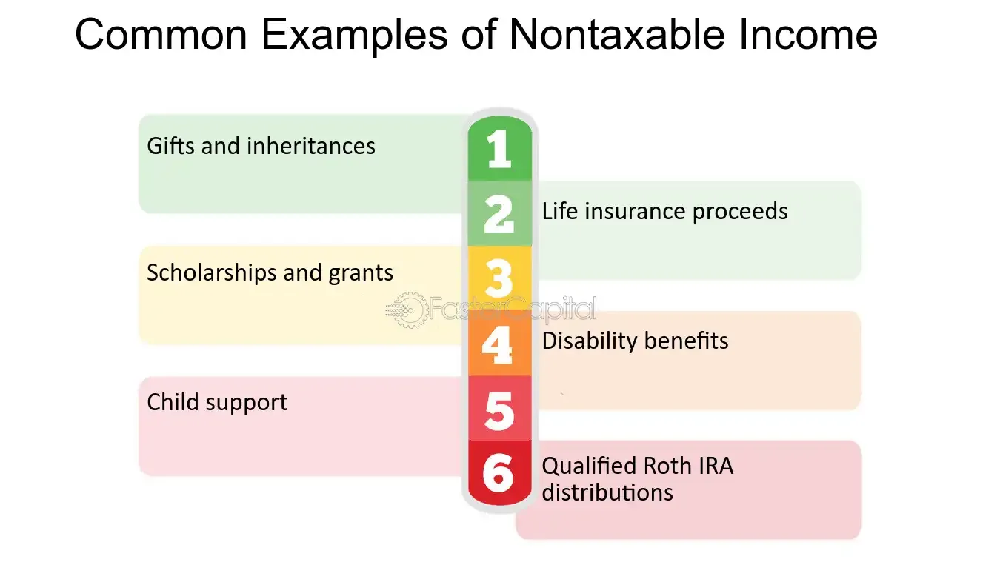

In the intricate world of finance, understanding non-taxable distributions is crucial for investors and corporations alike. Non-taxable distributions represent a form of tax-free income that can significantly impact an individual’s or corporation's financial strategy. These distributions are recognized for their potential to alter tax obligations, thereby influencing the financial health of stakeholders involved.

In this article, we aim to shed light on the concept of tax-free income through non-taxable financial distributions, particularly within the context of algorithmic trading and sophisticated investment strategies. Non-taxable distributions are not only pivotal in the broader financial landscape but also serve as a strategic tool for enhancing investment performance and minimizing tax burdens.



Algorithmic trading plays a transformative role in navigating non-taxable distributions. Algorithms can efficiently track corporate actions that lead to such distributions, allowing investors to adjust their portfolios dynamically. This capability empowers investors to optimize their tax liabilities and enhance their net returns by leveraging the tax efficiencies offered by non-taxable distributions.

By exploring what non-taxable distributions are and understanding their potential implications, investors can better align their investment strategies with overall financial goals. The focus will extend to the applications within algorithmic trading, highlighting the ways investors can harness these distributions effectively to achieve superior financial outcomes.

With these factors in consideration, an informed approach to managing non-taxable distributions can be a valuable aspect of financial strategy, benefiting both individual investors and corporate entities. As we proceed, the dialogue surrounding tax-free income will center on how these distributions can be integrated into investment frameworks to yield maximal advantage.

## Table of Contents

## Understanding Non-Taxable Distributions

Non-taxable distributions represent financial transactions in which corporations distribute assets to shareholders without immediate tax implications. Such distributions are crucial for strategic tax planning, as they allow shareholders to defer tax liabilities, primarily until specific conditions, such as the sale of stock, are fulfilled. 

These distributions can be classified into various types. One common form is the return of capital, which occurs when a company returns part of the initial investment back to its shareholders. This transaction is not considered taxable income because it is essentially the return of shareholders' original contributions. Rather than increasing taxable income, it reduces the shareholder's cost basis in the stock, which can directly affect capital gains upon the eventual sale of the security.

Stock dividends offer another form of non-taxable distribution. When a corporation issues additional shares to its shareholders in lieu of cash, this typically does not trigger an immediate tax event. The overall value of the investment remains unchanged, and like return of capital, stock dividends result in a reduction of the cost basis per share. The cost basis is recalculated by dividing the original investment cost by the new number of shares.

Stock splits increase the number of shares owned by shareholders proportionally, which typically also remains a non-taxable event. For instance, in a 2-for-1 stock split, a shareholder holding 100 shares will now own 200 shares, without any change in the aggregate market value of those shares. Like stock dividends, stock splits adjust the cost basis per share but do not affect the total cost basis of the investment.

Liquidating distributions occur when a corporation dissolves and returns any remaining capital to shareholders. These are not taxed as income unless the distribution exceeds the shareholder's cost basis in the stock. This means that initially, the distribution is treated as a return of capital, reducing the cost basis, and only once the cost basis reaches zero does any additional distribution become a taxable gain.

Understanding the mechanics of non-taxable distributions is essential, as these transactions influence future tax liabilities. By reducing the cost basis, these distributions can impact the calculation of capital gains when the stock is sold. Investors must maintain accurate records of these transactions to ensure proper reporting and to capitalize on potential tax benefits. This careful documentation and strategic timing in relation to these distributions can yield significant financial advantages by optimizing the tax treatment of investment returns.

## Types of Non-Taxable Distributions

Non-taxable distributions are a valuable concept for investors and corporations, as they provide ways to generate returns that aren’t immediately subject to taxation. Here, we explore various forms of non-taxable distributions and their implications.

**Return of Capital**: This occurs when companies return a portion of the original investment back to shareholders. Instead of being classified as taxable income, these distributions reduce the shareholder's cost basis in the investment. When the asset is eventually sold, the reduced cost basis can impact the calculation of capital gains. For example, if a shareholder invested $10,000 in a company and received a $1,000 return of capital, the adjusted cost basis would become $9,000.

**Stock Dividends**: These involve the issuance of additional shares to shareholders rather than cash payments. Generally non-taxable at the time of issuance, stock dividends increase the total number of shares owned without altering the total value of shares. This form of distribution can provide tax deferral benefits. For example, if a shareholder owns 100 shares and receives a 10% stock dividend, they would own 110 shares after the distribution.

**Stock Splits**: A stock split increases the number of shares owned by shareholders while maintaining the overall value of the shares relative to the company's market capitalization. Since stock splits do not involve the exchange of money, they are typically non-taxable events. If a shareholder holds 100 shares at $50 each and the company executes a 2-for-1 stock split, the shareholder would own 200 shares valued at $25 each.

**Merger and Acquisition Payments**: In certain mergers and acquisitions, shareholders may receive shares of the new entity in exchange for their current shares. If these transactions are structured properly, they may qualify as non-taxable events under specific conditions, such as Section 368(a) of the Internal Revenue Code in the U.S. This provision allows certain types of corporate reorganizations to be tax-free if continuity of interest and business purpose requirements are met.

**Liquidating Distributions**: When a corporation dissolves, it may return capital to shareholders. These distributions are typically non-taxable until they exceed the original investment's cost basis. Consequently, any amount received beyond the cost basis may be subject to capital gains taxation. For instance, if a shareholder's cost basis in a company's stock is $5,000 and they receive $6,000 in liquidating distributions, $1,000 may be subject to capital gains tax.

Understanding these various non-taxable distributions is essential for strategic financial planning, allowing investors to manage their portfolios effectively in a tax-efficient manner.

## Algorithmic Trading and Non-Taxable Distributions

Algorithmic trading has significantly transformed the landscape of financial investment by enabling the rapid and efficient execution of trades. When applied to non-taxable distributions, [algorithmic trading](/wiki/algorithmic-trading) can enhance investment strategies by identifying opportunities where tax obligations can be minimized, thereby maximizing returns. The key to achieving this lies in the algorithms' ability to process vast amounts of financial data and track corporate actions that lead to non-taxable distributions.

### Role of Algorithms in Non-Taxable Distributions

Algorithms can efficiently monitor corporate actions such as return of capital, stock dividends, and stock splits — all of which can result in non-taxable distributions. By continuously analyzing data streams from stock markets, an algorithm can predict these corporate actions based on patterns and historical data, allowing traders to adjust their portfolios to benefit from upcoming non-taxable events.

For instance, companies announcing stock dividends offer a non-cash distribution to shareholders. Algorithms can identify such announcements and help traders reposition their portfolios to optimize their exposure to the stock dividends without incurring immediate tax liabilities. This process not only aids in tax efficiency but also increases after-tax returns.

### Portfolio Optimization

Integrating algorithmic trading with non-taxable distributions requires advanced portfolio optimization techniques. Algorithms can rebalance portfolios by selecting assets that are likely to provide non-taxable distributions. This selection process is based on predicted actions and comparison with historical behaviors of stocks, maximizing tax efficiency.

Consider an algorithm tasked with optimizing a portfolio amid potential non-taxable distributions. The algorithm might use the following pseudo-code structure:

```python
def optimize_portfolio(portfolio, market_data):
    for security in portfolio:
        predicted_actions = predict_corporate_actions(security, market_data)
        if includes_non_taxable_distribution(predicted_actions):
            adjust_portfolio(portfolio, security)
    return portfolio

def predict_corporate_actions(security, market_data):
    # Implements machine learning models or traditional data analysis to predict actions
    pass

def includes_non_taxable_distribution(predicted_actions):
    # Checks predicted actions for non-taxable distributions
    return 'non-taxable' in predicted_actions

def adjust_portfolio(portfolio, security):
    # Rebalances the portfolio based on prediction
    pass
```

### Minimizing Taxable Income

By predicting and acting on non-taxable distributions, traders can substantially minimize their taxable income. Algorithmic trading systems employ sophisticated models to anticipate market shifts influenced by these distributions, allowing traders to relinquish positions that might otherwise increase tax liabilities while reinforcing those that enhance after-tax yield.

To conclude, the synergy between algorithmic trading and non-taxable distributions offers substantial benefits in reducing tax liabilities and increasing net returns. By leveraging data-driven strategies, investors can tailor their portfolios to harness the full potential of non-taxable financial mechanisms.

## Implications and Considerations for Investors

Investors must recognize the significant impact non-taxable distributions have on both tax liabilities and financial reporting. These distributions can alter the tax landscape by reducing the cost basis of investments, thereby affecting future capital gains calculations. As a result, investors can potentially minimize their taxable income if these distributions are managed correctly.

Proper record-keeping is paramount. Documentation should accurately reflect all non-taxable distributions received to effectively track adjustments to the investment's cost basis. Failure to maintain precise records can lead to significant discrepancies during tax assessments, potentially resulting in penalties. It's crucial that investors employ meticulous tax planning strategies. This involves assessing the timing and type of distributions received and their implications on personal or corporate tax obligations. By strategically timing the sale of assets influenced by non-taxable distributions, investors can further align tax liabilities with their broader financial strategy.

Additionally, investment strategies ought to be constructed with an understanding of the timing and nature of non-taxable distributions. For example, selecting investments based on anticipated corporate actions like stock splits or return of capital might enhance the tax efficiency of an investment portfolio. Investors should align these decisions with their financial goals, considering factors like the potential reduction in cost basis and how it may affect the timing of future asset sales.

To further compound tax efficiency, investors can leverage algorithmic trading strategies to monitor non-taxable distribution events and dynamically adjust investment portfolios. Python, being well-regarded for its capability in financial data analysis, could serve as a powerful tool for implementing such strategies. By employing algorithms that predict distribution events and adjust portfolio allocations accordingly, investors can optimize after-tax returns.

In conclusion, understanding non-taxable distributions and their implications requires an integration of precise record-keeping, adept tax planning, and strategic investment. By harmoniously consolidating these aspects, investors can capitalize on the tax advantages presented by these distributions, ultimately enhancing their financial health and achieving their investment objectives.

## Case Studies in Real Companies

Analyzing non-taxable distributions through real companies such as Philip Morris International, Microsoft, and Alphabet provides valuable insights into effectively utilizing these financial strategies for tax efficiency.

**Philip Morris International (PMI):** 

Philip Morris International has substantially leveraged non-taxable distributions, notably through stock dividends, as a strategic approach to enhance shareholder value. By issuing stock dividends instead of cash payouts, PMI allows shareholders to receive additional shares without immediately incurring tax liabilities. This method is particularly advantageous in jurisdictions where cash dividends are taxable upon receipt. Over the years, investors in PMI have benefited from compounded growth as the additional shares appreciate in value. This strategy aligns with the goal of maintaining investor interest without burdening them with immediate tax obligations.

**Microsoft Corporation:**

Microsoft has employed stock splits as a form of non-taxable distribution to its advantage, thereby supporting long-term investment growth. A noteworthy example is the 2-for-1 stock split executed in 2003. Such actions help in making shares more accessible to a wider pool of investors by lowering the per-share price while maintaining overall market capitalization. Since stock splits do not result in a direct economic gain, no immediate taxes are levied on shareholders. This form of distribution has historically increased [liquidity](/wiki/liquidity-risk-premium) and retained investor interest in the company’s stock over extended periods.

**Alphabet Inc.:**

Alphabet, the parent company of Google, has effectively utilized merger and acquisition payments as a non-taxable distribution mechanism. During strategic acquisitions, Alphabet often engages in stock-for-stock transactions, which, under specific conditions, are non-taxable. For instance, if an Alphabet shareholder receives shares from a target company during a merger, and both sets of shares are considered substantially similar, the exchange might not trigger immediate tax consequences. This approach supports Alphabet's strategic growth initiatives while offering shareholders a tax-efficient method to enhance portfolio value.

Incorporating non-taxable distributions into corporate strategies requires careful consideration of tax laws and market conditions. By examining how leading companies utilize these strategies, investors can gain insights into potential opportunities for tax-free income, ultimately optimizing their investment outcomes. Understanding these corporate strategies equips investors with the knowledge to identify and leverage non-taxable distribution opportunities effectively, thus maximizing after-tax returns.

## Conclusion

Non-taxable distributions provide distinct opportunities for generating tax-efficient income and maximizing shareholder value. These financial mechanisms allow investors to receive returns without immediate tax implications, which can significantly optimize after-tax investment returns. Incorporating such distributions into investment strategies requires a comprehensive understanding of both the tax code and corporate financial behavior.

A strategic approach to investment can undeniably enhance the benefits obtained from these distributions. Algorithmic trading, for instance, offers advanced methods for optimizing portfolio performance in this context. By employing algorithms to analyze and react to non-taxable distributions, investors can dynamically adjust their holdings to capitalize on tax advantages. These algorithms can identify when a corporation announces a non-taxable event, enabling investors to accurately time their trades. This approach not only maximizes the potential for tax-efficient income but also aligns with evolving market dynamics.

To illustrate, consider a Python algorithm capable of tracking corporate announcements and adjusting portfolios based on expected changes in non-taxable distributions:

```python
import yfinance as yf

def monitor_corporate_actions(ticker):
    stock = yf.Ticker(ticker)
    actions = stock.actions
    return actions

def adjust_portfolio(actions):
    for action in actions:
        if action['Type'] == 'Non-Taxable':
            # Logic to adjust investment strategy
            print(f"Adjusting for {action['Date']}: {action['Value']}")

ticker_symbol = 'AAPL'
actions = monitor_corporate_actions(ticker_symbol)
adjust_portfolio(actions)
```

With tools like this, investors can make informed decisions tailored to minimizing tax liabilities, thereby increasing the net return on investments over time.

For both investors and corporations, effectively managing non-taxable distributions involves understanding their impact on financial strategies. Investors should be aware of how these distributions affect their cost basis and future capital gains calculations, while corporations must align these payments with shareholder value maximization.

In conclusion, a thorough grasp of non-taxable distributions' characteristics and potentials can substantially benefit investors and corporations. By strategically incorporating these opportunities into broader financial strategies, they can enhance overall financial performance, thereby optimizing shareholder value and ensuring sustainable growth.

## References & Further Reading

[1]: Bergstra, J., Bardenet, R., Bengio, Y., & Kégl, B. (2011). ["Algorithms for Hyper-Parameter Optimization."](https://dl.acm.org/doi/10.5555/2986459.2986743) Advances in Neural Information Processing Systems 24.

[2]: ["Advances in Financial Machine Learning"](https://www.amazon.com/Advances-Financial-Machine-Learning-Marcos/dp/1119482089) by Marcos Lopez de Prado

[3]: ["Evidence-Based Technical Analysis: Applying the Scientific Method and Statistical Inference to Trading Signals"](https://www.amazon.com/Evidence-Based-Technical-Analysis-Scientific-Statistical/dp/0470008741) by David Aronson

[4]: ["Machine Learning for Algorithmic Trading"](https://github.com/stefan-jansen/machine-learning-for-trading) by Stefan Jansen

[5]: ["Quantitative Trading: How to Build Your Own Algorithmic Trading Business"](https://www.amazon.com/Quantitative-Trading-Build-Algorithmic-Business/dp/1119800064) by Ernest P. Chan