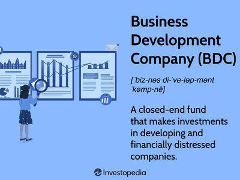

Investment opportunities have undergone significant transformations, with business development companies (BDCs) playing a crucial role in this evolution. Among these, non-traded BDCs have surfaced as a noteworthy investment vehicle, offering unique opportunities distinct from their publicly traded counterparts. This article aims to unravel the complexities of non-traded BDCs, highlighting their significance, inherent challenges, and the nascent but growing role of algorithmic trading within this sector.

Non-traded BDCs have garnered attention for their potential to provide substantial returns, an aspect that makes them attractive to investors eager to diversify their portfolios beyond traditional investment avenues. Unlike publicly traded BDCs, which offer liquidity through stock exchanges, non-traded BDCs focus on long-term capital appreciation and income production through investments in private or less liquid small to medium-sized enterprises. This focus aligns well with investors seeking stability, as non-traded BDCs are less swayed by the erratic fluctuations of public markets.



The promise of high returns, however, comes with accompanying risks. Investors must remain cognizant of the drawbacks associated with non-traded BDCs, such as high fees, limited liquidity, and stringent redemption policies. Therefore, a comprehensive understanding of these risks is crucial for potential investors who aim to successfully navigate this market.

In recent years, the incorporation of algorithmic trading has started to transform how investments are managed within the BDC sector. This technological innovation leverages complex algorithms and data analytics to optimize investment decisions, enhancing returns while attempting to minimize associated risks. The ensuing sections will discuss the impact of these advancements on the performance of non-traded BDCs and their strategic management.

Ultimately, non-traded BDCs represent a compelling component of a diversified investment strategy, offering a blend of high reward potential and inherent risk. By meticulously exploring this investment option, investors can harness the benefits of non-traded BDCs, reinforced by emerging technological trends in algorithmic trading, to achieve better financial outcomes.

## Table of Contents

## Understanding Business Development Companies

Business Development Companies (BDCs) were established to facilitate investment in small to medium-sized enterprises by enhancing their access to the capital markets. This initiative arose from the need to support smaller businesses that often encounter difficulties in obtaining sufficient funding from traditional bank loans or public stock offerings. BDCs play a crucial role in closing the gap between these small to medium-sized enterprises and greater financial opportunities by acting as intermediaries that channel capital from investors to businesses.

BDCs come in two primary forms: publicly traded and non-traded. Publicly traded BDCs are listed on stock exchanges, offering investors the advantage of [liquidity](/wiki/liquidity-risk-premium). This allows investors to buy and sell shares easily, akin to trading in regular stocks, which is beneficial for short-term strategic maneuvers or when facing unforeseen financial needs. In contrast, non-traded BDCs are not listed on public exchanges and are designed for long-term investments. These long-term strategies often lead to potentially higher yields, as they invest in private or distressed companies that might result in significant returns over time.

The governance and operations of BDCs are strictly regulated under the Investment Company Act of 1940, which underscores their legitimacy and crucial role in corporate finance. This legislation provides a rigorous framework within which BDCs must operate, ensuring transparency and a high level of accountability. For BDCs, adhering to these regulations not only assures compliance but also fosters trust among investors by offering a structured and legally sound investment avenue.

BDCs not only contribute significantly to economic growth by supporting mid-sized business ventures but also offer investors a unique opportunity to invest in a segment of the market that is less accessible via conventional investment vehicles. Through their dual capability to obtain significant returns and support smaller businesses, BDCs are instrumental in shaping the landscape of corporate finance.

## Advantages and Disadvantages of Non-Traded BDCs

Non-traded Business Development Companies (BDCs) have become a popular option for investors seeking substantial gains, primarily due to their focus on private or distressed firms that have the potential to yield high returns. These entities invest in companies that do not have immediate access to public markets, allowing them to negotiate favorable terms and potentially capitalize on significant growth opportunities. This ability to target investments in niche or emerging sectors distinguishes non-traded BDCs from traditional investment vehicles.

One of the primary advantages of non-traded BDCs is their insulation from public market [volatility](/wiki/volatility-trading-strategies). Since their assets are not subject to the same fluctuations as public equities, they offer a degree of stability that can be appealing to investors during periods of market instability. This feature can make non-traded BDCs an attractive option for those looking to diversify their portfolios with assets that have a different risk-return profile compared to publicly traded securities.

However, investing in non-traded BDCs is not without challenges. One significant concern is the high fee structure often associated with these investments. Management fees and other operational costs can be substantial, which may erode overall investment returns. Additionally, non-traded BDCs are typically characterized by illiquidity, meaning investors' capital is often tied up for extended periods. The lack of a secondary market for these securities means that liquidating holdings can be difficult, and redemption restrictions can further limit investors' ability to [exit](/wiki/exit-strategy) their positions.

These factors underscore the importance of thorough due diligence for potential investors. Understanding the specific fee structures, assessing the quality of the underlying investments, and evaluating the track record and expertise of the management team are critical steps in mitigating risks. While the potential for high returns is present, it is crucial for investors to weigh these benefits against the inherent disadvantages, such as illiquidity and high costs, to make informed investment decisions.

## Algorithmic Trading and BDCs

Algorithmic trading, widely adopted across financial markets, is now integral to the operation and management of Business Development Companies (BDCs). The automation and precision offered by algorithms allow BDCs to optimize investment returns while managing risk effectively. As BDCs typically invest in small to medium-sized and often private companies, leveraging [algorithmic trading](/wiki/algorithmic-trading) can enhance decision-making processes by analyzing vast data sets and swiftly executing trades.

At the core of algorithmic trading is the ability to process and analyze large volumes of data to identify patterns that human traders might overlook. These algorithms employ various statistical and mathematical models to forecast market movements and asset performance. For BDCs, which rely on strategic investments in growth-oriented businesses, this capability is vital. By predicting potential shifts in market conditions, algorithms can aid in adjusting portfolios dynamically, ensuring that the investments align with market signals.

The impact of algorithmic trading on BDC performance can be measured through several key performance indicators, including increased alpha generation, improved Sharpe ratios, and reduced transaction costs. For instance, the ability to execute trades within milliseconds eliminates the slippage traditionally associated with manual trading. Furthermore, algorithms can reduce biases in trading decisions, leading to more consistent performance outcomes.

A practical implementation of algorithmic trading in BDCs involves Python programming for constructing predictive models. By using packages like NumPy, pandas, and sklearn, analysts can develop [machine learning](/wiki/machine-learning) models to predict asset price changes based on historical data. Here's a basic example of using Python to train a regression model on historical BDC performance data:

```python
import pandas as pd
from sklearn.model_selection import train_test_split
from sklearn.linear_model import LinearRegression

# Load BDC performance data
data = pd.read_csv('bdc_performance_data.csv')
features = data[['feature1', 'feature2', 'feature3']]  # example feature columns
target = data['asset_price']

# Split data into training and test sets
X_train, X_test, y_train, y_test = train_test_split(features, target, test_size=0.2, random_state=42)

# Train a linear regression model
model = LinearRegression()
model.fit(X_train, y_train)

# Predict asset prices
predictions = model.predict(X_test)
```

The methodology behind these practices helps BDCs make informed investment choices based on empirical data, not just speculation. Additionally, algorithmic trading facilitates high-frequency trading ([HFT](/wiki/high-frequency-trading-strategies)), allowing BDCs to capitalize on fleeting market opportunities that occur over very short time frames, which would be impractical with manual trading.

While algorithmic trading offers substantial benefits, it also introduces challenges such as model risk and reliance on the quality of input data. For BDCs, ensuring that models are robust, regularly updated, and fed with comprehensive, high-quality data is crucial to maintain performance. 

In conclusion, the integration of algorithmic trading within BDCs represents an evolution in investment strategy. It enables these companies to navigate complex markets with greater precision and agility, thereby enhancing their ability to generate returns while effectively managing risk.

## Market Challenges and Future Outlook for Non-Traded BDCs

The market for non-traded Business Development Companies (BDCs) has encountered several significant challenges, driven primarily by global economic disruptions and the inherent volatility of the industries in which they invest. The COVID-19 pandemic, for instance, introduced widespread economic instability, affecting the cash flows and operational resilience of the small to medium-sized enterprises (SMEs) that BDCs typically fund. This resulted in fluctuating portfolio values and posed difficulties in valuation and performance forecasting.

The non-traded nature of these BDCs inherently limits liquidity, which can exacerbate financial strains during market downturns. Unlike their publicly traded counterparts, non-traded BDCs cannot leverage the liquidity of public markets to adjust their investment portfolios quickly in response to volatile economic conditions. This illiquidity presents a challenge for investors, as it restricts their ability to redeem shares or access capital swiftly during financial distress.

Moreover, industry-specific volatility, especially in sectors like energy, retail, and real estate—the common investment targets for BDCs—further complicates their performance outlook. Economic factors such as fluctuating oil prices, changing consumer habits, and declining retail space utilization have a direct impact on the profitability and risk profile of BDC portfolios.

However, despite these challenges, the market is showing signs of resilience and adaptation. Non-traded BDCs are increasingly refining their investment strategies, focusing on more resilient sectors, diversifying their asset bases, and embracing innovations like algorithmic trading to enhance decision-making processes. Such strategic shifts are aimed at improving portfolio performance and risk management, even in tumultuous times.

The future outlook for non-traded BDCs is cautiously optimistic. As global economies recover and stabilize post-pandemic, demand for capital by SMEs is expected to rise, offering new investment opportunities for BDCs. Furthermore, regulatory reforms and technological advancements are anticipated to provide a more supportive environment for non-traded BDCs, potentially increasing their appeal to a broader range of investors.

In summary, while the non-traded BDC market faces notable challenges from economic disruptions and sector-specific volatilities, strategic adaptations and market recoveries offer a promising future. Continued innovation and strategy recalibration will be crucial for these entities to capitalize on emerging opportunities and navigate the complexities of the investment landscape.

## Conclusion

Non-traded Business Development Companies (BDCs) offer investors a unique set of opportunities that distinguish them from traditional equities. These opportunities are primarily driven by the potential for high-yield returns, which are made possible by investments in a diverse range of private or distressed companies. While attractive, these high yields come with their own set of substantial risks. Investors face challenges such as high fees, illiquidity, and redemption restrictions, which necessitate careful due diligence and a profound understanding of these investment vehicles.

For those willing to navigate these complexities, non-traded BDCs offer an advantageous pathway to portfolio diversification. The challenges inherent in investing in non-traded BDCs are not insurmountable. Through comprehensive research and an understanding of market dynamics, informed investors can strategically position themselves to leverage the benefits these investment options present. This requires not only an understanding of specific BDC structures and underlying assets but also a keen awareness of market conditions.

The integration of algorithmic trading has significantly bolstered the potential of non-traded BDCs. By employing sophisticated algorithms and advanced data analytics, investors can optimize portfolio performance, enhancing returns while mitigating associated risks. Algorithmic trading introduces a level of efficiency and precision in executing investment strategies that traditional methods may lack, thus driving innovation across the financial landscape.

In conclusion, non-traded BDCs represent a compelling mix of risk and reward. They stand as a formidable option for those looking to diversify their investment portfolios beyond conventional equities. With the right strategies and tools in place, particularly with the advancements in algorithmic trading, investors can capitalize on the opportunities presented by non-traded BDCs while managing inherent risks. It is this balance of high-yield potential and strategic risk management that makes non-traded BDCs an intriguing proposition for investors aiming to enhance their investment portfolios.

## References & Further Reading

[1]: MacKenzie, M. (2022). ["Investing in BDCs: Pros and Cons"](https://www2.mackenzieinvestments.com/content/dam/igm/en/corpresp/assets/docs/mkz-2022-sustainable-investing-report-en.pdf). Investopedia.

[2]: Nichols, S. (2021). ["Business Development Companies: An Introduction"](https://mercercapital.com/media/introduction-business-development-companies/). The Motley Fool.

[3]: Lopez de Prado, M. (2018). ["Advancements in Financial Machine Learning"](https://www.amazon.com/Advances-Financial-Machine-Learning-Marcos/dp/1119482089). Wiley.

[4]: Chan, E. (2013). ["Algorithmic Trading: Winning Strategies and Their Rationale"](https://github.com/ftvision/quant_trading_echan_book). Wiley.

[5]: Levinson, M. (2016). ["Guide to Business Development Companies"](https://www.fool.com/investing/dividends-income/2007/01/08/an-investors-guide-to-business-development-compani.aspx). The Balance.