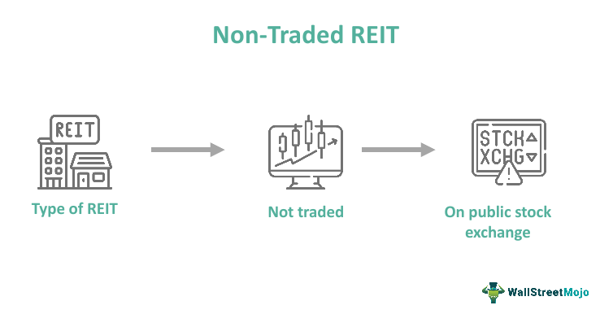

## Table of Contents

## What is a Non-Traded Real Estate Investment Trust (REIT)?

A Non-Traded Real Estate Investment Trust, or Non-Traded REIT, is a type of real estate investment that is not listed on public stock exchanges. This means you can't buy or sell shares of a Non-Traded REIT on the stock market like you can with stocks or traded REITs. Instead, these investments are typically offered through broker-dealers or financial advisors. Because they are not publicly traded, Non-Traded REITs might be less liquid, meaning it can be harder and take longer to sell your investment if you need to.

Non-Traded REITs invest in real estate properties, such as apartments, shopping centers, or office buildings, and they earn money from rent and property sales. Investors in Non-Traded REITs receive dividends from the income these properties generate. These investments can be attractive because they may offer higher dividend yields than publicly traded REITs and can provide a way to diversify an investment portfolio. However, they also come with higher fees and less transparency, so it's important to understand the risks before investing.

## How does a Non-Traded REIT differ from a publicly traded REIT?

A Non-Traded REIT and a publicly traded REIT are both ways to invest in real estate, but they work differently. A Non-Traded REIT is not listed on a stock exchange, so you can't buy or sell its shares on the market like you can with a publicly traded REIT. This means Non-Traded REITs are less liquid, which can make it harder to get your money out quickly if you need to. Also, Non-Traded REITs are usually sold through financial advisors or broker-dealers, and they might offer higher dividend yields because they don't have to follow the same strict rules that publicly traded companies do.

On the other hand, a publicly traded REIT can be bought and sold on stock exchanges, just like any other stock. This makes them more liquid, so you can easily buy or sell shares whenever you want during trading hours. Publicly traded REITs have to follow strict reporting rules, which means they are more transparent about their finances and operations. While they might offer lower dividend yields compared to Non-Traded REITs, they are easier to invest in and keep track of because of their public nature and regulatory requirements.

## What are the potential benefits of investing in a Non-Traded REIT?

Investing in a Non-Traded REIT can offer some good things. One big benefit is that they often give higher dividend payments than publicly traded REITs. This is because they don't have to follow the same strict rules, so they can focus more on making money from their properties. Also, Non-Traded REITs can help you spread out your investments. Instead of putting all your money into stocks or bonds, you can invest in real estate, which might not go up and down at the same time as the stock market.

Another advantage is that Non-Traded REITs might be less affected by the ups and downs of the stock market. Since they're not traded publicly, they don't have to worry about quick changes in stock prices. This can make them a bit more stable, which is good if you want to keep your investments safe over a long time. Just remember, while Non-Traded REITs have these benefits, they also come with higher fees and it can be harder to get your money out if you need it quickly.

## What are the risks associated with Non-Traded REITs?

One big risk with Non-Traded REITs is that they are not easy to sell. Since they're not on the stock market, if you want to get your money back, you might have to wait a long time or might not be able to sell at all. This is called low [liquidity](/wiki/liquidity-risk-premium), and it can be a problem if you need your money quickly for something important.

Another risk is that Non-Traded REITs can have high fees. These fees can eat into the money you make from your investment. Also, because they're not traded on public markets, it can be hard to know how much your investment is really worth. This lack of transparency can make it tough to understand if you're making or losing money.

Lastly, Non-Traded REITs might not perform as well as you hope. They invest in real estate, and the value of properties can go up and down. If the real estate market has a bad time, your investment could lose value. Plus, since they're not as strictly regulated as publicly traded REITs, there might be more chance for mismanagement or other problems that could hurt your investment.

## How can someone invest in a Non-Traded REIT?

To invest in a Non-Traded REIT, you usually need to work with a financial advisor or a broker-dealer. These professionals can help you find Non-Traded REITs that are available for investment. You can't just go online and buy shares like you can with stocks or publicly traded REITs. Instead, you'll need to fill out some paperwork and maybe go through a process to make sure you understand the investment. Once you've done that, you can put your money into the Non-Traded REIT.

After you invest, you'll start getting dividends from the income the REIT makes from its properties. Remember, though, that it can be hard to get your money back out of a Non-Traded REIT if you need it quickly. You might have to wait a long time or not be able to sell at all. So, it's important to think about this before you decide to invest. Talking to a financial advisor can help you understand if a Non-Traded REIT is a good choice for you and your money goals.

## What are the typical fees and costs associated with Non-Traded REITs?

Investing in Non-Traded REITs comes with several fees and costs that you should know about. One common fee is the upfront fee, which can be pretty high, sometimes as much as 15% of your investment. This fee goes to the people who sell the REIT, like broker-dealers. There are also management fees, which are paid to the company that runs the REIT. These fees can be around 1% to 2% of the REIT's total assets every year. 

Another cost to think about is the acquisition fee, which is charged when the REIT buys new properties. This fee can be about 1% to 2% of the cost of the property. If the REIT decides to sell properties, there might be a disposition fee, which is usually around 1% of the sale price. All these fees can add up and take a big chunk out of the money you make from your investment. It's important to understand these costs before you decide to invest in a Non-Traded REIT.

## How is the performance of a Non-Traded REIT typically measured?

The performance of a Non-Traded REIT is usually measured by looking at the dividends it pays out to investors. These dividends come from the money the REIT makes from renting out its properties or selling them. Investors like to see steady or growing dividends because it means their investment is doing well. Another way to measure performance is by looking at the net asset value (NAV) of the REIT. This is a way to figure out what the REIT's properties are worth after taking away any debts. If the NAV goes up, it's a good sign that the value of the REIT is increasing.

However, measuring the performance of a Non-Traded REIT can be tricky because they are not traded on public stock exchanges. This means there's no easy way to see what the market thinks the REIT is worth at any given time. Instead, investors have to rely on the information the REIT provides, which might not be as detailed or up-to-date as what you get with publicly traded companies. Because of this, it's important for investors to look at the REIT's financial reports and any updates they give about their properties and how they're doing.

## What are the liquidity considerations for investors in Non-Traded REITs?

When you invest in a Non-Traded REIT, you need to think about how easy it is to get your money back. These investments are not traded on public stock exchanges, so you can't just sell your shares whenever you want like you can with stocks. This means Non-Traded REITs are less liquid. If you need your money quickly, you might have to wait a long time or not be able to sell at all. Some Non-Traded REITs have programs that let you sell your shares back to the company, but these programs often have limits on how much you can sell and when you can do it.

Because of this low liquidity, it's important to think about how long you can keep your money tied up in a Non-Traded REIT. If you might need your money in the next few years, a Non-Traded REIT might not be the best choice. But if you're okay with keeping your money invested for a longer time, like 5 to 10 years, then a Non-Traded REIT could work for you. Just remember, the longer you can leave your money in, the better chance you have of seeing good returns, but you also need to be ready to wait if you want to get your money back.

## How do Non-Traded REITs handle property management and acquisitions?

Non-Traded REITs manage their properties and make new acquisitions through a team of professionals. They hire people who know a lot about real estate to find, buy, and take care of properties like apartments, shopping centers, and office buildings. These professionals look for good deals on properties that can make money by renting them out or selling them later. They also take care of everyday things like fixing up the properties, finding tenants, and collecting rent. This helps make sure the properties keep making money for the investors.

When it comes to buying new properties, Non-Traded REITs use the money they get from investors to make these acquisitions. They look for properties that fit their investment goals, like ones that will give good returns or help them grow their portfolio. Once they find a property they want to buy, they go through a process to make sure it's a good investment. This can include doing research, negotiating the price, and getting the money ready. After buying a property, they add it to their collection and start managing it to make money for the investors.

## What regulatory requirements do Non-Traded REITs need to comply with?

Non-Traded REITs have to follow some rules set by the government. One big rule is that they need to give most of their money to investors. The law says they must pay out at least 90% of their taxable income as dividends. This helps make sure that investors get money back from the REIT's properties. Also, Non-Traded REITs have to file reports with the Securities and Exchange Commission (SEC). These reports tell investors how the REIT is doing and what it's investing in. Even though they don't trade on public stock markets, they still have to be honest about their money and what they're doing with it.

Another important rule is about how Non-Traded REITs can raise money from investors. They have to follow the rules about selling their shares, which means they can't lie or trick people into investing. They also have to make sure that the people selling their shares are following the law. This is to protect investors from getting into something they don't understand or that might not be good for them. Even though Non-Traded REITs don't have as many rules to follow as publicly traded companies, they still need to be careful and do things the right way to keep everything fair and safe for investors.

## How do tax considerations affect investments in Non-Traded REITs?

When you invest in a Non-Traded REIT, you need to think about taxes. The good news is that Non-Traded REITs don't have to pay corporate income tax as long as they give at least 90% of their taxable income to investors as dividends. This means more money can come back to you. But, you will have to pay taxes on the dividends you get. These dividends are usually taxed as ordinary income, which can be higher than the tax rate for other types of investments like stocks.

Another thing to know is that if you sell your shares in a Non-Traded REIT, you might have to pay capital gains tax. This tax depends on how long you held the shares and how much money you made from selling them. If you held the shares for less than a year, you'll pay a short-term capital gains tax, which is the same as your regular income tax rate. If you held them for more than a year, you'll pay a long-term capital gains tax, which is usually lower. It's a good idea to talk to a tax advisor to understand how these taxes will affect your investment in a Non-Traded REIT.

## What are some advanced strategies for investing in Non-Traded REITs?

One advanced strategy for investing in Non-Traded REITs is to diversify your investments across different types of properties and different Non-Traded REITs. By spreading your money around, you can lower the risk that comes with putting all your eggs in one basket. For example, you might invest in REITs that focus on apartments, shopping centers, and office buildings. This way, if one type of property doesn't do well, the others might still be doing okay. Also, you could look at Non-Traded REITs managed by different companies to spread out the risk even more.

Another strategy is to pay close attention to the fees and costs of the Non-Traded REITs you're looking at. Some Non-Traded REITs have higher fees than others, and these fees can eat into your returns. So, it's smart to compare different Non-Traded REITs and see which ones have the lowest fees. You might also want to think about the timing of your investment. Non-Traded REITs can be a good choice if you're looking for long-term investments, so make sure you're ready to keep your money in them for several years. Talking to a financial advisor can help you figure out the best times to invest and which Non-Traded REITs might be the best fit for your goals.

## References & Further Reading

[1]: Rubinoff, J., & Dressler, K. (2021). ["Non-Traded REITs: Are They Right for You?"](https://www.cnsreit.com/insights/non-traded-reits-new-fund-structures-improve-fees-liquidity-and-transparency/) Investopedia.

[2]: Lopez de Prado, M. (2018). ["Advances in Financial Machine Learning."](https://www.amazon.com/Advances-Financial-Machine-Learning-Marcos/dp/1119482089) Wiley.

[3]: Chan, E. P. (2009). ["Quantitative Trading: How to Build Your Own Algorithmic Trading Business."](https://github.com/ftvision/quant_trading_echan_book) Wiley.

[4]: Jansen, S. (2020). ["Machine Learning for Algorithmic Trading."](https://github.com/stefan-jansen/machine-learning-for-trading) Packt Publishing.

[5]: Aronson, D. (2006). ["Evidence-Based Technical Analysis: Applying the Scientific Method and Statistical Inference to Trading Signals."](https://www.amazon.com/Evidence-Based-Technical-Analysis-Scientific-Statistical/dp/0470008741) Wiley.