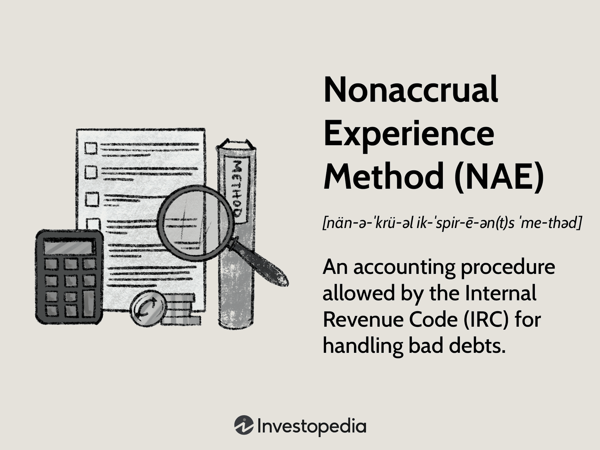

## Table of Contents

## What is the Nonaccrual Experience Method?

The Nonaccrual Experience Method is a way banks use to figure out how much money they might lose from loans that are not being paid back on time. When a loan goes into nonaccrual status, it means the borrower has stopped making payments, and the bank stops counting the interest on that loan as income. To use this method, banks look at their past experiences with similar loans to predict how much money they might not get back.

This method helps banks set aside enough money to cover potential losses. By looking at historical data, banks can estimate the percentage of nonaccrual loans that will likely turn into actual losses. This helps them stay financially stable by preparing for the worst-case scenarios. It's an important part of managing risk in the banking industry.

## How does the Nonaccrual Experience Method differ from other accounting methods?

The Nonaccrual Experience Method is different from other accounting methods because it focuses on past experiences to predict future losses from loans that are not being paid back. Other methods might use different ways to guess how much money a bank might lose. For example, some methods might look at the current value of the loan or use a set formula to decide how much money to set aside for potential losses. The Nonaccrual Experience Method, however, uses real data from the bank's own history to make these predictions.

Another way the Nonaccrual Experience Method differs is in how it handles interest income. When a loan goes into nonaccrual status, the bank stops counting the interest on that loan as income. This is different from other methods that might continue to count the interest as income until the loan is officially written off as a loss. By stopping the interest income, the Nonaccrual Experience Method helps banks be more cautious and realistic about their financial situation.

## What are the key principles behind the Nonaccrual Experience Method?

The Nonaccrual Experience Method is based on the idea that banks should use their past experiences to predict how much money they might lose from loans that are not being paid back. When a loan goes into nonaccrual status, it means the borrower has stopped making payments, and the bank stops counting the interest on that loan as income. By looking at what happened with similar loans in the past, banks can guess how much money they might not get back. This helps them set aside enough money to cover these potential losses.

Another key principle of the Nonaccrual Experience Method is being cautious and realistic about the bank's financial situation. When a loan goes into nonaccrual status, the bank stops counting the interest as income right away. This is different from other methods that might keep counting the interest until the loan is officially a loss. By stopping the interest income, the Nonaccrual Experience Method helps banks prepare for the worst-case scenarios and stay financially stable.

## In what scenarios is the Nonaccrual Experience Method most applicable?

The Nonaccrual Experience Method is most useful when banks want to predict how much money they might lose from loans that are not being paid back. This method is especially helpful for banks that have a lot of history with similar types of loans. By looking at what happened in the past, banks can guess how much money they might not get back from loans that are currently not being paid.

This method is also good for banks that want to be careful and realistic about their money situation. When a loan goes into nonaccrual status, meaning the borrower has stopped making payments, the bank stops counting the interest on that loan as income. This helps banks prepare for the worst-case scenarios and stay financially stable by setting aside enough money to cover potential losses.

## How do you implement the Nonaccrual Experience Method in financial reporting?

To implement the Nonaccrual Experience Method in financial reporting, banks first need to identify loans that have gone into nonaccrual status. This happens when borrowers stop making their loan payments, and the bank stops counting the interest on those loans as income. The bank then looks at its past experiences with similar loans to guess how much money it might not get back. This involves analyzing historical data to find out what percentage of nonaccrual loans turned into actual losses in the past.

Once the bank has this information, it can use it to set aside enough money to cover the potential losses from the current nonaccrual loans. This money is called a provision for loan losses, and it helps the bank stay financially stable by preparing for the worst-case scenarios. By using the Nonaccrual Experience Method, banks can report their financial situation in a way that is cautious and realistic, helping them manage risk and plan for the future.

## What are the advantages of using the Nonaccrual Experience Method?

The Nonaccrual Experience Method helps banks by letting them use their own past experiences to guess how much money they might lose from loans that are not being paid back. This means banks can look at what happened with similar loans before and use that information to plan for the future. By doing this, banks can set aside the right amount of money to cover these potential losses, which helps them stay financially stable.

Another advantage is that this method makes banks be careful and realistic about their money situation. When a loan goes into nonaccrual status, the bank stops counting the interest on that loan as income right away. This helps banks prepare for the worst-case scenarios by not counting money they might not actually get. By being cautious, banks can better manage their risk and keep their financial reports accurate and trustworthy.

## What are the potential drawbacks or limitations of the Nonaccrual Experience Method?

One limitation of the Nonaccrual Experience Method is that it relies on past data to predict future losses. This means if the bank's past experiences are not similar to what is happening now, the predictions might not be accurate. For example, if the economy changes a lot or if there are new types of loans the bank hasn't dealt with before, the method might not work well. Banks need to keep updating their data and be careful about how they use it to make sure their predictions are as accurate as possible.

Another drawback is that the Nonaccrual Experience Method can be complicated to use. Banks need to keep detailed records of their past loans and analyze them carefully to make good predictions. This can take a lot of time and effort, and if the bank doesn't do it right, they might set aside too much or too little money for potential losses. This method also requires the bank to have a lot of history with similar types of loans, which might not be the case for newer banks or those that have recently changed their loan types.

## Can you provide a case study where the Nonaccrual Experience Method was effectively used?

A small community bank in the Midwest used the Nonaccrual Experience Method to manage its loan portfolio during a tough economic time. The bank had been lending to local farmers for many years and had a lot of data on how these loans performed. When the economy took a downturn and some farmers started missing their loan payments, the bank used its past experiences to guess how much money it might lose. By looking at what happened with similar loans in the past, the bank set aside enough money to cover the potential losses. This helped the bank stay financially stable even when times were hard.

The bank's use of the Nonaccrual Experience Method was especially helpful because it allowed them to be cautious and realistic about their financial situation. When a farmer's loan went into nonaccrual status, meaning they stopped making payments, the bank stopped counting the interest on that loan as income. This made their financial reports more accurate and helped them prepare for the worst-case scenarios. By using this method, the bank was able to manage its risk well and continue supporting the local community through the economic downturn.

## How does the Nonaccrual Experience Method affect financial statements?

The Nonaccrual Experience Method changes how banks show their money in their financial statements. When a loan goes into nonaccrual status, meaning the borrower has stopped making payments, the bank stops counting the interest on that loan as income. This makes the bank's income look lower on the financial statements. But it also helps the bank be more honest about its money situation by not counting money it might not get.

The bank also uses its past experiences with similar loans to guess how much money it might lose. This helps them set aside the right amount of money to cover these possible losses. On the financial statements, this money is called a provision for loan losses. It makes the bank's expenses look higher, but it helps them prepare for the future and stay financially stable. By using the Nonaccrual Experience Method, banks can show a more realistic picture of their financial health.

## What regulatory considerations should be taken into account when using the Nonaccrual Experience Method?

When banks use the Nonaccrual Experience Method, they need to follow rules set by financial regulators like the Federal Reserve or the Office of the Comptroller of the Currency (OCC). These rules make sure that banks are honest and careful about how they guess how much money they might lose from loans that are not being paid back. Banks have to keep good records of their past loans and use this information in a way that follows the rules. If they don't, they might get in trouble with the regulators.

Regulators also want banks to set aside enough money to cover possible losses, but not too much. This means banks need to use the Nonaccrual Experience Method carefully and keep updating their data to make sure their guesses are right. By doing this, banks can show that they are managing their risk well and staying financially stable, which is important for keeping the trust of their customers and the regulators.

## How can the Nonaccrual Experience Method be integrated with other financial analysis techniques?

The Nonaccrual Experience Method can be used together with other ways to look at a bank's money situation. For example, banks can use the Nonaccrual Experience Method to guess how much money they might lose from loans that are not being paid back. Then, they can use other methods like the Discounted Cash Flow (DCF) analysis to see how much those loans are worth right now. By combining these methods, banks can get a better idea of their financial health and make smarter decisions about their loans.

Another way to use the Nonaccrual Experience Method with other techniques is by looking at the bank's overall risk. Banks can use the Nonaccrual Experience Method to set aside money for potential losses. At the same time, they can use methods like stress testing to see how their money situation might change if the economy gets worse. By using both methods, banks can plan for different scenarios and make sure they are ready for whatever might happen. This helps them stay financially stable and manage their risk better.

## What are the latest trends and developments related to the Nonaccrual Experience Method in the financial industry?

The Nonaccrual Experience Method is still important for banks, but there are new trends and developments happening. One big trend is the use of technology and data analytics to make the method better. Banks are using computers and special software to look at their past loan data more quickly and accurately. This helps them make better guesses about how much money they might lose from loans that are not being paid back. Another trend is that regulators are paying more attention to how banks use this method. They want to make sure banks are being honest and careful about their money situation, so they are setting new rules and guidelines for banks to follow.

Another development is that banks are combining the Nonaccrual Experience Method with other ways to look at their money situation. For example, they might use this method along with stress testing to see how their finances might change if the economy gets worse. By using different methods together, banks can get a fuller picture of their financial health and make smarter decisions. This helps them manage their risk better and stay stable, even when times are tough.

## References & Further Reading

[1]: U.S. Internal Revenue Service. ["Publication 535 (2020), Business Expenses."](https://www.irs.gov/pub/irs-prior/p535--2020.pdf) Internal Revenue Service.

[2]: ["Advances in Financial Machine Learning"](https://www.amazon.com/Advances-Financial-Machine-Learning-Marcos/dp/1119482089) by Marcos Lopez de Prado

[3]: ["Quantitative Trading: How to Build Your Own Algorithmic Trading Business"](https://github.com/LucindaYa/quant-resources/blob/master/Quantitative%20Trading%20How%20to%20Build%20Your%20Own%20Algorithmic%20Trading%20Business.pdf) by Ernest P. Chan

[4]: Chow, G. C. (2008). ["Testing equality between sets of coefficients in two linear regressions."](https://www.semanticscholar.org/paper/Tests-of-equality-between-sets-of-coefficients-in-Chow/0f70219160c8ad2f9db02e226d3f7d7320e729b8) Econometrica: Journal of the Econometric Society, 28(3), 591-605.

[5]: ["Non-accrual Loan Definition"](https://www.investopedia.com/terms/n/nonaccrual-loan.asp) - Investopedia.