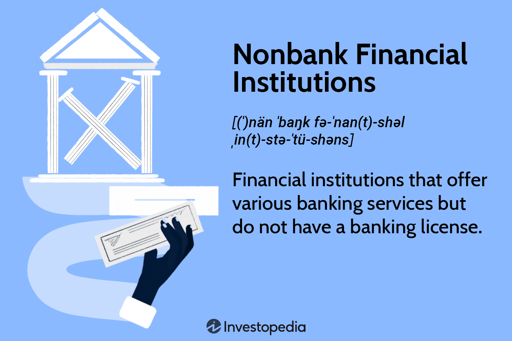

## Table of Contents

## What are nonbank financial institutions?

Nonbank financial institutions are companies that offer financial services but are not banks. They do not take deposits like banks do, but they still play a big role in the financial system. Examples include insurance companies, investment firms, and payday lenders. These institutions help people and businesses manage their money, invest, and get loans in different ways than traditional banks.

These institutions can sometimes be less regulated than banks, which means they might take on more risk. This can be good for people who need quick loans or special financial products that banks don't offer. However, it can also be risky if these institutions make bad decisions. Overall, nonbank financial institutions add variety to the financial system, giving people more choices for managing their money.

## How do nonbank financial institutions differ from traditional banks?

Nonbank financial institutions and traditional banks both help people with money, but they do it in different ways. Traditional banks take in money from people as deposits, like when you put money into a savings account. They then use that money to give out loans to others. Banks are very regulated, which means they have to follow a lot of rules to make sure they are safe and fair. On the other hand, nonbank financial institutions don't take deposits. Instead, they might offer services like insurance, help with investments, or give out loans in different ways, like payday loans.

Because nonbank financial institutions don't take deposits, they often have fewer rules to follow than banks. This can mean they can be more flexible and offer services that banks might not provide. For example, they might give loans to people who can't get them from banks. But this also means they can be riskier. If a nonbank financial institution makes bad decisions, it might not have the same safety nets that banks have. So, while they add more options for people to manage their money, they also come with different levels of risk.

## What types of services do nonbank financial institutions offer?

Nonbank financial institutions offer a variety of services that are different from what traditional banks provide. One common service is insurance. Insurance companies, which are a type of nonbank financial institution, help people protect themselves from risks like car accidents, health problems, or damage to their homes. Another service is investment help. Investment firms can manage people's money by investing it in stocks, bonds, or other financial products to try to make it grow.

In addition to insurance and investment services, nonbank financial institutions can also offer loans. For example, payday lenders give out short-term loans to people who need money quickly, often with fewer requirements than banks. Peer-to-peer lending platforms connect people who need loans directly with people who want to lend money. These services can be helpful for people who can't get loans from banks. Overall, nonbank financial institutions provide a range of financial services that can meet different needs, from protecting against risks to helping people invest or borrow money.

## Can you provide examples of nonbank financial institutions?

Nonbank financial institutions are companies that offer financial services but are not banks. One example is insurance companies. They help people protect themselves from risks like car accidents, health problems, or damage to their homes. Another example is investment firms. These firms manage people's money by investing it in stocks, bonds, or other financial products to try to make it grow.

Payday lenders are also nonbank financial institutions. They give out short-term loans to people who need money quickly, often with fewer requirements than banks. Another type is peer-to-peer lending platforms. These platforms connect people who need loans directly with people who want to lend money. These services can be helpful for people who can't get loans from banks.

Overall, nonbank financial institutions offer a range of services that can meet different needs. They help people protect against risks, invest their money, or borrow money in different ways than traditional banks do.

## What role do nonbank financial institutions play in the financial system?

Nonbank financial institutions play a big role in the financial system by offering services that traditional banks don't provide. They help people and businesses manage their money in different ways. For example, insurance companies help people protect themselves from risks like car accidents or health problems. Investment firms help people grow their money by investing it in stocks or bonds. These services add variety to the financial system, giving people more choices for managing their money.

Nonbank financial institutions also help people who can't get services from banks. Payday lenders give out short-term loans to people who need money quickly, often with fewer requirements than banks. Peer-to-peer lending platforms connect people who need loans directly with people who want to lend money. These services can be very helpful for people who are left out by traditional banks. However, because nonbank financial institutions are often less regulated, they can also be riskier. They might take on more risk than banks, which can be good or bad depending on the situation.

## How are nonbank financial institutions regulated?

Nonbank financial institutions are not regulated as much as banks. Banks have to follow a lot of rules because they take people's money as deposits. Nonbanks don't take deposits, so they don't have to follow all those rules. However, they still have to follow some rules, but these rules can be different depending on what kind of service they offer. For example, insurance companies have to follow rules set by insurance regulators, while investment firms have to follow rules set by securities regulators.

Even though nonbanks have fewer rules to follow, they are still watched by different government agencies. These agencies make sure that nonbanks are not doing anything too risky or unfair. If a nonbank does something wrong, it can get in trouble just like a bank. But because they are less regulated, nonbanks can sometimes take on more risk. This can be good because it lets them offer services that banks might not, but it can also be bad if they make bad decisions.

## What are the advantages of using nonbank financial institutions over banks?

Nonbank financial institutions can offer services that banks don't. For example, if you need a quick loan and can't get one from a bank, a payday lender might help you. Nonbanks can also help you invest your money in ways that banks might not offer. They can be more flexible because they don't have to follow as many rules as banks. This means they can sometimes give you options that are better for your needs.

Another advantage is that nonbanks can help people who banks might not serve. If you have a low credit score or no credit history, a bank might not give you a loan. But a nonbank might be willing to help you. This can be really important for people who need money but can't get it from a bank. Nonbanks add more choices to the financial system, making it easier for everyone to find the services they need.

## What are the potential risks associated with nonbank financial institutions?

Nonbank financial institutions can be riskier than banks because they don't have to follow as many rules. This means they might take on more risk to offer services that banks won't. For example, payday lenders might give out loans with very high interest rates. If you can't pay back the loan, you could end up owing a lot more money than you borrowed. This can lead to a cycle of debt that's hard to get out of.

Another risk is that nonbanks might not be as stable as banks. Banks have to keep a certain amount of money on hand to make sure they can pay back their customers. Nonbanks don't have these same requirements, so if they make bad decisions, they could go out of business. This could leave you without the services you need or, worse, without the money you invested with them. While nonbanks can offer helpful services, it's important to understand these risks before using them.

## How have nonbank financial institutions evolved over time?

Nonbank financial institutions have changed a lot over time. They used to be pretty simple, mainly offering services like insurance and some types of loans. But as technology got better, nonbanks started to offer more services. For example, online platforms made it easier for people to invest their money or get loans from other people directly. This made nonbanks more popular because they could offer services that were faster and easier to use than what banks provided.

Over the years, nonbanks have also become more important in the financial system. They now play a big role in helping people and businesses manage their money. But because they are less regulated than banks, they can sometimes take on more risk. This has led to more rules being made to watch over nonbanks and make sure they are not doing anything too risky. Overall, nonbank financial institutions have grown and changed a lot, offering more choices for people to manage their money but also bringing new risks that need to be managed carefully.

## What impact do nonbank financial institutions have on financial stability?

Nonbank financial institutions can affect financial stability in big ways. They offer services that banks don't, like quick loans or special investments. This can help more people manage their money and keep the economy moving. But because nonbanks are less regulated than banks, they can take on more risk. If a nonbank makes bad decisions, it could cause problems not just for itself but for the whole financial system. This is why it's important for regulators to keep an eye on nonbanks and make sure they are not doing anything too risky.

At the same time, nonbanks can also help make the financial system more stable. They give people more choices for managing their money, which can help spread out risk. If everyone used only banks and something went wrong with the banks, it could be a big problem. But with nonbanks offering different services, the risk is spread out more. So, while nonbanks can add risk to the financial system, they can also help make it stronger by offering more options and spreading out risk.

## How do nonbank financial institutions contribute to financial inclusion?

Nonbank financial institutions help more people get financial services by offering options that banks might not provide. For example, if you have a low credit score or no credit history, a bank might not give you a loan. But a nonbank like a payday lender might be willing to help you. This can be really important for people who need money but can't get it from a bank. Nonbanks also offer services like peer-to-peer lending, where people can borrow money directly from other people. This makes it easier for everyone to find the financial help they need.

By offering these services, nonbanks make the financial system more inclusive. They help people who might be left out by traditional banks to still manage their money, invest, or get loans. This can make a big difference in people's lives, helping them pay for things they need or start a business. While nonbanks can be riskier because they are less regulated, they play an important role in making sure more people can access financial services.

## What future trends are expected in the nonbank financial institutions sector?

In the future, nonbank financial institutions are expected to keep growing and changing. One big trend is the use of technology. More nonbanks will use digital platforms to offer their services. This means you'll be able to get loans, insurance, or invest your money online more easily. Technology will also help nonbanks reach more people, especially those who can't go to a bank. This could make financial services even more inclusive, helping more people manage their money.

Another trend is that nonbanks might start to offer more services that banks usually provide. For example, some nonbanks might start offering checking accounts or other banking services. This could make it harder to tell the difference between banks and nonbanks. But because nonbanks are less regulated, they might still take on more risk. Regulators will need to keep an eye on this to make sure nonbanks are not doing anything too risky. Overall, nonbanks will continue to play a big role in the financial system, offering more choices and helping more people.

## References & Further Reading

[1]: ["Shadow Banking: Economics and Policy"](https://www.imf.org/external/pubs/ft/sdn/2012/sdn1212.pdf) by Stijn Claessens, M. A. Kose, Luc Laeven, and Fabian Valencia

[2]: Adrian, Tobias, and Hyun Song Shin. ["The Shadow Banking System: Implications for Financial Regulation."](https://papers.ssrn.com/sol3/papers.cfm?abstract_id=1441324) Federal Reserve Bank of New York Staff Reports, no. 382, July 2009.

[3]: Hendershott, Terrence, Charles M. Jones, and Albert J. Menkveld. ["Does Algorithmic Trading Improve Liquidity?"](https://onlinelibrary.wiley.com/doi/full/10.1111/j.1540-6261.2010.01624.x) The Review of Financial Studies, Volume 24, Issue 8, 2011, Pages 2495–2522.

[4]: Lopez de Prado, Marcos. ["Advances in Financial Machine Learning"](https://www.amazon.com/Advances-Financial-Machine-Learning-Marcos/dp/1119482089)

[5]: Liang, Nai-Fu, and Mark Carney. ["Financial Stability Risks: Where Do We Stand?"](https://onlinelibrary.wiley.com/doi/full/10.1111/joes.12551) Bank for International Settlements Quarterly Review, June 2021.