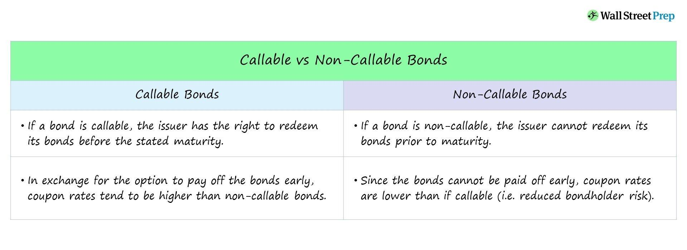

## Table of Contents

## What is a noncallable bond?

A noncallable bond is a type of bond that cannot be paid off early by the issuer. This means that once the bond is issued, the issuer must make interest payments to the bondholder until the bond reaches its maturity date. The bondholder is guaranteed to receive these payments for the entire term of the bond, which can be appealing for investors looking for a steady income stream.

Because the issuer cannot call back the bond before its maturity, noncallable bonds often have a higher interest rate compared to callable bonds. This is to compensate investors for the added security and predictability of their investment. Investors who buy noncallable bonds do not have to worry about the bond being called away if interest rates fall, which can be a risk with callable bonds.

## How does a noncallable bond differ from a callable bond?

A noncallable bond and a callable bond are different in a big way. A noncallable bond means the company that issued the bond can't pay it back early. They have to keep paying interest to the person who bought the bond until the bond's end date. This makes the bond safer for the buyer because they know they'll get their money for sure until the bond is done.

On the other hand, a callable bond lets the issuer pay it back before it's supposed to end. They might do this if interest rates go down, so they can borrow money cheaper later. This can be bad for the bond buyer because they might lose the chance to keep getting interest payments if the bond gets called back early. Because of this risk, callable bonds usually have a higher interest rate to make up for it.

## What are the key characteristics of noncallable bonds?

Noncallable bonds are special because the company that makes them can't take them back early. This means if you buy one, you'll get interest payments until the bond's end date. It's like a promise that you'll keep getting money for the whole time the bond is around. This makes noncallable bonds a safe choice if you want steady money coming in.

Because noncallable bonds are safer, they usually have a lower interest rate than callable bonds. People like them because they don't have to worry about the bond being called back if interest rates drop. If you're looking for something reliable and don't mind a bit less interest, a noncallable bond might be good for you.

## Why might an investor prefer noncallable bonds?

An investor might prefer noncallable bonds because they offer more safety and predictability. When you buy a noncallable bond, you know you'll get interest payments until the bond's end date. This is good if you want a steady income without surprises. The company can't take the bond back early, so you don't have to worry about losing your investment if interest rates change.

Another reason is that noncallable bonds can be easier to plan with. Since the payments are guaranteed until the end, you can count on that money being there. This makes it easier to budget and plan for the future. Even though noncallable bonds might have a lower interest rate, the peace of mind and stability they offer can be worth it for many investors.

## How do noncallable bonds affect a bond issuer's financial strategy?

When a company issues noncallable bonds, it means they can't pay them back early. This can be good for planning because the company knows exactly how much money they'll need to pay in interest until the bond's end date. It helps them make a solid financial plan without worrying about having to come up with money to pay back the bond early if interest rates go down. But, it also means they can't take advantage of lower interest rates to save money later.

On the other hand, because noncallable bonds are safer for investors, the company might have to offer a lower interest rate than they would with callable bonds. This can save them money on interest payments over time. But, it also means they're locked into those payments, which can limit their financial flexibility. If they need to free up cash or change their debt strategy, noncallable bonds make it harder to do that quickly.

## What are the typical terms and conditions associated with noncallable bonds?

Noncallable bonds come with terms and conditions that make them different from other types of bonds. The main condition is that the issuer can't pay back the bond early. This means the company has to keep making interest payments to the bondholder until the bond reaches its maturity date. The bond's maturity date is set when the bond is first issued and can be anywhere from a few years to several decades. The interest rate, or coupon rate, is also fixed at the start and doesn't change over the life of the bond.

Another important term is that noncallable bonds usually have a lower interest rate compared to callable bonds. This is because they are seen as safer for investors since they can't be called back early. The bond agreement will also include details about how often interest is paid, which can be monthly, quarterly, semi-annually, or annually. There might also be conditions about what happens if the issuer can't make the payments, like going into default, which can protect the bondholder's investment.

## How do noncallable bonds impact interest rate risk for investors?

Noncallable bonds help lower interest rate risk for investors. When you buy a noncallable bond, you know you'll get interest payments until the bond's end date. This means you don't have to worry about the bond being called back if interest rates go down. If rates drop, the value of your bond might go up because new bonds will have lower interest rates, making yours more valuable. So, you're protected from the risk of losing your investment early.

However, noncallable bonds still have some interest rate risk. If interest rates go up after you buy the bond, the value of your bond might go down. This is because new bonds will have higher interest rates, making yours less attractive to other investors. But, since you can't lose the bond early, you'll still get your interest payments until the bond matures. This makes noncallable bonds a safer choice if you're worried about interest rate changes affecting your investment.

## What role do noncallable bonds play in a diversified investment portfolio?

Noncallable bonds can be a good part of a diversified investment portfolio because they offer safety and steady income. When you include them in your investments, you're adding something that can help balance out riskier investments like stocks. Since noncallable bonds can't be paid back early, you know you'll get your interest payments until the bond's end date. This makes them a reliable source of income, which can be really helpful if you want to keep your money safe while still earning something.

Adding noncallable bonds to your portfolio can also help manage interest rate risk. Even though their value might go down if interest rates go up, you won't lose the bond early if rates drop. This means you can count on getting your interest payments no matter what happens with interest rates. By having noncallable bonds, you're making your portfolio more stable and less likely to be thrown off by big changes in the market.

## How are noncallable bonds priced in the market compared to callable bonds?

Noncallable bonds are usually priced higher than callable bonds because they are safer for investors. When you buy a noncallable bond, you know you'll get your interest payments until the bond's end date. The company can't take the bond back early, so you don't have to worry about losing your investment if interest rates change. Because of this safety, investors are often willing to pay more for noncallable bonds. They might have a lower interest rate compared to callable bonds, but the peace of mind they offer can make them more valuable.

Callable bonds, on the other hand, can be paid back early by the issuer. This means if interest rates go down, the company might call back the bond to borrow money at a lower rate. This risk makes callable bonds less attractive to investors, so they usually have a higher interest rate to make up for it. But, because of this risk, callable bonds are often priced lower in the market than noncallable bonds. Investors might get a higher return, but they also have to deal with the uncertainty of when the bond might be called back.

## What are the tax implications of investing in noncallable bonds?

When you invest in noncallable bonds, you need to think about taxes. The interest you earn from these bonds is usually taxed as regular income. This means you'll pay taxes on it at the same rate as your salary or wages. If you're in a high tax bracket, this could mean you pay a lot in taxes on the interest you earn from your bonds. But, if you buy municipal noncallable bonds, the interest might be tax-free at the federal level, and sometimes at the state level too, depending on where you live.

Another thing to keep in mind is if you sell your noncallable bond before it matures. If you sell it for more than you paid, you might have to pay capital gains tax on the profit. The tax rate for this depends on how long you held the bond. If you held it for a year or less, it's a short-term capital gain, and you'll pay your regular income tax rate on it. If you held it for more than a year, it's a long-term capital gain, and the tax rate is usually lower. So, think about these tax rules when you're planning your investments in noncallable bonds.

## How do changes in monetary policy affect the value of noncallable bonds?

Changes in monetary policy can affect the value of noncallable bonds a lot. When the central bank changes interest rates, it can make the value of your bond go up or down. If the central bank raises interest rates, new bonds will have higher interest rates. This makes your noncallable bond less attractive because it has a lower interest rate. So, the value of your bond might go down because people would rather buy the new bonds with higher rates.

On the other hand, if the central bank lowers interest rates, new bonds will have lower interest rates. This makes your noncallable bond more attractive because it has a higher interest rate than the new ones. So, the value of your bond might go up because people want to buy it instead of the new bonds with lower rates. Since noncallable bonds can't be paid back early, you're protected from losing your bond if rates go down, but you still have to deal with changes in its value because of monetary policy.

## What advanced strategies can be used to optimize returns from noncallable bonds?

One way to get more out of noncallable bonds is by using a laddering strategy. This means you buy bonds that end at different times. For example, you might buy some bonds that end in one year, some in three years, and some in five years. When each bond ends, you can take the money you get back and buy a new bond with a longer time until it ends. This way, you can take advantage of different interest rates over time and have a steady flow of money coming in. It also helps you manage the risk of interest rates changing because you're not putting all your money into bonds that end at the same time.

Another strategy is to use noncallable bonds as part of a bond swap. This means you sell one bond and use the money to buy another bond that might give you a better return or fit better with your investment goals. For example, if interest rates go up, you might sell a bond with a lower interest rate and buy one with a higher rate. Since noncallable bonds can't be paid back early, you don't have to worry about losing your investment if rates go down. But, you can still make changes to your portfolio to try to get a better return.

## What are the advantages and disadvantages?

Noncallable bonds provide a unique blend of income stability and predictability that is particularly appealing to conservative investors and retirees. This stability arises from the bonds' fixed interest rate, which remains constant throughout the life of the bond, thereby eliminating the uncertainty of fluctuating income streams. Conservative investors looking for a reliable flow of income can benefit significantly from this attribute, making noncallable bonds an essential component of a low-risk investment strategy.

The absence of call risk in noncallable bonds is another significant advantage. Call risk refers to the possibility that an issuer might redeem a bond before its maturity, often occurring in a declining interest rate environment when the issuer can refinance debt at a lower cost. Noncallable bonds protect investors from this eventuality, enabling them to fully leverage a fixed interest rate environment. This protection ensures that investors can hold the bond until maturity without the fear of reinvestment risk associated with premature redemption.

Despite these advantages, noncallable bonds are not without their downsides. One major disadvantage is their generally lower yields compared to callable bonds. This lower yield results from the added security and predictability that noncallable bonds offer; investors essentially pay a premium for reliability, which translates into reduced interest returns. The equation for bond yield can be represented as:

$$
\text{Yield} = \frac{\text{Coupon Payment}}{\text{Market Price}}
$$

The market price of noncallable bonds may be higher due to their secure nature, thus reducing their yield.

Moreover, noncallable bonds are susceptible to inflation risk. Since the bonds' interest payments are fixed, their purchasing power can be eroded over time in a high inflation environment. This erosion reduces the real returns that investors receive, potentially making these bonds less attractive during periods of rising prices.

Additionally, limited [liquidity](/wiki/liquidity-risk-premium) in secondary markets poses a challenge for noncallable bond investors who might wish to sell their holdings before maturity. The lack of liquidity implies that investors may have to sell at a discount, affecting their overall returns. Investors often need to weigh the stability and predictability of noncallable bonds against their lower yields and inflation risk, as well as the potential difficulties of exiting their investments prematurely due to limited market activity.

## How can noncallable bonds be integrated with algorithmic trading?

Algorithmic trading has revolutionized the landscape of financial markets, offering enhanced capabilities for managing a wide array of investments, including noncallable bonds. The integration of algorithmic strategies with noncallable bonds leverages the inherent predictability of their returns, allowing traders to build sophisticated models that optimize portfolio performance while minimizing risk.

### Tailoring Algorithmic Strategies for Noncallable Bonds

Noncallable bonds, due to their fixed interest payments and inability to be called before maturity, present a unique advantage for algorithmic trading. Given their predictable cash flow, algorithms can be precisely calibrated to take advantage of stable returns. A common approach is utilizing mean-variance optimization, which weighs expected returns against potential volatility. This is expressed mathematically by:

$$

\max \left( \frac{E(R_p) - R_f}{\sigma_p} \right) 
$$

where $E(R_p)$ is the expected portfolio return, $R_f$ is the risk-free rate, and $\sigma_p$ is the standard deviation of the portfolio’s return, representing its volatility.

Python, a popular language for algorithmic trading, can be used to implement these strategies. For instance:

```python
import numpy as np

def bond_optimization(expected_returns, cov_matrix, risk_free_rate):
    num_assets = len(expected_returns)
    weights = np.random.random(num_assets)
    weights /= np.sum(weights)

    portfolio_return = np.sum(weights * expected_returns)
    portfolio_volatility = np.sqrt(np.dot(weights.T, np.dot(cov_matrix, weights)))

    sharpe_ratio = (portfolio_return - risk_free_rate) / portfolio_volatility
    return sharpe_ratio, weights

# Example data
expected_returns = np.array([0.05, 0.04, 0.06])
cov_matrix = np.array([[0.0001, 0.00002, 0.00003], [0.00002, 0.0001, 0.00004], [0.00003, 0.00004, 0.0001]])
risk_free_rate = 0.02

sharpe, weights = bond_optimization(expected_returns, cov_matrix, risk_free_rate)
print(f"Sharpe Ratio: {sharpe}, Weights: {weights}")
```

The script above calculates the optimal portfolio weights that maximize the Sharpe ratio, considering expected returns, covariance among asset returns, and a risk-free rate.

### Competitive Edge in Stability

The application of algorithmic trading in managing noncallable bonds ensures robust handling of stable, long-term investments, which are less affected by market trends compared to equity-based instruments. Algorithms can continuously assess market conditions, update bond valuations, and adjust portfolios accordingly to optimize performance. These systems efficiently parse through vast amounts of data, incorporating factors such as interest rate shifts, macroeconomic indicators, and bond yield spreads, to make informed decisions quickly.

Moreover, algorithmic trading strategies can execute trades at electronic speeds, enabling rapid response to market fluctuations, which would be near impossible through manual processes. The integration of feature-rich trading platforms further enhances decision-making precision, providing traders with real-time analytics and performance insights, underscoring the role of technology in bolstering investment strategies.

Overall, the orchestration of noncallable bonds and algorithmic trading culminates in a synergy that maximizes investment potential, offering a reliable path for investors aiming to achieve steady income with minimized volatility.

## References & Further Reading

[1]: ["Advances in Financial Machine Learning"](https://www.amazon.com/Advances-Financial-Machine-Learning-Marcos/dp/1119482089) by Marcos Lopez de Prado

[2]: ["Quantitative Trading: How to Build Your Own Algorithmic Trading Business"](https://github.com/LucindaYa/quant-resources/blob/master/Quantitative%20Trading%20How%20to%20Build%20Your%20Own%20Algorithmic%20Trading%20Business.pdf) by Ernest P. Chan

[3]: ["The Handbook of Fixed Income Securities"](https://www.amazon.com/Handbook-Fixed-Income-Securities-Ninth/dp/1260473899) by Frank J. Fabozzi

[4]: ["Algorithmic Trading and DMA: An introduction to direct access trading strategies"](https://archive.org/details/algorithmictradi0000john) by Barry Johnson

[5]: ["Evidence-Based Technical Analysis: Applying the Scientific Method and Statistical Inference to Trading Signals"](https://www.amazon.com/Evidence-Based-Technical-Analysis-Scientific-Statistical/dp/0470008741) by David Aronson