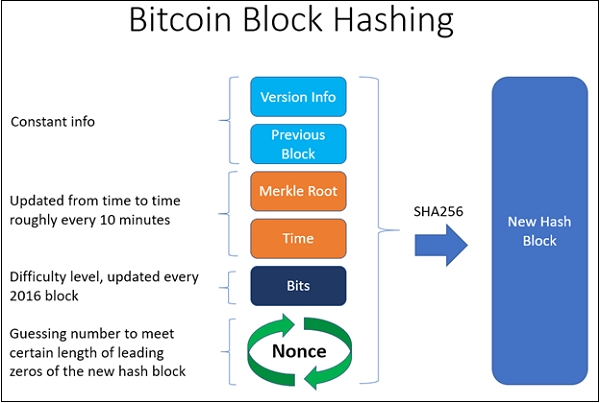

## Table of Contents

## What is a nonce in blockchain technology?

A nonce in blockchain technology is a number used only once. It's like a special code that helps keep the blockchain secure. Miners, who are people that add new transactions to the blockchain, use the nonce to solve a difficult math problem. When they find the right nonce, they can add a new block to the blockchain.

The nonce is important because it makes sure that the blockchain stays safe and trustworthy. Every time a miner tries to add a new block, they have to find a unique nonce that fits the rules of the blockchain. This process makes it very hard for anyone to cheat or change the blockchain without others noticing. So, the nonce helps keep the whole system honest and secure.

## Why is a nonce important in blockchain?

A nonce is important in blockchain because it helps keep the system secure and trustworthy. It's like a special number that miners use to solve a puzzle before they can add new transactions to the blockchain. By finding the right nonce, miners prove that they've done the hard work needed to add a new block. This process makes sure that only honest miners can add new blocks, keeping the blockchain safe from people who might want to cheat.

The nonce also makes it really hard for anyone to change the blockchain without others noticing. If someone tries to change a block, they would have to find a new nonce that fits the rules of the blockchain all over again. This is very difficult and time-consuming, which discourages people from trying to mess with the blockchain. So, the nonce is a key part of what makes blockchain technology reliable and secure.

## How does a nonce work in the context of Bitcoin mining?

In Bitcoin mining, a nonce is a number that miners use to try and solve a puzzle. This puzzle is part of adding new transactions to the Bitcoin blockchain. Miners take all the new transactions, some other information, and a nonce, and put them through a special math formula. If the result of this formula is a number that meets the Bitcoin rules, the miner has found the right nonce and can add a new block to the blockchain. The miner gets a reward in Bitcoin for doing this hard work.

Finding the right nonce is not easy. Miners have to guess many different nonces until they find the one that works. It's like trying different keys to unlock a door. The Bitcoin system is set up so that it takes about 10 minutes on average for someone to find the right nonce. This keeps the system fair and makes sure that new blocks are added at a steady pace. The nonce is important because it helps keep Bitcoin safe and stops people from cheating by making it hard to change the blockchain without others noticing.

## Can you explain the role of a nonce in proof-of-work?

In proof-of-work, a nonce is like a special number that helps keep things fair and secure. Miners use the nonce to solve a puzzle. They take all the new transactions, some other information, and the nonce, and put them through a special math formula. If the result meets the rules, the miner has found the right nonce and can add a new block to the blockchain. This is important because it makes sure only honest miners can add new blocks.

Finding the right nonce is hard work. Miners have to try many different nonces until they find the one that works. It's like trying different keys to unlock a door. The system is set up so it takes about 10 minutes on average to find the right nonce. This keeps the system steady and fair. The nonce is a big part of what makes proof-of-work secure because it stops people from cheating and makes it hard to change the blockchain without others noticing.

## What is the typical range of values for a nonce?

In blockchain technology, the nonce is usually a number that starts at zero and can go up to a very big number. For Bitcoin, the nonce is a 32-bit number, which means it can be any number from 0 to 4,294,967,295. Miners try different nonce values to solve the puzzle and add a new block to the blockchain.

When miners are working, they start with a nonce of zero and keep increasing it by one each time they try. They keep going until they find the right nonce that makes the math formula give the correct result. If they reach the highest possible nonce without finding the right one, they might change some other information and start over with the nonce at zero again.

## How does the nonce contribute to the security of a blockchain?

The nonce is really important for keeping a blockchain safe. It's like a special number that miners use to solve a puzzle before they can add new transactions to the blockchain. By finding the right nonce, miners prove that they've done the hard work needed to add a new block. This makes sure that only honest miners can add new blocks, which keeps the blockchain safe from people who might want to cheat.

The nonce also makes it very hard for anyone to change the blockchain without others noticing. If someone tries to change a block, they would have to find a new nonce that fits the rules of the blockchain all over again. This is very difficult and time-consuming, which stops people from trying to mess with the blockchain. So, the nonce helps keep the whole system honest and secure.

## What happens if two miners find a valid nonce at the same time?

If two miners find a valid nonce at the same time, it can cause a temporary split in the blockchain. This is called a "fork." When this happens, the blockchain has two different versions of the next block. The rest of the network sees both versions and has to decide which one to accept.

Usually, the fork gets solved pretty quickly. The miners keep working on both versions of the blockchain. Whichever version gets the next block added to it first becomes the main blockchain. The other version is then ignored, and everyone goes back to working on the same blockchain again. This system makes sure that even if two miners find a valid nonce at the same time, the blockchain stays secure and everyone agrees on one version.

## How does the difficulty adjustment affect the nonce in blockchain?

The difficulty adjustment in a blockchain changes how hard it is for miners to find the right nonce. It's like making the puzzle easier or harder. If the puzzle is too easy, miners find the right nonce too quickly, so the system makes it harder. If it's too hard, and miners are taking too long, the system makes it easier. This keeps the time it takes to add new blocks to the blockchain steady, usually around 10 minutes for Bitcoin.

When the difficulty changes, miners have to try more or fewer nonces to solve the puzzle. If the difficulty goes up, miners need to try more nonces because the puzzle is harder. If the difficulty goes down, they need to try fewer nonces because the puzzle is easier. The difficulty adjustment helps keep the blockchain fair and secure by making sure miners can't add new blocks too quickly or too slowly.

## Can a nonce be reused in a blockchain?

No, a nonce cannot be reused in a blockchain. Each nonce is used only once, which is why it's called a "number used once." When miners are trying to add a new block to the blockchain, they need to find a unique nonce that solves the puzzle. If they reuse an old nonce, it won't work because the puzzle changes with each new block.

This rule of using a nonce only once helps keep the blockchain secure. If nonces could be reused, it would be easier for someone to cheat by changing old blocks. By making sure each nonce is unique, the blockchain stays safe and trustworthy.

## What are the implications of a nonce on the energy consumption of mining?

The nonce in blockchain mining affects how much energy miners use. Miners have to guess many different nonces until they find the right one to solve the puzzle and add a new block. Each guess uses a lot of computing power, and that power comes from energy. So, the more nonces miners have to try, the more energy they use. This is why mining can use a lot of electricity, and it's a big reason why people talk about the energy costs of blockchain technology.

The difficulty of finding the right nonce can change how much energy is used. If the puzzle is really hard, miners have to try more nonces, which means they use more energy. But if the puzzle is easier, they can find the right nonce faster and use less energy. The system tries to keep things balanced by adjusting the difficulty, but mining still uses a lot of energy because of all the guesses miners have to make with the nonce.

## How do different blockchain technologies handle nonces differently?

Different blockchain technologies handle nonces in their own way. In Bitcoin, the nonce is a 32-bit number that miners use to solve a puzzle. They start at zero and keep trying different numbers until they find the right one. If they can't find it, they might change other information and start over with the nonce at zero again. This system helps keep Bitcoin secure by making it hard for anyone to cheat.

In Ethereum, the nonce works a bit differently. Each account has its own nonce, which counts the number of transactions sent from that account. This helps prevent double-spending and keeps the order of transactions straight. Unlike Bitcoin, where the nonce is used to solve a puzzle, Ethereum's nonce is more about keeping track of transactions and making sure they happen one at a time. Both ways of using nonces help keep their blockchains safe, but they do it in different ways.

## What advanced strategies are used to optimize nonce selection in mining?

Miners use some smart tricks to pick nonces faster. One trick is called "nonce range splitting." Instead of trying nonces one by one, miners split the work among many computers. Each computer tries a different part of the nonce range at the same time. This makes it quicker to find the right nonce because more computers are working on different guesses.

Another trick is using "nonce prediction." Some miners use past data to guess which nonces might work better. They look at patterns from before to make smarter guesses. This can save time and energy because they don't have to try as many nonces randomly. Both of these strategies help miners find the right nonce faster and use less power.

## What is the Role of Nonce in Cryptography and Blockchain?

A nonce, short for 'number only used once,' is a critical concept in cryptography and blockchain systems. It serves as a unique, random number that is used to ensure secure communication in cryptographic protocols. In cryptography, a nonce is typically used to prevent replay attacks, where an adversary could maliciously repeat a valid data transmission. By including a unique nonce in each transaction, systems can verify that each piece of data is fresh and not a repeat of a previously captured message.

In the context of blockchain technology, nonces are fundamental to the process of mining, especially in proof-of-work (PoW) systems. A nonce is a 32-bit field that miners repeatedly change to find a hash value that fulfills the difficulty requirement of the network. This process involves hashing the block header, which includes the nonce, until a hash is produced that is lower than or equal to the current target of the network. The equation essential to this mining process is:

$$
\text{hash}(block\_header + nonce) \leq \text{target}
$$

This brute-force method ensures that adding a block to the blockchain requires significant computational work, thereby securing the network against certain types of attacks, such as double-spending.

The successful discovery of a nonce that meets the PoW criteria confirms the miner's work, allowing the block to be validated and added to the blockchain, thus awarding the miner with [cryptocurrency](/wiki/cryptocurrency) as a reward. This process is both an incentive mechanism and a critical security feature that makes unauthorized alterations to the blockchain practically infeasible due to the computational resources required.

Nonces add layers of security to blockchain transactions by contributing to their immutability. Every block contains a unique nonce, and even a small change in the block's content would necessitate the recalculation of a new valid nonce, an endeavor requiring vast computational power over a potentially large-scale network of miners.

Nonce usage can vary across different blockchain platforms and cryptographic algorithms. Innovations in nonce application may include adaptive nonce strategies or dynamic difficulty adjustments to enhance efficiency and security. For example, some systems seek to optimize nonce selection procedures to reduce computational demand, potentially using algorithms that predict the likelihood of achieving the desired hash output more quickly.

In summary, the nonce is a crucial component in both cryptographic security protocols and blockchain processes. It ensures the integrity and freshness of communications in cryptography and secures the labor-intensive PoW consensus mechanism that underpins blockchain technology. Understanding and innovating in nonce application continue to be areas of significant research and development in enhancing secure digital systems.

## References & Further Reading

[1]: Diffie, W., & Hellman, M. E. (1976). ["New Directions in Cryptography."](https://www.cs.jhu.edu/~rubin/courses/sp03/papers/diffie.hellman.pdf) IEEE Transactions on Information Theory, 22(6), 644-654.

[2]: Nakamoto, S. (2008). ["Bitcoin: A Peer-to-Peer Electronic Cash System."](https://nakamotoinstitute.org/library/bitcoin/) 

[3]: Shor, P. W. (1997). ["Polynomial-Time Algorithms for Prime Factorization and Discrete Logarithms on a Quantum Computer."](https://arxiv.org/abs/quant-ph/9508027) SIAM Journal on Computing, 26(5), 1484-1509.

[4]: Narayanan, A., Bonneau, J., Felten, E., Miller, A., & Goldfeder, S. (2016). ["Bitcoin and Cryptocurrency Technologies."](https://press.princeton.edu/books/hardcover/9780691171692/bitcoin-and-cryptocurrency-technologies) Princeton University Press.

[5]: Peters, G. W., & Panayi, E. (2016). Understanding Modern Banking Ledgers through Blockchain Technologies: Future of Transaction Processing and Smart Contracts on the Internet of Money. In L. J. V. C. A. Gheorghe, M. Olariu, & A. T. Andersen (Eds.), ["Banking Beyond Banks and Money: A Guide to Banking Services in the Twenty-First Century."](https://link.springer.com/content/pdf/10.1007/978-3-319-42448-4_13.pdf) Springer International Publishing.

[6]: Swan, M. (2015). ["Blockchain: Blueprint for a New Economy."](https://books.google.com/books/about/Blockchain.html?id=RHJmBgAAQBAJ) O'Reilly Media.

[7]: Goodfellow, I., Bengio, Y., & Courville, A. (2016). ["Deep Learning."](https://www.deeplearningbook.org/) MIT Press.

[8]: Malkiel, B. G. (2019). ["A Random Walk Down Wall Street: The Time-Tested Strategy for Successful Investing."](https://yourknowledgedigest.org/wp-content/uploads/2020/04/a-random-walk-down-wall-street.pdf) W. W. Norton & Company.

[9]: Turing, A. M. (1937). ["On Computable Numbers, with an Application to the Entscheidungsproblem."](https://www.cs.virginia.edu/~robins/Turing_Paper_1936.pdf) Proceedings of the London Mathematical Society, 2(1), 230-265.