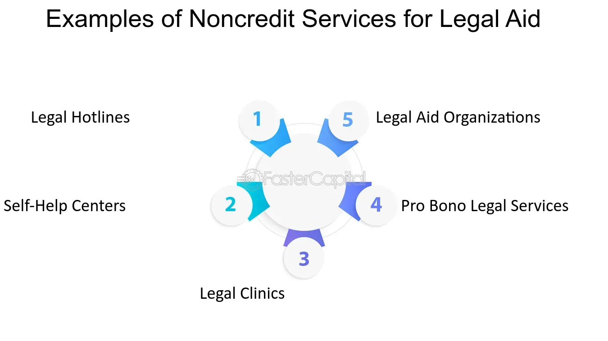

## Table of Contents

## What are noncredit services?

Noncredit services are educational programs and courses that do not offer college credits. These services are often provided by community colleges, adult education centers, and other educational institutions. They are designed to help people learn new skills, improve their job prospects, or pursue personal interests without the pressure of earning a degree or academic credits.

These services can include a wide range of subjects, such as basic skills like reading and math, English as a Second Language (ESL), vocational training, and personal enrichment classes like art or cooking. Noncredit courses are usually more affordable than credit courses and are often flexible in terms of scheduling, making them accessible to a broader audience. They are a great option for people who want to learn for the sake of learning, without the need for formal academic recognition.

## How do noncredit services differ from credit services?

Noncredit services and credit services are both offered by educational institutions, but they have some big differences. Credit services give you college credits that count toward a degree or certificate. These credits can be important for your academic record and can help you get a job or move to a higher level of education. Noncredit services, on the other hand, do not give you any college credits. They are meant for learning new skills or exploring interests without the need for formal academic recognition.

Another difference is the cost and flexibility. Credit services usually cost more because they are part of a degree program. They also have strict schedules and requirements. Noncredit services are often cheaper and more flexible. You can take classes at times that work for you, and they are designed to be accessible to more people. This makes noncredit services a good choice for people who want to learn for fun or to improve their skills without the pressure of [earning](/wiki/earning-announcement) a degree.

## What are the benefits of using noncredit services?

Noncredit services are great because they let you learn new things without the stress of getting college credits. If you want to learn a new skill like cooking or painting, or if you need to improve your job skills, noncredit classes can help. They are usually cheaper than credit classes, so you don't have to spend a lot of money to learn something new. This makes it easier for more people to take classes and learn.

Another benefit is that noncredit services are often more flexible. You can take classes at different times that fit your schedule, and you don't have to worry about grades or exams. This is perfect if you work or have a busy life. Noncredit services can help you learn at your own pace and focus on what you want to learn, without the pressure of a degree program.

## Can you provide examples of noncredit services?

Noncredit services include a lot of different classes that help you learn new things without getting college credits. For example, you might take a class to learn how to cook new dishes or how to paint. These classes are fun and let you explore your interests. They are also good if you want to learn a new language, like Spanish or French, just for fun or to help you when you travel.

Another type of noncredit service is classes that help you get better at your job. For example, you might take a class to learn how to use a computer program like Microsoft Excel or how to do basic car repairs. These classes can help you get a better job or do your current job better. They are often shorter and more focused than college classes, so you can learn what you need quickly.

Some noncredit services also help people who need to improve their basic skills. For example, there are classes that help adults learn to read better or get better at math. There are also classes for people who want to learn English as a second language. These classes can help people feel more confident and do better in their everyday lives.

## Who typically uses noncredit services?

People who want to learn new things without the pressure of getting college credits often use noncredit services. This includes folks who are interested in hobbies like cooking, painting, or photography. They take these classes just for fun or to explore new interests. Noncredit services are also popular with people who want to learn a new language, like Spanish or French, for travel or personal growth.

Noncredit services are also used by people who want to improve their job skills. For example, someone might take a class to learn how to use a computer program like Microsoft Excel or to learn basic car repair. These classes help them do their jobs better or get a better job. They are shorter and more focused than college classes, so people can learn what they need quickly.

Another group that uses noncredit services are people who need to improve their basic skills. This includes adults who want to get better at reading or math. Noncredit services also offer classes for people learning English as a second language. These classes help people feel more confident and do better in their everyday lives.

## How are noncredit services regulated?

Noncredit services are regulated by different groups depending on where they are offered. In the United States, community colleges and adult education centers often have to follow rules set by state education departments. These rules make sure that the classes are good quality and that the people teaching them know what they are doing. Sometimes, there are also rules about what kinds of classes can be offered and how they should be run.

Even though noncredit services do not give college credits, they still need to meet certain standards. This helps make sure that students get a good learning experience. For example, the teachers might need to have special training or certifications. Also, the classes might need to follow certain guidelines to make sure they are fair and helpful for everyone who takes them.

## What are the risks associated with noncredit services?

One risk of noncredit services is that they might not be as good as you expect. Since they don't give college credits, some classes might not be as strict or well-organized. This means the teachers might not be as good, or the classes might not be as helpful as you hoped. It's important to check reviews and ask about the teachers before you sign up for a class.

Another risk is that noncredit services might not help you get a better job or earn more money. Even though some classes teach job skills, employers might not care about them as much as college credits. If you want to improve your job chances, you need to make sure the class you take is respected by employers. It's a good idea to talk to people in your field before you start a noncredit class.

Lastly, there's a risk that you might spend money on classes that don't meet your needs. Noncredit services can be cheaper than college classes, but they still cost money. If you pick the wrong class, you might not learn what you wanted to learn. It's important to think carefully about what you want to get out of a class before you pay for it.

## How can noncredit services impact personal finance management?

Noncredit services can help you manage your money better by teaching you new skills that can save you money. For example, if you take a class on cooking, you can learn to make meals at home instead of eating out, which can save you a lot of money over time. Or, if you take a class on basic car repairs, you might be able to fix your car yourself instead of paying someone else to do it. These skills can help you spend less money and keep more of it in your pocket.

On the other hand, noncredit services can also cost you money. Even though they are usually cheaper than college classes, you still have to pay for them. If you pick a class that doesn't help you or teach you what you need, you might feel like you wasted your money. It's important to think carefully about what you want to learn and how it can help you before you spend money on a noncredit class.

## What are the best practices for choosing noncredit services?

When choosing noncredit services, it's important to think about what you want to learn and why. Ask yourself if you want to learn a new hobby, like cooking or painting, or if you want to improve your job skills. Knowing your goals will help you pick the right class. Also, make sure the class fits your schedule. Noncredit services are often flexible, but you still need to find a time that works for you.

Another good practice is to check the quality of the class before you sign up. Look for reviews from other students to see if they liked the class and if it helped them learn. You can also ask about the teacher's experience and qualifications. This will help you make sure the class is worth your time and money. Remember, even though noncredit services don't give college credits, you still want to get a good learning experience.

## How do noncredit services fit into broader financial planning?

Noncredit services can be a smart part of your financial planning. They can help you learn new skills that save you money. For example, if you take a cooking class, you can make meals at home instead of eating out, which can save you a lot of money. Or, if you learn basic car repairs, you might fix your car yourself instead of paying someone else. These skills can help you spend less and keep more money in your pocket.

But, you need to be careful when choosing noncredit services. They cost money, even if they are cheaper than college classes. If you pick a class that doesn't help you or teach you what you need, you might feel like you wasted your money. So, think carefully about what you want to learn and how it can help you before you spend money on a noncredit class. This way, noncredit services can be a good part of your financial plan.

## What future trends are expected in the noncredit services sector?

In the future, noncredit services are expected to become even more popular. More people are looking for ways to learn new skills without the pressure of getting college credits. This means that community colleges and adult education centers will offer more noncredit classes. These classes will be easier to find online, so people can learn from home. Also, more businesses might start offering noncredit training to help their workers learn new skills quickly.

Another trend is that noncredit services will focus more on job skills. As jobs change and new technology comes out, people will need to learn new things to stay competitive. Noncredit classes can help with this because they are shorter and more focused than college classes. This means people can learn what they need quickly and get back to work. Also, noncredit services might start working more with businesses to make sure the classes teach the skills that employers want.

## How can one evaluate the effectiveness of noncredit services they are using?

You can evaluate the effectiveness of noncredit services by thinking about what you wanted to learn and if the class helped you learn it. If you took a cooking class to make meals at home, ask yourself if you can now cook better and if you are saving money by not eating out. If you took a class to learn a new job skill, like using a computer program, see if you can use that skill at work and if it has helped you do your job better. Talking to other people who took the class can also help. If they learned a lot and felt the class was worth it, that's a good sign.

Another way to evaluate noncredit services is to look at the teacher and the class materials. A good teacher should know a lot about the subject and be able to explain it well. The class materials, like [books](/wiki/algo-trading-books) or online resources, should be helpful and easy to understand. If the teacher and materials are good, you are more likely to learn what you need. Also, think about if the class was organized well and if it fit your schedule. If everything worked well and you learned what you wanted, then the noncredit service was effective for you.

## References & Further Reading

[1]: Suranovic, S. M. (2010). ["International Finance: Theory and Policy."](https://open.umn.edu/opentextbooks/textbooks/18) Flat World Knowledge.

[2]: Sandeep, S., & Malladi, R. (2015). ["High-frequency Trading: Evolution and the Future."](https://scholar.google.com/citations?user=FtowR08AAAAJ&hl=en) SSRN Electronic Journal.

[3]: Aldridge, I. (2013). ["High-Frequency Trading: A Practical Guide to Algorithmic Strategies and Trading Systems."](https://www.amazon.com/High-Frequency-Trading-Practical-Algorithmic-Strategies/dp/1118343506) Wiley.

[4]: Treleaven, P., Galas, M., & Lalchand, V. (2013). ["Algorithmic Trading Review."](https://www.researchgate.net/publication/262239006_Algorithmic_Trading_Review) Financial Markets, Institutions & Instruments.

[5]: O’Hara, M. (2015). ["High Frequency Market Microstructure."](https://www.sciencedirect.com/science/article/pii/S0304405X15000045) Annual Review of Financial Economics.