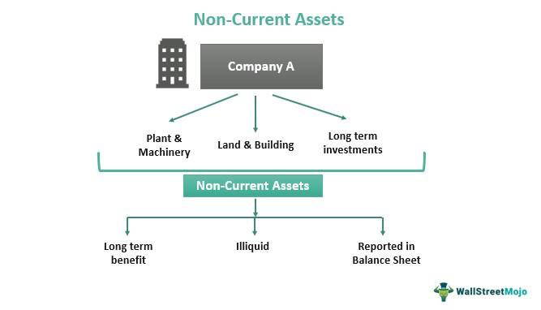

Understanding the intersection of financial accounting and algorithmic trading is essential in today's dynamic financial landscape. Noncurrent assets play a significant role in this context, representing long-term investments that extend beyond a single accounting year and provide ongoing economic benefits. These assets, which include property, plant, equipment, intellectual property, and long-term investments, are crucial for sustaining business operations and achieving strategic objectives. Proper accounting treatment, including capitalization and depreciation, ensures that their impact on financial statements aligns with the true economic value they provide. 

Simultaneously, the advent of algorithmic trading has transformed asset management and investment strategies. By deploying complex algorithms capable of processing vast datasets, businesses can achieve improved efficiency and accuracy in trading operations. These algorithms facilitate quick decision-making and enable real-time market reactions, optimizing both risk management and potential returns. The integration of algorithmic trading into financial strategies enhances an organization's ability to manage its assets effectively.



Together, these components—noncurrent assets and algorithmic trading—shape an organization's financial health and competitive positioning. They influence not only the balance sheet but also strategic decision-making processes that drive long-term sustainability. Businesses that integrate informed analysis of noncurrent assets with sophisticated trading algorithms are better positioned to enhance their decision-making, resource allocation, and overall strategic direction, ensuring resilience and competitiveness in rapidly evolving markets.

## Table of Contents

## What Are Noncurrent Assets?

Noncurrent assets represent long-term investments that provide extended economic benefits beyond a single accounting year. These assets are fundamental components of a company's balance sheet and encompass various categories, including property, plant, and equipment (PPE), intellectual property, and long-term investments. Unlike current assets, which are expected to be converted into cash within a year, noncurrent assets are typically illiquid and cannot be swiftly converted into cash without potentially affecting the company's operations or market value.

The presence of noncurrent assets on a balance sheet is an indicator of the company's long-term financial health and capacity for sustained operations. Such assets are integral to achieving strategic business objectives, as they often form the backbone of production capabilities and innovative potential. For example, a manufacturing firm's machinery (a tangible noncurrent asset) is essential for its production process, while a technology company's patents (an intangible noncurrent asset) provide competitive advantages and revenue streams through licensing or protection of proprietary technology.

The management and valuation of noncurrent assets have profound implications on a company's financial statements and stability. Proper valuation ensures that the assets accurately reflect their potential to generate future economic benefits. This involves adopting appropriate accounting policies such as depreciation for tangible assets and amortization for intangible assets, which allocate the cost of the asset over its useful life. These processes help in representing the asset's value more accurately over time, aligning with its utility and contribution to revenue generation.

Effective management of noncurrent assets is also crucial for maintaining the budgetary balance and ensuring that the organization remains solvent and capable of meeting its long-term financial obligations. Consequently, executives and financial managers emphasize the strategic handling of such assets, recognizing their critical role in the overall financial planning and growth of the organization.

## Classification and Examples of Noncurrent Assets

Noncurrent assets, which encompass resources that provide economic benefits over multiple accounting periods, are critical for a company's sustained operations and strategic initiatives. These assets are categorized into three main types: tangible assets, intangible assets, and natural resources.

Tangible assets are physical and concrete resources that are utilized in production and other business activities. Examples include real estate properties, machinery, and equipment. These assets play a significant role in manufacturing and operational processes, contributing directly to revenue generation. Their physical presence allows for the straightforward assessment of their value and utility over time.

Intangible assets, on the other hand, are non-physical and often derive value from intellectual property rights, brand recognition, or proprietary technology. Patents, trademarks, and goodwill are prime examples of intangible assets. These assets provide strategic advantages by protecting innovations, enhancing brand value, and fostering competitive differentiation. Although they lack physical substance, intangible assets require careful valuation and management to ensure they are accurately represented in financial statements.

Natural resources are another category of noncurrent assets, including materials sourced from the earth such as oil, timber, and minerals. These resources can be vital for companies in extractive industries or those relying on raw materials. Although subject to market fluctuations, natural resources provide substantial economic value through their exploitation and sale.

Additionally, long-term investments, which represent stakes in other companies or real estate holdings meant for future benefits rather than immediate returns, are considered noncurrent assets. These investments are held with the expectation of appreciating in value or generating income over an extended period, thus impacting overall financial strategy and planning.

Overall, understanding the classification and diverse characteristics of noncurrent assets is fundamental for analyzing a company's financial position and potential for sustained growth.

## Accounting for Noncurrent Assets

Noncurrent assets, often considered long-term investments, play a critical role in a company's financial strategy. Their treatment in accounting is pivotal in portraying an accurate picture of an organization's financial health. These assets are capitalized on balance sheets, with their costs systematically allocated over their useful life to ensure that the financial statements remain reflective of economic realities.

**Depreciation and Amortization Practices**

Depreciation and amortization are essential accounting methods used to allocate the cost of noncurrent assets across the periods benefiting from their use. Depreciation applies to tangible assets, while amortization pertains to intangible assets. Both methods acknowledge that these assets lose value over time due to usage, obsolescence, or other factors.

**Depreciation Methods**

1. **Straight-Line Method**: This is the most straightforward and widely used method. It spreads the cost of an asset evenly over its useful life. The formula for annual depreciation using the straight-line method is:
$$
   \text{Annual Depreciation} = \frac{\text{Cost} - \text{Residual Value}}{\text{Useful Life}}

$$

   This method is particularly useful for assets that provide consistent value throughout their lifespan.

2. **Declining Balance Method**: This method applies a higher depreciation charge in the initial years of the asset's life, which gradually declines over time. It is often used for assets that rapidly lose value. The formula in the first year is:
$$
   \text{Depreciation} = \text{Book Value} \times \text{Depreciation Rate}

$$

   The declining balance method can vary in its specifics (e.g., double-declining balance), but the basic idea remains the same—accelerated depreciation early on.

**Amortization of Intangible Assets**

Amortization distributes the cost of intangible assets, such as patents or copyrights, over their useful life or legal duration, whichever is shorter. The method is akin to the straight-line depreciation, given the non-physical nature of these assets:
$$
   \text{Annual Amortization} = \frac{\text{Cost}}{\text{Useful Life}}

$$

Accurate amortization practices ensure that financial statements reflect the diminished value of intangibles over time.

**Ensuring Financial Statement Integrity**

The adoption of appropriate depreciation and amortization methods is fundamental in maintaining the integrity of financial statements. These practices must align with the asset's utility and actual revenue generation. Inaccurate or inconsistent application can lead to distorted financial statements, misleading stakeholders about the organization's true financial performance.

Moreover, the choice of methods is often influenced by regulatory requirements and industry standards, ensuring comparability and consistency across firms. Through careful selection and application of these accounting treatments, businesses can present a truer representation of their economic gains and losses. This ensures stakeholders, including investors and creditors, can make informed decisions based on reliable financial data.

## Challenges in Valuing Noncurrent Assets

Choosing appropriate valuation methods for noncurrent assets is essential for accurately reflecting an asset's true worth. These methods help ensure the integrity and reliability of financial statements, guiding investment and strategic decisions. Each method offers distinct advantages and challenges, necessitating judicious selection based on the type of asset and prevailing market conditions.

The historical cost method records assets at their original purchase price. This approach provides consistency and simplicity, as the recorded values remain unaffected by market [volatility](/wiki/volatility-trading-strategies). However, it fails to account for inflation, which can lead to outdated asset valuations, particularly over long periods. This limitation may result in financial statements that do not accurately reflect an organization's current economic position.

Fair value accounting addresses some of these limitations by measuring assets at their current market prices. This approach is particularly beneficial in environments with frequent asset trading, as it captures the dynamic nature of the market. By reflecting the latest market conditions, fair value provides a more accurate representation of an asset's worth. However, it can introduce volatility in financial statements, as values fluctuate with market trends, and may involve significant estimation, particularly for assets without active markets.

Income-based models, such as discounted cash flow (DCF) analysis, offer a forward-looking perspective by evaluating expected future cash returns from an asset. The DCF method estimates an asset's value by projecting its future cash flows and discounting them to present value using an appropriate discount rate. This model is particularly useful for assets like intellectual property or long-term investments with predictable revenue streams. However, it generally relies on assumptions about future market conditions, cash flows, and interest rates, which can be subjective and uncertain.

Each valuation method presents unique benefits and challenges, highlighting the necessity for careful selection tailored to the specific asset and context. For instance, a company with significant tangible assets, such as property and equipment, might prefer historical cost for its simplicity and reliability. In contrast, an organization heavily involved in asset trading might opt for fair value to leverage real-time market insights.

In practice, firms often use a combination of these methods to achieve a balanced and comprehensive asset valuation approach. The key lies in matching the valuation technique with the asset's characteristics, intended use, and the firm's strategic goals, ensuring a realistic and practical appraisal of noncurrent assets. Ultimately, these valuation practices underpin sound financial management, supporting informed decision-making and maintaining the credibility of financial reporting.

## Algorithmic Trading and Asset Management

Algorithmic trading employs complex algorithms to execute trades in financial markets with high speed and precision. These algorithms are designed to process large volumes of data, allowing for enhanced asset management capabilities through predictive modeling and analysis. By leveraging statistical methods and [machine learning](/wiki/machine-learning) techniques, [algorithmic trading](/wiki/algorithmic-trading) systems can identify patterns and trends in market data, resulting in more informed decision-making.

One of the primary benefits of algorithmic trading is the reduction of human error. Automated systems can operate continuously without fatigue, ensuring real-time market reactions and execution of trading strategies. This ability to respond instantly to market movements helps streamline strategic planning by mitigating the risk of emotional biases that can impact trading decisions.

Algorithmic trading supports a diverse array of investment strategies, optimizing both risk and return on investment. Strategies range from simple techniques like moving averages to more sophisticated approaches like statistical [arbitrage](/wiki/arbitrage) and algorithmic execution tactics. By applying these strategies, traders can exploit inefficiencies in the market, achieving favorable trade outcomes.

Programming languages such as Python play a crucial role in developing robust trading algorithms. Python's extensive libraries, such as NumPy, pandas, and TensorFlow, facilitate data handling, quantitative analysis, and the implementation of machine learning models. Below is a simple example of how Python can be used to calculate a moving average, a common tool in algorithmic trading:

```python
import numpy as np

def moving_average(prices, window_size):
    return np.convolve(prices, np.ones(window_size)/window_size, mode='valid')

prices = [10, 20, 30, 40, 50]
window_size = 3
print(moving_average(prices, window_size))
```

In this code snippet, the `moving_average` function calculates the average of the closing prices over a defined window size, offering insights into short-term trends.

Algorithmic trading not only enhances operational efficiency but also contributes significantly to strategic asset management. By enabling precise execution and versatile strategy integration, algorithmic trading systems empower organizations to navigate complex financial markets effectively, optimizing their portfolios in alignment with risk management objectives.

## The Role of Noncurrent Assets in Financial Statements

Noncurrent assets play a vital role in financial statements, primarily appearing on the balance sheet as long-term investments that contribute to a company’s sustained economic objectives. These assets, comprising tangible and intangible categories, are crucial for understanding a firm's financial health and forecasting future financial performance.

Depreciation and amortization are integral to accounting for noncurrent assets, ensuring that the cost allocation aligns with the asset's utility over time. Depreciation applies to tangible assets like machinery and buildings, while amortization pertains to intangible assets such as patents and trademarks. These systematic allocations are essential in matching the asset's cost with the revenue it generates, adhering to the matching principle in accounting. For instance, the straight-line method of depreciation spreads the asset’s cost evenly over its useful life, calculated as:

$$
\text{Annual Depreciation Expense} = \frac{\text{Cost of the Asset} - \text{Residual Value}}{\text{Useful Life of the Asset}}
$$

Regular impairment checks are necessary to ensure that noncurrent assets do not remain overvalued on the balance sheet. An asset is considered impaired when its carrying amount exceeds its recoverable amount, necessitating a write-down to reflect its true economic value. This practice maintains the credibility and accuracy of financial statements, providing stakeholders with a realistic view of the company's financial position.

Noncurrent assets significantly influence various financial metrics, thereby guiding both investment and financing decisions. Metrics such as return on assets (ROA) and asset turnover ratios are directly affected by the valuation and management of these assets. Effective management of noncurrent assets aligns them with organizational goals, facilitating strategic investments and maintaining an optimal balance of solvency and [liquidity](/wiki/liquidity-risk-premium).

Proper alignment of noncurrent asset management with financial obligations ensures that the organization remains solvent and adequately liquid, meeting both short-term liabilities and long-term growth objectives. This alignment is crucial for maintaining investor confidence and achieving sustainable corporate growth, as it enhances a company’s ability to generate returns and optimize its capital structure. Through strategic management of noncurrent assets, organizations can secure their financial health and ensure long-term success in a competitive market.

## Strategic Financial Management and Planning

Incorporating noncurrent asset management into strategic financial planning is crucial for enhancing decision-making capabilities within organizations. By effectively managing noncurrent assets, businesses can align their financial strategies with long-term objectives, ensuring stability and growth. These assets, due to their extended economic benefits, are integral to achieving strategic goals and optimizing resource allocation.

Algorithmic trading tools provide significant advantages in this context, allowing for enhanced real-time analysis and market trend prediction, which subsequently improves execution. The use of sophisticated algorithms enables rapid processing of vast data volumes, reducing reaction times and minimizing human errors. This capability supports the development of dynamic investment strategies that balance risks and returns effectively. For instance, Python, a leading programming language, is frequently used to create robust trading algorithms that automate complex decision-making processes.

Efficient financial management strategies aim to harmonize organizational assets with overarching company objectives. By doing so, businesses can achieve a favorable balance between risks and returns. This involves the utilization of data-driven methodologies that bolster capital allocation and risk mitigation—crucial components in dynamically changing environments. Techniques such as data analysis and machine learning facilitate the assessment of market conditions and the anticipation of potential risks, thereby enhancing the strategic planning process.

Companies that successfully integrate these strategies can build greater financial resilience, ensuring a competitive advantage. The strategic management of noncurrent assets, paired with innovative algorithmic trading solutions, leads to a more robust financial framework. As a result, organizations are better positioned to respond to market changes, safeguard their financial health, and sustain long-term profitability. This powerful combination of informed asset management and advanced trading technologies can significantly elevate an organization's market positioning and operational efficiency.

## Conclusion

Mastering the integration of financial accounting, noncurrent assets, and algorithmic trading is paramount for achieving robust financial management. Such integration enhances decision-making by providing a detailed understanding of both the assets an organization holds and how they can be strategically managed and traded. This synergy facilitates informed resource allocation, enabling companies to optimize their investments and maximize returns.

Furthermore, a strategic approach that incorporates both financial accounting and algorithmic trading positions an organization competitively in the market. With algorithmic trading, the ability to process and analyze vast datasets in real time becomes possible, allowing businesses to execute trades that capitalize on market opportunities with precision and speed. This capability offers a significant advantage over competitors who may rely on slower, more traditional trading methods.

The rapid evolution of financial technologies emphasizes the importance of continuous adaptation. Embracing new tools and methodologies is essential for maximizing corporate value and ensuring long-term stability. By staying informed about advancements in financial technology and integrating them into their operations, companies safeguard their financial interests and position themselves to thrive amidst ever-shifting financial landscapes.

As financial markets and technologies continue to evolve, ongoing learning in these interrelated domains is crucial. Businesses that prioritize education and innovation in financial accounting, asset management, and algorithmic trading are better equipped to safeguard and enhance their organizational success. This proactive approach not only bolsters financial resilience but also enables organizations to capture new opportunities and maintain a leading edge in the competitive financial arena.

## References & Further Reading

[1]: ["International Financial Reporting Standards (IFRS)"](https://www.investopedia.com/terms/i/ifrs.asp) - An essential source for understanding global accounting standards relevant to noncurrent asset management.

[2]: Lo, Andrew W. (2017). ["Adaptive Markets: Financial Evolution at the Speed of Thought"](https://www.amazon.com/Adaptive-Markets-Financial-Evolution-Thought/dp/0691135142) - A book that explores the integration of financial technologies, including algorithmic trading, with financial theories.

[3]: ["Advances in Financial Machine Learning"](https://www.amazon.com/Advances-Financial-Machine-Learning-Marcos/dp/1119482089) by Marcos Lopez de Prado - A comprehensive resource on the application of machine learning in financial markets, particularly relevant to algorithmic trading.

[4]: ["Essentials of Financial Accounting"](https://www.amazon.com/Essentials-Financial-Accounting-Asish-Bhattacharyya/dp/8120353153) by Asokan Anandarajan - This book covers the fundamental principles of financial accounting, including the management of noncurrent assets.

[5]: Jorion, Philippe (2007). ["Value at Risk: The New Benchmark for Managing Financial Risk"](https://link.springer.com/article/10.1007/s11408-007-0057-3) - A detailed exploration of risk management techniques important for both noncurrent asset management and algorithmic trading strategies.

[6]: ["Python for Data Analysis"](https://wesmckinney.com/book/) by Wes McKinney - A guide to using Python for data analysis, essential for developing algorithmic trading models and strategies.