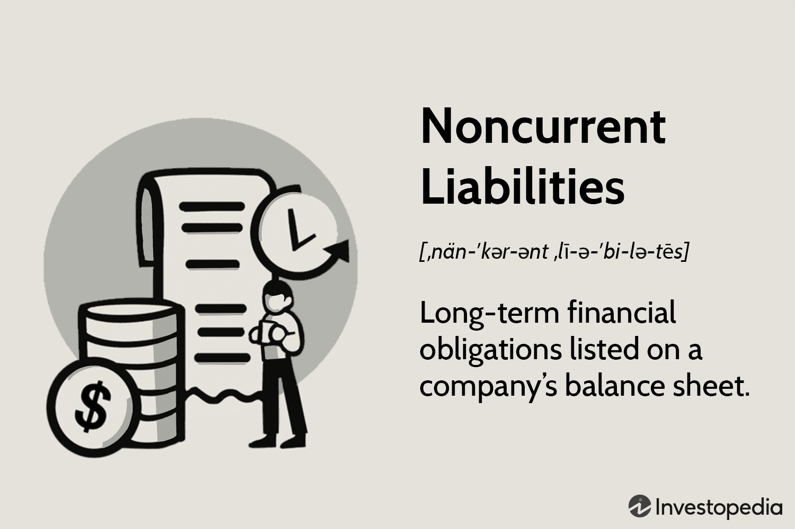

This article explores the intersection of financial ratios, long-term debt, noncurrent liabilities, and algorithmic trading, providing an in-depth analysis of their significance in the financial sphere. Financial metrics such as the debt ratio and leverage ratio are critical in evaluating a company's financial health and are pivotal in optimizing trading strategies. These ratios assess a company's ability to meet its long-term obligations and how effectively it utilizes borrowed funds to generate earnings. For instance, the debt ratio is calculated as follows:

$$
\text{Debt Ratio} = \frac{\text{Total Debt}}{\text{Total Assets}}
$$



A higher ratio may indicate greater financial risk, making the analysis of these ratios vital for investors and analysts to gauge a company's financial stability and operational efficiency.

Algorithmic trading, commonly referred to as algo trading, uses advanced mathematical models to enhance trading strategies and improve market efficiency through automation. By employing pre-programmed algorithms, traders can execute orders at speeds and frequencies that are impossible for human traders. The intersection of these financial metrics and algorithmic trading provides traders and investors with a powerful toolkit for capital allocation and risk management decisions.

Incorporating financial ratios into trading algorithms optimizes decision-making processes by providing real-time data and analytics, enabling strategic adjustments based on current financial conditions. For instance, traders can use algorithms to continually assess the debt-to-equity ratio or similar metrics to ensure optimal leverage levels are maintained, thereby mitigating risks associated with high leverage and debt loads.

Comprehending these elements is crucial for investors and traders aiming to make informed decisions regarding capital allocation and risk management. As the financial landscape becomes increasingly complex, leveraging these tools effectively can lead to more robust trading strategies and improved risk-adjusted returns. By integrating these financial metrics into algorithmic trading systems, market participants can enhance their ability to navigate the volatile environment of financial markets.

## Table of Contents

## Understanding Financial Ratios

Financial ratios are fundamental metrics used to evaluate a company's financial health and operational performance. These ratios provide insights into various aspects of a company's financial condition, allowing analysts and investors to make informed decisions. Among these ratios, those that measure leverage and financial stability are particularly important, as they assess the financial risk and debt levels a company undertakes.

Noncurrent liabilities and long-term debts are central to determining a company's leverage position. Noncurrent liabilities include any financial obligations not due within the current fiscal year, such as bonds payable, long-term loans, and deferred tax liabilities. These long-term obligations are contrasted with current liabilities, which are due within a shorter time frame and impact the [liquidity](/wiki/liquidity-risk-premium) of a company.

A key financial ratio that incorporates long-term debt is the debt-to-assets ratio. This is calculated as:

$$
\text{Debt-to-Assets Ratio} = \frac{\text{Total Debt}}{\text{Total Assets}}
$$

This ratio measures the proportion of a company’s assets that are financed by debt, indicating how leveraged a company is. A higher ratio suggests greater financial leverage and potentially higher financial risk, as the company has more debt to service.

Another crucial metric is the debt-to-capital ratio. This ratio compares a company’s total debt to its total capital, showing investors the proportion of capital funding that comes from debt versus equity. It is calculated as:

$$
\text{Debt-to-Capital Ratio} = \frac{\text{Total Debt}}{\text{Total Debt + Shareholder's Equity}}
$$

A higher debt-to-capital ratio signals that a company might be over-leveraged, which could strain the company during financial downturns.

The total debt-to-total assets ratio is also pivotal, offering a broader view of leverage relative to all assets:

$$
\text{Total Debt-to-Total Assets Ratio} = \frac{\text{Total Debt plus Total Liabilities}}{\text{Total Assets}}
$$

This ratio helps in understanding the structure of liabilities in relation to the company’s entire asset base, offering insights into potential solvency issues.

These financial ratios are instrumental in assessing how well a company can manage its obligations and sustain operations. By analyzing these metrics, analysts can determine the financial leverage and stability of a company, aiding in the prediction of future financial performance and risk. These ratios allow stakeholders to gauge whether a company's capital structure is balanced and prudent for its growth objectives and market conditions.

## Noncurrent Liabilities and Long-Term Debt

Noncurrent liabilities, also known as long-term debts, are financial obligations that a company is required to settle beyond a 12-month period from the balance sheet date. These liabilities form a critical component of a firm's financial structure, reflecting its long-term financial commitments and are vital for assessing its fiscal health and sustainability. This section outlines the types of noncurrent liabilities, their role in financial evaluation, and their impact on company strategy.

**Types of Noncurrent Liabilities:**
Noncurrent liabilities encompass a variety of obligations that organizations must manage over an extended period. Typical examples include:

1. **Bonds Payable:** These are debt securities issued by the company to investors under the agreement to pay back with interest. Bonds generally have maturities extending beyond a year, often spanning several decades.

2. **Long-term Loans:** Often provided by financial institutions, these loans require periodic interest payments and the principal to be repaid after more than one year. They could be fixed or variable based on interest rates.

3. **Deferred Tax Liabilities:** These arise when the tax expenses recorded in the company's accounting books differ from tax payable per tax authorities, typically due to timing differences.

4. **Lease Liabilities:** Per updated accounting standards such as IFRS 16 and ASC 842, many leases are now reflected as long-term liabilities on the balance sheet.

5. **Pension Liabilities:** These represent the unfunded portion of a company's pension obligations to its employees.

**Importance in Financial Evaluation:**
Understanding noncurrent liabilities is paramount for long-term financial analysis. They indicate how much external funding a company is leveraging, potentially affecting investments, expansion plans, and strategic decisions. Analysts assess these liabilities to gauge a firm's leverage and financial flexibility.

- **Leverage Ratios:** Ratios like the debt-to-equity ratio and long-term debt-to-assets ratio help in evaluating the leverage level. A higher ratio typically indicates increased financial risk, as more debt implies higher obligations for interest and principal repayments.
$$
  \text{Debt-to-Equity Ratio} = \frac{\text{Total Long-term Debt}}{\text{Shareholder's Equity}}

$$

- **Financial Stability:** The nature and terms of noncurrent liabilities can affect the company's cash flow stability. For example, fixed-rate debt could shield the company from interest rate fluctuations but may also lead to higher costs than variable rate instruments during decreasing rates.

**Impact on Company Strategy:**
Companies must strategically manage their noncurrent liabilities to align with their overarching business objectives. Excessive long-term debt can constrain a firm's operational flexibility and ability to invest in new opportunities. Conversely, strategically used long-term obligations can enable growth and expansion without sacrificing immediate resources or equity dilution.

In summary, noncurrent liabilities and long-term debts are integral in shaping the long-term financial landscape of a company. They influence a company's leverage, financial risk, and strategic flexibility, highlighting the importance of careful management and analysis in financial planning.

## Financial Ratios and Algo Trading

Algorithmic trading systems leverage financial ratios such as debt and leverage ratios to enhance trading strategy optimization. These ratios are pivotal in assessing a company's financial leverage and risk, allowing algorithmic models to evaluate and manage exposure effectively. Traders rely on these insights to make data-driven decisions and optimize capital deployment, ensuring a balance between risk and reward.

Debt ratios, such as the debt-to-assets ratio and leverage ratios, give traders insight into a company's financial structure. For instance, the debt-to-assets ratio is defined as:

$$
\text{Debt-to-Assets Ratio} = \frac{\text{Total Debt}}{\text{Total Assets}}
$$

This ratio helps traders understand what portion of a company's assets is financed through debt, a critical [factor](/wiki/factor-investing) in assessing the risk associated with investing in or trading that company's stock.

Incorporating these ratios into trading algorithms involves assessing current and historical data to project potential price movements and [volatility](/wiki/volatility-trading-strategies). By analyzing a company's leverage, traders can gauge the potential impact of debt on its operations and consequently decide on suitable risk management strategies.

Python, with its robust libraries for data analysis such as Pandas, NumPy, and financial analysis libraries, provides an efficient platform to automate the monitoring of these ratios. For example, a simple script to calculate the debt-to-assets ratio using Python could look like this:

```python
import pandas as pd

def calculate_debt_to_assets_ratio(total_debt, total_assets):
    return total_debt / total_assets

# Example data
data = {'total_debt': [500000, 600000, 550000], 'total_assets': [1000000, 1200000, 1100000]}
df = pd.DataFrame(data)

df['debt_to_assets_ratio'] = df.apply(lambda row: calculate_debt_to_assets_ratio(row['total_debt'], row['total_assets']), axis=1)

print(df)
```

This script automates the collection of financial data and calculates the debt-to-assets ratio, allowing traders to make quick and informed decisions based on the leverage dynamics of companies within their portfolio.

By continuously updating and integrating financial ratios into algorithmic models, traders can adjust their strategies dynamically in response to changing market conditions, thereby optimizing risk-adjusted returns. This approach underscores the significance of these metrics in enabling precise capital allocation and sophisticated risk management.

## Impact of Debt and Leverage Ratios on Trading Strategies

High debt ratios can significantly influence trading strategies by prompting traders to reassess their positions and manage risks more effectively. Debt ratios, such as the debt-to-equity ratio, are critical indicators of financial leverage and overall company health. When these ratios suggest excessive leverage, traders may take precautionary measures, including reducing their positions or adopting more conservative trading strategies to mitigate potential risks. 

The primary goal is to align trading strategies with acceptable risk thresholds while optimizing potential returns. Financial ratios, particularly those reflecting leverage, guide the determination of optimal leverage levels. For instance, the formula for the debt-to-equity ratio is:

$$
\text{Debt-to-Equity Ratio} = \frac{\text{Total Debt}}{\text{Total Equity}}
$$

This ratio helps traders in assessing whether a company is financing its operations through debt, which can indicate financial instability and potential future solvency issues. A high ratio may alert traders to the need for careful evaluation of its implications on their portfolio.

The rise of [algorithmic trading](/wiki/algorithmic-trading) has made it feasible to automate the monitoring and calculation of these financial metrics, which can significantly enhance trading strategies. Traders can utilize Python and similar technologies to streamline this process. This automation not only improves the efficiency of strategy implementation but also allows for real-time adjustments in response to fluctuating financial indicators. Below is a simple Python example demonstrating how to calculate the debt-to-equity ratio programmatically:

```python
def calculate_debt_to_equity(total_debt, total_equity):
    return total_debt / total_equity

# Example usage
total_debt = 500000  # example debt value
total_equity = 200000  # example equity value

debt_to_equity_ratio = calculate_debt_to_equity(total_debt, total_equity)
print("Debt to Equity Ratio:", debt_to_equity_ratio)
```

By leveraging such algorithms, traders can ensure that their strategies remain aligned with desired risk levels. This integration of technology not only enhances decision-making processes but also supports traders in achieving better risk-adjusted returns. Additionally, the use of Python libraries such as Pandas and NumPy can further facilitate complex data analysis and management of extensive datasets, offering a more comprehensive understanding of financial metrics and their implications on trading strategies.

## Conclusion

Debt and leverage ratios are pivotal in offering a comprehensive view of a company’s financial health, serving as indispensable tools for investors and traders alike. By analyzing these metrics, stakeholders can gain insights into the degree of risk associated with a company's capital structure and its ability to meet long-term obligations. Understanding these financial indicators is vital for developing effective algorithmic trading strategies.

Algorithmic trading systems thrive on precise, data-driven analysis, and integrating financial metrics, such as debt and leverage ratios, enhances the ability to make informed decisions. These systems can evaluate a company's financial state, aiding in the optimization of trading strategies that can better balance risk and reward. For instance, the debt-to-equity ratio and other leverage ratios help determine the level of financial risk a company is exposed to, allowing traders to calibrate their strategies accordingly.

Through the dynamic adjustment of trading strategies based on real-time assessments of these ratios, traders can achieve improved risk-adjusted returns. Algorithmic systems, using tools like Python, can automate the monitoring and recalibration processes, ensuring strategies remain aligned with fluctuating financial environments. The automation may cover tasks like fetching data, calculating critical ratios, and executing trades based on pre-defined risk thresholds.

For instance, a simple Python script could be employed to calculate and regularly update these ratios:

```python
def calculate_debt_ratios(total_debt, total_assets, total_equity):
    debt_to_assets = total_debt / total_assets
    debt_to_equity = total_debt / total_equity
    return debt_to_assets, debt_to_equity

# Example usage
total_debt = 500000
total_assets = 1000000
total_equity = 500000

ratios = calculate_debt_ratios(total_debt, total_assets, total_equity)
print(f"Debt-to-Assets Ratio: {ratios[0]}")
print(f"Debt-to-Equity Ratio: {ratios[1]}")
```

The capacity to harness these financial insights algorithmically enables traders to maintain robust strategies that can withstand market volatility. Ultimately, leveraging debt and leverage ratios in algorithmic trading not only aids in optimizing capital deployment but also in achieving superior financial returns, underscoring their indispensable role in modern finance.

## References & Further Reading

Modigliani, F., & Miller, M. H. (1958). "The Cost of Capital, Corporation Finance and the Theory of Investment" is a seminal work that forms the foundation of modern corporate finance theory. This paper introduces the Modigliani-Miller theorem, which posits that in a perfect market, a company's value is unaffected by its capital structure. This theorem provides critical insights into the relationship between financial leverage and firm valuation, making it essential reading for understanding the implications of financial ratios on corporate finance.

Damodaran, A. (2012). "Investment Valuation: Tools and Techniques for Determining the Value of Any Asset" offers a comprehensive guide to the valuation of assets, using financial ratios as one of the fundamental tools. This resource is invaluable for traders and investors looking to assess company value and risk, incorporating various financial ratios into valuation techniques.

Professional literature on algorithmic trading and financial ratios expands on the practical applications of these concepts in modern trading environments. Books and articles in this field discuss the integration of financial metrics into algorithmic models, highlighting how quantitative and financial analyses are combined to inform trading decisions. Research papers and textbooks emphasize methodologies for automating the calculation and monitoring of financial ratios, crucial for alerting traders to changes in a company's financial health.

Further reading includes exploring advanced resources such as financial datasets and [machine learning](/wiki/machine-learning) algorithms to refine trading strategies, utilizing Python libraries such as pandas for data manipulation, and incorporating financial ratios into predictive models. The combination of financial theory, algorithmic trading insights, and programming skills enables traders to develop robust, data-driven trading frameworks.