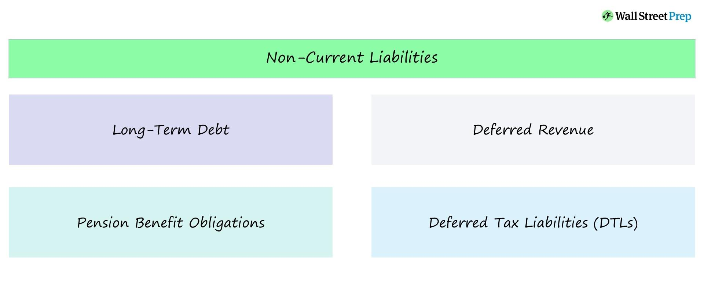

## Table of Contents

## What are noncurrent liabilities?

Noncurrent liabilities are debts or obligations that a company does not have to pay off within the next year. These are long-term financial responsibilities that businesses take on to fund their operations, growth, or investments. Examples include long-term loans, bonds payable, and pension liabilities. Because they are due over a longer period, they help companies manage their cash flow better by spreading out payments.

These liabilities are important because they show how a company is financing its long-term growth and stability. For example, if a company takes out a long-term loan to build a new factory, this loan would be a noncurrent liability. It's different from short-term debts like accounts payable, which need to be paid off quickly. By looking at a company's noncurrent liabilities, investors and analysts can understand its long-term financial health and strategy.

## How do noncurrent liabilities differ from current liabilities?

Noncurrent liabilities and current liabilities are both debts a company owes, but they are different because of when they need to be paid. Current liabilities are debts that a company needs to pay within one year. These can include things like bills to suppliers, short-term loans, and taxes that need to be paid soon. They are important because they show how much money a company needs to find quickly to keep running smoothly.

On the other hand, noncurrent liabilities are debts that a company does not need to pay off within the next year. These are long-term debts like long-term loans, bonds that will mature in more than a year, and pension obligations. Noncurrent liabilities help a company spread out its payments over time, which can be good for planning and managing money. They are important because they show how a company is planning for the future and managing its long-term financial health.

Understanding the difference between these two types of liabilities is key for anyone looking at a company's financial health. Current liabilities give a snapshot of the immediate financial pressures, while noncurrent liabilities provide insight into the company's long-term strategy and stability. Together, they help paint a full picture of how a company manages its debts and finances over time.

## Can you provide examples of common noncurrent liabilities?

Common noncurrent liabilities include long-term loans and bonds payable. A long-term loan might be money a company borrows from a bank to buy a new building or expand its operations. The loan is paid back over many years, not all at once. Bonds payable are another example. These are like IOUs that a company issues to investors. The company promises to pay back the money, plus interest, over a long period, usually more than one year.

Another type of noncurrent liability is deferred tax liabilities. These happen when a company's tax bill is delayed to future years. It's money the company knows it will have to pay eventually, but not right away. Pension liabilities are also common. These are promises a company makes to pay its employees after they retire. The company sets aside money now to pay these future benefits, and it's considered a long-term obligation.

Lease obligations can also be noncurrent liabilities. If a company signs a long-term lease for office space or equipment, the payments due beyond the next year are considered noncurrent liabilities. These leases help the company use assets without buying them outright, spreading the cost over many years.

## Why are noncurrent liabilities important for a company's financial health?

Noncurrent liabilities are important for a company's financial health because they show how the company plans for the future. When a company takes on long-term debts like loans or bonds, it's usually to invest in big projects that can help the business grow. These projects might be things like building new factories or buying new equipment. By spreading out the cost of these investments over many years, the company can manage its money better and not have to pay everything at once. This helps the company keep running smoothly without running out of cash.

Also, noncurrent liabilities give a good picture of the company's long-term stability. If a company has a lot of long-term debt, it might mean they are growing quickly and making big investments. But it also means they have to keep making money to pay back these debts over time. Investors and people who look at the company's finances pay attention to noncurrent liabilities to see if the company is planning well for the future. If the company manages its long-term debts well, it can be a sign that they are financially healthy and ready for future challenges.

## How are noncurrent liabilities reported on the balance sheet?

Noncurrent liabilities are shown on the balance sheet under the liabilities section. The balance sheet is like a big picture of what a company owns and owes at a certain time. On this sheet, you'll see current liabilities first, which are debts the company needs to pay within a year. Right after that, you'll see noncurrent liabilities. These are the debts the company doesn't have to pay off right away, like long-term loans or bonds that won't come due for a while.

The way noncurrent liabilities are listed on the balance sheet is important because it helps people understand how the company is planning for the future. For example, if a company has a lot of long-term loans, it might mean they are investing in big projects that will help them grow. By looking at these long-term debts, investors and others can see if the company is managing its money well and if it's ready for future challenges.

## What is the debt to equity ratio and how does it relate to noncurrent liabilities?

The debt to equity ratio is a number that shows how much a company is borrowing compared to how much money the owners have put into the business. It's calculated by dividing the company's total debts by the total equity. This ratio helps people see if a company is using a lot of borrowed money to grow or if it's mostly using the money from its owners. A high debt to equity ratio might mean the company is taking more risks because it has to pay back a lot of money, while a low ratio might mean the company is being more careful with its money.

Noncurrent liabilities are a big part of the debt to equity ratio because they are long-term debts that the company doesn't have to pay back right away. When you calculate the total debts for the ratio, you include these noncurrent liabilities along with any short-term debts. So, if a company has a lot of long-term loans or bonds, it will show up in the debt to equity ratio. This helps investors and others understand how the company is managing its long-term financial health and how much it's relying on borrowed money to grow.

## How can the interest coverage ratio be used to assess the burden of noncurrent liabilities?

The interest coverage ratio is a tool that helps people understand if a company can pay the interest on its debts, including noncurrent liabilities. It's calculated by dividing the company's earnings before interest and taxes (EBIT) by the interest expenses it has to pay. A high interest coverage ratio means the company is making enough money to easily cover its interest payments, which is good. A low ratio means the company might struggle to pay its interest, which could be a problem, especially if it has a lot of long-term debts.

Noncurrent liabilities, like long-term loans or bonds, often come with interest payments that the company has to make over many years. If a company has a lot of these long-term debts, the interest coverage ratio becomes really important. It shows if the company's profits are strong enough to handle these ongoing interest costs. By looking at this ratio, investors and others can see if the company is in a good position to manage its long-term financial obligations or if it might face challenges in the future.

## What role do noncurrent liabilities play in a company's long-term financial strategy?

Noncurrent liabilities are important for a company's long-term financial strategy because they help the company plan for the future. When a company takes on long-term debts like loans or bonds, it's usually to invest in big projects that can help the business grow. These projects might include building new factories, buying new equipment, or expanding into new markets. By spreading out the cost of these investments over many years, the company can manage its money better and not have to pay everything at once. This helps the company keep running smoothly without running out of cash.

Noncurrent liabilities also show how well a company is managing its long-term financial health. If a company has a lot of long-term debt, it might mean they are growing quickly and making big investments. But it also means they have to keep making money to pay back these debts over time. Investors and people who look at the company's finances pay attention to noncurrent liabilities to see if the company is planning well for the future. If the company manages its long-term debts well, it can be a sign that they are financially healthy and ready for future challenges.

## How do changes in interest rates affect the cost of noncurrent liabilities?

Changes in interest rates can have a big impact on the cost of noncurrent liabilities for a company. When interest rates go up, it means the company has to pay more interest on its long-term loans and bonds. This can make the cost of borrowing money higher, which can be tough if the company has a lot of long-term debt. For example, if a company has a loan with a variable interest rate, the payments will go up when interest rates rise, making it more expensive to keep the loan.

On the other hand, when interest rates go down, the cost of noncurrent liabilities can decrease. Lower interest rates mean the company pays less interest on its long-term debts, which can save them money. This can be good for the company's cash flow and make it easier to manage their long-term financial obligations. Companies often try to plan for these changes by choosing fixed interest rates or using financial tools to manage the risk of rising interest rates.

## What are some advanced methods for analyzing the structure of noncurrent liabilities?

One advanced method for analyzing the structure of noncurrent liabilities is to look at the debt maturity schedule. This schedule shows when different parts of the company's long-term debts need to be paid back. By studying this schedule, you can see if the company has a lot of debt coming due at the same time or if the payments are spread out. This helps understand if the company might face big payments in the future that could strain its cash flow. It also shows how well the company is planning for the future by managing when its debts are due.

Another method is to use financial ratios like the debt to equity ratio and the interest coverage ratio. The debt to equity ratio compares the company's total debts to the money the owners have put into the business. A high ratio might mean the company is taking more risks by borrowing a lot, while a low ratio might mean they are being more careful. The interest coverage ratio shows if the company's profits are enough to cover the interest on its debts. A high ratio means the company can easily pay its interest, which is good, especially if it has a lot of long-term debt. By looking at these ratios, you can get a better idea of how the company is managing its long-term financial health.

## How can a company optimize its use of noncurrent liabilities to enhance financial flexibility?

A company can optimize its use of noncurrent liabilities to enhance financial flexibility by carefully planning its debt structure. This means choosing the right mix of long-term loans and bonds that match the company's growth plans. For example, if a company knows it will have a big project coming up in a few years, it can take out a long-term loan with payments spread out over time. This way, the company doesn't have to pay a lot of money all at once and can keep its cash flow steady. By spreading out payments, the company can use its money for other important things like research or expanding into new markets.

Another way to enhance financial flexibility is by managing interest rate risks. When interest rates change, it can affect how much the company has to pay on its long-term debts. To handle this, a company can choose fixed interest rates on its loans, so the payments stay the same even if interest rates go up. Or, they can use financial tools like interest rate swaps to manage the risk of rising rates. By doing this, the company can make sure it can handle its long-term debts without worrying too much about changes in interest rates. This helps the company plan for the future and stay financially healthy.

## What are the potential risks associated with high levels of noncurrent liabilities and how can they be mitigated?

High levels of noncurrent liabilities can be risky for a company because they might struggle to pay back the money they owe over time. If a company has a lot of long-term debts like loans or bonds, it needs to keep making money to cover the payments. If something goes wrong, like the economy gets bad or the company's profits drop, it might not have enough money to pay back these debts. This can make it hard for the company to grow or even stay in business. Also, if the company has too much debt, it might have to pay a lot of interest, which can eat into its profits and make it harder to invest in new projects.

To mitigate these risks, a company can take a few steps. First, it can try to keep a good balance between its debts and the money the owners have put into the business. This means not borrowing too much and making sure the company has enough money to cover its debts. Second, the company can choose loans with fixed interest rates so that payments don't go up if interest rates rise. This can help the company plan better and avoid surprises. Finally, the company can spread out its debt payments over time so that it doesn't have to pay a lot of money all at once. By doing these things, the company can manage its long-term debts better and keep its financial health strong.

## What is the key to understanding financial ratios?

Financial ratios are fundamental metrics used to evaluate a company's financial health and operational performance. These ratios provide insights into various aspects of a company's financial condition, allowing analysts and investors to make informed decisions. Among these ratios, those that measure leverage and financial stability are particularly important, as they assess the financial risk and debt levels a company undertakes.

Noncurrent liabilities and long-term debts are central to determining a company's leverage position. Noncurrent liabilities include any financial obligations not due within the current fiscal year, such as bonds payable, long-term loans, and deferred tax liabilities. These long-term obligations are contrasted with current liabilities, which are due within a shorter time frame and impact the [liquidity](/wiki/liquidity-risk-premium) of a company.

A key financial ratio that incorporates long-term debt is the debt-to-assets ratio. This is calculated as:

$$
\text{Debt-to-Assets Ratio} = \frac{\text{Total Debt}}{\text{Total Assets}}
$$

This ratio measures the proportion of a company’s assets that are financed by debt, indicating how leveraged a company is. A higher ratio suggests greater financial leverage and potentially higher financial risk, as the company has more debt to service.

Another crucial metric is the debt-to-capital ratio. This ratio compares a company’s total debt to its total capital, showing investors the proportion of capital funding that comes from debt versus equity. It is calculated as:

$$
\text{Debt-to-Capital Ratio} = \frac{\text{Total Debt}}{\text{Total Debt + Shareholder's Equity}}
$$

A higher debt-to-capital ratio signals that a company might be over-leveraged, which could strain the company during financial downturns.

The total debt-to-total assets ratio is also pivotal, offering a broader view of leverage relative to all assets:

$$
\text{Total Debt-to-Total Assets Ratio} = \frac{\text{Total Debt plus Total Liabilities}}{\text{Total Assets}}
$$

This ratio helps in understanding the structure of liabilities in relation to the company’s entire asset base, offering insights into potential solvency issues.

These financial ratios are instrumental in assessing how well a company can manage its obligations and sustain operations. By analyzing these metrics, analysts can determine the financial leverage and stability of a company, aiding in the prediction of future financial performance and risk. These ratios allow stakeholders to gauge whether a company's capital structure is balanced and prudent for its growth objectives and market conditions.

## What are Noncurrent Liabilities and Long-Term Debt?

Noncurrent liabilities, also known as long-term debts, are financial obligations that a company is required to settle beyond a 12-month period from the balance sheet date. These liabilities form a critical component of a firm's financial structure, reflecting its long-term financial commitments and are vital for assessing its fiscal health and sustainability. This section outlines the types of noncurrent liabilities, their role in financial evaluation, and their impact on company strategy.

**Types of Noncurrent Liabilities:**
Noncurrent liabilities encompass a variety of obligations that organizations must manage over an extended period. Typical examples include:

1. **Bonds Payable:** These are debt securities issued by the company to investors under the agreement to pay back with interest. Bonds generally have maturities extending beyond a year, often spanning several decades.

2. **Long-term Loans:** Often provided by financial institutions, these loans require periodic interest payments and the principal to be repaid after more than one year. They could be fixed or variable based on interest rates.

3. **Deferred Tax Liabilities:** These arise when the tax expenses recorded in the company's accounting books differ from tax payable per tax authorities, typically due to timing differences.

4. **Lease Liabilities:** Per updated accounting standards such as IFRS 16 and ASC 842, many leases are now reflected as long-term liabilities on the balance sheet.

5. **Pension Liabilities:** These represent the unfunded portion of a company's pension obligations to its employees.

**Importance in Financial Evaluation:**
Understanding noncurrent liabilities is paramount for long-term financial analysis. They indicate how much external funding a company is leveraging, potentially affecting investments, expansion plans, and strategic decisions. Analysts assess these liabilities to gauge a firm's leverage and financial flexibility.

- **Leverage Ratios:** Ratios like the debt-to-equity ratio and long-term debt-to-assets ratio help in evaluating the leverage level. A higher ratio typically indicates increased financial risk, as more debt implies higher obligations for interest and principal repayments.
$$
  \text{Debt-to-Equity Ratio} = \frac{\text{Total Long-term Debt}}{\text{Shareholder's Equity}}

$$

- **Financial Stability:** The nature and terms of noncurrent liabilities can affect the company's cash flow stability. For example, fixed-rate debt could shield the company from interest rate fluctuations but may also lead to higher costs than variable rate instruments during decreasing rates.

**Impact on Company Strategy:**
Companies must strategically manage their noncurrent liabilities to align with their overarching business objectives. Excessive long-term debt can constrain a firm's operational flexibility and ability to invest in new opportunities. Conversely, strategically used long-term obligations can enable growth and expansion without sacrificing immediate resources or equity dilution.

In summary, noncurrent liabilities and long-term debts are integral in shaping the long-term financial landscape of a company. They influence a company's leverage, financial risk, and strategic flexibility, highlighting the importance of careful management and analysis in financial planning.

## What is the relationship between Financial Ratios and Algo Trading?

Algorithmic trading systems leverage financial ratios such as debt and leverage ratios to enhance trading strategy optimization. These ratios are pivotal in assessing a company's financial leverage and risk, allowing algorithmic models to evaluate and manage exposure effectively. Traders rely on these insights to make data-driven decisions and optimize capital deployment, ensuring a balance between risk and reward.

Debt ratios, such as the debt-to-assets ratio and leverage ratios, give traders insight into a company's financial structure. For instance, the debt-to-assets ratio is defined as:

$$
\text{Debt-to-Assets Ratio} = \frac{\text{Total Debt}}{\text{Total Assets}}
$$

This ratio helps traders understand what portion of a company's assets is financed through debt, a critical [factor](/wiki/factor-investing) in assessing the risk associated with investing in or trading that company's stock.

Incorporating these ratios into trading algorithms involves assessing current and historical data to project potential price movements and [volatility](/wiki/volatility-trading-strategies). By analyzing a company's leverage, traders can gauge the potential impact of debt on its operations and consequently decide on suitable risk management strategies.

Python, with its robust libraries for data analysis such as Pandas, NumPy, and financial analysis libraries, provides an efficient platform to automate the monitoring of these ratios. For example, a simple script to calculate the debt-to-assets ratio using Python could look like this:

```python
import pandas as pd

def calculate_debt_to_assets_ratio(total_debt, total_assets):
    return total_debt / total_assets

# Example data
data = {'total_debt': [500000, 600000, 550000], 'total_assets': [1000000, 1200000, 1100000]}
df = pd.DataFrame(data)

df['debt_to_assets_ratio'] = df.apply(lambda row: calculate_debt_to_assets_ratio(row['total_debt'], row['total_assets']), axis=1)

print(df)
```

This script automates the collection of financial data and calculates the debt-to-assets ratio, allowing traders to make quick and informed decisions based on the leverage dynamics of companies within their portfolio.

By continuously updating and integrating financial ratios into algorithmic models, traders can adjust their strategies dynamically in response to changing market conditions, thereby optimizing risk-adjusted returns. This approach underscores the significance of these metrics in enabling precise capital allocation and sophisticated risk management.

## What is the impact of debt and leverage ratios on trading strategies?

High debt ratios can significantly influence trading strategies by prompting traders to reassess their positions and manage risks more effectively. Debt ratios, such as the debt-to-equity ratio, are critical indicators of financial leverage and overall company health. When these ratios suggest excessive leverage, traders may take precautionary measures, including reducing their positions or adopting more conservative trading strategies to mitigate potential risks. 

The primary goal is to align trading strategies with acceptable risk thresholds while optimizing potential returns. Financial ratios, particularly those reflecting leverage, guide the determination of optimal leverage levels. For instance, the formula for the debt-to-equity ratio is:

$$
\text{Debt-to-Equity Ratio} = \frac{\text{Total Debt}}{\text{Total Equity}}
$$

This ratio helps traders in assessing whether a company is financing its operations through debt, which can indicate financial instability and potential future solvency issues. A high ratio may alert traders to the need for careful evaluation of its implications on their portfolio.

The rise of [algorithmic trading](/wiki/algorithmic-trading) has made it feasible to automate the monitoring and calculation of these financial metrics, which can significantly enhance trading strategies. Traders can utilize Python and similar technologies to streamline this process. This automation not only improves the efficiency of strategy implementation but also allows for real-time adjustments in response to fluctuating financial indicators. Below is a simple Python example demonstrating how to calculate the debt-to-equity ratio programmatically:

```python
def calculate_debt_to_equity(total_debt, total_equity):
    return total_debt / total_equity

# Example usage
total_debt = 500000  # example debt value
total_equity = 200000  # example equity value

debt_to_equity_ratio = calculate_debt_to_equity(total_debt, total_equity)
print("Debt to Equity Ratio:", debt_to_equity_ratio)
```

By leveraging such algorithms, traders can ensure that their strategies remain aligned with desired risk levels. This integration of technology not only enhances decision-making processes but also supports traders in achieving better risk-adjusted returns. Additionally, the use of Python libraries such as Pandas and NumPy can further facilitate complex data analysis and management of extensive datasets, offering a more comprehensive understanding of financial metrics and their implications on trading strategies.

## References & Further Reading

Modigliani, F., & Miller, M. H. (1958). "The Cost of Capital, Corporation Finance and the Theory of Investment" is a seminal work that forms the foundation of modern corporate finance theory. This paper introduces the Modigliani-Miller theorem, which posits that in a perfect market, a company's value is unaffected by its capital structure. This theorem provides critical insights into the relationship between financial leverage and firm valuation, making it essential reading for understanding the implications of financial ratios on corporate finance.

Damodaran, A. (2012). "Investment Valuation: Tools and Techniques for Determining the Value of Any Asset" offers a comprehensive guide to the valuation of assets, using financial ratios as one of the fundamental tools. This resource is invaluable for traders and investors looking to assess company value and risk, incorporating various financial ratios into valuation techniques.

Professional literature on algorithmic trading and financial ratios expands on the practical applications of these concepts in modern trading environments. Books and articles in this field discuss the integration of financial metrics into algorithmic models, highlighting how quantitative and financial analyses are combined to inform trading decisions. Research papers and textbooks emphasize methodologies for automating the calculation and monitoring of financial ratios, crucial for alerting traders to changes in a company's financial health.

Further reading includes exploring advanced resources such as financial datasets and [machine learning](/wiki/machine-learning) algorithms to refine trading strategies, utilizing Python libraries such as pandas for data manipulation, and incorporating financial ratios into predictive models. The combination of financial theory, algorithmic trading insights, and programming skills enables traders to develop robust, data-driven trading frameworks.

